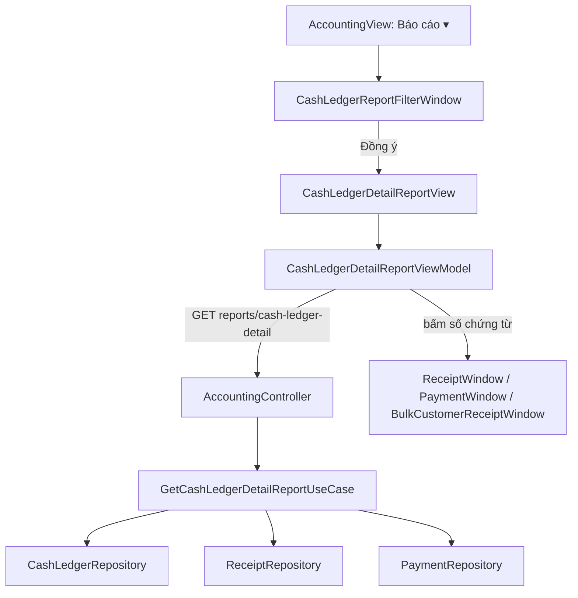

# Báo cáo Quỹ — Sổ kế toán chi tiết quỹ tiền mặt — Feature Document

> **Jira:** — (branch `dev` không có mã ticket) | **Branch:** `dev` | **Generated:** 2026-10-02 (code chưa commit)
> **Nguồn:** đọc trực tiếp code BE (`be-window-lamour`) + WPF (`desktop-lamour`). Jira/Confluence không lấy được (Atlassian MCP chưa đăng nhập).
> Tài liệu liên quan: [quy.md](quy.md) (màn Quỹ) · [phieu-thu.md](phieu-thu.md) · [phieu-chi.md](phieu-chi.md) · [phieu-thu-hang-loat.md](phieu-thu-hang-loat.md)

---

## PRD Summary

- **Goal:** Xem "Sổ kế toán chi tiết quỹ tiền mặt" theo kỳ như MISA: mỗi dòng hạch toán một dòng, có Số tồn đầu kỳ và Số tồn cộng dồn; bấm số chứng từ ra phiếu gốc.
- **User story:** Là kế toán, tôi muốn chọn kỳ (theo tháng hoặc tùy chọn từ ngày – đến ngày) và tài khoản rồi xem sổ quỹ chi tiết, để đối chiếu tiền mặt và in/xuất gửi đi.
- **Acceptance criteria** (đối chiếu code hiện tại):
  - [x] Màn Quỹ có nút **📊 Báo cáo ▾** → "Sổ kế toán chi tiết quỹ tiền mặt"
  - [x] Hộp Chọn tham số: Kỳ báo cáo (Tháng 1–12, Tùy chọn, …), Từ/Đến, bảng tài khoản có tick tất cả, Đồng ý
  - [x] Sửa tay Từ/Đến → ô Kỳ tự chuyển sang "Tùy chọn"
  - [x] Báo cáo: dòng Số tồn đầu kỳ + các dòng hạch toán + Số tồn cộng dồn + tổng Nợ/Có
  - [x] Bấm số phiếu thu / phiếu chi mở popup phiếu gốc
  - [x] In, Xuất khẩu Excel, Gửi Email/Zalo
  - [ ] 3 báo cáo còn lại của MISA (Dòng tiền · Dự báo thu, chi công nợ · Bảng kê số dư tiền theo ngày): **chưa** — chờ mẫu
  - [ ] Lọc theo từng cột / kéo cột để nhóm: **chưa**
  - [ ] Kiểm chứng giao diện trên UTM: **chưa**

---

## Business Rules

| Rule | Description |
|------|-------------|
| Nguồn dữ liệu | Sổ quỹ `CashTransaction` (để số tồn khớp màn Quỹ). Phiếu chưa ghi sổ (Treo) **không** có trong báo cáo |
| Mỗi dòng = 1 dòng hạch toán | Dòng sổ quỹ **tìm được phiếu gốc** theo số chứng từ → **bung ra từng dòng hạch toán** của phiếu. **Không còn phiếu gốc** (dữ liệu cũ nhập từ MISA, vốn đã 1 dòng/1 bút toán) → dùng nguyên dòng sổ. Phiếu gốc chỉ bung 1 lần dù sổ quỹ trùng số |
| Tài khoản của dòng | Phiếu thu: TK Nợ của dòng; TK đối ứng = TK Có. Phiếu chi: TK Có của dòng nếu là 111*, không thì TK của sổ quỹ; TK đối ứng = TK Nợ. Dòng cũ: giữ `Account` / `CounterAccount` của sổ quỹ |
| Chỉ quỹ tiền mặt | Chỉ lấy dòng có TK bắt đầu bằng **111**. Phiếu thu tiền gửi (TK Nợ 112*) không vào báo cáo |
| Lọc tài khoản | Dòng được tính khi TK của nó **hoặc TK cha** được tick (tick 111 gồm cả 1111). Tick hết = WPF gửi `account_codes` rỗng = mọi TK tiền mặt |
| Số tồn đầu kỳ | Số dư gốc (`ICashLedgerRepository.InitialBalance`, thuộc TK 111) + Σ(Nợ − Có) các dòng được chọn có ngày hạch toán trước `from_date` |
| Số tồn từng dòng | Cộng dồn từ Số tồn đầu kỳ theo thứ tự hiển thị |
| Thứ tự mặc định | Ngày hạch toán → Ngày chứng từ → thời điểm tạo phiếu → số chứng từ → thứ tự dòng trong phiếu |
| Sắp xếp theo thứ tự lập | Tick → sắp theo thời điểm tạo phiếu (`CreatedAt`) trước |
| Cộng gộp bút toán giống nhau | Tick → các dòng cùng phiếu + cùng ngày + cùng diễn giải + cùng TK / TK đối ứng gộp thành 1 dòng cộng tiền |
| Người nhận/Người nộp | `PayerName` / `PayeeName`; phiếu thu hàng loạt mang tên mặc định BE tự điền thì để trống |
| Mã / Tên mục thu/chi | Khoản mục CP của dòng phiếu chi. Phiếu thu và dòng cũ để trống |
| Bấm số chứng từ | Dòng có `receipt_id` / `payment_id` → mở `ReceiptWindow` / `PaymentWindow`; `is_bulk_receipt` → `BulkCustomerReceiptWindow`. Dòng cũ không có id → chữ thường, không bấm được. Lưu / Ghi sổ / Bỏ ghi trong phiếu xong thì báo cáo tự nạp lại |
| Kỳ báo cáo | Hôm nay · Tuần này · Đầu tháng đến hiện tại · Tháng này · Tháng trước · Quý này · Năm nay · Tháng 1–12 · Quý I–IV (**của năm hiện tại**) · Tùy chọn. Mặc định "Tháng này" |
| Tùy chọn | Chọn "Tùy chọn" thì Từ/Đến nhập tay. Sửa tay Từ/Đến khi đang ở kỳ khác → ô Kỳ tự chuyển "Tùy chọn" |
| Phụ đề | Đúng trọn 1 tháng → "Tháng 01 năm 2026"; còn lại → "Từ ngày dd/MM/yyyy đến ngày dd/MM/yyyy" |
| Bảng tài khoản | Các TK trong danh mục có mã bắt đầu bằng 111; Bậc = độ dài mã − 2 (111 = 1, 1111 = 2); tick hết mặc định; phải tick ít nhất 1 |

---

## Architecture Overview

### Key Components

| Layer | File | Role |
|-------|------|------|
| API | `Lamour.Api/Controllers/AccountingController.cs` | `GET api/v1/accounting/reports/cash-ledger-detail`, `[Authorize]` |
| UseCase | `UseCases/GetCashLedgerDetailReportUseCase.cs` | Bung dòng, lọc TK, tính tồn đầu kỳ / cộng dồn, cộng gộp, sắp xếp |
| DTO | `Dtos/CashLedgerDetailReportDto.cs` | `CashLedgerDetailReportDto`, `CashLedgerDetailRowDto` |
| Repository | `ICashLedgerRepository` | `GetUpToDateAsync`, `InitialBalance` |
| Repository | `IReceiptRepository` / `IPaymentRepository` | `GetByDocumentNumbersAsync` (phiếu + dòng hạch toán + TK + Khoản mục CP) |
| WPF — lối vào | `Accounting/Views/AccountingView.xaml` + `AccountingViewModel.OpenCashLedgerReport` | Nút "📊 Báo cáo ▾" |
| WPF — tham số | `Accounting/Views/CashLedgerReportFilterWindow.xaml(.cs)` + `ViewModels/CashLedgerReportFilterViewModel.cs` | Hộp Chọn tham số |
| WPF — báo cáo | `Accounting/Views/CashLedgerDetailReportView.xaml(.cs)` + `ViewModels/CashLedgerDetailReportViewModel.cs` | Trang báo cáo, mở phiếu, In/Xuất/Gửi |
| WPF — model | `Accounting/Domain/Models/CashLedgerReportFilter.cs` (`CashLedgerReportFilter`, `CashLedgerReportPeriods`), `CashLedgerReportRow.cs` (`CashLedgerReportRow`, `CashAccountCheckItem`) | Tham số, kỳ, dòng hiển thị |
| WPF — dữ liệu | `Accounting/Domain/UseCases/GetCashLedgerDetailReportUseCase.cs`, `Data/Services/CashLedgerService.GetDetailReportAsync` | Gọi API |
| WPF — điều hướng | `Core/Navigation/NavigationRoutes.Accounting.CashLedgerDetailReport`, `NavigationService.ResolveView` | Route trang báo cáo |

### Data Flow

```
Màn Quỹ → 📊 Báo cáo ▾ → Sổ kế toán chi tiết quỹ tiền mặt
  AccountingViewModel.OpenCashLedgerReport
    → CashLedgerReportFilterWindow.ShowDialog (nạp danh mục TK 111*)
    → Đồng ý → BuildFilter() → NavigateTo(CashLedgerDetailReport, filter)
  CashLedgerDetailReportViewModel.OnNavigatedTo(filter) → LoadAsync
    → GET /api/v1/accounting/reports/cash-ledger-detail
        GetCashLedgerDetailReportUseCase
          sổ quỹ đến to_date            ← ICashLedgerRepository.GetUpToDateAsync
          phiếu gốc theo số chứng từ    ← IReceiptRepository / IPaymentRepository.GetByDocumentNumbersAsync
          bung dòng → lọc TK → tồn đầu kỳ → (cộng gộp) → sắp xếp → cộng dồn
    ← Rows = [Số tồn đầu kỳ] + rows; RowCount, TotalDebit, TotalCredit, ClosingBalance

Bấm số phiếu → OpenReceiptCommand / OpenPaymentCommand → popup phiếu gốc → lưu xong tự nạp lại
⚙️ Chọn tham số → mở lại hộp với tham số đang xem → nạp lại
```



---

## Key Files & Symbols

### BE (`be-window-lamour/src`)
- [`AccountingController.cs`](../../../../Lamour.Api/Controllers/AccountingController.cs): `GetCashLedgerDetailReport`
- [`GetCashLedgerDetailReportUseCase.cs`](../UseCases/GetCashLedgerDetailReportUseCase.cs): `ExecuteAsync`, `Expand`, `IsSelected`, `Merge`
- [`IGetCashLedgerDetailReportUseCase.cs`](../UseCases/IGetCashLedgerDetailReportUseCase.cs)
- [`CashLedgerDetailReportDto.cs`](../Dtos/CashLedgerDetailReportDto.cs)
- [`ICashLedgerRepository.cs`](../Repositories/ICashLedgerRepository.cs) / [`CashLedgerRepository.cs`](../../../../Lamour.Infrastructure/Repositories/CashLedgerRepository.cs)

### WPF (`desktop-lamour/src/DesktopLamour/Features/HomePage/Accounting`)
- `ViewModels/CashLedgerReportFilterViewModel.cs`: `Initialize`, `LoadLookupsAsync`, `ApplyPeriod`, `SwitchToCustomIfEdited`, `Submit`, `ClearFilters`, `BuildFilter`
- `ViewModels/CashLedgerDetailReportViewModel.cs`: `OnNavigatedTo`, `ReloadAsync`, `ChooseParameters`, `OpenReceiptAsync`, `OpenPayment`, `ExportExcel`, `Print`, `SendEmail`, `SendZalo`, `GoBack`
- `Domain/Models/CashLedgerReportFilter.cs`: `Subtitle`, `CashLedgerReportPeriods.Range`
- `Views/CashLedgerDetailReportView.xaml`: style `VoucherLinkButton` (số chứng từ dạng link)

### Màn hình

**Hộp "Chọn tham số"**: Kỳ báo cáo · Từ · Đến · bảng (☑ · Số tài khoản · Tên tài khoản · Bậc) + "Chọn tất cả" · ☐ Cộng gộp các bút toán giống nhau · ☐ Sắp xếp chứng từ theo thứ tự lập · Xóa điều kiện · Hủy bỏ · Đồng ý

**Trang báo cáo**
- Toolbar: ⚙️ Chọn tham số · 🔄 Nạp · 🖨️ In · 📤 Xuất khẩu · ✉️ Gửi Email · 💬 Zalo · ✖ Đóng
- Tiêu đề "SỔ KẾ TOÁN CHI TIẾT QUỸ TIỀN MẶT" + phụ đề kỳ
- Cột: Ngày hạch toán · Ngày chứng từ · Số phiếu thu · Số phiếu chi · Diễn giải · Tài khoản · TK đối ứng · Phát sinh Nợ · Phát sinh Có · Số tồn · Người nhận/Người nộp · Mã mục thu/chi · Tên mục thu/chi
- Chân trang: Số dòng · Tổng phát sinh Nợ · Tổng phát sinh Có · Số tồn cuối kỳ
- Bản in bỏ 2 cột mục thu/chi cho vừa giấy; Excel có đủ cột

---

## API Contracts

| Method | Endpoint | Input | Output |
|--------|----------|-------|--------|
| `GET` | `/api/v1/accounting/reports/cash-ledger-detail` | query `from_date`, `to_date` (ngày), `account_codes` (mã TK cách nhau dấu phẩy, bỏ trống = mọi TK 111*), `merge_similar`, `order_by_created` (bool) | `CashLedgerDetailReportDto` |

### Response

```json
{
  "from_date": "2026-01-01T00:00:00",
  "to_date": "2026-01-31T00:00:00",
  "opening_balance": 133262021,
  "closing_balance": 195662021,
  "total_debit": 62400000,
  "total_credit": 0,
  "rows": [
    {
      "accounting_date": "2026-01-05T00:00:00Z",
      "document_date": "2026-01-05T00:00:00Z",
      "receipt_number": "PT00018",
      "payment_number": null,
      "description": "Thu tiền khách hàng",
      "account": "1111",
      "counter_account": "131",
      "debit_amount": 62400000,
      "credit_amount": 0,
      "balance": 195662021,
      "person_name": "thanh đức",
      "category_code": null,
      "category_name": null,
      "receipt_id": 18,
      "payment_id": null,
      "is_bulk_receipt": true
    }
  ]
}
```

> Số liệu chỉ để minh hoạ.

---

## Edge Cases & Error Handling

| Scenario | Expected Behavior | Handled? |
|----------|------------------|----------|
| Kỳ không có phát sinh | Chỉ có dòng Số tồn đầu kỳ; Số tồn cuối kỳ = đầu kỳ | ✅ BE |
| Chưa chọn Từ/Đến, hoặc Từ > Đến | Hộp tham số báo lỗi, không đóng | ✅ WPF |
| Bỏ tick hết tài khoản | "Vui lòng chọn ít nhất một tài khoản." | ✅ WPF |
| Chỉ tick TK con (1111) | Dòng cũ ghi thẳng 111 và số dư gốc bị loại → tồn đầu kỳ có thể = 0 | ✅ Theo thiết kế |
| Dòng sổ quỹ không còn phiếu gốc | Vẫn hiện, số chứng từ không bấm được | ✅ |
| Phiếu hàng loạt bị xoá ở nơi khác rồi bấm số | "Không tìm thấy phiếu thu hàng loạt này…", nạp lại báo cáo | ✅ WPF |
| Tải báo cáo lỗi | Banner "Không thể tải báo cáo: …" | ✅ WPF |
| Phiếu thu tiền gửi (TK Nợ 112*) | Không vào báo cáo, nhưng **vẫn** cộng vào "Tồn quỹ đến hiện tại" ở màn Quỹ → hai số có thể lệch | ⚠️ Lệch có chủ ý, xem Notes |
| Trùng số chứng từ | Bung theo phiếu tạo sau cùng, 1 lần | ⚠️ Dòng của phiếu trùng số còn lại không hiện |
| Chọn "Tháng 1" khi đang ở năm sau | Luôn là tháng 1 của **năm hiện tại**; xem năm khác phải dùng Tùy chọn | ⚠️ Chưa có chọn năm |
| Dữ liệu lớn (nhiều năm) | BE nạp toàn bộ sổ quỹ đến `to_date` vào bộ nhớ để tính tồn đầu kỳ | ⚠️ Chưa tối ưu |

---

## Test Coverage Notes

| Component | Test File | Coverage |
|-----------|-----------|----------|
| `GetCashLedgerDetailReportUseCase` | `tests/Lamour.Application.Tests/Features/Accounting/UseCases/GetCashLedgerDetailReportUseCaseTests.cs` | ✅ 5 test (bung dòng + giữ dòng cũ + số tồn; cộng gộp; thứ tự lập; chỉ tick TK con; phiếu thu tiền gửi không vào quỹ) |
| Đối chiếu DB local | chạy tay | Tồn cuối báo cáo = "Tồn quỹ đến hiện tại" màn Quỹ (98.134.061, 21 dòng) |
| `CashLedgerReportFilterViewModel` / `CashLedgerDetailReportViewModel` (WPF) | — | ❌ Chưa có |
| `CashLedgerReportPeriods.Range` | — | ❌ Chưa có |
| Repository `GetUpToDateAsync` / `GetByDocumentNumbersAsync` | — | ❌ Chưa có (cần DB thật) |

**Suggested test cases:**
- [ ] `CashLedgerReportPeriods.Range`: Tháng 2 năm nhuận, Quý IV, Tuần này (thứ Hai → Chủ nhật)
- [ ] `CashLedgerReportFilter.Subtitle`: trọn tháng vs khoảng tùy chọn
- [ ] Sửa Từ ngày khi đang ở "Tháng 3" → Kỳ = "Tùy chọn"; chọn lại "Tháng 3" → ngày về 01/03–31/03
- [ ] Phiếu chi có TK Có không phải 111* → dòng vẫn thuộc TK của sổ quỹ

---

## Notes

- **Chưa kiểm chứng trên UTM:** toàn bộ giao diện (menu Báo cáo, hộp tham số, link số chứng từ, In, Xuất khẩu). Mac chỉ build được.
- **Chưa đối chiếu được với ảnh mẫu của kế toán** (05/03–30/09/2026, 1.312 dòng): DB local chỉ có 21 dòng.
- **Danh sách báo cáo là menu thả xuống** ở nút "📊 Báo cáo ▾", không phải trang riêng như MISA; 3 mục chưa có mẫu để mờ kèm "(chưa hỗ trợ)".
- **Số tồn báo cáo vs màn Quỹ:** màn Quỹ chưa lọc theo tài khoản (xem [quy.md](quy.md) Notes) nên vẫn cộng phiếu thu tiền gửi; báo cáo thì không. Nếu có phiếu như vậy, cần quyết định sửa màn Quỹ cho thống nhất.
- **Không có** cột Số khế ước (app chưa có khế ước vay), lọc theo từng cột, kéo cột để nhóm, các nút Mẫu / Báo cáo đã cất / Thu gọn / Tạo báo cáo song ngữ.
- Không có migration; khi deploy chỉ cần bản BE + WPF mới.

---

*Generated by `/ct-ai-document` on 2026-10-02*
