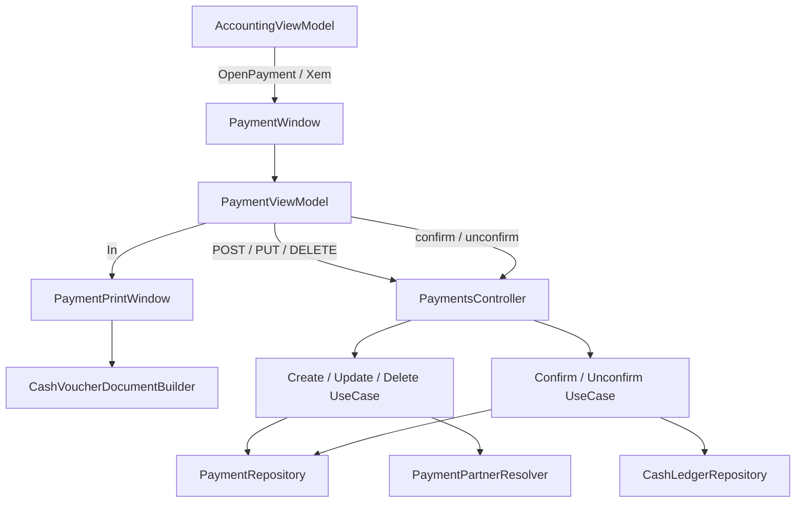

# Phiếu Chi (Payment) — Feature Document

> **Jira:** — (branch `dev` không có mã ticket) | **Branch:** `dev` | **Generated:** 2026-10-02 (cập nhật theo code hiện tại; phần 2026-10-01/02 chưa commit)
> **Nguồn:** đọc trực tiếp code BE (`be-window-lamour`, commit `c3492e7`) + WPF (`desktop-lamour`, commit `583f522`).
> Jira/Confluence không lấy được (Atlassian MCP chưa đăng nhập).
> Bản trước khi cập nhật: [phieu-chi-old.md](phieu-chi-old.md). Bản cũ hơn (nhật ký thay đổi 2026-04 → 2026-09-29, có đoạn đã lỗi thời như "Ghi sổ chỉ từ Treo", "Cất = lưu Nháp") xem trong git history của file này.
> Tài liệu liên quan: [quy.md](quy.md) (Sổ quỹ — nơi hiện và thao tác phiếu chi) · [phieu-thu.md](phieu-thu.md) · [bao-cao-quy.md](bao-cao-quy.md) · WPF: `desktop-lamour/.../Accounting/docs/phieu-chi.md` (chi tiết giao diện, bug ComboBox trong DataGrid)

---

## PRD Summary

- **Goal:** Lập phiếu chi tiền mặt theo đúng luồng MISA: chọn đối tượng → lý do chi → nội dung → TK Nợ / Số tiền / Khoản mục CP → Cất (lưu + ghi sổ quỹ ngay) → In mẫu 02-TT.
- **User story:** Là kế toán/thu ngân, tôi muốn lập phiếu chi cho nhà cung cấp, khách hàng hoặc nhân viên, để khoản chi được ghi vào sổ quỹ tiền mặt và in ra phiếu có chữ ký.
- **Acceptance criteria** (đối chiếu code hiện tại):
  - [x] Đối tượng là 1 ô tìm chung cho Nhà cung cấp / Khách hàng / Nhân viên
  - [x] Lý do chi: Tạm ứng cho nhân viên · Gửi tiền vào ngân hàng · Chi khác (mặc định) · Thuế TNDN tạm tính
  - [x] Diễn giải của dòng hạch toán tự lấy từ nội dung lý do chi chi tiết
  - [x] Dòng tự điền TK Nợ 6418 / TK Có 1111 (dòng đầu sau khi chọn Đối tượng, dòng khác khi gõ Số tiền)
  - [x] Gõ mã TK Nợ / TK Có / Khoản mục CP trực tiếp trong ô (lọc danh sách, Enter/rời ô là chọn)
  - [x] Cất = lưu + ghi sổ ngay; Ghi sổ/Bỏ ghi là 1 nút; Sửa/Xóa chỉ khi chưa ghi sổ
  - [x] In mẫu 02-TT giống bản in MISA
  - [ ] Chặn Số tiền âm: **chưa** (xem Edge Cases)
  - [ ] Chặn trùng Số chứng từ: **chưa**

---

## Business Rules

| Rule | Description |
|------|-------------|
| Đối tượng đa loại | `Payment.PartnerType` (`Supplier`/`Customer`/`Employee`) + `PartnerId`. Không có FK thật (không FK được tới 3 bảng); `PaymentPartnerResolver` kiểm tra tồn tại lúc Create/Update, lỗi: "Nhà cung cấp / Khách hàng / Nhân viên không tồn tại." |
| Tên đối tượng cache | `Payment.PartnerName` lưu tên tại thời điểm lưu, không tự cập nhật nếu đổi tên gốc sau đó |
| Người nhận | `PayeeName` tự điền = tên đối tượng khi chọn, sửa tay được. Địa chỉ tự điền nếu đối tượng là Nhà cung cấp/Khách hàng (Nhân viên không có địa chỉ) |
| Đồng bộ xuống dòng | Đổi Đối tượng ở header → cập nhật `SubjectCode`/`SubjectName` của dòng **đầu** và các dòng **đã có số tiền** (không điền vào dòng trống) |
| Lý do chi | Enum `PaymentReason`, lưu dạng chuỗi (`HasConversion<string>`). Chọn được: `TamUngNhanVien`, `GuiTienNganHang`, `ChiKhac` (mặc định), `ThueTNDNTamTinh`. `ChiMuaHang`/`ChiTraNo`/`ChiLuong` chỉ còn cho phiếu cũ: mở phiếu cũ vẫn hiện đúng, không chọn mới được |
| Lý do chi chi tiết | `ReasonDetail` (tự do, vd "làm cờ even 21/7"), BE trim, rỗng → `null` |
| Diễn giải tự điền | Dòng đầu và dòng đã có số tiền lấy Diễn giải = `ReasonDetail`, đổi theo khi gõ tiếp — chỉ khi Diễn giải còn trống hoặc đang mang đúng nội dung cũ; dòng người dùng tự sửa thì giữ nguyên |
| TK mặc định | TK Nợ **6418** (Chi phí bằng tiền khác), TK Có **1111** (Tiền Việt Nam). Nếu danh mục chưa có mã đó → TK dùng gần nhất trong phiên (`ILastUsedPaymentAccountsStore`, chỉ trong bộ nhớ). Áp cho dòng đầu sau khi chọn Đối tượng và cho dòng vừa được gõ Số tiền (`PaymentViewModel.IsActiveEntry` / `ApplyEntryDefaults`) |
| Gõ mã TK | Ô TK Nợ / TK Có / Khoản mục CP là `AppSearchableComboBox` dạng gọn (`IsCompact` + `CodeOnlyDisplay` + `CommitTypedText`): gõ là lọc; Enter/rời ô chọn mã khớp hẳn → mã bắt đầu bằng chữ đã gõ → dòng đầu danh sách lọc; không khớp thì trả về giá trị cũ; xoá trắng = bỏ chọn |
| TK là FK thật | TK Nợ/Có → `AccountSetting`; Khoản mục CP → `ExpenseCategory` (tuỳ chọn). BE báo "Tài khoản Nợ/Có không tồn tại." / "Khoản mục chi phí không tồn tại." |
| Dòng trống | Form mở sẵn 50 dòng trống, hiện trống hẳn (Số tiền 0 = ô trống, ẩn nút ✕ — `PaymentEntryItem.IsEmpty`); khi lưu chỉ gửi dòng có `Amount != 0`. Không có dòng nào → "Vui lòng nhập ít nhất một dòng hạch toán." |
| Số chứng từ | WPF tự sinh `PC{max+1:D5}` từ danh sách phiếu đã tải. BE **không** sinh và **không** kiểm tra trùng |
| Trạng thái | `Draft` (vừa tạo) · `Treo` (sau khi Bỏ ghi) · `Confirmed` (đã ghi sổ). Sổ quỹ coi Draft và Treo đều là "Treo" |
| Cất = Lưu + Ghi sổ | WPF gọi Create/Update rồi Confirm ngay. Confirm nhận cả Draft lẫn Treo |
| Ghi sổ | `ConfirmPaymentUseCase`: cần ≥ 1 dòng; tạo 1 `CashTransaction` (Có = tổng tiền) rồi `Status = Confirmed` |
| Bỏ ghi | `UnconfirmPaymentUseCase`: chỉ khi `Confirmed`; xoá `CashTransaction` theo số phiếu, về `Treo` |
| Bất biến sau ghi sổ | Sửa/Xóa phiếu `Confirmed` bị chặn ở cả WPF (tắt nút) và BE |
| Sổ quỹ | `CashTransaction.Account` luôn `"111"` (kể cả khi TK Có là 112), `CounterAccount` = TK Nợ dòng đầu. Diễn giải trên sổ quỹ tính lúc đọc = `ReasonDetail`, trống thì nhãn lý do (xem [quy.md](quy.md)) |
| Bản in 02-TT | Nợ = các TK Nợ của phiếu, Có = các TK Có (111 in thành 1111, 112 → 1121); Số tiền = Σ dòng; Lý do chi = `ReasonDetail`, trống thì nhãn lý do; 5 chữ ký, tên người nhận in dưới cột "Người nhận tiền" |

### Vòng đời

```
            Cất (Create/Update + Confirm)
  (mới) ───────────────────────────────► Confirmed ──── Bỏ ghi ────► Treo
                                            ▲                          │
                                            └──────── Ghi sổ ──────────┤
                                                                       │ Sửa → Cất
                                                                       ▼
                                                                  (Update + Confirm)
```

Nếu Confirm lỗi sau khi đã lưu: phiếu nằm ở `Draft`, hiện banner lỗi, form vẫn đang sửa — bấm Cất lại sẽ Update + Confirm.

---

## Architecture Overview

### Key Components

| Layer | File | Role |
|-------|------|------|
| Domain | `Lamour.Domain/Entities/Payment.cs` | `Payment` + enum `PaymentStatus` |
| Domain | `Lamour.Domain/Entities/PaymentEntry.cs` | Dòng hạch toán (TK Nợ/Có, Số tiền, Đối tượng, Khoản mục CP) |
| Domain | `Lamour.Domain/Enums/PaymentReason.cs`, `PaymentPartnerType.cs` | Lý do chi, loại đối tượng |
| API | `Lamour.Api/Controllers/PaymentsController.cs` | `api/v1/accounting/payments` |
| UseCase | `CreatePaymentUseCase`, `UpdatePaymentUseCase`, `DeletePaymentUseCase` | Lưu / sửa / xoá, validate đối tượng + TK + Khoản mục CP |
| UseCase | `ConfirmPaymentUseCase`, `UnconfirmPaymentUseCase` | Ghi sổ / Bỏ ghi (tạo / xoá `CashTransaction`) |
| UseCase | `SetPaymentTreoUseCase`, `DuplicatePaymentUseCase` | Có endpoint, **WPF hiện không gọi** |
| UseCase | `PaymentPartnerResolver` | Tra tên đối tượng theo loại |
| Repository | `Lamour.Infrastructure/Repositories/PaymentRepository.cs` | CRUD, `GetUnconfirmedByDateRangeAsync` (cho sổ quỹ), `GetIdsByDocumentNumbersAsync`, `GetReasonDetailsByIdsAsync` |
| Migration | `20260929150308_AddPaymentDefaultAccounts6418And1111` | Thêm TK 6418 / 1111 nếu chưa có |
| WPF — cửa sổ | `Views/PaymentWindow.xaml(.cs)` | Toolbar `DocumentToolbar`, Thông tin chung, lưới Hạch toán |
| WPF — ViewModel | `ViewModels/PaymentViewModel.cs` | Toàn bộ logic nhập liệu / lưu / ghi sổ |
| WPF — bản in | `Views/PaymentPrintWindow.xaml(.cs)` + `Views/CashVoucherDocumentBuilder.cs` | Mẫu 02-TT, layout dùng chung với phiếu thu |
| WPF — model dòng | `Domain/Models/PaymentEntryItem.cs` | `SelectedDebitAccount`, `SelectedCreditAccount`, `SelectedExpenseCategory`, `IsEmpty` |
| WPF — control | `Shared/Controls/AppSearchableComboBox.xaml(.cs)` | Ô TK / Khoản mục CP (`ExpenseCategory` implement `ISearchableItem`) |
| WPF — nhãn | `Shared/Converters/PaymentReasonDisplayConverter.cs` | `Label(reason)` dùng chung cho ô Lý do chi, Quỹ, Xuất khẩu, bản in |
| WPF — mở từ | `ViewModels/AccountingViewModel.cs` (`OpenPayment`, xem / sửa dòng sổ quỹ) | Màn Quỹ → Thêm ▾ Phiếu chi, double-click dòng phiếu chi |

### Data Flow

```
Màn Quỹ → Thêm ▾ → Phiếu chi (AccountingViewModel.OpenPayment → PaymentWindow.Show)
  PaymentViewModel.LoadAsync
    → nạp NCC, KH, NV, Khoản mục CP, Tài khoản kế toán (trước)
    → GET payments → hiện phiếu đầu danh sách

➕ Thêm → form trống + 50 dòng trống
  chọn Đối tượng  → Người nhận, Địa chỉ, dòng đầu (Diễn giải, 6418/1111, Đối tượng)
  gõ Lý do chi chi tiết → Diễn giải dòng đầu + dòng đã có số tiền
  gõ Số tiền vào dòng khác → dòng đó tự điền
  nhập TK Nợ, Số tiền, Khoản mục CP

💾 Cất → PersistAsync: POST payments (mới) | PUT payments/{id} (đang sửa)
       → POST payments/{id}/confirm → CashTransaction (TK 111, Có = tổng)
       → tải lại, khoá form, báo màn Quỹ tải lại
Ghi sổ / Bỏ ghi → POST {id}/confirm | {id}/unconfirm
🗑️ Xóa → hỏi Yes/No → DELETE {id} → đóng cửa sổ
🖨 In → PaymentPrintWindow (CashVoucherDocumentBuilder, mẫu 02-TT)
```



---

## Key Files & Symbols

### BE (`be-window-lamour/src`)
- [`PaymentsController.cs`](../../../../Lamour.Api/Controllers/PaymentsController.cs): `GetPayments`, `GetPaymentById`, `CreatePayment`, `UpdatePayment`, `DeletePayment`, `DuplicatePayment`, `ConfirmPayment`, `UnconfirmPayment`, `SetPaymentTreo`
- [`CreatePaymentUseCase.cs`](../UseCases/CreatePaymentUseCase.cs) / [`UpdatePaymentUseCase.cs`](../UseCases/UpdatePaymentUseCase.cs) / [`DeletePaymentUseCase.cs`](../UseCases/DeletePaymentUseCase.cs)
- [`ConfirmPaymentUseCase.cs`](../UseCases/ConfirmPaymentUseCase.cs) / [`UnconfirmPaymentUseCase.cs`](../UseCases/UnconfirmPaymentUseCase.cs)
- [`SetPaymentTreoUseCase.cs`](../UseCases/SetPaymentTreoUseCase.cs) / [`DuplicatePaymentUseCase.cs`](../UseCases/DuplicatePaymentUseCase.cs)
- [`PaymentPartnerResolver.cs`](../UseCases/PaymentPartnerResolver.cs): `ResolveNameAsync`
- [`IPaymentRepository.cs`](../Repositories/IPaymentRepository.cs) / [`PaymentRepository.cs`](../../../../Lamour.Infrastructure/Repositories/PaymentRepository.cs)
- DTOs: [`CreatePaymentRequestDto.cs`](../Dtos/CreatePaymentRequestDto.cs), [`UpdatePaymentRequestDto.cs`](../Dtos/UpdatePaymentRequestDto.cs), [`PaymentResponseDto.cs`](../Dtos/PaymentResponseDto.cs), [`PaymentEntryDto.cs`](../Dtos/PaymentEntryDto.cs)

### WPF (`desktop-lamour/src/DesktopLamour`)
- `Features/HomePage/Accounting/ViewModels/PaymentViewModel.cs`: `AddNew`, `AddEntry`, `IsActiveEntry`, `ApplyEntryDefaults` (TK mặc định), `ConfirmAsync` (Cất), `PersistAsync`, `ToggleConfirmAsync`, `DeleteAsync`, `Print`, `OnSelectedPartnerChanged`, `OnReasonDetailChanged`, `RefreshPaymentReasons`, `GenerateNextDocumentNumber`, `ResolvePartnerType`
- `Features/HomePage/Accounting/Views/PaymentWindow.xaml`: style `EntryTextCell`; cột TK / Khoản mục CP dùng `controls:AppSearchableComboBox` (ô chỉ hiện mã, danh sách hiện "mã — tên")
- `Features/HomePage/Accounting/Views/PaymentPrintWindow.xaml.cs`, `CashVoucherDocumentBuilder.cs` (`CashVoucherPrintModel`, `PrintAccountCode`)
- `Features/HomePage/Accounting/Domain/Models/PaymentEntryItem.cs`
- `Shared/Converters/PaymentReasonDisplayConverter.cs`: `Label`

### Màn hình

**Cửa sổ "Phiếu chi"**
- Toolbar (`DocumentToolbar`): Trước · Sau · Thêm · Sửa · Xóa · Cất · Ghi sổ/Bỏ ghi · In · Đóng
- Thông tin chung: Đối tượng · Người nhận · Địa chỉ · Lý do chi + nội dung chi tiết · Nhân viên (có nút ➕ tạo nhanh) · Kèm theo · Tham chiếu
- Chứng từ: Ngày hạch toán · Ngày chứng từ · Số chứng từ
- Tab "1. Hạch toán": Diễn giải · TK Nợ · TK Có · Số tiền · Đối tượng · Tên đối tượng · TK ngân hàng · Khoản mục CP · ✕. Phím: F9 thêm dòng, chuột phải / Ctrl+Insert / Ctrl+Delete / Ctrl+F
- Tab "2. Thuế": chỉ thông báo "Phiếu chi này không có thông tin thuế."

**Bản in "PHIẾU CHI" (mẫu 02-TT)**: Header công ty + Mẫu số 02 - TT · PHIẾU CHI · Ngày · Quyển số · Số · Nợ · Có · Họ tên người nhận tiền · Địa chỉ · Lý do chi · Số tiền · Viết bằng chữ · Kèm theo · Giám đốc · Kế toán trưởng · Thủ quỹ · Người lập phiếu · Người nhận tiền · "Đã nhận đủ số tiền (Viết bằng chữ)"

---

## API Contracts

Base route: `api/v1/accounting/payments`

| Method | Endpoint | Input | Output | Lỗi |
|--------|----------|-------|--------|-----|
| `GET` | `/` | — | `PaymentResponseDto[]` | |
| `GET` | `/{id}` | — | `PaymentResponseDto` | 404 |
| `POST` | `/` | `CreatePaymentRequestDto` | `PaymentResponseDto` (Draft) | 400 lý do/đối tượng/TK/Khoản mục CP sai |
| `PUT` | `/{id}` | `UpdatePaymentRequestDto` | `PaymentResponseDto` | 404; 400 nếu đã ghi sổ |
| `DELETE` | `/{id}` | — | 204 | 404; 400 nếu đã ghi sổ |
| `POST` | `/{id}/confirm` | — | `PaymentResponseDto` (Confirmed) | 400 đã ghi sổ / không có dòng |
| `POST` | `/{id}/unconfirm` | — | `PaymentResponseDto` (Treo) | 400 nếu chưa ghi sổ |
| `POST` | `/{id}/treo` | — | `PaymentResponseDto` | 400 nếu không phải Draft — **WPF không dùng** |
| `POST` | `/{id}/duplicate` | — | `PaymentResponseDto` (Draft, số `{số cũ}-COPY`) | 404 — **WPF không dùng** |

### Request — `POST /` (`PUT /{id}` cùng field)

```json
{
  "partner_type": "Employee",
  "partner_id": 16,
  "payee_name": "TRẦN THỊ NHI TRÚC",
  "address": null,
  "payment_reason": "ChiKhac",
  "reason_detail": "làm cờ even 21/7",
  "payment_employee_id": null,
  "attachment": null,
  "reference": null,
  "accounting_date": "2026-09-29T00:00:00",
  "document_date": "2026-09-29T00:00:00",
  "document_number": "PC00008",
  "entries": [
    {
      "description": "làm cờ even 21/7",
      "debit_account_id": 44,
      "credit_account_id": 45,
      "amount": 3166000,
      "subject_code": "NV016",
      "subject_name": "TRẦN THỊ NHI TRÚC",
      "bank_account": null,
      "expense_category_id": 2
    }
  ]
}
```

### Response — `PaymentEntryDto` (thêm các field chỉ có ở response)

```json
{
  "id": 1,
  "description": "làm cờ even 21/7",
  "debit_account_id": 44, "debit_account_code": "6418", "debit_account_description": "Chi phí bằng tiền khác",
  "credit_account_id": 45, "credit_account_code": "1111", "credit_account_description": "Tiền Việt Nam",
  "amount": 3166000,
  "subject_code": "NV016", "subject_name": "TRẦN THỊ NHI TRÚC",
  "bank_account": null,
  "expense_category_id": 2, "expense_category_name": "PHÒNG MARKETING"
}
```

> Id tài khoản (44/45) và các giá trị là minh hoạ — trên máy khác id có thể khác vì migration chèn theo mã. `PaymentResponseDto` còn có `id`, `partner_name`, `payment_employee_name`, `status` (`Draft`/`Treo`/`Confirmed`), `created_at`, `confirmed_at`.

---

## Edge Cases & Error Handling

| Scenario | Expected Behavior | Handled? |
|----------|------------------|----------|
| Chưa chọn Đối tượng mà bấm Cất | "Vui lòng chọn đối tượng." | ✅ WPF |
| Không dòng nào có Số tiền | "Vui lòng nhập ít nhất một dòng hạch toán." | ✅ WPF |
| Dòng có Số tiền nhưng xoá TK Nợ/Có | BE: "Tài khoản Nợ/Có không tồn tại." (WPF gửi id 0) | ✅ BE (thông báo chưa nói rõ dòng nào) |
| Đối tượng / Khoản mục CP đã bị xoá | BE: "… không tồn tại." | ✅ BE |
| Lưu được nhưng Ghi sổ lỗi | Phiếu nằm ở Draft, banner lỗi, form vẫn sửa được, Cất lại = Update + Confirm | ✅ WPF |
| Sửa / Xóa phiếu đã ghi sổ | WPF tắt nút; BE: "Phiếu chi đã ghi số, không thể sửa/xoá." | ✅ WPF + BE |
| Ghi sổ / Bỏ ghi lỗi | Hộp thoại "Thao tác thất bại" | ✅ WPF |
| Số tiền âm | Được lưu và ghi sổ (lọc chỉ bỏ dòng `= 0`) → làm **tăng** quỹ | ⚠️ Chưa chặn |
| Trùng Số chứng từ (2 máy cùng lập, hoặc gõ tay) | Lưu được; sổ quỹ tra id theo số → lấy phiếu tạo sau cùng, Bỏ ghi xoá `CashTransaction` theo số → ảnh hưởng cả 2 phiếu | ⚠️ Chưa chặn |
| TK Có là 112 (chi bằng tiền gửi) | Vẫn ghi vào sổ quỹ tiền mặt (`Account = "111"`) | ⚠️ Chưa đúng |
| Mở phiếu cũ có lý do đã bỏ (Chi mua hàng…) | Ô Lý do chi vẫn hiện đúng giá trị cũ | ✅ WPF |
| DB chưa chạy migration 6418/1111 | Dòng tự điền dùng TK gần nhất thay vì 6418/1111 | ✅ WPF (không báo lỗi) |
| Gõ mã TK không có trong danh mục | Ô trả về TK trước khi gõ | ✅ WPF (chưa kiểm chứng trên UTM) |
| Đổi tên đối tượng gốc sau khi lưu | Phiếu vẫn giữ tên cũ (`PartnerName` cache) | ✅ Theo thiết kế |

---

## Test Coverage Notes

| Component | Test File | Coverage |
|-----------|-----------|----------|
| `ConfirmPaymentUseCase` | `tests/Lamour.Application.Tests/Features/Accounting/UseCases/ConfirmPaymentUseCaseTests.cs` | ✅ 2 test (Draft/Treo ghi sổ được; đã ghi sổ bị chặn) |
| Diễn giải phiếu chi trên sổ quỹ | `GetCashLedgerUseCaseTests.cs` | ✅ 3 test (lý do chi chi tiết / nhãn / 4 lý do mới) |
| `CreatePaymentUseCase` / `UpdatePaymentUseCase` / `DeletePaymentUseCase` | — | ❌ Chưa có |
| `UnconfirmPaymentUseCase` | — | ❌ Chưa có |
| `PaymentPartnerResolver` | — | ❌ Chưa có |
| `PaymentViewModel` (WPF) | `desktop-lamour/tests/DesktopLamour.Tests` không có test Phiếu chi | ❌ Chưa có |
| Bản in `CashVoucherDocumentBuilder` | — | ❌ Chỉ kiểm tra được bằng mắt trên UTM |

**Suggested test cases:**
- [ ] Create: `partner_type` sai / đối tượng không tồn tại / TK Nợ không tồn tại → `DomainException`
- [ ] Create: `reason_detail` toàn khoảng trắng → lưu `null`
- [ ] Update / Delete phiếu `Confirmed` → `DomainException`
- [ ] Unconfirm: xoá đúng `CashTransaction` theo số phiếu, trả về `Treo`; phiếu chưa ghi sổ → `DomainException`
- [ ] WPF: `ApplyEntryDefaults` chọn 6418/1111 khi có trong danh mục, rơi về TK gần nhất khi không có; dòng thứ hai chỉ tự điền khi gõ Số tiền
- [ ] WPF: `OnReasonDetailChanged` không ghi đè dòng người dùng đã tự sửa Diễn giải
- [ ] WPF: mở phiếu `ChiLuong` → `PaymentReasons` có thêm `ChiLuong`, `SelectedPaymentReason` giữ nguyên

---

## Notes

- **Số tiền âm và trùng Số chứng từ chưa bị chặn** ở cả WPF lẫn BE — xem Edge Cases. Cần quyết định với kế toán trước khi thêm ràng buộc (vd unique index trên `DocumentNumber` sẽ làm lỗi nếu dữ liệu thật đã có số trùng).
- **Chi bằng tiền gửi (TK Có 112) vẫn vào sổ quỹ tiền mặt**, cùng vấn đề với phiếu thu (xem [quy.md](quy.md) Notes).
- `POST /treo` và `POST /duplicate` còn ở BE nhưng WPF đã bỏ nút Treo (2026-09-26) và chưa từng có nút Nhân bản. Giữ lại, chưa xoá.
- Khi deploy: phải chạy migration `AddPaymentDefaultAccounts6418And1111`, không thì Phiếu chi không có mặc định 6418/1111.
- **Chưa kiểm chứng trên UTM** các thay đổi 2026-10-01: lưới trống khi mở, ô TK / Khoản mục CP gõ được. Đã thử và bỏ `ComboBox IsEditable` (WPF tự bôi đen chữ khi mở danh sách → gõ bị đè mất ký tự) — đừng quay lại hướng đó.
- Doc WPF `desktop-lamour/.../Accounting/docs/phieu-chi.md` vẫn là nhật ký cũ (có đoạn "Cất = lưu Nháp", toolbar Treo/Hoàn) — phần mô tả giao diện ở đó đã lỗi thời, lấy file này làm chuẩn cho logic.

---

*Generated by `/ct-ai-document` on 2026-09-30 · cập nhật 2026-10-02*
