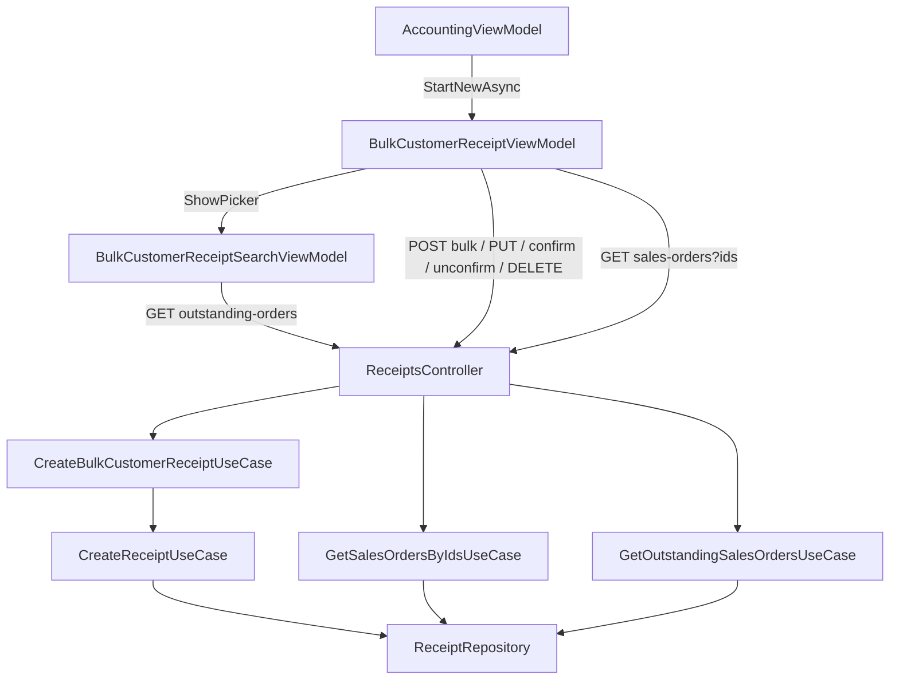

# Phiếu Thu Hàng Loạt (Thu tiền khách hàng hàng loạt) — Feature Document

> **Jira:** — (branch `dev` không có mã ticket) | **Branch:** `dev` | **Generated:** 2026-09-26 (viết lại theo code đã commit)
> **Nguồn:** đọc trực tiếp code BE (`be-window-lamour`, commit `97cb6a2`) + WPF (`desktop-lamour`, commit `143270b`).
> Jira/Confluence không lấy được (Atlassian MCP chưa đăng nhập).
> Tài liệu liên quan: [quy.md](quy.md) (màn Quỹ, nơi mở tính năng này) · [phieu-thu.md](phieu-thu.md) (mục "Phiếu thu tiền khách hàng hàng loạt (2026-08-26)": vì sao bỏ cách tách nhiều phiếu theo khách hàng)

---

## PRD Summary

- **Goal:** Lập **1 phiếu thu duy nhất** thu tiền cho **nhiều chứng từ bán hàng còn nợ**, kể cả của nhiều khách hàng khác nhau, thay vì lập từng phiếu thu. Giao diện và luồng làm theo MISA.
- **User story:** Là kế toán/thu ngân, tôi muốn tìm các chứng từ bán hàng còn nợ theo khoảng ngày và NV bán hàng, tick chọn nhiều chứng từ, sửa số thu từng chứng từ (thu 1 phần được), Cất thành 1 phiếu thu rồi Ghi sổ khi đã kiểm tra, để không phải lập phiếu cho từng khách hàng.
- **Acceptance criteria** (đối chiếu với code hiện tại):
  - [x] Bộ chọn chứng từ hiện **trước**; Hủy thì không mở gì; bấm "✔ Thu tiền" mới mở cửa sổ phiếu
  - [x] Lọc theo Khoảng thời gian + NV bán hàng; chỉ hiện chứng từ đã ghi sổ và còn nợ > 0
  - [x] Chọn Tiền mặt (TK 111) / Tiền gửi (TK 112 + TK ngân hàng), Ngày thu tiền; tổng "Số tiền" cập nhật ngay khi tick
  - [x] Cửa sổ phiếu đầy đủ: Trước · Sau · Thêm · Sửa · Xóa · Cất · Ghi sổ/Bỏ ghi · In · Đóng · Xuất khẩu
  - [x] Tổng tiền dưới lưới tab "1. Hạch toán", thẳng cột Số tiền (2026-09-29)
  - [x] In Phiếu thu mẫu 01-TT khớp bản in MISA (2026-09-29)
  - [x] Tab "1. Hạch toán" gộp theo khách hàng; tab "2. Chứng từ" 1 dòng/1 chứng từ, sửa được Số thu
  - [x] Số chứng từ và Tham chiếu là link mở lại hóa đơn gốc (chỉ xem)
  - [x] Cất = chỉ lưu (Treo), Ghi sổ là bước riêng (đúng MISA)
  - [ ] Sửa phiếu đã lưu có chặn thu vượt số còn nợ: **chưa** (xem Notes)

---

## Business Rules

| Rule | Description |
|------|-------------|
| Nguồn chứng từ còn nợ | `SalesOrder.Status == Normal` (đã ghi sổ), `AccountingDate` trong khoảng lọc (tính trọn ngày cuối), lọc thêm `EmployeeId` nếu chọn NV bán hàng |
| Số còn nợ | `GrandTotal − Σ ReceiptEntry.Amount (cùng SalesOrderId) − Σ DepositDeduction.Amount`. Chỉ trả về dòng còn nợ > 0 |
| Phiếu Treo cũng giữ chỗ | `Σ ReceiptEntry` không lọc trạng thái phiếu → phiếu Treo đã trừ vào số còn nợ. Xóa phiếu thì số nợ quay lại |
| 1 phiếu duy nhất | `Receipt.CustomerId = null`. Mỗi dòng hạch toán tự mang khách hàng riêng qua `SubjectCode` / `SubjectName` |
| **1 dòng hạch toán / 1 chứng từ bán hàng** | Bắt buộc ở BE: `GetRemainingAmountAsync` tính nợ theo `ReceiptEntry.SalesOrderId`. Gộp theo khách hàng ở tab "1. Hạch toán" **chỉ là hiển thị** (`BulkReceiptGroupedLine.FromLines`), dữ liệu gửi lên vẫn 1 dòng/1 chứng từ |
| Lý do thu | Luôn `ThuCongNo`, hiển thị "Thu tiền khách hàng" |
| Tài khoản | TK Nợ `Cash111` hoặc `Bank112` (chọn 1 lần ở bộ chọn, áp cho mọi dòng). TK Có luôn `Receivable131` |
| Ngày | "Ngày thu tiền" ở bộ chọn → đổ vào cả Ngày hạch toán và Ngày chứng từ của phiếu |
| Người nộp | Nhập tay → nếu trống: tên NV thu nợ → nếu trống: `"Thu tiền khách hàng hàng loạt"` (BE, lúc tạo) |
| Số chứng từ | WPF hiện **số dự đoán** (`GET next-code`), số thật do BE gán lúc Cất |
| Số thu mỗi dòng | Mặc định = số còn nợ. WPF chặn `<= 0` hoặc `>` Số chưa thu. BE (lúc tạo) kiểm tra lại số còn nợ **thực tế** trong DB |
| Cất ≠ Ghi sổ | Cất chỉ lưu phiếu ở trạng thái Treo (`CreateBulkCustomerReceiptUseCase` không tự Confirm). Ghi sổ là nút riêng — đúng như MISA |
| Khóa theo trạng thái | Mở phiếu có sẵn → form khóa. Sửa chỉ khi chưa ghi sổ. Xóa chỉ khi chưa ghi sổ và không đang sửa. Ghi sổ/Bỏ ghi là 1 nút đổi nhãn theo trạng thái |
| Trước/Sau | Chỉ duyệt trong nhóm phiếu hàng loạt (`CustomerId == null`), mới nhất trước |
| "Ngày chứng từ" trên lưới | Là **ngày chứng từ của hóa đơn bán hàng** (`DocumentDate`), không phải ngày hạch toán |

---

## Architecture Overview

### Key Components

| Layer | File | Role |
|-------|------|------|
| API | `Lamour.Api/Controllers/ReceiptsController.cs` | `GET outstanding-orders`, `POST bulk`, `GET sales-orders`, `GET next-code`, cùng CRUD/confirm/unconfirm phiếu thu |
| UseCase | `UseCases/GetOutstandingSalesOrdersUseCase.cs` | Chứng từ còn nợ cho bộ chọn |
| UseCase | `UseCases/CreateBulkCustomerReceiptUseCase.cs` | Validate dòng, dựng `CreateReceiptRequestDto`, gọi `ICreateReceiptUseCase` |
| UseCase | `UseCases/GetSalesOrdersByIdsUseCase.cs` | Dựng lại tab "2. Chứng từ" khi mở phiếu đã lưu (không lọc còn nợ/ngày) |
| UseCase (dùng chung) | `CreateReceiptUseCase`, `UpdateReceiptUseCase`, `ConfirmReceiptUseCase`, `UnconfirmReceiptUseCase`, `DeleteReceiptUseCase`, `GetNextReceiptCodeUseCase` | Lưu / sửa / ghi sổ / bỏ ghi / xóa / sinh số |
| Repository | `Lamour.Infrastructure/Repositories/ReceiptRepository.cs` | `GetOutstandingSalesOrdersAsync`, `GetSalesOrdersByIdsAsync`, `GetRemainingAmountAsync` |
| DTOs | `Dtos/BulkCustomerReceiptDtos.cs` | `OutstandingSalesOrderDto`, `BulkReceiptLineRequestDto`, `CreateBulkCustomerReceiptRequestDto`, `CreateBulkCustomerReceiptResponseDto` |
| WPF — bộ chọn | `Views/BulkCustomerReceiptSearchWindow.xaml` + `ViewModels/BulkCustomerReceiptSearchViewModel.cs` | Lọc, tick, phương thức, ngày thu tiền; chỉ trả kết quả, không tự lưu |
| WPF — cửa sổ phiếu | `Views/BulkCustomerReceiptWindow.xaml` + `ViewModels/BulkCustomerReceiptViewModel.cs` | Cửa sổ chứng từ đầy đủ |
| WPF — models | `Domain/Models/OutstandingSalesOrderCheckItem.cs`, `BulkReceiptLineItem.cs`, `BulkReceiptGroupedLine.cs` | Dòng có ô tick / dòng chứng từ (Số thu sửa được) / dòng gộp theo khách hàng |
| WPF — mở từ Quỹ | `ViewModels/AccountingViewModel.cs` → `OpenBulkCustomerReceiptAsync` | Chạy bộ chọn trước, chỉ `Show()` cửa sổ phiếu khi đã chọn |
| WPF — bản in | `Views/ReceiptPrintWindow.xaml(.cs)` | Phiếu thu mẫu 01-TT (A5, FlowDocument), nhận `ReceiptResponseDto` + nhãn lý do nộp. Dùng lại được cho phiếu thu thường |
| WPF — toolbar dùng chung | `Shared/Controls/DocumentToolbar.xaml(.cs)` | Thêm slot `TrailingContent` để nút Xuất khẩu nằm trong khung toolbar |

### Data Flow

```
Màn Quỹ → ➕ Thêm ▾ → "Thu tiền khách hàng hàng loạt"
  AccountingViewModel.OpenBulkCustomerReceiptAsync
    tạo BulkCustomerReceiptWindow (CHƯA Show)
    → BulkCustomerReceiptViewModel.StartNewAsync
        → Bộ chọn: BulkCustomerReceiptSearchWindow (ShowDialog, căn giữa cửa sổ chính)
            tự tải lần đầu → GET receipts/outstanding-orders?from_date&to_date&employee_id
            "🔍 Lấy dữ liệu" để tải lại; tick chọn; link Số chứng từ → SalesOrderWindow (chỉ xem)
        Hủy bỏ   → false → window.Close() (không bao giờ hiện) → hết
        ✔ Thu tiền → nạp NV + danh sách phiếu hàng loạt cũ (không đổ lên form)
                   → dựng phiếu mới từ lựa chọn, GET receipts/next-code (số dự đoán)
    → window.Show()

Trong cửa sổ phiếu:
  💾 Cất   → mới:  POST receipts/bulk → CreateBulkCustomerReceiptUseCase → CreateReceiptUseCase (Treo)
           → sửa:  PUT  receipts/{id} → UpdateReceiptUseCase
           → tải lại danh sách, nhảy tới phiếu vừa lưu, khóa form, báo màn Quỹ tải lại
  Ghi sổ / Bỏ ghi → POST receipts/{id}/confirm | unconfirm
  🗑️ Xóa   → hỏi Yes/No → DELETE receipts/{id} → đóng cửa sổ, Quỹ tải lại
  ◀ / ▶    → phiếu hàng loạt trước/sau → GET receipts/sales-orders?ids=... để dựng tab "2. Chứng từ"
  ➕ Thêm  → bộ chọn lại (lần này căn giữa CỬA SỔ PHIẾU)
  📤 Xuất khẩu → file Excel các dòng tab "2. Chứng từ"
```



---

## Key Files & Symbols

### BE (`be-window-lamour/src`)
- [`ReceiptsController.cs`](../../../../Lamour.Api/Controllers/ReceiptsController.cs): `GetOutstandingOrders`, `CreateBulkCustomerReceipt`, `GetSalesOrdersByIds`, `GetNextCode`
- [`GetOutstandingSalesOrdersUseCase.cs`](../UseCases/GetOutstandingSalesOrdersUseCase.cs): `ExecuteAsync(DateOnly fromDate, DateOnly toDate, int? employeeId, ct)`
- [`CreateBulkCustomerReceiptUseCase.cs`](../UseCases/CreateBulkCustomerReceiptUseCase.cs): `ExecuteAsync(CreateBulkCustomerReceiptRequestDto, ct)`
- [`GetSalesOrdersByIdsUseCase.cs`](../UseCases/GetSalesOrdersByIdsUseCase.cs) / [`IGetSalesOrdersByIdsUseCase.cs`](../UseCases/IGetSalesOrdersByIdsUseCase.cs)
- [`IReceiptRepository.cs`](../Repositories/IReceiptRepository.cs) / [`ReceiptRepository.cs`](../../../../Lamour.Infrastructure/Repositories/ReceiptRepository.cs)
- [`BulkCustomerReceiptDtos.cs`](../Dtos/BulkCustomerReceiptDtos.cs)

### WPF (`desktop-lamour/src/DesktopLamour/Features/HomePage/Accounting`)
- `ViewModels/BulkCustomerReceiptViewModel.cs`: `StartNewAsync`, `AddNewAsync`, `ShowPicker`, `BuildNewFromPickerAsync`, `SaveAsync`, `DeleteAsync`, `ToggleConfirmAsync`, `NavigatePrevAsync`/`NavigateNextAsync`, `OpenSalesOrderAsync`, `ExportExcel`, `RecalculateTotals`; `HostWindow` (Owner cho popup con); tổng `TotalGrandTotal` / `TotalRemaining` / `TotalAmount`
- `ViewModels/BulkCustomerReceiptSearchViewModel.cs`: `InitializeAsync`, `LoadAsync`, `Collect`, `Cancel`, `OpenSalesOrderAsync`, `CollectionDate`, `SelectedTotal`, `SelectedItems`, `HostWindow`
- `Views/BulkCustomerReceiptWindow.xaml(.cs)`, `Views/BulkCustomerReceiptSearchWindow.xaml(.cs)`
- `Domain/Models/OutstandingSalesOrderCheckItem.cs`, `BulkReceiptLineItem.cs`, `BulkReceiptGroupedLine.cs`
- `Domain/UseCases/GetSalesOrdersByIdsUseCase.cs` (+ interface), `Data/Services/ReceiptService.cs` (`GetSalesOrdersByIdsAsync`)
- `ViewModels/AccountingViewModel.cs`: `OpenBulkCustomerReceiptAsync`

### Màn hình

**Bộ chọn "Thu tiền khách hàng hàng loạt"**
- Lọc: Phương thức (Tiền mặt/Tiền gửi) · TK ngân hàng (chỉ khi Tiền gửi) · Khoảng thời gian (Hôm nay · Hôm qua · Tuần này · Đầu tháng đến hiện tại · Tùy chọn; mặc định **Hôm nay**) · Từ · Đến · NV bán hàng · Ngày thu tiền · 🔍 Lấy dữ liệu · Số tiền (tổng dòng đã tick)
- Cột: ô tick (có chọn tất cả) · Ngày chứng từ (căn phải) · **Số chứng từ (link)** · Mã khách hàng · Tên khách hàng · Diễn giải · Còn nợ
- Footer: Số dòng = N · Hủy bỏ · ✔ Thu tiền

**Cửa sổ "Phiếu thu tiền mặt khách hàng hàng loạt"**
- Toolbar (`DocumentToolbar`): Trước · Sau · Thêm · Sửa · Xóa · Cất · Ghi sổ/Bỏ ghi · In · Đóng, và 📤 Xuất khẩu canh phải **trong** khung toolbar. In chỉ bật khi phiếu đã lưu (Treo hoặc đã ghi sổ) và không đang sửa
- Thông tin: Người nộp · Địa chỉ · Lý do nộp · NV thu nợ · Kèm theo · **Tham chiếu (link từng số BH)** · Ngày hạch toán · Ngày chứng từ · Số chứng từ
- Tab "1. Hạch toán" (gộp theo khách hàng, chỉ xem): Diễn giải · TK Nợ · TK Có · Số tiền · Mã khách hàng · Tên khách hàng. Dưới lưới: "Số dòng = N" (số dòng đã gộp) và **Tổng tiền thẳng cột Số tiền**
- Tab "2. Chứng từ" (1 dòng/1 chứng từ, **cố định 2 cột đầu** khi cuộn ngang): Ngày chứng từ · **Số chứng từ (link)** · Mã khách hàng · Tên khách hàng · Hạn thanh toán · Số phải thu · Số chưa thu · **Số thu (sửa được)** · TK phải thu · Điều khoản TT. Dưới lưới: tổng Số phải thu / Số chưa thu / Số thu
- Không còn footer chung của cửa sổ: mỗi tab có "Số dòng" riêng dưới lưới (tab 1 đếm dòng gộp, tab 2 đếm chứng từ)

**Bản in "PHIẾU THU" (mẫu 01-TT)**
- Header: logo · thông tin công ty (tên, địa chỉ, MST, Tel/Website) · "Mẫu số 01 - TT" (TT 200/2014/TT-BTC) góc phải
- PHIẾU THU · Ngày chứng từ · Quyển số (chấm để điền tay) · Số · Nợ · Có
- TK trên bản in theo MISA: `Cash111` → **1111**, `Bank112` → **1121**, `Receivable131` → **131** (lưới app vẫn hiện 111/112)
- Họ tên người nộp tiền · Địa chỉ (trống → dòng chấm) · Lý do nộp · Số tiền (Σ mọi dòng, "… VND") · Viết bằng chữ ("… đồng chẵn.") · Kèm theo
- 5 chữ ký: Giám đốc (Ký, họ tên, đóng dấu) · Kế toán trưởng · Người nộp tiền · Người lập phiếu · Thủ quỹ; tên người nộp in dưới cột Người nộp tiền
- "Đã nhận đủ số tiền (Viết bằng chữ)" ở cuối
- Không in bảng chi tiết từng khách hàng (MISA cũng không in)

---

## API Contracts

| Method | Endpoint | Input | Output |
|--------|----------|-------|--------|
| `GET` | `/api/v1/accounting/receipts/outstanding-orders` | query `from_date`, `to_date` (DateOnly), `employee_id` (tùy chọn) | `OutstandingSalesOrderDto[]` |
| `POST` | `/api/v1/accounting/receipts/bulk` | `CreateBulkCustomerReceiptRequestDto` | `{ "receipt": ReceiptResponseDto }` |
| `GET` | `/api/v1/accounting/receipts/sales-orders` | query `ids` = `"101,102,103"` (id không hợp lệ bị bỏ qua) | `OutstandingSalesOrderDto[]` |
| `GET` | `/api/v1/accounting/receipts/next-code` | — | số phiếu thu tiếp theo |
| `PUT` | `/api/v1/accounting/receipts/{id}` | `UpdateReceiptRequestDto` (`customer_id = null`, `payment_reason = "ThuCongNo"`) | `ReceiptResponseDto` |
| `POST` | `/api/v1/accounting/receipts/{id}/confirm` · `/unconfirm` | — | `ReceiptResponseDto` |
| `DELETE` | `/api/v1/accounting/receipts/{id}` | — | 204 |

### Request — `POST /bulk`

```json
{
  "accounting_date": "2026-09-26T00:00:00",
  "document_date": "2026-09-26T00:00:00",
  "debit_account": "Cash111",
  "bank_account": null,
  "collector_employee_id": 3,
  "payer_name": null,
  "address": null,
  "attachment": null,
  "lines": [
    { "sales_order_id": 36, "amount": 453600 },
    { "sales_order_id": 37, "amount": 1450000 }
  ]
}
```

### Response item — `OutstandingSalesOrderDto` (`outstanding-orders` và `sales-orders`)

```json
{
  "sales_order_id": 36,
  "document_number": "BH00036",
  "accounting_date": "2026-09-25T00:00:00Z",
  "document_date": "2026-09-25T00:00:00Z",
  "customer_id": 1,
  "customer_code": "KH00001",
  "customer_name": "PHƯƠNG HOA SPA",
  "description": null,
  "remaining_amount": 453600,
  "grand_total": 453600,
  "payment_terms": null,
  "payment_due_date": null
}
```

> Số liệu chỉ để minh họa. Với `sales-orders`, `remaining_amount` **đã trừ** phần phiếu đang mở giữ chỗ; WPF cộng lại (`BulkReceiptLineItem(order, currentAmount)`: `MaxAmount = remaining_amount + currentAmount`) để ra đúng Số chưa thu cho phép khi sửa.

---

## Edge Cases & Error Handling

| Scenario | Expected Behavior | Handled? |
|----------|------------------|----------|
| Hủy bộ chọn khi mở từ Quỹ | Không mở cửa sổ phiếu; cửa sổ đã tạo được `Close()` để app vẫn thoát được (ShutdownMode mặc định `OnLastWindowClose`) | ✅ WPF |
| Hủy bộ chọn khi bấm Thêm trong cửa sổ phiếu | Giữ nguyên phiếu đang xem | ✅ WPF |
| Không tick dòng nào mà bấm "Thu tiền" | "Vui lòng chọn ít nhất 1 chứng từ để thu tiền." | ✅ WPF |
| Cất khi không có dòng | "Phiếu thu hàng loạt phải có ít nhất 1 chứng từ." | ✅ WPF |
| Số thu `<= 0` hoặc > Số chưa thu | "Số tiền thu của chứng từ '…' phải > 0 và không vượt quá số còn nợ (…)." — không gọi BE | ✅ WPF |
| Có phiếu khác vừa thu cùng đơn (lúc tạo mới) | BE kiểm tra lại: "Số tiền thu (…) vượt quá số còn nợ thực tế (…)" | ✅ BE |
| Sửa phiếu đã lưu, số thu vượt nợ thực tế trong DB | `UpdateReceiptUseCase` **không** kiểm tra số còn nợ; chỉ WPF chặn theo `MaxAmount` lúc mở | ⚠️ Chưa chặn ở BE |
| Mở phiếu cũ mà hóa đơn gốc đã bị xóa | Bỏ qua dòng đó (ghi log cảnh báo) | ✅ WPF |
| Sửa / Xóa phiếu đã ghi sổ | WPF tắt nút; BE: "Chứng từ đã ghi sổ, không thể sửa/xóa. Bỏ ghi trước khi sửa/xóa." | ✅ WPF + BE |
| Ghi sổ / Bỏ ghi lỗi | Hộp thoại "Thao tác thất bại" | ✅ WPF |
| Khoảng ngày không có chứng từ còn nợ | "Không có chứng từ nào còn nợ trong khoảng ngày đã chọn." | ✅ WPF |
| Link Số chứng từ trỏ tới hóa đơn đã xóa | "Không tìm thấy chứng từ bán hàng này (có thể đã bị xóa)." | ✅ WPF |
| Link Số chứng từ khi phiếu đang khóa | Vẫn bấm được (lưới khóa bằng `IsReadOnly`, không dùng `IsEnabled`) | ✅ WPF |
| Cùng 1 đơn xuất hiện 2 lần trong `lines` | BE tạo 2 dòng, dòng lặp bỏ qua kiểm tra `amount <= 0`, không cộng dồn khi so số nợ | ⚠️ WPF không tạo được, BE không chặn |
| Chọn Tiền gửi nhưng bỏ trống TK ngân hàng | Không chặn, lưu `bank_account = null` | ⚠️ Chưa kiểm tra |

---

## Test Coverage Notes

| Component | Test File | Coverage |
|-----------|-----------|----------|
| `GetSalesOrdersByIdsUseCase` (BE) | `tests/Lamour.Application.Tests/Features/Accounting/UseCases/GetSalesOrdersByIdsUseCaseTests.cs` | ✅ 2 test |
| `CreateBulkCustomerReceiptUseCase` (BE) | — | ❌ Chưa có |
| `GetOutstandingSalesOrdersUseCase` (BE) | — | ❌ Chưa có |
| `ReceiptRepository` (còn nợ, theo ids) | — | ❌ Chưa có (cần DB thật hoặc SQLite in-memory) |
| `BulkCustomerReceiptViewModel` / `BulkCustomerReceiptSearchViewModel` (WPF) | — | ❌ Chưa có |

**Suggested test cases:**
- [ ] 0 dòng → `DomainException`; dòng `amount <= 0` → `DomainException`
- [ ] 2 đơn của 2 khách hàng → 1 phiếu, `CustomerId = null`, 2 entry khác `SubjectCode`, `Reference` = 2 số chứng từ
- [ ] `payer_name` trống + có NV thu → tên NV; không NV → `"Thu tiền khách hàng hàng loạt"`
- [ ] `debit_account = "Bank112"` → mọi entry `DebitAccount = Bank112`, có `BankAccount`
- [ ] Repository: đơn đã thu đủ và đơn chưa ghi sổ không xuất hiện trong `outstanding-orders`
- [ ] `BulkReceiptGroupedLine.FromLines`: 2 chứng từ cùng khách → 1 dòng, Số tiền = tổng
- [ ] WPF: `StartNewAsync` trả `false` khi Hủy; `true` thì `CurrentReceipt == null`, `IsEditing == true`, số dòng = số đã tick

---

## So với MISA (tình trạng sau khi làm)

| Chi tiết MISA | App | Ghi chú |
|---|---|---|
| Bộ chọn hiện trước, cửa sổ phiếu hiện sau | ✅ | |
| Ngày thu tiền, tổng Số tiền khi tick | ✅ | |
| Toolbar Trước · Sau · Thêm · Sửa · Cất · Xóa · Ghi sổ · Xuất khẩu | ✅ | Bỏ ghi dùng chung nút với Ghi sổ |
| "Sửa nhanh", "Nạp", "Tiện ích", "Mẫu" | ❌ Cố ý không làm | App chưa có tính năng tương ứng ở đâu |
| "In" Phiếu thu mẫu 01-TT | ✅ 2026-09-29 | Chỉ 1 mẫu (không có menu chọn mẫu như MISA). Phiếu thu thường (`ReceiptWindow`) chưa gắn nút In |
| Tổng tiền dưới cột Số tiền (tab Hạch toán) | ✅ 2026-09-29 | |
| Tab Hạch toán gộp theo khách hàng | ✅ | Chỉ gộp khi hiển thị |
| Tham chiếu / Số chứng từ dạng link | ✅ | |
| Tab Chứng từ: cố định cột, dòng tổng, ngày căn phải, Ngày chứng từ đúng | ✅ | Dòng tổng là nhãn canh phải, không thẳng từng cột (WPF DataGrid không có footer cuộn theo cột) |
| Cột Số hóa đơn, Tỷ lệ CK, Tiền chiết khấu, TK chiết khấu (TK 635) | ❌ Chưa làm | Cần BE: app chưa có chiết khấu khi thu nợ |
| "Xem chứng từ thu tiền chưa ghi sổ" ở bộ chọn | ❌ Chưa làm | Tính năng phụ |

---

## Notes

- **Sửa phiếu đã lưu chưa được BE chặn thu vượt nợ.** `UpdateReceiptUseCase` (dùng chung với phiếu thu thường) không gọi `GetRemainingAmountAsync` như `CreateReceiptUseCase`. Có từ trước; giờ dễ gặp hơn vì phiếu hàng loạt đã Sửa được.
- ~~Double-click phiếu hàng loạt trên màn Quỹ mở nhầm `ReceiptWindow`~~ — **đã sửa 2026-09-26**, mở đúng cửa sổ này qua `OpenExistingAsync(receiptId)` (xem [quy.md](quy.md)).
- Tiêu đề cửa sổ và "Loại chứng từ" luôn ghi "tiền **mặt**", kể cả khi chọn Tiền gửi (TK 112). Phiếu Tiền gửi sau khi ghi sổ còn **bị cộng vào sổ quỹ tiền mặt** (xem [quy.md](quy.md)).
- Popup con căn giữa đúng cửa sổ cha nhờ `HostWindow` do từng cửa sổ tự gán (`PopupOwner` rơi về `MainWindow` khi cửa sổ phiếu chưa hiện).
- Ở bộ chọn, đổi Khoảng thời gian chỉ tính lại Từ/Đến, **không tự tải**: phải bấm "🔍 Lấy dữ liệu". Mặc định "Hôm nay" nên lần đầu mở thường trống.

---

*Generated by `/ct-ai-document` on 2026-09-26*
