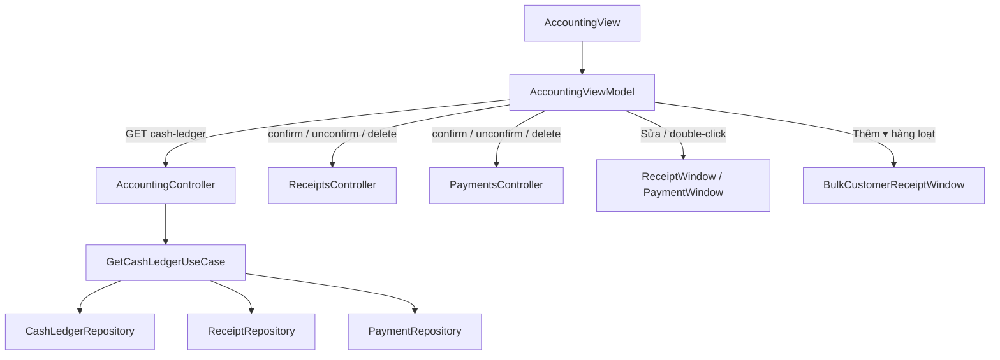

# Quỹ (Sổ kế toán chi tiết quỹ tiền mặt) — Feature Document

> **Jira:** — (branch `dev` không có mã ticket) | **Branch:** `dev` | **Generated:** 2026-09-26
> **Nguồn:** đọc trực tiếp code BE (`be-window-lamour`, commit `97cb6a2`) + WPF (`desktop-lamour`, commit `143270b`).
> Jira/Confluence không lấy được (Atlassian MCP chưa đăng nhập).
> Tài liệu liên quan: [phieu-thu.md](phieu-thu.md) · [phieu-chi.md](phieu-chi.md) · [phieu-thu-hang-loat.md](phieu-thu-hang-loat.md)

---

## PRD Summary

- **Goal:** Một màn hình duy nhất xem toàn bộ phiếu thu/chi trong kỳ (đã ghi sổ và chưa ghi sổ), kèm số tồn đầu kỳ/cuối kỳ. Thao tác Ghi sổ/Bỏ ghi/Sửa/Xóa/Gửi làm ngay trên dòng đang chọn, không phải mở từng phiếu.
- **User story:** Là kế toán/thu ngân, tôi muốn chọn kỳ rồi xem sổ quỹ, lọc theo trạng thái/loại/từng cột, và ghi sổ hoặc bỏ ghi phiếu ngay trên danh sách, để đối chiếu tiền mặt cuối ngày nhanh.
- **Acceptance criteria** (đối chiếu với code hiện tại):
  - [x] Chọn Kỳ (9 lựa chọn) hoặc Từ ngày/Đến ngày, bấm "🔍 Lấy dữ liệu" mới tải
  - [x] Hiện cả phiếu **Treo** (chưa ghi sổ) lẫn **Đã ghi sổ**; không còn trạng thái "Nháp"
  - [x] Phiếu Treo **không** làm thay đổi số tồn
  - [x] Thanh công cụ giống Chứng từ bán hàng: Thêm ▾ · Sửa · Ghi sổ · Bỏ ghi · Xóa · Xuất khẩu · Gửi email · Gửi Zalo
  - [x] Menu chuột phải + phím tắt (Ctrl+E/D/G/B)
  - [x] Lọc từng cột ngay trên tiêu đề lưới
  - [x] Double-click / Sửa phiếu thu **hàng loạt** mở đúng cửa sổ Phiếu thu hàng loạt (sửa 2026-09-26)

---

## Business Rules

| Rule | Description |
|------|-------------|
| Nguồn dữ liệu | Dòng **Đã ghi sổ** = bảng `CashTransaction` (tạo lúc Ghi sổ). Dòng **Treo** = `Payment`/`Receipt` có `Status != Confirmed` và có ít nhất 1 dòng hạch toán, dựng tại chỗ (`GetCashLedgerUseCase`) |
| Trạng thái | BE trả `"Confirmed"` hoặc `"Treo"`. WPF hiển thị "Đã ghi sổ" / "Treo". Dữ liệu cũ `"Draft"` được coi là Treo |
| Tô màu dòng Treo | Từ 2026-09-26, giống danh sách Chứng từ bán hàng: dòng chưa ghi sổ chữ cam (`AppColor.TextBrand`) đậm; chọn dòng Treo thì nền cam (`AppColor.ButtonPrimaryHover`) chữ trắng. Cờ `CashLedgerEntryDto.IsHeld` (chỉ ở WPF) |
| Số tồn | Tồn đầu kỳ = Σ(Nợ − Có) của `CashTransaction` trước ngày bắt đầu. Số tồn từng dòng cộng dồn **chỉ khi dòng Đã ghi sổ**. Tồn cuối kỳ = số tồn dòng cuối (hoặc tồn đầu kỳ nếu không có dòng) |
| Nội dung dòng Treo khớp lúc ghi sổ | Dòng phiếu thu Treo dùng cùng cách map với `ConfirmReceiptUseCase` (Diễn giải = Người nộp, TK = TK Nợ của dòng đầu, TK đối ứng = TK Có dòng đầu), để dòng không đổi nội dung sau khi ghi sổ |
| Loại chứng từ | `"Phiếu chi"`, `"Phiếu thu tiền mặt khách hàng"`, hoặc `"Phiếu thu tiền mặt khách hàng hàng loạt"` (khi `Receipt.CustomerId == null`) |
| Id phiếu gốc | `CashTransaction` chỉ lưu số chứng từ → BE tra lại `receipt_id`/`payment_id` theo số phiếu (`GetIdsByDocumentNumbersAsync`). Dòng không tìm được phiếu gốc thì không thao tác được |
| Ghi sổ | Chỉ khi dòng **Treo**. Không hỏi xác nhận. Tạo `CashTransaction`, phiếu → `Confirmed` |
| Bỏ ghi | Chỉ khi dòng **Đã ghi sổ**. Không hỏi xác nhận. Xóa `CashTransaction` theo số phiếu, phiếu về `Draft` (hiện là Treo) |
| Sửa / Xóa | Chỉ khi **Treo** (đã ghi sổ phải Bỏ ghi trước). Xóa có hỏi Yes/No. BE cũng chặn: "Chứng từ đã ghi sổ, không thể sửa/xóa. Bỏ ghi trước khi sửa/xóa." |
| Sửa = mở phiếu gốc | "Sửa" và double-click đều mở thẳng vào phiếu đang chọn: `BulkCustomerReceiptWindow` nếu `is_bulk_receipt = true`, không thì `ReceiptWindow` / `PaymentWindow` |
| Nhận biết phiếu hàng loạt | `is_bulk_receipt`: dòng Treo lấy từ `Receipt.CustomerId == null`; dòng đã ghi sổ tra qua `IReceiptRepository.GetBulkReceiptIdsAsync` |
| Lọc | Trạng thái (Tất cả/Treo/Đã ghi sổ), Loại (Tất cả/Thu/Chi) và lọc từng cột đều áp **trên dữ liệu đã tải**, không gọi lại BE |
| Xuất khẩu | Xuất đúng các dòng **đang hiển thị** (sau khi lọc), không phải toàn bộ |
| Gửi email/Zalo | App chưa tích hợp SMTP/Zalo OA: lưu file Excel của phiếu đang chọn vào thư mục tạm, mở thư mục đó + mở ứng dụng email/Zalo để người dùng tự đính kèm |
| Kỳ mặc định | "Hôm nay". Đổi Kỳ chỉ tính lại Từ/Đến, **không tự tải** |

---

## Architecture Overview

### Key Components

| Layer | File | Role |
|-------|------|------|
| API | `Lamour.Api/Controllers/AccountingController.cs` | `GET api/v1/accounting/cash-ledger` |
| API | `Lamour.Api/Controllers/ReceiptsController.cs` | confirm / unconfirm / delete phiếu thu |
| API | `Lamour.Api/Controllers/PaymentsController.cs` | confirm / unconfirm / delete phiếu chi |
| UseCase | `UseCases/GetCashLedgerUseCase.cs` | Gộp dòng đã ghi sổ + dòng Treo, tính số tồn |
| UseCase | `UseCases/ConfirmReceiptUseCase.cs`, `UnconfirmReceiptUseCase.cs`, `DeleteReceiptUseCase.cs` | Ghi sổ / Bỏ ghi / Xóa phiếu thu |
| UseCase | `UseCases/ConfirmPaymentUseCase.cs`, `UnconfirmPaymentUseCase.cs`, `DeletePaymentUseCase.cs` | Ghi sổ / Bỏ ghi / Xóa phiếu chi |
| Repository | `Lamour.Infrastructure/Repositories/CashLedgerRepository.cs` | `GetByDateRangeAsync`, `GetBalanceBeforeDateAsync` |
| Repository | `ReceiptRepository.cs` / `PaymentRepository.cs` | `GetUnconfirmedByDateRangeAsync`, `GetIdsByDocumentNumbersAsync` |
| DTO | `Dtos/CashLedgerEntryDto.cs` | 1 dòng sổ quỹ (có `status`, `receipt_id`, `payment_id`) |
| WPF — màn hình | `desktop-lamour/.../Accounting/Views/AccountingView.xaml` (+ `.cs`) | Thanh công cụ, bộ lọc, lưới, menu chuột phải, phím tắt |
| WPF — ViewModel | `desktop-lamour/.../Accounting/ViewModels/AccountingViewModel.cs` | Lệnh, quy tắc bật/tắt nút, lọc |

### Data Flow

```
Màn Quỹ → "🔍 Lấy dữ liệu" (AccountingViewModel.LoadAsync)
  → GET /api/v1/accounting/cash-ledger?from_date&to_date
    → GetCashLedgerUseCase
        tồn đầu kỳ      ← CashLedgerRepository.GetBalanceBeforeDateAsync
        dòng đã ghi sổ  ← CashLedgerRepository.GetByDateRangeAsync (+ tra receipt_id/payment_id)
        dòng Treo       ← PaymentRepository / ReceiptRepository.GetUnconfirmedByDateRangeAsync
        sắp theo AccountingDate, cộng dồn số tồn chỉ cho dòng Confirmed
  ← Items + OpeningBalance + ClosingBalance → lưới (ItemsView đã lọc)

Chọn 1 dòng → nút/menu bật theo trạng thái:
  Ghi sổ  → POST receipts|payments/{id}/confirm   → tải lại
  Bỏ ghi  → POST receipts|payments/{id}/unconfirm → tải lại
  Xóa     → hỏi Yes/No → DELETE receipts|payments/{id} → tải lại
  Sửa / double-click → mở ReceiptWindow / PaymentWindow theo số phiếu → Lưu xong tự tải lại

Thêm ▾ → Phiếu thu (ReceiptWindow) | Phiếu chi (PaymentWindow)
       | Thu tiền khách hàng hàng loạt (xem phieu-thu-hang-loat.md)
```



---

## Key Files & Symbols

### BE (`be-window-lamour/src`)
- [`AccountingController.cs`](../../../../Lamour.Api/Controllers/AccountingController.cs): `GetCashLedger(from_date, to_date)`
- [`GetCashLedgerUseCase.cs`](../UseCases/GetCashLedgerUseCase.cs): `ExecuteAsync(DateTime from, DateTime to, ct)`
- [`CashLedgerEntryDto.cs`](../Dtos/CashLedgerEntryDto.cs)
- [`ConfirmReceiptUseCase.cs`](../UseCases/ConfirmReceiptUseCase.cs) / [`UnconfirmReceiptUseCase.cs`](../UseCases/UnconfirmReceiptUseCase.cs) / [`DeleteReceiptUseCase.cs`](../UseCases/DeleteReceiptUseCase.cs)
- [`ConfirmPaymentUseCase.cs`](../UseCases/ConfirmPaymentUseCase.cs) / [`UnconfirmPaymentUseCase.cs`](../UseCases/UnconfirmPaymentUseCase.cs) / [`DeletePaymentUseCase.cs`](../UseCases/DeletePaymentUseCase.cs)
- [`CashLedgerRepository.cs`](../../../../Lamour.Infrastructure/Repositories/CashLedgerRepository.cs), [`ReceiptRepository.cs`](../../../../Lamour.Infrastructure/Repositories/ReceiptRepository.cs), [`PaymentRepository.cs`](../../../../Lamour.Infrastructure/Repositories/PaymentRepository.cs)

### WPF (`desktop-lamour/src/DesktopLamour/Features/HomePage/Accounting`)
- `ViewModels/AccountingViewModel.cs`: `LoadAsync`, `ViewEntry`, `EditEntry`, `ConfirmEntryAsync`, `UnconfirmEntryAsync`, `DeleteEntryAsync`, `SendEmail`, `SendZalo`, `ExportExcel`, `OpenReceipt`, `OpenPayment`, `OpenBulkCustomerReceiptAsync`, `FilterEntry`; quy tắc `CanConfirmSelected` / `CanUnconfirmSelected` / `CanModifySelected`
- `Views/AccountingView.xaml` (+ `.cs`: `LedgerGrid_MouseDoubleClick`)
- `Data/Services/Dtos/CashLedgerEntryDto.cs`

### Màn hình

| Vùng | Nội dung |
|---|---|
| Tiêu đề | "Sổ Kế Toán Chi Tiết Quỹ Tiền Mặt" · "Tài khoản: 111 — Tiền mặt" |
| Thanh công cụ | ➕ Thêm ▾ (Phiếu thu / Phiếu chi / Thu tiền khách hàng hàng loạt) · ✏️ Sửa · 📗 Ghi sổ · ↩️ Bỏ ghi · 🗑️ Xóa · 📤 Xuất khẩu · ✉️ Gửi email · 💬 Gửi Zalo |
| Bộ lọc | Kỳ · Từ ngày · Đến ngày · Trạng thái · Loại · 🔍 Lấy dữ liệu |
| Tổng | Số tồn đầu kỳ · Số tồn cuối kỳ |
| Cột lưới | Ngày hạch toán · Ngày chứng từ · Số phiếu thu · Số phiếu chi · Diễn giải · Số tiền · Người nhận/Người nộp · Lý do thu/chi · Loại chứng từ |
| Menu chuột phải | ➕ Thêm ▸ (3 loại) · 👁 Xem · ✏️ Sửa · 🗑️ Xóa · 📗 Ghi sổ · ↩️ Bỏ ghi · 📨 Gửi email, Zalo ▸ |

| Phím tắt | Lệnh |
|---|---|
| Ctrl+E | Sửa |
| Ctrl+D | Xóa |
| Ctrl+G | Ghi sổ |
| Ctrl+B | Bỏ ghi |

Kỳ: Tùy chọn · Hôm nay · Hôm qua · Tuần này · Tháng này · Tháng trước · Quý này · Năm nay · Đầu tháng đến hiện tại.

---

## API Contracts

| Method | Endpoint | Input | Output |
|--------|----------|-------|--------|
| `GET` | `/api/v1/accounting/cash-ledger` | query `from_date`, `to_date` (DateTime) | `CashLedgerResponseDto` |
| `POST` | `/api/v1/accounting/receipts/{id}/confirm` | — | `ReceiptResponseDto` |
| `POST` | `/api/v1/accounting/receipts/{id}/unconfirm` | — | `ReceiptResponseDto` |
| `DELETE` | `/api/v1/accounting/receipts/{id}` | — | 204 |
| `POST` | `/api/v1/accounting/payments/{id}/confirm` | — | `PaymentResponseDto` |
| `POST` | `/api/v1/accounting/payments/{id}/unconfirm` | — | `PaymentResponseDto` |
| `DELETE` | `/api/v1/accounting/payments/{id}` | — | 204 |

`POST /api/v1/accounting/payments/{id}/treo` (`SetPaymentTreoUseCase`) vẫn còn ở BE nhưng màn Quỹ không gọi (đã bỏ nút Treo).

### Response item — `CashLedgerEntryDto`

```json
{
  "accounting_date": "2026-09-26T00:00:00Z",
  "document_date": "2026-09-26T00:00:00Z",
  "receipt_number": "PT00004",
  "payment_number": null,
  "description": "Thu tiền khách hàng hàng loạt",
  "account": "111",
  "counter_account": "131",
  "debit_amount": 1903600,
  "credit_amount": 0,
  "amount": 1903600,
  "balance": 5000000,
  "person_name": "Thu tiền khách hàng hàng loạt",
  "payment_reason": "ThuCongNo",
  "document_type": "Phiếu thu tiền mặt khách hàng hàng loạt",
  "status": "Treo",
  "receipt_id": 12,
  "payment_id": null,
  "is_bulk_receipt": true
}
```

> Số liệu chỉ để minh họa. Response bọc ngoài: `CashLedgerResponseDto` = `{ "opening_balance", "closing_balance", "entries": [CashLedgerEntryDto] }`.

---

## Edge Cases & Error Handling

| Scenario | Expected Behavior | Handled? |
|----------|------------------|----------|
| Chưa chọn dòng | Sửa/Ghi sổ/Bỏ ghi/Xóa/Gửi đều tắt | ✅ WPF |
| Dòng không tìm được phiếu gốc (không có `receipt_id`/`payment_id`) | Sửa/Ghi sổ/Bỏ ghi/Xóa tắt | ✅ WPF |
| Ghi sổ phiếu đã ghi sổ | BE: "Chứng từ này đã được ghi sổ." / "Phiếu chi này đã được ghi sổ." | ✅ BE |
| Ghi sổ phiếu chi không có dòng hạch toán | BE: "Phiếu chi phải có ít nhất 1 dòng hạch toán." | ✅ BE |
| Bỏ ghi phiếu chưa ghi sổ | BE: "Chỉ chứng từ đã ghi sổ mới có thể bỏ ghi." | ✅ BE |
| Sửa/Xóa phiếu đã ghi sổ | WPF tắt nút; BE vẫn chặn nếu gọi thẳng | ✅ WPF + BE |
| Ghi sổ / Bỏ ghi lỗi | Hộp thoại "Ghi sổ thất bại" / "Bỏ ghi thất bại" | ✅ WPF |
| Xóa lỗi | Banner "Xóa thất bại: …" | ✅ WPF |
| Tải lỗi | Banner "Không thể tải dữ liệu: …" | ✅ WPF |
| Phiếu Treo không có dòng hạch toán | Không hiện trên sổ quỹ (`Entries.Count > 0`) | ✅ BE |
| Phiếu thu Tiền gửi (TK 112) | Vẫn hiện và **vẫn cộng vào số tồn quỹ tiền mặt** (xem Notes) | ⚠️ Chưa đúng |
| Double-click / Sửa phiếu thu hàng loạt | Mở `BulkCustomerReceiptWindow` đúng phiếu đó | ✅ WPF + BE (2026-09-26) |
| Phiếu hàng loạt vừa bị xóa ở nơi khác | "Không tìm thấy phiếu thu hàng loạt này (có thể đã bị xóa).", tải lại sổ quỹ | ✅ WPF |

---

## Test Coverage Notes

| Component | Test File | Coverage |
|-----------|-----------|----------|
| `GetCashLedgerUseCase` | `tests/Lamour.Application.Tests/Features/Accounting/UseCases/GetCashLedgerUseCaseTests.cs` | ✅ 4 test (có `BulkReceipts_AreFlagged_BothPostedAndTreo`) |
| `ConfirmPaymentUseCase` | `tests/.../ConfirmPaymentUseCaseTests.cs` | ✅ 2 test |
| `ConfirmReceiptUseCase` / `UnconfirmReceiptUseCase` / `DeleteReceiptUseCase` | — | ❌ Chưa có |
| `CashLedgerRepository` | — | ❌ Chưa có (cần DB thật hoặc SQLite in-memory) |
| `AccountingViewModel` (WPF) | — | ❌ Chưa có |

**Suggested test cases:**
- [ ] Dòng Treo không đổi số tồn; dòng Confirmed cộng dồn đúng
- [ ] Không có dòng nào → tồn cuối kỳ = tồn đầu kỳ
- [ ] Phiếu thu `CustomerId == null` → `document_type` = "Phiếu thu tiền mặt khách hàng hàng loạt"
- [ ] Unconfirm xóa đúng `CashTransaction` theo số phiếu và trả phiếu về `Draft`
- [ ] Delete phiếu đã ghi sổ → `DomainException`

---

## Notes

- **Sổ quỹ tiền mặt đang lẫn tiền gửi.** `ConfirmReceiptUseCase` ghi `CashTransaction.Account` theo TK Nợ thật (`111` hoặc `112`), nhưng `CashLedgerRepository.GetByDateRangeAsync` / `GetBalanceBeforeDateAsync` **không lọc theo `Account`**. Dòng Treo cũng không lọc (`GetUnconfirmedByDateRangeAsync`). Vì vậy phiếu thu Tiền gửi (TK 112) vẫn hiện trên "Sổ kế toán chi tiết quỹ tiền mặt — TK 111" và làm lệch số tồn sau khi ghi sổ. Cần quyết định: lọc `Account == "111"`, hay thêm chọn tài khoản trên màn Quỹ.
- ~~Double-click phiếu thu hàng loạt mở nhầm cửa sổ~~ — **đã sửa 2026-09-26**: BE thêm `is_bulk_receipt` vào `CashLedgerEntryDto`; WPF `AccountingViewModel.ViewEntryAsync` mở `BulkCustomerReceiptWindow` qua `BulkCustomerReceiptViewModel.OpenExistingAsync(receiptId)`.
- Tên "Loại chứng từ" của phiếu thu luôn có chữ "tiền mặt", kể cả khi thu bằng tiền gửi.
- Ghi sổ/Bỏ ghi không hỏi xác nhận, chỉ Xóa có hỏi — **kế toán đã chốt giữ nguyên 2026-09-26**, đồng bộ với Chứng từ bán hàng / Hàng bán trả lại. (Phiếu nhập kho hiện là màn duy nhất còn hỏi khi Bỏ ghi.)

---

*Generated by `/ct-ai-document` on 2026-09-26*

## Update — 2026-09-28: Box "Tồn quỹ đến hiện tại" + dòng tổng cuối lưới + cột "Ngày ghi sổ quỹ" (khớp ảnh mẫu MISA)

Theo yêu cầu, khớp 3 điểm còn thiếu so với ảnh mẫu "Sổ Kế Toán Chi Tiết Quỹ Tiền Mặt" của MISA:

| Thêm mới | Chi tiết |
|---|---|
| `CashLedgerResponseDto.current_balance` | Tồn quỹ tính tới HÔM NAY (UTC), độc lập bộ lọc Từ ngày/Đến ngày — khác `closing_balance` (chỉ tính tới `to`). `GetCashLedgerUseCase` gọi thêm `_repo.GetBalanceBeforeDateAsync(DateTime.UtcNow.Date.AddDays(1))` |
| `CashLedgerEntryDto.posted_at` | `CashTransaction.CreatedAt` — thời điểm Ghi sổ thật sự tạo dòng sổ quỹ. `null` cho dòng Treo (chưa từng có `CashTransaction`) |
| WPF `AccountingView` — box "Tồn quỹ đến hiện tại" | Góc trên phải, cạnh tiêu đề trang, bind `CurrentBalance` |
| WPF `AccountingView` — dòng tổng cuối lưới | "Số dòng = N · Tổng thu: X · Tổng chi: X" — tính trên `ItemsView` (dòng ĐANG HIỂN THỊ sau lọc, khớp cách "Xuất khẩu" chỉ xuất dòng đang hiển thị), không phải `Items` gốc. `AccountingViewModel.RecalculateFooterTotals()` chạy mỗi lần `ItemsView.CollectionChanged` (Refresh do đổi filter, hoặc Add/Clear do LoadAsync) |
| WPF `AccountingView` — cột "Ngày ghi sổ quỹ" | Chỉ hiển thị, không có ô lọc riêng, đặt trước "Loại chứng từ" |

Không cần EF migration (không đổi schema `CashTransaction`, chỉ thêm field DTO tính từ cột `CreatedAt` đã có sẵn). Verify: `dotnet build`/`dotnet test` (BE) và `dotnet build -p:EnableWindowsTargeting=true` (WPF) đều sạch. Chưa test qua UTM thật.
