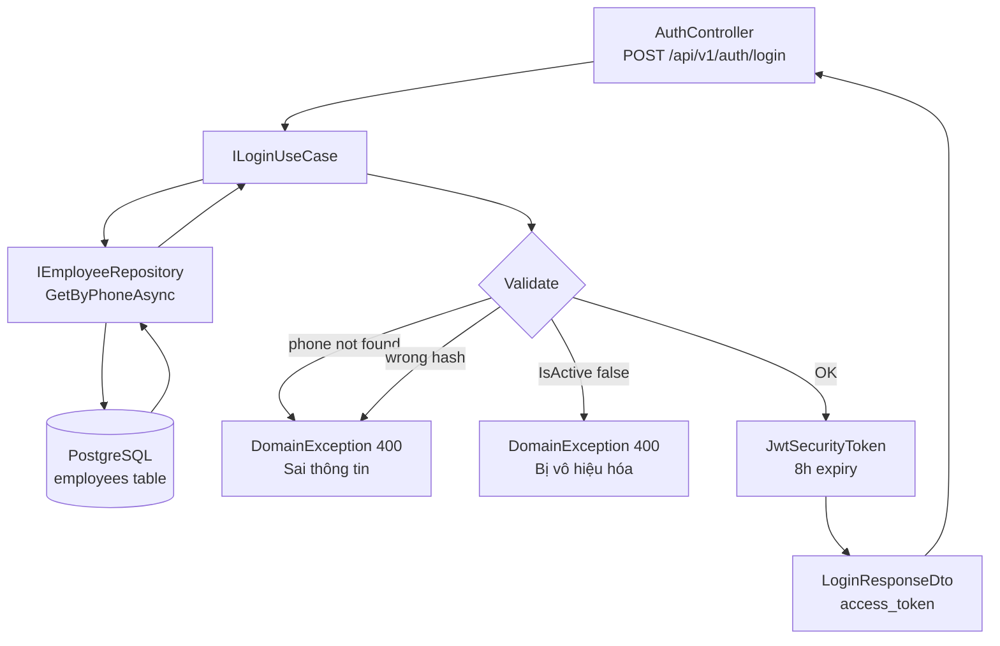

# Login Feature — Feature Document (BE)

> **Jira:** — | **Branch:** `dev` | **Generated:** 2026-04-25

---

## PRD Summary

> Cho phép nhân viên đăng nhập vào hệ thống Lamour bằng số điện thoại và mật khẩu để nhận JWT Bearer token, dùng cho tất cả các API được bảo vệ.

- **Goal:** Xác thực nhân viên bằng phone + password, trả về JWT token có thời hạn 8 giờ
- **User story:** As a nhân viên Lamour, I want to đăng nhập bằng số điện thoại và mật khẩu so that I can truy cập đầy đủ chức năng của hệ thống (quản lý sản phẩm, nhà cung cấp, nhân viên, hoá đơn)
- **Acceptance criteria:**
  - [x] `POST /api/v1/auth/login` trả về `200 OK` với `access_token` khi credentials đúng
  - [x] Trả về `400 Bad Request` nếu phone không tồn tại hoặc mật khẩu sai
  - [x] Trả về `400 Bad Request` với message "Tài khoản đã bị vô hiệu hóa" nếu `IsActive = false`
  - [x] JWT token bao gồm claims: `sub`, `phone`, `name`, `role`, expires 8 giờ
  - [x] Tất cả controllers (`Employees`, `Suppliers`, `Products`, `Customers`) đều yêu cầu `[Authorize]`
  - [x] Endpoint `/api/v1/auth/login` không cần `[Authorize]` (public)

---

## Example Account

> Dùng account này để test Login ngay sau khi setup database.

| Field    | Value          |
|----------|----------------|
| Phone    | `0901234567`   |
| Password | `Admin@123`    |
| Role     | `Admin` (0)    |
| Name     | `Admin`        |
| IsActive | `true`         |

**Seed lại account nếu cần:**
```bash
psql -h localhost -d lamour_db -U hai.phan -c "
INSERT INTO employees (name, phone, role, password_hash, is_active)
VALUES ('Admin', '0901234567', 0, '6G94qKPK8LYNjnTllCqm2G3BUM08AzOK7yW30tfjrMc=', true)
ON CONFLICT (phone) DO NOTHING;
"
```

---

## Business Rules

| Rule | Description |
|------|-------------|
| Phone-based auth | Login credential là số điện thoại 10 chữ số (không phải email) |
| SHA256 password | Password được hash bằng `SHA256` + Base64 — không lưu plaintext |
| IsActive gate | Nhân viên `IsActive = false` bị block với message "Tài khoản đã bị vô hiệu hóa" |
| Generic error | Cả phone-not-found và wrong-password đều trả cùng message (không tiết lộ phone existence) |
| JWT expiry | Token hết hạn sau **8 giờ** (`DateTime.UtcNow.AddHours(8)`) |
| Role claim | JWT claim `role` dùng `employee.Role.ToString()` → `"Admin"`, `"Cashier"`, `"Warehouse"` |
| UTC timestamps | `DateTime.UtcNow` được store — convert to local time ở WPF client |
| No refresh token | Hiện tại chỉ có access token. Refresh token là `Not available — add manually` |

---

## Architecture Overview

> ASP.NET Core Web API — Clean Architecture 4 layers.

### Key Components

| Layer | File | Role |
|-------|------|------|
| API | [`Controllers/AuthController.cs`](../src/Lamour.Api/Controllers/AuthController.cs) | HTTP entry point — `POST /api/v1/auth/login` |
| Application | [`Features/Auth/UseCases/ILoginUseCase.cs`](../src/Lamour.Application/Features/Auth/UseCases/ILoginUseCase.cs) | UseCase interface |
| Application | [`Features/Auth/UseCases/LoginUseCase.cs`](../src/Lamour.Application/Features/Auth/UseCases/LoginUseCase.cs) | Core logic: lookup → hash compare → JWT generation |
| Application | [`Features/Auth/Dtos/LoginRequestDto.cs`](../src/Lamour.Application/Features/Auth/Dtos/LoginRequestDto.cs) | Request shape: `phone`, `password` |
| Application | [`Features/Auth/Dtos/LoginResponseDto.cs`](../src/Lamour.Application/Features/Auth/Dtos/LoginResponseDto.cs) | Response shape: `user_id`, `phone`, `name`, `role`, `access_token` |
| Domain | [`Entities/Employee.cs`](../src/Lamour.Domain/Entities/Employee.cs) | Entity với `Phone`, `PasswordHash`, `IsActive`, `Role` |
| Infrastructure | [`Repositories/EmployeeRepository.cs`](../src/Lamour.Infrastructure/Repositories/EmployeeRepository.cs) | `GetByPhoneAsync` với `AsNoTracking()` |

### Data Flow

```
HTTP POST /api/v1/auth/login  { phone, password }
  → AuthController.Login()
  → ILoginUseCase.ExecuteAsync(LoginRequestDto, ct)
  → IEmployeeRepository.GetByPhoneAsync(phone, ct)     [AsNoTracking]
  ← Employee? (null → DomainException 400)
  → employee.IsActive check                             [false → DomainException 400]
  → SHA256.HashData(password) == employee.PasswordHash  [false → DomainException 400]
  → JwtSecurityToken { sub, phone, name, role, exp +8h }
  ← LoginResponseDto { user_id, phone, name, role, access_token }
  ← 200 OK
```



---

## Key Files & Symbols

### API Layer
- [`AuthController.cs`](../src/Lamour.Api/Controllers/AuthController.cs) — `POST /api/v1/auth/login`, no `[Authorize]`, delegates to `ILoginUseCase`

### Application Layer
- [`ILoginUseCase.cs`](../src/Lamour.Application/Features/Auth/UseCases/ILoginUseCase.cs) — `Task<LoginResponseDto> ExecuteAsync(LoginRequestDto, CancellationToken)`
- [`LoginUseCase.cs`](../src/Lamour.Application/Features/Auth/UseCases/LoginUseCase.cs) — implements `ILoginUseCase`, injects `IEmployeeRepository`, `IConfiguration`, `ILogger<LoginUseCase>`
- [`LoginRequestDto.cs`](../src/Lamour.Application/Features/Auth/Dtos/LoginRequestDto.cs) — `phone` (string), `password` (string)
- [`LoginResponseDto.cs`](../src/Lamour.Application/Features/Auth/Dtos/LoginResponseDto.cs) — `user_id` (int), `phone`, `name`, `role`, `access_token`

### Infrastructure Layer
- [`EmployeeRepository.cs`](../src/Lamour.Infrastructure/Repositories/EmployeeRepository.cs) — `GetByPhoneAsync(string phone, ct)` added for login lookup

### Protected Controllers (restored `[Authorize]`)
- [`EmployeesController.cs`](../src/Lamour.Api/Controllers/EmployeesController.cs)
- [`SuppliersController.cs`](../src/Lamour.Api/Controllers/SuppliersController.cs)
- [`ProductsController.cs`](../src/Lamour.Api/Controllers/ProductsController.cs)
- [`CustomersController.cs`](../src/Lamour.Api/Controllers/CustomersController.cs)

---

## API Contracts

| Method | Endpoint | Auth | Input | Output |
|--------|----------|------|-------|--------|
| `POST` | `/api/v1/auth/login` | Public (no token) | `LoginRequestDto` | `LoginResponseDto` |

### Request

```json
{
  "phone": "0901234567",
  "password": "Admin@123"
}
```

### Response `200 OK`

```json
{
  "user_id": 3,
  "phone": "0901234567",
  "name": "Admin",
  "role": "Admin",
  "access_token": "eyJhbGciOiJIUzI1NiIsInR5cCI6IkpXVCJ9..."
}
```

### Error `400 Bad Request`

```json
{
  "error": "Số điện thoại hoặc mật khẩu không đúng."
}
```

```json
{
  "error": "Tài khoản đã bị vô hiệu hóa."
}
```

### JWT Claims

| Claim | Value |
|-------|-------|
| `sub` | `employee.Id.ToString()` |
| `phone` | `employee.Phone` |
| `name` | `employee.Name` |
| `role` | `employee.Role.ToString()` |
| `exp` | `DateTime.UtcNow + 8h` |

---

## Edge Cases & Error Handling

| Scenario | Expected Behavior | Handled? |
|----------|------------------|----------|
| Phone không tồn tại trong DB | `DomainException` → 400 "Số điện thoại hoặc mật khẩu không đúng." | ✅ |
| Mật khẩu sai | `DomainException` → 400 (same message — không tiết lộ phone existence) | ✅ |
| `IsActive = false` | `DomainException` → 400 "Tài khoản đã bị vô hiệu hóa." | ✅ |
| Request body thiếu field | ASP.NET Core model binding → 400 tự động | ✅ |
| DB connection lỗi | `GlobalExceptionHandler` → 500 | ✅ |
| Token đã hết hạn (8h) | WPF nhận 401 trên API khác → redirect to Login | ❌ Chưa handle ở WPF |
| Refresh token | Không có refresh token hiện tại | ❌ Not implemented |
| Brute force / rate limiting | Không có rate limiting | ❌ Not implemented |
| HTTPS | Dev dùng HTTP — production cần HTTPS | ❌ Not configured |

---

## Test Coverage Notes

| Component | Test File | Coverage |
|-----------|-----------|----------|
| `LoginUseCase` | Not created (skipped per user request) | ❌ Missing |
| `AuthController` | Not created | ❌ Missing |
| `EmployeeRepository.GetByPhoneAsync` | Not created | ❌ Missing |

**Suggested test cases (nếu cần thêm sau):**
- [ ] `LoginUseCase`: phone không tồn tại → `DomainException` với message đúng
- [ ] `LoginUseCase`: mật khẩu sai → `DomainException` với message đúng
- [ ] `LoginUseCase`: `IsActive = false` → `DomainException` "Tài khoản đã bị vô hiệu hóa"
- [ ] `LoginUseCase`: credentials đúng → `LoginResponseDto` với `access_token` không null
- [ ] `LoginUseCase`: JWT claims đúng (`sub`, `phone`, `name`, `role`)
- [ ] `EmployeeRepository.GetByPhoneAsync`: phone tồn tại → trả về `Employee`
- [ ] `EmployeeRepository.GetByPhoneAsync`: phone không tồn tại → trả về `null`

---

## Environment

| Setting | Value |
|---------|-------|
| .NET version | `net10.0` |
| PostgreSQL username | `hai.phan` |
| Connection string | `Host=localhost;Database=lamour_db;Username=hai.phan;Password=` |
| BE listen URL | `http://0.0.0.0:5282` |
| JWT Key | `appsettings.json → Jwt:Key` |
| JWT Expiry | 8 hours from `DateTime.UtcNow` |
| Password hashing | SHA256 + Base64 (`CreateEmployeeUseCase.HashPassword`) |

---

## Notes

- `GlobalExceptionHandler` ở `Lamour.Api/Middleware/` xử lý tất cả exceptions — không cần try/catch trong controller
- Không có EF migration mới — Login dùng bảng `employees` hiện có
- Nếu cần thêm **refresh token** trong tương lai: cần thêm `RefreshToken` entity + `refresh_tokens` table + endpoint `POST /api/v1/auth/refresh`
- Production cần đổi `Jwt:Key` từ `appsettings.json` sang environment variable hoặc Azure Key Vault

---

*Generated by `/ct-ai-document` on 2026-04-25*
