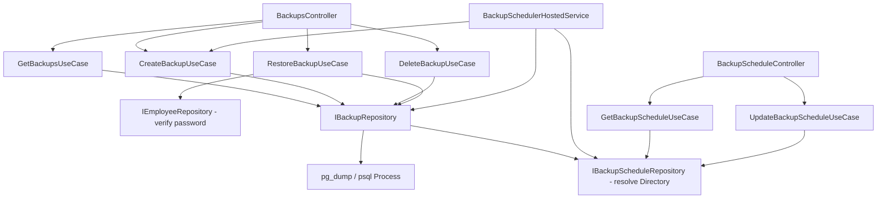

# Backups — Feature Document (BE + WPF)

> **Jira:** — | **Branch:** `dev` | **Generated:** 2026-07-26

---

## PRD Summary

> Sao lưu & phục hồi toàn bộ cơ sở dữ liệu PostgreSQL của hệ thống Lamour, có thể chạy thủ công hoặc tự động theo lịch, chỉ dành cho Admin.

- **Goal:** Cho phép Admin tạo bản sao lưu (`pg_dump`) theo yêu cầu hoặc theo lịch tự động, xem danh sách, xóa bản cũ, và phục hồi (`psql`) khi cần — không phụ thuộc WPF client có đang mở hay không.
- **User story:** As an Admin, I want the system to back up itself automatically and let me restore from any backup if something goes wrong, so that business data is never permanently lost.
- **Acceptance criteria:**
  - [x] `GET /api/v1/backups` trả danh sách file backup, mới nhất trước
  - [x] `POST /api/v1/backups` chạy `pg_dump`, tạo file mới
  - [x] `DELETE /api/v1/backups/{fileName}` xóa 1 file backup
  - [x] `POST /api/v1/backups/{fileName}/restore` phục hồi DB từ file, yêu cầu nhập lại mật khẩu Admin
  - [x] `GET`/`PUT /api/v1/backup-schedule` cấu hình lịch tự động (bật/tắt, giờ chạy, chu kỳ N ngày/lần, số ngày giữ, thư mục lưu trữ)
  - [x] `BackupSchedulerHostedService` chạy nền trong BE, tự trigger backup + dọn file cũ đúng lịch, không cần WPF mở
  - [x] WPF: màn hình "Sao lưu dữ liệu" (List + Tạo mới + Xóa + Phục hồi + cấu hình lịch), chỉ hiện tile trên Home khi đăng nhập bằng tài khoản Admin

---

## Business Rules

| Rule | Description |
|------|-------------|
| Chỉ Admin | Mọi endpoint `[Authorize(Roles = "Admin")]` — JWT đã có sẵn `ClaimTypes.Role` từ `LoginUseCase` |
| Backup dump có thể restore | `pg_dump` chạy với `--no-owner --no-privileges --clean --if-exists` — mỗi file backup tự chứa `DROP ... IF EXISTS` trước mỗi `CREATE`, restore không cần thao tác xóa schema thủ công |
| Path traversal | `fileName` (route param) luôn qua `Path.GetFileName()` trước khi ghép với thư mục cấu hình — chặn `../../etc/passwd` |
| Xác thực lại mật khẩu khi Restore | `RestoreBackupUseCase` lấy `employeeId` từ JWT claim, so `CreateEmployeeUseCase.HashPassword(password)` với `Employee.PasswordHash` hiện tại — sai mật khẩu → `DomainException` "Mật khẩu không đúng." |
| Restore là destructive | `psql -v ON_ERROR_STOP=1 -f <file>` chạy toàn bộ file — vì có `--clean --if-exists` nên sẽ DROP + tạo lại mọi bảng, **mất hết dữ liệu hiện tại** không thuộc file backup |
| Backup cũ (trước khi thêm `--clean`) không restore được | File tạo trước ngày thêm cờ `--clean --if-exists` sẽ báo lỗi `relation "..." already exists` khi restore — cần tạo backup mới để có thể phục hồi |
| Retention tự động | `BackupSchedulerHostedService` sau mỗi lần backup tự động sẽ gọi `DeleteOlderThanAsync(RetentionDays)` xóa file cũ hơn N ngày (dựa vào `CreationTimeUtc`) |
| Lịch chạy 1 lần/ngày | Kiểm tra mỗi phút (`CheckInterval = 1 phút`); so `LastRunAt.Date + IntervalDays` với ngày hiện tại (giờ local) để biết đã tới hạn chưa, và so giờ hiện tại với `TimeOfDay` (cửa sổ trùng khớp = đúng 1 phút) để tránh chạy lặp trong ngày |
| Thư mục lưu trữ động | `Directory` lưu trong bảng `backup_schedule` (không còn cố định trong `appsettings.json`) — `BackupRepository` đọc lại giá trị này ở đầu **mỗi** thao tác (Get/Create/Delete/Restore/DeleteOlderThan), tự `Directory.CreateDirectory()` nếu chưa tồn tại |
| Không cần EF migration cho file backup | Backup là file trên đĩa (`IBackupRepository`), không phải bảng DB — chỉ `BackupSchedule` (bảng cấu hình, luôn 1 row `Id=1`) mới cần EF/migration |

---

## Architecture Overview

### Key Components (BE)

| Layer | File | Role |
|-------|------|------|
| Controller | `Lamour.Api/Controllers/BackupsController.cs` | 4 action: GetAll/Create/Delete/Restore, `[Authorize(Roles="Admin")]` |
| Controller | `Lamour.Api/Controllers/BackupScheduleController.cs` | Get/Update cấu hình lịch |
| Hosted Service | `Lamour.Api/Realtime/BackupSchedulerHostedService.cs` | `BackgroundService` chạy nền, check mỗi phút, tự trigger backup + retention cleanup |
| UseCase | `UseCases/GetBackupsUseCase.cs` / `CreateBackupUseCase.cs` / `DeleteBackupUseCase.cs` | Passthrough tới repository, map DTO |
| UseCase | `UseCases/RestoreBackupUseCase.cs` | Xác thực lại mật khẩu Admin (`CreateEmployeeUseCase.HashPassword`) rồi mới gọi `IBackupRepository.RestoreAsync` |
| UseCase | `UseCases/GetBackupScheduleUseCase.cs` / `UpdateBackupScheduleUseCase.cs` | Validate `TimeOfDay` (regex HH:mm), `IntervalDays > 0`, `RetentionDays > 0`, `Directory` không rỗng |
| Repository | `Repositories/IBackupRepository.cs` | `GetAllAsync`, `CreateAsync`, `DeleteAsync`, `DeleteOlderThanAsync`, `RestoreAsync` — thao tác file + chạy process `pg_dump`/`psql` |
| Repository | `Repositories/IBackupScheduleRepository.cs` | `GetAsync`/`UpdateAsync` trên bảng `backup_schedule` (luôn 1 row) |
| Infra | `Lamour.Infrastructure/Repositories/BackupRepository.cs` | `ResolveDirectoryAsync()` đọc `Directory` từ `IBackupScheduleRepository` mỗi lần gọi; build `ProcessStartInfo` cho `pg_dump`/`psql` từ `NpgsqlConnectionStringBuilder` parse `ConnectionStrings:DefaultConnection` (tự đúng khi đổi môi trường, không hardcode credentials riêng) |
| Infra | `Lamour.Infrastructure/Repositories/BackupScheduleRepository.cs` | EF Core đơn giản: `_db.BackupSchedules.AsNoTracking().FirstAsync()` / `Update` + `SaveChangesAsync` |
| Entity | `Lamour.Domain/Entities/BackupSchedule.cs` | `Id`, `IsEnabled`, `TimeOfDay` (TimeOnly), `IntervalDays`, `RetentionDays`, `Directory`, `LastRunAt` — luôn đúng 1 row (`Id=1`, seed qua `HasData`) |
| Config | `Configurations/BackupScheduleConfiguration.cs` | Table `backup_schedule`, seed data mặc định |

### Data Flow — Backup thủ công

```
WPF: bấm "Tạo bản sao lưu mới"
  → POST /api/v1/backups
  → CreateBackupUseCase → IBackupRepository.CreateAsync()
  → ResolveDirectoryAsync() đọc Directory từ backup_schedule
  → Process.Start(pg_dump --no-owner --no-privileges --clean --if-exists -h -p -U -d -f <path>)
  → PGPASSWORD env var nếu connection string có password
  ← file .sql mới → BackupResponseDto
```

### Data Flow — Lịch tự động

```
BackupSchedulerHostedService (chạy liên tục, độc lập WPF)
  → mỗi 60s: đọc backup_schedule
  → IsEnabled=true && đã tới TimeOfDay && LastRunAt + IntervalDays <= hôm nay?
  → ICreateBackupUseCase.ExecuteAsync()
  → IBackupRepository.DeleteOlderThanAsync(RetentionDays)
  → cập nhật LastRunAt = UtcNow
```

### Data Flow — Restore

```
WPF: chọn file → "🔄 Phục hồi" → nhập lại mật khẩu Admin (RestoreConfirmWindow)
  → POST /api/v1/backups/{fileName}/restore  { password }
  → RestoreBackupUseCase: lấy employeeId từ JWT claim (ClaimTypes.NameIdentifier)
  → so HashPassword(password) với Employee.PasswordHash — sai → 400
  → IBackupRepository.RestoreAsync(fileName)
  → Process.Start(psql -v ON_ERROR_STOP=1 -h -p -U -d -f <path>)
  → NpgsqlConnection.ClearAllPools() (tránh connection cũ giữ plan trỏ object đã bị DROP/CREATE lại)
  ← 204 → WPF: MessageBox thành công → tự Clear token + ShutdownAsync realtime + NavigateToLogin
```



---

## Key Files & Symbols

### Domain
- [`Lamour.Domain/Entities/BackupSchedule.cs`](../../../../Lamour.Domain/Entities/BackupSchedule.cs) — `Id`, `IsEnabled`, `TimeOfDay`, `IntervalDays`, `RetentionDays`, `Directory`, `LastRunAt`

### Application — Repositories
- [`Repositories/IBackupRepository.cs`](../Repositories/IBackupRepository.cs) — `GetAllAsync`, `CreateAsync`, `DeleteAsync`, `DeleteOlderThanAsync(retentionDays)`, `RestoreAsync(fileName)`; record `BackupFileInfo(FileName, SizeBytes, CreatedAt)`
- [`Repositories/IBackupScheduleRepository.cs`](../Repositories/IBackupScheduleRepository.cs) — `GetAsync`, `UpdateAsync(schedule)`

### Application — DTOs
- [`Dtos/BackupResponseDto.cs`](../Dtos/BackupResponseDto.cs) — `file_name`, `size_bytes`, `created_at`
- [`Dtos/BackupScheduleResponseDto.cs`](../Dtos/BackupScheduleResponseDto.cs) — `is_enabled`, `time_of_day`, `interval_days`, `retention_days`, `directory`, `last_run_at`
- [`Dtos/UpdateBackupScheduleRequestDto.cs`](../Dtos/UpdateBackupScheduleRequestDto.cs) — cùng field trừ `last_run_at`
- [`Dtos/RestoreBackupRequestDto.cs`](../Dtos/RestoreBackupRequestDto.cs) — `password`

### Application — UseCases
- [`UseCases/GetBackupsUseCase.cs`](../UseCases/GetBackupsUseCase.cs) — `internal static MapToDto()` dùng chung
- [`UseCases/CreateBackupUseCase.cs`](../UseCases/CreateBackupUseCase.cs)
- [`UseCases/DeleteBackupUseCase.cs`](../UseCases/DeleteBackupUseCase.cs)
- [`UseCases/RestoreBackupUseCase.cs`](../UseCases/RestoreBackupUseCase.cs) — inject thêm `IEmployeeRepository` để verify password
- [`UseCases/GetBackupScheduleUseCase.cs`](../UseCases/GetBackupScheduleUseCase.cs) / [`UpdateBackupScheduleUseCase.cs`](../UseCases/UpdateBackupScheduleUseCase.cs)

### Infrastructure
- [`Lamour.Infrastructure/Repositories/BackupRepository.cs`](../../../../Lamour.Infrastructure/Repositories/BackupRepository.cs)
- [`Lamour.Infrastructure/Repositories/BackupScheduleRepository.cs`](../../../../Lamour.Infrastructure/Repositories/BackupScheduleRepository.cs)
- [`Lamour.Infrastructure/Persistence/Configurations/BackupScheduleConfiguration.cs`](../../../../Lamour.Infrastructure/Persistence/Configurations/BackupScheduleConfiguration.cs)
- [`Lamour.Api/Realtime/BackupSchedulerHostedService.cs`](../../../../Lamour.Api/Realtime/BackupSchedulerHostedService.cs)

---

## API Contracts

| Method | Endpoint | Input | Output |
|--------|----------|-------|--------|
| `GET` | `/api/v1/backups` | — | `BackupResponseDto[]`, mới nhất trước |
| `POST` | `/api/v1/backups` | — | `BackupResponseDto` (201) |
| `DELETE` | `/api/v1/backups/{fileName}` | — | 204 / 404 nếu không tồn tại |
| `POST` | `/api/v1/backups/{fileName}/restore` | `RestoreBackupRequestDto` | 204 / 400 sai mật khẩu / 404 file không tồn tại / 400 psql lỗi |
| `GET` | `/api/v1/backup-schedule` | — | `BackupScheduleResponseDto` |
| `PUT` | `/api/v1/backup-schedule` | `UpdateBackupScheduleRequestDto` | `BackupScheduleResponseDto` (200) / 400 validate |

Tất cả `[Authorize(Roles = "Admin")]`.

### Request — Restore
```json
{ "password": "mat_khau_admin_hien_tai" }
```

### Request/Response — Update Schedule
```json
{
  "is_enabled": true,
  "time_of_day": "02:00",
  "interval_days": 1,
  "retention_days": 30,
  "directory": "/Users/haiphan/Desktop/haiphan/be-window-lamour/backups"
}
```

---

## Edge Cases & Error Handling

| Scenario | Expected Behavior | Handled? |
|----------|------------------|----------|
| `pg_dump`/`psql` không tìm thấy đường dẫn cấu hình | `DomainException` "Không thể khởi chạy pg_dump/psql." → 400 | ✅ |
| `pg_dump` exit code != 0 | Xóa file dở dang, `DomainException` kèm stderr → 400 | ✅ |
| Xóa/Restore file không tồn tại | `DeleteAsync` trả `false` → `NotFoundException` ở UseCase → 404 | ✅ |
| `fileName` chứa path traversal (`../../etc/passwd`) | `Path.GetFileName()` luôn strip về tên file thuần trước khi ghép path | ✅ |
| Restore sai mật khẩu | `DomainException` "Mật khẩu không đúng." → 400 | ✅ |
| Restore file backup tạo trước khi có `--clean --if-exists` | `psql` báo lỗi `relation "..." already exists` — **giới hạn đã biết**, không tự động xử lý | ⚠️ Known limitation |
| Restore khi có client khác đang query | `NpgsqlConnection.ClearAllPools()` sau restore để tránh cached query plan lỗi thời — vẫn có rủi ro nhỏ với transaction đang mở dở | ⚠️ Rủi ro chấp nhận được |
| `Directory` cấu hình trỏ tới path không có quyền ghi | `Directory.CreateDirectory()` ném `UnauthorizedAccessException` → rơi vào nhánh 500 mặc định của `GlobalExceptionHandler` (chưa bọc thành `DomainException` riêng) | ⚠️ Chưa xử lý đẹp |
| Lịch tự động: BE restart đúng lúc tới giờ chạy | Có thể bỏ lỡ 1 lần chạy trong ngày đó — sẽ tự chạy lại vào lần tiếp theo tới hạn | ⚠️ Chấp nhận được |

---

## Test Coverage Notes

| Component | Test File | Coverage |
|-----------|-----------|----------|
| `CreateBackupUseCase` / `DeleteBackupUseCase` / `RestoreBackupUseCase` | — | ❌ Missing |
| `UpdateBackupScheduleUseCase` | — | ❌ Missing |
| `BackupSchedulerHostedService` | — | ❌ Missing (khó test vì phụ thuộc `DateTime.Now` + `Process.Start`) |

**Suggested test cases:**
- [ ] Restore: sai mật khẩu → `DomainException`
- [ ] Restore: file không tồn tại → `NotFoundException`
- [ ] UpdateBackupScheduleUseCase: `retention_days <= 0` / `interval_days <= 0` / `time_of_day` sai định dạng / `directory` rỗng → đều `DomainException`
- [ ] Scheduler: `LastRunAt` hôm qua + `IntervalDays=2` → chưa tới hạn hôm nay
- [ ] Scheduler: `LastRunAt` null (chưa từng chạy) → luôn tới hạn ngay khi tới giờ

---

## DI Registration (`Program.cs`)

```csharp
// ── Backups DI ────────────────────────────────────────────────────────────────
builder.Services.AddScoped<IBackupRepository, BackupRepository>();
builder.Services.AddScoped<IGetBackupsUseCase, GetBackupsUseCase>();
builder.Services.AddScoped<ICreateBackupUseCase, CreateBackupUseCase>();
builder.Services.AddScoped<IDeleteBackupUseCase, DeleteBackupUseCase>();
builder.Services.AddScoped<IRestoreBackupUseCase, RestoreBackupUseCase>();
builder.Services.AddScoped<IBackupScheduleRepository, BackupScheduleRepository>();
builder.Services.AddScoped<IGetBackupScheduleUseCase, GetBackupScheduleUseCase>();
builder.Services.AddScoped<IUpdateBackupScheduleUseCase, UpdateBackupScheduleUseCase>();
builder.Services.AddHostedService<BackupSchedulerHostedService>();
```

## Configuration (`appsettings.json`)

```json
"BackupSettings": {
  "Directory": "/Users/haiphan/Desktop/haiphan/be-window-lamour/backups",  // chỉ dùng làm giá trị SEED ban đầu — sau đó Directory thực tế nằm trong bảng backup_schedule, đổi được qua UI
  "PgDumpPath": "/opt/homebrew/opt/postgresql@16/bin/pg_dump",
  "PsqlPath": "/opt/homebrew/opt/postgresql@16/bin/psql"
}
```

> Khi deploy Windows Server: đổi `PgDumpPath`/`PsqlPath` sang path `.exe` của PostgreSQL cài trên máy đó (tương tự cách `appsettings.Production.json` đã đổi `ConnectionStrings`).

## EF Migrations

3 migration liên tiếp cho bảng `backup_schedule` (không đụng tới bảng nghiệp vụ nào khác):

1. `BackupScheduleCreate` — tạo bảng, seed 1 row mặc định (`IsEnabled=false, TimeOfDay=02:00, RetentionDays=30`)
2. `BackupScheduleAddIntervalDays` — thêm cột `interval_days` (default 1)
3. `BackupScheduleAddDirectory` — thêm cột `directory` (varchar 500, seed = giá trị `BackupSettings:Directory` lúc đó trong `appsettings.json`)

```bash
export PATH="$PATH:$HOME/.dotnet/tools"
dotnet ef database update --project src/Lamour.Infrastructure --startup-project src/Lamour.Api
```

---

## WPF Client (`desktop-lamour`)

### Module: `Features/HomePage/Backups/`

Cấu trúc giống hệt pattern Category/Supplier (Data/Services, Data/Repositories, Domain/UseCases, ViewModels, Views):

| File | Role |
|---|---|
| `Domain/Models/BackupInfo.cs` | `FileName`, `SizeBytes`, `CreatedAt` (local time) + `SizeDisplay` computed (B/KB/MB) |
| `Domain/Models/BackupSchedule.cs` | `IsEnabled`, `TimeOfDay` (string "HH:mm"), `IntervalDays`, `RetentionDays`, `Directory`, `LastRunAt` |
| `Data/Services/IBackupService.cs` / `BackupService.cs` | HttpClient, `EnsureSuccessOrThrowAsync` pattern, timeout 5 phút (pg_dump có thể lâu) |
| `Data/Repositories/IBackupRepository.cs` / `BackupRepository.cs` | Map DTO ↔ model, convert `CreatedAt`/`LastRunAt` UTC → Local |
| `Domain/UseCases/` | `IGetBackupsUseCase`, `ICreateBackupUseCase`, `IDeleteBackupUseCase`, `IRestoreBackupUseCase`, `IGetBackupScheduleUseCase`, `IUpdateBackupScheduleUseCase` — `UpdateBackupScheduleUseCase` validate client-side (regex HH:mm, `RetentionDays`/`IntervalDays > 0`, `Directory` không rỗng) trước khi gọi API |
| `ViewModels/BackupViewModel.cs` | List + Tạo mới + Xóa (confirm dialog) + Phục hồi (mở `RestoreConfirmWindow`) + Load/Save lịch tự động + `OpenDirectoryCommand` (mở folder local qua `Process.Start`) |
| `ViewModels/RestoreConfirmViewModel.cs` + `Views/RestoreConfirmWindow.xaml` | Popup cảnh báo đỏ "không thể hoàn tác" + tên file + `AppPasswordField` — nút "Phục hồi" chỉ bật khi có mật khẩu |
| `Views/BackupView.xaml` | Toolbar (Tạo mới/Phục hồi/Xóa) + section "⏰ Lịch tự động" (ô thư mục + nút mở folder, Giờ/Phút/Chạy mỗi/Giữ tối đa, nút Lưu cấu hình) + DataGrid danh sách backup |

### Ẩn tính năng theo Role (Admin-only)

- `UserInfo`/`IAuthTokenStorage` mở rộng thêm `Role` (lưu lúc login qua `LoginViewModel`, xóa lúc logout/`Clear()`)
- `HomeViewModel.IsAdmin` đọc `tokenStorage.GetRole() == "Admin"` lúc khởi tạo (mỗi lần `NavigateToHome()` tạo `HomeViewModel` mới nên luôn cập nhật đúng)
- `HomeView.xaml` section "Hệ thống" (tile "💾 Sao lưu dữ liệu") có `Visibility` bind `IsAdmin` — non-Admin không thấy tile, dù BE vẫn chặn 403 nếu cố gọi thẳng API

### Navigation

- `NavigationRoutes.Backup.List = "BackupView"` + case tương ứng trong `NavigationService.ResolveView`
- Vào từ `HomeViewModel.NavigateToBackupCommand` (chỉ hiện khi `IsAdmin`)

### Nút "📂 Mở thư mục"

`BackupViewModel.OpenDirectoryCommand` gọi `Process.Start(new ProcessStartInfo { FileName = ScheduleDirectory, UseShellExecute = true })` — mở folder **local trên máy đang chạy WPF client**, KHÔNG phải máy chạy BE. Chỉ đúng khi WPF và BE chạy chung 1 máy; nếu WPF chạy qua UTM còn BE chạy trên Mac, nút này sẽ báo lỗi (đã bọc try/catch hiện warning rõ ràng thay vì crash).

---

## Known gaps (chưa làm, ngoài phạm vi yêu cầu ban đầu)

- Chưa có unit test nào cho Backup/BackupSchedule UseCases (BE lẫn WPF)
- `Directory.CreateDirectory()` lỗi quyền ghi chưa được bọc thành `DomainException` riêng — vẫn rơi vào 500 mặc định
- Nút "Mở thư mục" chỉ hoạt động đúng khi WPF + BE chạy chung máy — chưa có cách nào "mở remote folder" khi chạy qua UTM
- Backup cũ tạo trước khi thêm `--clean --if-exists` (trước 2026-07-26) không thể restore được, phải tạo lại
- Chưa có cảnh báo trong lúc restore nếu có client khác đang active connection tới DB

---

*Generated by `/ct-be-to-desktop` on 2026-07-26*
