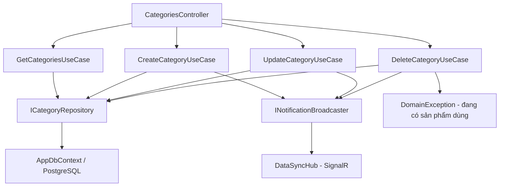

# Categories — Feature Document (BE + WPF)

> **Jira:** — | **Branch:** `dev` | **Generated:** 2026-07-25

---

## PRD Summary

> Danh mục sản phẩm ("Danh mục") — trước đây là 1 trường text tự do trên `Product.Category`, giờ tách thành master-data entity riêng để quản lý nhất quán và tái sử dụng được ở nhiều nơi.

- **Goal:** Cung cấp CRUD API cho Danh mục + FK thật trên `Product` (thay vì string tự do), kèm dropdown chọn/thêm nhanh Danh mục ngay trong popup "Thêm sản phẩm" ở WPF client.
- **User story:** As a Lamour warehouse manager, I want products to reference a managed list of categories so that category names stay consistent (no typos/duplicates) across the catalog.
- **Acceptance criteria:**
  - [x] `GET /api/v1/categories` trả danh sách tất cả danh mục
  - [x] `POST /api/v1/categories` tạo mới, validate `name` unique case-insensitive + required
  - [x] `PUT /api/v1/categories/{id}` cập nhật, validate unique (exclude self)
  - [x] `DELETE /api/v1/categories/{id}` xóa — chặn nếu đang có sản phẩm dùng
  - [x] `Product.Category` (string) → `Product.CategoryId` (FK) — migration backfill tự động từ dữ liệu string cũ, không mất data
  - [x] WPF: popup "Thêm sản phẩm" đổi ô "Danh mục" từ textbox tự do sang dropdown (`AppSearchableComboBox`) + nút "+" mở `CategoryFormWindow` thêm nhanh ngay tại chỗ
  - [x] Category dùng chung hạ tầng cache (load 1 lần sau login) + SignalR realtime đã có sẵn cho Customer/Employee/Product/Supplier

---

## Business Rules

| Rule | Description |
|------|-------------|
| Name required | `name` không được trống — `DomainException` |
| Name unique | `name` unique case-insensitive — `DomainException` nếu trùng (Create: check toàn bộ; Update: exclude chính nó) |
| Không xóa được nếu đang dùng | `DeleteCategoryUseCase` gọi `ICategoryRepository.IsInUseAsync(id)` trước — nếu có ít nhất 1 `Product.CategoryId` trỏ tới → `DomainException`, không cho xóa |
| FK Restrict ở DB | `ProductConfiguration` khai báo `OnDelete: Restrict` cho `Product.CategoryId → Categories.Id` — lớp phòng thủ thứ 2 ở tầng DB, phòng trường hợp check ở UseCase bị bỏ qua |
| Backfill migration (2026-07-25) | Migration `CategoriesCreate` tạo bảng `categories`, insert 1 row cho mỗi giá trị `products.category` (string) distinct — gom nhóm theo `TRIM` + so sánh case-insensitive để tránh trùng do khác hoa/thường/khoảng trắng; sản phẩm nào `category` rỗng/NULL được gán vào category fallback `"Chưa phân loại"` (tự tạo nếu cần) |
| WPF cache-first | `ICategoryService.GetAllAsync` cache-first giống Product/Supplier — load 1 lần sau login (`PostLoginSyncService`), tự cập nhật qua `DataSyncHub` khi có Category khác được tạo/sửa/xóa ở client khác |

---

## Architecture Overview

### Key Components (BE)

| Layer | File | Role |
|-------|------|------|
| Controller | `Lamour.Api/Controllers/CategoriesController.cs` | 4 HTTP actions (GetAll/Create/Update/Delete), `[Authorize]` |
| UseCase | `UseCases/GetCategoriesUseCase.cs` | Fetch all + map to DTO; `MapToDto` static dùng chung |
| UseCase | `UseCases/CreateCategoryUseCase.cs` | Validate required + unique → persist → broadcast `CategoryCreated` |
| UseCase | `UseCases/UpdateCategoryUseCase.cs` | Find → validate unique (exclude self) → update → broadcast `CategoryUpdated` |
| UseCase | `UseCases/DeleteCategoryUseCase.cs` | Find → `IsInUseAsync` guard → delete → broadcast `CategoryDeleted` |
| Repository | `Repositories/ICategoryRepository.cs` | `GetAllAsync`, `GetByIdAsync`, `NameExistsAsync`, `IsInUseAsync`, `AddAsync`, `UpdateAsync`, `DeleteAsync` |
| Repository | `Lamour.Infrastructure/Repositories/CategoryRepository.cs` | EF Core implementation; `IsInUseAsync` query trực tiếp `_db.Products.AnyAsync(p => p.CategoryId == categoryId)` |
| Entity | `Lamour.Domain/Entities/Category.cs` | Chỉ `Id`, `Name` — không có `Code` (khác Supplier/Product) |
| Config | `Lamour.Infrastructure/Persistence/Configurations/CategoryConfiguration.cs` | Table `categories`, `Name` unique index |
| Realtime | `Lamour.Api/Realtime/SignalRNotificationBroadcaster.cs` | `CategoryCreatedAsync`/`CategoryUpdatedAsync`/`CategoryDeletedAsync` — cùng `DataSyncHub` với Customer/Employee/Product/Supplier |

### Data Flow

```
HTTP Request
  → CategoriesController
  → IXxxCategoryUseCase.ExecuteAsync()
  → ICategoryRepository
  → AppDbContext (EF Core + PostgreSQL table: categories)
  ← Category entity → CategoryResponseDto
  ← INotificationBroadcaster.CategoryXxxAsync() → SignalR DataSyncHub → mọi WPF client đang kết nối
  ← IActionResult
```



### Quan hệ với Product

`Lamour.Domain/Entities/Product.cs`: `CategoryId` (int, FK) + `Category` (navigation) — trước 2026-07-25 là `string Category` tự do. `ProductRepository.GetAllAsync`/`GetByIdAsync` phải `.Include(p => p.Category)` để `ProductResponseDto.CategoryName` không rỗng. Chi tiết đầy đủ về phía Product xem [`products.md`](../../Products/docs/products.md).

---

## Key Files & Symbols

### Domain
- [`Lamour.Domain/Entities/Category.cs`](../../../../Lamour.Domain/Entities/Category.cs) — `Id`, `Name`

### Application — Repositories
- [`Repositories/ICategoryRepository.cs`](../Repositories/ICategoryRepository.cs) — `GetAllAsync`, `GetByIdAsync`, `NameExistsAsync(name, excludeId?)`, `IsInUseAsync(categoryId)`, `AddAsync`, `UpdateAsync`, `DeleteAsync`

### Application — DTOs
- [`Dtos/CategoryResponseDto.cs`](../Dtos/CategoryResponseDto.cs) — `id`, `name`
- [`Dtos/CreateCategoryRequestDto.cs`](../Dtos/CreateCategoryRequestDto.cs) — `name`
- [`Dtos/UpdateCategoryRequestDto.cs`](../Dtos/UpdateCategoryRequestDto.cs) — `name`

### Application — UseCases
- [`UseCases/GetCategoriesUseCase.cs`](../UseCases/GetCategoriesUseCase.cs) — `ExecuteAsync()` → `IEnumerable<CategoryResponseDto>`; `internal static MapToDto()` dùng chung
- [`UseCases/CreateCategoryUseCase.cs`](../UseCases/CreateCategoryUseCase.cs) — Validate required + `NameExistsAsync` → `AddAsync` → broadcast
- [`UseCases/UpdateCategoryUseCase.cs`](../UseCases/UpdateCategoryUseCase.cs) — `GetByIdAsync` → validate → `UpdateAsync` → broadcast
- [`UseCases/DeleteCategoryUseCase.cs`](../UseCases/DeleteCategoryUseCase.cs) — `GetByIdAsync` → `IsInUseAsync` guard → `DeleteAsync` → broadcast

### Infrastructure
- [`Lamour.Infrastructure/Repositories/CategoryRepository.cs`](../../../../Lamour.Infrastructure/Repositories/CategoryRepository.cs) — EF Core impl, `AsNoTracking()` trên mọi read
- [`Lamour.Infrastructure/Persistence/Configurations/CategoryConfiguration.cs`](../../../../Lamour.Infrastructure/Persistence/Configurations/CategoryConfiguration.cs) — table `categories`, unique index trên `name`

---

## API Contracts

| Method | Endpoint | Input | Output |
|--------|----------|-------|--------|
| `GET` | `/api/v1/categories` | — | `CategoryResponseDto[]` |
| `POST` | `/api/v1/categories` | `CreateCategoryRequestDto` | `CategoryResponseDto` (201) |
| `PUT` | `/api/v1/categories/{id}` | `UpdateCategoryRequestDto` | `CategoryResponseDto` (200) |
| `DELETE` | `/api/v1/categories/{id}` | — | 204 No Content / 400 nếu đang có sản phẩm dùng |

### Request — Create / Update
```json
{ "name": "Son môi" }
```

### Response
```json
{ "id": 1, "name": "Son môi" }
```

---

## Edge Cases & Error Handling

| Scenario | Expected Behavior | Handled? |
|----------|------------------|----------|
| `name` trống | `DomainException` → 400 | ✅ |
| `name` đã tồn tại (Create) | `DomainException` → 400 | ✅ |
| `name` trùng khi Update (exclude self) | `DomainException` → 400 | ✅ |
| `id` không tồn tại (Update/Delete) | `NotFoundException` → 404 | ✅ |
| Xóa Category đang có Product dùng | `DomainException` → 400 ("Không thể xóa danh mục '...' vì đang có sản phẩm sử dụng.") | ✅ |
| Migration: `products.category` cũ trùng tên khác hoa/thường/khoảng trắng | Gom về 1 `Category` duy nhất qua `TRIM` + `LOWER` khi backfill | ✅ |
| Migration: `products.category` rỗng/NULL | Gán vào category fallback `"Chưa phân loại"` (tự tạo nếu chưa có) | ✅ |

---

## Test Coverage Notes

| Component | Test File | Coverage |
|-----------|-----------|----------|
| `GetCategoriesUseCase` | — | ❌ Missing |
| `CreateCategoryUseCase` | — | ❌ Missing |
| `UpdateCategoryUseCase` | — | ❌ Missing |
| `DeleteCategoryUseCase` | — | ❌ Missing |
| `CategoryRepository` | — | ❌ Missing |

**Suggested test cases:**
- [ ] Create: `name` trống → `DomainException`
- [ ] Create: `name` trùng (khác hoa/thường) → `DomainException`
- [ ] Update: `id` không tồn tại → `NotFoundException`
- [ ] Delete: category đang có Product dùng → `DomainException`, không xóa
- [ ] Delete: category không có Product nào dùng → xóa thành công

---

## DI Registration (`Program.cs`)

```csharp
// ── Categories DI ─────────────────────────────────────────────────────────────
builder.Services.AddScoped<Lamour.Application.Features.Categories.Repositories.ICategoryRepository,
                           Lamour.Infrastructure.Repositories.CategoryRepository>();
builder.Services.AddScoped<Lamour.Application.Features.Categories.UseCases.IGetCategoriesUseCase,
                           Lamour.Application.Features.Categories.UseCases.GetCategoriesUseCase>();
builder.Services.AddScoped<Lamour.Application.Features.Categories.UseCases.ICreateCategoryUseCase,
                           Lamour.Application.Features.Categories.UseCases.CreateCategoryUseCase>();
builder.Services.AddScoped<Lamour.Application.Features.Categories.UseCases.IUpdateCategoryUseCase,
                           Lamour.Application.Features.Categories.UseCases.UpdateCategoryUseCase>();
builder.Services.AddScoped<Lamour.Application.Features.Categories.UseCases.IDeleteCategoryUseCase,
                           Lamour.Application.Features.Categories.UseCases.DeleteCategoryUseCase>();
```

## EF Migration

Migration `CategoriesCreate` (`20260725093244_CategoriesCreate.cs`) — **viết tay lại thứ tự thao tác** sau khi scaffold, vì EF tự sinh sẽ `DropColumn("category")` **trước** khi tạo bảng `categories`, làm mất data cần backfill trước khi kịp đọc. Thứ tự đúng đã áp dụng:

1. `CreateTable("categories")` + unique index trên `name`
2. `AddColumn<int>("category_id", nullable: true)` — tạm nullable
3. Raw SQL: `INSERT INTO categories` — 1 row/distinct value của `products.category` (trim + case-insensitive dedupe qua `DISTINCT ON (LOWER(TRIM(category)))`)
4. Raw SQL: tạo category `"Chưa phân loại"` nếu có sản phẩm category rỗng/NULL
5. Raw SQL: `UPDATE products SET category_id = ...` khớp theo tên đã chuẩn hóa, fallback về `"Chưa phân loại"` cho phần còn lại
6. `AlterColumn` `category_id` → `NOT NULL` + `CreateIndex` + `AddForeignKey` (`OnDelete: Restrict`)
7. `DropColumn("category")` — **cuối cùng**, sau khi data đã migrate ra khỏi nó

Đã chạy `dotnet ef database update` trên DB local, verify bằng `psql`: 5 category tạo ra từ dữ liệu cũ, toàn bộ 9 sản phẩm hiện có gán đúng `category_id`, không có sản phẩm nào rơi vào `"Chưa phân loại"` (vì `category` luôn required từ trước).

```bash
export PATH="$PATH:$HOME/.dotnet/tools"
dotnet ef migrations add CategoriesCreate \
  --project src/Lamour.Infrastructure \
  --startup-project src/Lamour.Api
# → migration file cần sửa tay lại thứ tự Up() như trên trước khi chạy update
dotnet ef database update \
  --project src/Lamour.Infrastructure \
  --startup-project src/Lamour.Api
```

---

## WPF Client (`desktop-lamour`)

> Không có doc riêng phía WPF cho Categories — module nhỏ, ghi chú gộp ở đây.

### Module mới: `Features/HomePage/Categories/`

Cấu trúc giống hệt pattern Supplier/Product (Data/Services, Data/Cache, Data/Repositories, Domain/Models, Domain/UseCases):

| File | Role |
|---|---|
| `Domain/Models/Category.cs` | Implements `ISearchableItem` — `Code` luôn rỗng (Category không có mã), `DisplayText => Name` |
| `Data/Services/ICategoryService.cs` / `CategoryService.cs` | HttpClient cache-first, dùng `EnsureSuccessOrThrowAsync` (đọc body lỗi `{"error": "..."}` từ BE) — 4 method `GetAllAsync`/`CreateAsync`/`UpdateAsync`/`DeleteAsync` |
| `Data/Cache/ICategoryCacheStore.cs` / `CategoryCacheStore.cs` | `EntityCacheStore<CategoryResponseDto>` tái dùng generic có sẵn |
| `Data/Repositories/ICategoryRepository.cs` / `CategoryRepository.cs` | Map DTO ↔ `Category` model — `GetAllAsync`/`CreateAsync`/`UpdateAsync`/`DeleteAsync` |
| `Domain/UseCases/IGetCategoriesUseCase.cs` + `ICreateCategoryUseCase.cs` + `IUpdateCategoryUseCase.cs` + `IDeleteCategoryUseCase.cs` | 4 UseCase — validate client-side (`ValidationException`, unique-name check exclude self khi Update) trước khi gọi API |
| `ViewModels/CategoryFormViewModel.cs` + `Views/CategoryFormWindow.xaml` | Popup nhỏ (chỉ 1 field `Name`) — hỗ trợ cả Add lẫn Edit (`Initialize(Category? category = null)`), cùng pattern `ShowDialog()`/`RequestClose` với `CustomerFormWindow`/`EmployeeFormWindow`/`SupplierFormWindow` |
| `ViewModels/CategoryListViewModel.cs` + `Views/CategoryListView.xaml` | Trang điều hướng đầy đủ List + Thêm + Sửa + Xóa — cùng skeleton `ProductListView`/`SupplierListView` (không có nút "Nhân bản" vì Category không có endpoint duplicate). Xóa thất bại (đang có sản phẩm dùng) hiện nguyên message BE qua `MessageBox.Show` |

### Wiring vào `ProductFormWindow`

- `ProductFormViewModel`: `Category` (string) → `Categories` (`IReadOnlyList<ISearchableItem>`) + `SelectedCategory` + `AddCategoryCommand` — load categories fire-and-forget trong `Initialize()`, cùng pattern `AddCustomerCommand`/`AddEmployeeCommand` trong `SalesOrderViewModel` (mở `CategoryFormWindow`, reload list, auto-select item mới)
- `ProductFormWindow.xaml`: ô "Danh mục" đổi từ `AppTextField` → `AppSearchableComboBox` + `AddCommand="{Binding AddCategoryCommand}"`
- `Product.cs` (WPF model): `Category` (string) → `CategoryId` (int) + `CategoryName` (string)
- `ProductListView.xaml`: cột "Danh mục" đổi binding sang `CategoryName`
- `SalesOrderReportFilterViewModel.cs`: dropdown lọc báo cáo theo Category đổi từ derive `p.Category` sang `p.CategoryName` (không đổi cơ chế — vẫn là distinct-value client-side, không gọi API Category riêng cho filter này)

### Màn hình quản lý Danh mục (từ "Sản phẩm")

- Ban đầu wire vào tile trong `SalesView` ("Bán hàng"), sau đó **move sang `ProductListView`** cho hợp lý về mặt nghiệp vụ (Danh mục là master-data của Sản phẩm, không liên quan Bán hàng)
- `ProductListView.xaml` toolbar có thêm nút "🏷️ Danh mục" (style `Tertiary.Medium`, đặt cuối toolbar sau "🗑️ Xóa") → `ProductListViewModel.NavigateToCategoriesCommand` → `NavigationService.NavigateTo(NavigationRoutes.Categories.List)`
- `NavigationRoutes.Categories.List = "CategoryListView"` + case tương ứng trong `NavigationService.ResolveView`
- `CategoryListView`: DataGrid 1 cột "Tên danh mục" + toolbar "➕ Thêm" / "✏️ Sửa" / "🗑️ Xóa" (không có "📋 Nhân bản")
- Xóa danh mục đang có sản phẩm dùng: BE trả 400 với message rõ ràng, WPF hiện đúng message đó qua `MessageBox.Show(ex.Message, "Xóa thất bại", ...)` — không có confirm-dialog phụ, chỉ confirm "Bạn có chắc muốn xóa?" trước khi gọi API (giống Product/Supplier)

### Realtime — dùng chung hạ tầng đã có

`RealtimeSyncService`/`RealtimeServiceCollectionExtensions`/`PostLoginSyncService` (tại `Features/Realtime/`) đã thêm `ICategoryCacheStore` + lắng nghe `CategoryCreated`/`CategoryUpdated`/`CategoryDeleted` từ `DataSyncHub` — Category giờ warmup sau login + tự cập nhật real-time y hệt Customer/Employee/Product/Supplier.

### DI (`HomeServiceCollectionExtensions.cs`)

```csharp
// ── Categories: Views + ViewModels ───────────────────────────────────
services.AddTransient<CategoryFormWindow>();
services.AddTransient<CategoryFormViewModel>();
services.AddTransient<CategoryListView>();
services.AddTransient<CategoryListViewModel>();

// ── Categories: UseCases ──────────────────────────────────────────────
services.AddTransient<IGetCategoriesUseCase, GetCategoriesUseCase>();
services.AddTransient<ICreateCategoryUseCase, CreateCategoryUseCase>();
services.AddTransient<IUpdateCategoryUseCase, UpdateCategoryUseCase>();
services.AddTransient<IDeleteCategoryUseCase, DeleteCategoryUseCase>();

// ── Categories: Repository ────────────────────────────────────────────
services.AddTransient<ICategoryRepository, CategoryRepository>();

// ── Categories: Local cache (populated after login, kept fresh via SignalR) ──
services.AddSingleton<ICategoryCacheStore, CategoryCacheStore>();

// ── Categories: Service + typed HttpClient ───────────────────────────
services.AddHttpClient<ICategoryService, CategoryService>(client => { ... });

// ── Categories: Window factory ────────────────────────────────────────
services.AddTransient<Func<CategoryFormWindow>>(sp => () => sp.GetRequiredService<CategoryFormWindow>());
```

### Known gaps (chưa làm, ngoài phạm vi yêu cầu ban đầu)

- Chưa có unit test nào cho Category UseCases (BE lẫn WPF).

---

*Generated by `/ct-be-to-desktop` on 2026-07-25*
