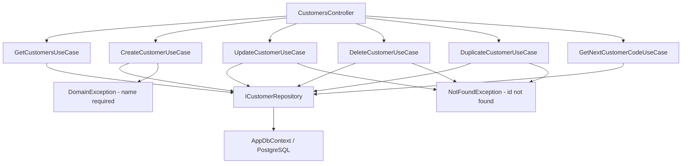

# Customers — Feature Document (BE)

> **Jira:** — | **Branch:** `dev` | **Generated:** 2026-04-25

---

## PRD Summary

> API quản lý danh sách khách hàng cho hệ thống Lamour Spa & Cosmetics.

- **Goal:** Cung cấp CRUD API đầy đủ cho module Khách Hàng, bao gồm tự động sinh mã KH và nhân bản.
- **User story:** As a Lamour admin, I want to manage customers via a REST API so that the WPF desktop client can display and edit customer data.
- **Acceptance criteria:**
  - [x] `GET /api/v1/customers` trả danh sách tất cả khách hàng
  - [x] `POST /api/v1/customers` tạo mới với mã `KH{5 digits}` tự động sinh
  - [x] `PUT /api/v1/customers/{id}` cập nhật thông tin (không đổi mã)
  - [x] `DELETE /api/v1/customers/{id}` xóa khách hàng
  - [x] `POST /api/v1/customers/{id}/duplicate` nhân bản với mã mới tự sinh
  - [x] `GET /api/v1/customers/next-code` trả mã tiếp theo để WPF preview

---

## Business Rules

| Rule | Description |
|------|-------------|
| Mã tự động sinh | Format `KH{5 digits}` (KH00001, KH00002...). Server tính max hiện tại + 1 |
| Mã không thể sửa | Sau khi tạo, `code` là immutable — không expose trong UpdateRequestDto |
| Tên bắt buộc | `name` không được để trống — ném `DomainException` nếu vi phạm |
| Unique index | `code` có unique index trong DB — không thể trùng |
| AsNoTracking | Tất cả read queries dùng `AsNoTracking()` |

---

## Architecture Overview

### Key Components

| Layer | File | Role |
|-------|------|------|
| Controller | `Lamour.Api/Controllers/CustomersController.cs` | HTTP entry point, 6 actions |
| UseCase | `UseCases/GetCustomersUseCase.cs` | Fetch & map all customers |
| UseCase | `UseCases/CreateCustomerUseCase.cs` | Validate + auto-gen code + persist |
| UseCase | `UseCases/UpdateCustomerUseCase.cs` | Validate + update mutable fields |
| UseCase | `UseCases/DeleteCustomerUseCase.cs` | Find + delete |
| UseCase | `UseCases/DuplicateCustomerUseCase.cs` | Clone with new auto-gen code |
| UseCase | `UseCases/GetNextCustomerCodeUseCase.cs` | Compute next KHxxxxx code |
| Repository | `Repositories/ICustomerRepository.cs` | Data access contract |
| Repository | `Lamour.Infrastructure/Repositories/CustomerRepository.cs` | EF Core implementation |
| Entity | `Lamour.Domain/Entities/Customer.cs` | Domain model |
| Config | `Lamour.Infrastructure/Persistence/Configurations/CustomerConfiguration.cs` | EF table mapping |

### Data Flow

```
HTTP Request
  → CustomersController (action method)
  → IXxxCustomerUseCase.ExecuteAsync()
  → ICustomerRepository (GetAllAsync / GetNextCodeAsync / AddAsync / UpdateAsync / DeleteAsync)
  → AppDbContext (EF Core + PostgreSQL)
  ← Customer entity
  ← CustomerResponseDto (mapped in UseCase)
  ← IActionResult (Ok / CreatedAtAction / NoContent)
```



---

## Key Files & Symbols

### Domain
- [`Lamour.Domain/Entities/Customer.cs`](../../../../Lamour.Domain/Entities/Customer.cs) — Entity: `Id`, `Code`, `Name`, `Address`, `Province`, `CustomerGroup`, `TaxCode`, `Phone`, `SaleCare`

### Application — Repositories
- [`Repositories/ICustomerRepository.cs`](../Repositories/ICustomerRepository.cs) — `GetAllAsync`, `GetByIdAsync`, `GetNextCodeAsync`, `AddAsync`, `UpdateAsync`, `DeleteAsync`

### Application — DTOs
- [`Dtos/CustomerResponseDto.cs`](../Dtos/CustomerResponseDto.cs) — Response: 9 fields snake_case JSON (thêm `sale_care`)
- [`Dtos/CreateCustomerRequestDto.cs`](../Dtos/CreateCustomerRequestDto.cs) — Create: `name`, `address`, `province`, `customer_group`, `tax_code`, `phone`, `sale_care` (no code)
- [`Dtos/UpdateCustomerRequestDto.cs`](../Dtos/UpdateCustomerRequestDto.cs) — Update: same fields (no code)

### Application — UseCases
- [`UseCases/GetCustomersUseCase.cs`](../UseCases/GetCustomersUseCase.cs) — `ExecuteAsync()` → `IEnumerable<CustomerResponseDto>`
- [`UseCases/CreateCustomerUseCase.cs`](../UseCases/CreateCustomerUseCase.cs) — Validate name → `GetNextCodeAsync` → `AddAsync`
- [`UseCases/UpdateCustomerUseCase.cs`](../UseCases/UpdateCustomerUseCase.cs) — `GetByIdAsync` → validate → `UpdateAsync`
- [`UseCases/DeleteCustomerUseCase.cs`](../UseCases/DeleteCustomerUseCase.cs) — `GetByIdAsync` → `DeleteAsync`
- [`UseCases/DuplicateCustomerUseCase.cs`](../UseCases/DuplicateCustomerUseCase.cs) — Clone entity, new code via `GetNextCodeAsync`
- [`UseCases/GetNextCustomerCodeUseCase.cs`](../UseCases/GetNextCustomerCodeUseCase.cs) — Compute `KH{max+1:D5}`

### Infrastructure
- [`Lamour.Infrastructure/Repositories/CustomerRepository.cs`](../../../../Lamour.Infrastructure/Repositories/CustomerRepository.cs) — EF Core impl, `GetNextCodeAsync` parses existing KH codes
- [`Lamour.Infrastructure/Persistence/Configurations/CustomerConfiguration.cs`](../../../../Lamour.Infrastructure/Persistence/Configurations/CustomerConfiguration.cs) — Table `customers`, unique index on `code`

---

## API Contracts

| Method | Endpoint | Input | Output |
|--------|----------|-------|--------|
| `GET` | `/api/v1/customers` | — | `CustomerResponseDto[]` |
| `GET` | `/api/v1/customers/next-code` | — | `{ "code": "KH00002" }` |
| `POST` | `/api/v1/customers` | `CreateCustomerRequestDto` | `CustomerResponseDto` (201) |
| `PUT` | `/api/v1/customers/{id}` | `UpdateCustomerRequestDto` | `CustomerResponseDto` (200) |
| `DELETE` | `/api/v1/customers/{id}` | — | 204 No Content |
| `POST` | `/api/v1/customers/{id}/duplicate` | — | `CustomerResponseDto` (201) |

### Request — Create / Update
```json
{
  "name": "CHI NHI",
  "address": "351 Nguyễn Thiện Thuật, P.6, Q.3, HCM",
  "province": "TP HỒ CHÍ MINH",
  "customer_group": "TP HỒ CHÍ MINH",
  "tax_code": "",
  "phone": "0932737477",
  "sale_care": "Nguyễn Văn A"
}
```

### Response
```json
{
  "id": 1,
  "code": "KH00001",
  "name": "CHI NHI",
  "address": "351 Nguyễn Thiện Thuật, P.6, Q.3, HCM",
  "province": "TP HỒ CHÍ MINH",
  "customer_group": "TP HỒ CHÍ MINH",
  "tax_code": "",
  "phone": "0932737477",
  "sale_care": "Nguyễn Văn A"
}
```

---

## Edge Cases & Error Handling

| Scenario | Expected Behavior | Handled? |
|----------|------------------|----------|
| `name` trống | `DomainException` → 400 Bad Request | ✅ |
| `id` không tồn tại (GET/PUT/DELETE) | `NotFoundException` → 404 | ✅ |
| Database unreachable | `GlobalExceptionHandler` → 500 | ✅ |
| Duplicate code (race condition) | PostgreSQL unique constraint → 500 (to improve) | ❌ |
| `next-code` với DB trống | Trả `KH00001` (DefaultIfEmpty(0) + 1) | ✅ |
| Code format không phải KHxxxxx | Bỏ qua khi tính max (Where filter) | ✅ |

---

## Test Coverage Notes

| Component | Test File | Coverage |
|-----------|-----------|----------|
| `GetCustomersUseCase` | — | ❌ Missing |
| `CreateCustomerUseCase` | — | ❌ Missing |
| `UpdateCustomerUseCase` | — | ❌ Missing |
| `DeleteCustomerUseCase` | — | ❌ Missing |
| `DuplicateCustomerUseCase` | — | ❌ Missing |
| `GetNextCustomerCodeUseCase` | — | ❌ Missing |
| `CustomerRepository` | — | ❌ Missing |

**Suggested test cases:**
- [ ] Create: name trống → `DomainException`
- [ ] Create: thành công → code bắt đầu bằng `KH` và là 7 ký tự
- [ ] Update: id không tồn tại → `NotFoundException`
- [ ] Delete: id không tồn tại → `NotFoundException`
- [ ] Duplicate: clone đúng fields, code khác source
- [ ] GetNextCode: DB trống → `KH00001`; có 5 records → `KH00006`

---

## Notes

- `[Authorize]` tạm thời bị comment — TODO restore khi WPF auth flow hoàn thiện
- Tất cả DateTime lưu `UtcNow` (hiện không có timestamp field trên Customer)
- EF Migrations: `20260425052915_CustomersCreate`, `20260523100425_AddSaleCareToCustomers`

### Import Excel (2026-05-29)

Import hàng loạt khách hàng từ file `.xlsx` qua `POST /api/v1/customers/import-excel`.

**Excel template columns** (header row = row 1, flexible order):

| Header trong file | Field |
|---|---|
| Tên khách hàng / Tên KH | `name` (bắt buộc) |
| Địa chỉ | `address` |
| Tỉnh/TP / Tỉnh/Thành phố / Tỉnh | `province` |
| Nhóm KH/NCC / Nhóm KH NCC / Nhóm KH | `customer_group` |
| Mã số thuế / MST | `tax_code` |
| Điện thoại / SĐT | `phone` |
| Tên nhân viên / Nhân viên | `sale_care` |

**Behavior:**
- `code` tự sinh `KH{D5}` từ max hiện tại — tính một lần, gán tuần tự trong memory
- Row lỗi (name trống) bị skip — các row còn lại vẫn import
- Bulk insert qua `AddRangeAsync` (1 `SaveChangesAsync` cho toàn bộ batch)

**Response:**
```json
{ "total": 50, "imported": 47, "skipped": 3, "errors": [{ "row": 5, "reason": "Tên khách hàng không được để trống." }] }
```

**BE files changed:**
| File | Thay đổi |
|---|---|
| `Lamour.Infrastructure/Lamour.Infrastructure.csproj` | Thêm `ClosedXML 0.104.2` |
| `Application/Features/Customers/Dtos/ImportCustomerResultDto.cs` | Tạo mới DTO kết quả |
| `Application/Features/Customers/Repositories/ICustomerRepository.cs` | Thêm `AddRangeAsync` |
| `Infrastructure/Repositories/CustomerRepository.cs` | Implement `AddRangeAsync` |
| `Application/Features/Customers/UseCases/IImportExcelCustomersUseCase.cs` | Interface |
| `Infrastructure/UseCases/ImportExcelCustomersUseCase.cs` | Impl — parse Excel, bulk insert |
| `Api/Controllers/CustomersController.cs` | Thêm `POST /import-excel` action |
| `Api/Program.cs` | Đăng ký DI |

**WPF files changed (desktop-lamour):**
| File | Thay đổi |
|---|---|
| `Data/Services/Dtos/ImportCustomerResultDto.cs` | Tạo mới DTO |
| `Data/Services/ICustomerService.cs` | Thêm `ImportExcelAsync` |
| `Data/Services/CustomerService.cs` | Implement multipart upload |
| `Domain/Models/ImportCustomerResult.cs` | Tạo domain record |
| `Data/Repositories/ICustomerRepository.cs` | Thêm `ImportExcelAsync` |
| `Data/Repositories/CustomerRepository.cs` | Implement mapper |
| `Domain/UseCases/IImportExcelCustomersUseCase.cs` | Interface |
| `Domain/UseCases/ImportExcelCustomersUseCase.cs` | Impl |
| `HomeServiceCollectionExtensions.cs` | Đăng ký DI |
| `ViewModels/CustomerListViewModel.cs` | Thêm `ImportExcelCommand` + `OpenFileDialog` |
| `Views/CustomerListView.xaml` | Thêm button "📥 Import Excel"

---

*Generated by `/ct-ai-document` on 2026-04-25 — Updated 2026-05-23: thêm field `SaleCare` (`sale_care`) vào entity, DTOs, và tất cả UseCase mappings*
