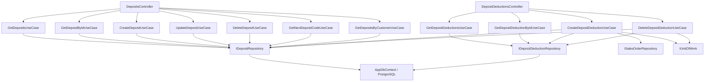

# Đặt Cọc (Deposit) — Feature Document (BE)

> **Jira:** — | **Branch:** `dev` | **Generated:** 2026-08-09 | **Updated:** 2026-08-15 (Deposit có thể tự sinh từ 1 dòng sản phẩm "Đặt cọc" trong Sales Order — xem changelog cuối file)

---

## PRD Summary

> API quản lý tiền cọc khách hàng (Deposit) và trừ cọc (DepositDeduction) cho hệ thống Lamour Spa & Cosmetics.

- **Goal:** Cho phép ghi nhận khoản tiền khách đặt cọc trước, sau đó trừ dần vào các Chứng từ bán hàng (Sales Order) cho tới khi hết số dư, kèm báo cáo theo dõi các lần trừ cọc.
- **User story:** As a Lamour cashier, I want to record a customer deposit and later deduct part of it against a specific sales order, so that the remaining balance is tracked automatically and I have a report of every deduction made.
- **Acceptance criteria:**
  - [x] `GET /api/v1/deposits` trả danh sách tất cả phiếu cọc kèm các lần trừ cọc (deductions)
  - [x] `GET /api/v1/deposits/{id}` trả chi tiết một phiếu cọc
  - [x] `GET /api/v1/deposits/next-code` trả số chứng từ tiếp theo dạng `DC{5 digits}`
  - [x] `GET /api/v1/deposits/by-customer/{customerId}` trả các cọc còn số dư của 1 khách hàng (dùng cho dropdown chọn cọc khi trừ)
  - [x] `POST /api/v1/deposits` tạo mới, `RemainingBalance` khởi tạo = `Amount`, `Status = Active`
  - [x] `PUT /api/v1/deposits/{id}` cập nhật — chỉ cho phép khi chưa bị trừ lần nào
  - [x] `DELETE /api/v1/deposits/{id}` xóa — chỉ cho phép khi chưa bị trừ lần nào
  - [x] `GET /api/v1/deposit-deductions` — **báo cáo đơn trừ cọc**, filter theo `customer_id`/`employee_id`/`sales_order_id`/`from_date`/`to_date`
  - [x] `GET /api/v1/deposit-deductions/{id}` trả chi tiết 1 lần trừ cọc
  - [x] `POST /api/v1/deposit-deductions` tạo lần trừ cọc mới, gắn với 1 Sales Order cụ thể, trừ số dư cọc
  - [x] `DELETE /api/v1/deposit-deductions/{id}` xóa lần trừ cọc, hoàn lại số dư cho cọc

---

## Business Rules

| Rule | Description |
|------|-------------|
| Số chứng từ Deposit | Prefix `DC`, format `DC{5 digits}` — sinh qua `GET /deposits/next-code`, gửi lên khi tạo (giống pattern SalesOrder) |
| Số chứng từ DepositDeduction | Prefix `TC`, format `TC{5 digits}` — **tự sinh ở BE** bên trong `CreateDepositDeductionUseCase` (không cần client generate) |
| Khởi tạo cọc | `Amount > 0` bắt buộc — `DomainException` nếu vi phạm. `RemainingBalance` = `Amount`, `Status = Active` |
| Trừ cọc bắt buộc gắn Sales Order | `DepositDeduction.SalesOrderId` bắt buộc — validate Sales Order tồn tại (`NotFoundException` → 404 nếu không) |
| Guard số dư (đã thay thế, xem rule bên dưới 2026-08-25) | ~~`Amount trừ > 0` và `Amount trừ <= Deposit.RemainingBalance` — nếu vượt: `DomainException("Số tiền trừ cọc vượt quá số dư còn lại.")` → 400~~ Guard này áp dụng cho model 1 deduction = 1 deposit cụ thể (client chọn `deposit_id`), nay không còn dùng — xem rule "Trừ cọc tự động phân bổ FIFO" |
| Trừ cọc tự động phân bổ FIFO (mới 2026-08-25) | Client **không còn gửi `deposit_id`** khi tạo `DepositDeduction` — chỉ gửi `sales_order_id` + `amount`. BE tự resolve `CustomerId` qua Sales Order (`ISalesOrderRepository.GetByIdAsync`), lấy các `Deposit` còn số dư (`RemainingBalance > 0`) của khách hàng đó qua `IDepositRepository.GetEligibleForDeductionAsync(customerId, excludeSalesOrderId: salesOrderId)` — sắp xếp CŨ NHẤT TRƯỚC (FIFO theo `CreatedAt` tăng dần), loại trừ cọc có `SourceSalesOrderId == salesOrderId` đang xử lý (chặn tự trừ cọc do chính đơn này sinh ra). `Amount` yêu cầu vẫn phải `> 0` (`DomainException("Số tiền trừ cọc phải lớn hơn 0.")`). Guard tổng số dư: nếu `Amount > Σ RemainingBalance` của các cọc hợp lệ → `DomainException("Số tiền trừ cọc vượt quá tổng số dư cọc còn lại của khách hàng.")` → 400, **không phân bổ một phần** (all-or-nothing). Nếu hợp lệ: phân bổ `Amount` tuần tự vào từng cọc theo thứ tự FIFO — mỗi cọc nhận `Math.Min(số còn cần phân bổ, RemainingBalance của cọc đó)`, dừng khi phân bổ hết, **không tạo dòng `DepositDeduction` cho cọc không được đụng tới**. Mỗi cọc nhận phân bổ → 1 dòng `DepositDeduction` riêng, số chứng từ `TC{5}` riêng (sinh mới cho từng dòng qua `GetNextCodeNumberAsync` trong cùng transaction), nhưng cùng `SalesOrderId`. Toàn bộ nằm trong 1 `IUnitOfWork` transaction — hoặc tất cả các dòng deduction + cập nhật balance đều thành công, hoặc rollback hết. `POST /deposit-deductions` trả về **mảng** `DepositDeductionResponseDto[]` (201) thay vì 1 object |
| Trừ cọc thành công | `Deposit.RemainingBalance -= Amount`; nếu về `0` → `Status = Depleted`, ngược lại giữ/trả về `Active` |
| Xóa lần trừ cọc | Hoàn `Deposit.RemainingBalance += Amount`, `Status = Active` (đã hoàn nên chắc chắn > 0), rồi xóa dòng `DepositDeduction` |
| Sửa/Xóa Deposit header | Chỉ cho phép khi **chưa bị trừ lần nào** (`RemainingBalance == Amount`) — ngược lại `DomainException("Cọc đã bị trừ, không thể sửa/xóa.")` |
| Không đụng Quỹ Tiền Mặt | Toàn bộ feature này **không** tạo/sửa/xóa bất kỳ dòng `CashTransaction` nào — tiền đã được ghi nhận vào quỹ tại thời điểm tạo cọc (ngoài phạm vi feature này), trừ cọc chỉ là điều chỉnh số dư nội bộ |
| Không đụng tồn kho | Deposit/DepositDeduction hoàn toàn không liên quan `Product`/`StockQuantity` |
| DB Transaction | `CreateDepositDeductionUseCase` và `DeleteDepositDeductionUseCase` dùng `IUnitOfWork.BeginAsync` → `CommitAsync`/`RollbackAsync` (2 thao tác ghi: deduction row + deposit balance update phải atomic) |
| Concurrency guard trên `RemainingBalance` (mới 2026-08-26) | `Deposit` dùng cột hệ thống `xmin` của PostgreSQL làm optimistic concurrency token (`DepositConfiguration.cs`, migration `AddDepositXminConcurrency` — no-op về DDL, chỉ khai báo cho EF). Nếu 2 request trừ/hoàn cọc chạy đồng thời trên cùng 1 `Deposit` (ví dụ 2 thu ngân trừ cọc cùng lúc cho cùng khách hàng), request ghi sau sẽ nhận `DbUpdateConcurrencyException` → `DepositRepository.UpdateAsync` bắt và dịch thành `DomainException("Cọc {DocumentNumber} vừa được cập nhật bởi giao dịch khác, vui lòng tải lại và thử lại.")` → 400, tránh lost-update làm trừ vượt số dư thực tế |
| DateTime UTC | Lưu `DateTime.UtcNow` / `DateTime.SpecifyKind(..., Utc)`, WPF convert sang local time khi hiển thị |
| Deposit tự sinh từ Sales Order (mới 2026-08-15) | Khi 1 Sales Order (Chứng từ bán hàng, XK) có dòng dùng sản phẩm `IsDepositProduct = true`, `CreateSalesOrderUseCase`/`UpdateSalesOrderUseCase` tự tạo/đồng bộ 1 `Deposit` với `SourceSalesOrderId` trỏ về đúng đơn đó — số DC vẫn tự sinh như bình thường, nhưng màn "Trừ cọc" hiển thị theo số XK gốc (xem `SourceSalesOrderDocumentNumber`). Xem chi tiết ở changelog cuối file |
| Deposit tự sinh — sửa/xóa Sales Order gốc | Nếu Deposit **chưa bị trừ** (`RemainingBalance == Amount`): sửa số tiền dòng "Đặt cọc" trên XK → đồng bộ `Amount`/`RemainingBalance`; xóa dòng "Đặt cọc" hoặc xóa cả đơn XK → xóa luôn Deposit. Nếu Deposit **đã bị trừ** (dùng ở 1 lần Trừ cọc nào đó): mọi thao tác đổi số tiền/xóa dòng "Đặt cọc"/xóa đơn XK đều bị chặn — `DomainException("Cọc từ đơn hàng này đã bị trừ, không thể ...")` |
| Sản phẩm "Đặt cọc" không phải hàng tồn kho thật | `Product.IsDepositProduct = true` → dòng dùng sản phẩm này trong Sales Order được loại khỏi toàn bộ validate/adjust tồn kho (`StockQuantity`, `ProductWarehouseStock`), y hệt cách dòng khuyến mại (`IsPromotion`) được loại trừ |
| Loại trừ cọc tự sinh của chính đơn đang sửa (mới 2026-08-25) | `GET /deposits/by-customer/{customerId}?exclude_sales_order_id=` — khi WPF đang sửa 1 Sales Order đã có sẵn (Deposit tự sinh từ chính nó, `SourceSalesOrderId == order.Id`), truyền `exclude_sales_order_id = order.Id` để loại cọc đó khỏi dropdown "Trừ cọc", tránh cho phép 1 đơn tự trừ cọc do chính nó tạo ra. Bỏ qua param này khi tạo đơn mới |

---

## Architecture Overview

### Key Components

| Layer | File | Role |
|-------|------|------|
| Controller | `Lamour.Api/Controllers/DepositsController.cs` | HTTP entry point — 7 actions |
| Controller | `Lamour.Api/Controllers/DepositDeductionsController.cs` | HTTP entry point — 4 actions (báo cáo + CRUD trừ cọc) |
| UseCase | `UseCases/GetDepositsUseCase.cs` | Fetch tất cả cọc; chứa `internal static MapToDto()` dùng chung |
| UseCase | `UseCases/GetDepositByIdUseCase.cs` | Fetch 1 cọc theo id |
| UseCase | `UseCases/GetNextDepositCodeUseCase.cs` | Trả số chứng từ tiếp theo `DC{5}` |
| UseCase | `UseCases/GetDepositsByCustomerUseCase.cs` | Cọc còn số dư của 1 khách hàng (cho WPF dropdown) |
| UseCase | `UseCases/CreateDepositUseCase.cs` | Validate `Amount > 0` → tạo cọc, `RemainingBalance = Amount` |
| UseCase | `UseCases/UpdateDepositUseCase.cs` | Guard chưa bị trừ → cập nhật header |
| UseCase | `UseCases/DeleteDepositUseCase.cs` | Guard chưa bị trừ → xóa |
| UseCase | `UseCases/GetDepositDeductionsUseCase.cs` | Báo cáo — nhận filter → `IDepositDeductionRepository.GetAllAsync` → map; chứa `internal static MapToDto()` dùng chung |
| UseCase | `UseCases/GetDepositDeductionByIdUseCase.cs` | Fetch 1 lần trừ cọc |
| UseCase | `UseCases/CreateDepositDeductionUseCase.cs` | Validate SalesOrder tồn tại (lấy `CustomerId`) → lấy các Deposit còn số dư của khách (FIFO, loại cọc tự sinh của chính đơn) → guard tổng số dư → `IUnitOfWork` transaction → phân bổ tuần tự, tạo 1+ dòng deduction + trừ balance từng deposit |
| UseCase | `UseCases/DeleteDepositDeductionUseCase.cs` | `IUnitOfWork` transaction → hoàn balance → xóa deduction |
| Repository | `Repositories/IDepositRepository.cs` / `IDepositDeductionRepository.cs` | Data access contract |
| Repository | `Lamour.Infrastructure/Repositories/DepositRepository.cs` / `DepositDeductionRepository.cs` | EF Core implementation |
| Entity | `Lamour.Domain/Entities/Deposit.cs` | Domain model + `DepositStatus` enum |
| Entity | `Lamour.Domain/Entities/DepositDeduction.cs` | Domain model, FK → `Deposit` + `SalesOrder` |
| Config | `Lamour.Infrastructure/Persistence/Configurations/DepositConfiguration.cs` / `DepositDeductionConfiguration.cs` | EF table mapping |

### Data Flow (Create Deduction)

```
HTTP POST /api/v1/deposit-deductions
  → DepositDeductionsController.Create
  → ICreateDepositDeductionUseCase.ExecuteAsync()
  → ISalesOrderRepository.GetByIdAsync(sales_order_id)         ← 404 nếu không có; lấy CustomerId
  → guard: amount > 0                                          ← 400 nếu vi phạm
  → IDepositRepository.GetEligibleForDeductionAsync(customerId, excludeSalesOrderId: sales_order_id)
                                                                ← các Deposit còn số dư, FIFO theo CreatedAt tăng dần
  → guard: amount <= Σ RemainingBalance                        ← 400 nếu vượt tổng số dư (all-or-nothing)
  → IUnitOfWork.BeginAsync()
  → loop qua từng deposit (FIFO) cho tới khi phân bổ hết amount:
      → IDepositDeductionRepository.GetNextCodeNumberAsync()   ← TC{5} riêng cho từng dòng
      → IDepositDeductionRepository.AddAsync(deduction)        ← insert deduction row (1 deposit / dòng)
      → deposit.RemainingBalance -= slice; Status update
      → IDepositRepository.UpdateAsync(deposit)                ← update deposit row
  → IUnitOfWork.CommitAsync()
  ← DepositDeductionResponseDto[]
```



---

## API Contracts

| Method | Endpoint | Input | Output |
|--------|----------|-------|--------|
| `GET` | `/api/v1/deposits` | — | `DepositResponseDto[]` |
| `GET` | `/api/v1/deposits/{id}` | — | `DepositResponseDto` (200) / 404 |
| `GET` | `/api/v1/deposits/next-code` | — | `{ "code": "DC00001" }` (200) |
| `GET` | `/api/v1/deposits/by-customer/{customerId}?exclude_sales_order_id=` | — (query `exclude_sales_order_id` optional) | `DepositResponseDto[]` (chỉ cọc `RemainingBalance > 0`, loại cọc có `SourceSalesOrderId == exclude_sales_order_id` nếu param được truyền) |
| `POST` | `/api/v1/deposits` | `CreateDepositRequestDto` | `DepositResponseDto` (201) |
| `PUT` | `/api/v1/deposits/{id}` | `UpdateDepositRequestDto` | `DepositResponseDto` (200) / 400 nếu đã bị trừ / 404 |
| `DELETE` | `/api/v1/deposits/{id}` | — | 204 / 400 nếu đã bị trừ / 404 |
| `GET` | `/api/v1/deposit-deductions?customer_id=&employee_id=&sales_order_id=&from_date=&to_date=` | — (query only) | `DepositDeductionResponseDto[]` (200) — **báo cáo đơn trừ cọc** |
| `GET` | `/api/v1/deposit-deductions/{id}` | — | `DepositDeductionResponseDto` (200) / 404 |
| `POST` | `/api/v1/deposit-deductions` | `CreateDepositDeductionRequestDto` (không còn `deposit_id` — chỉ `sales_order_id` + `amount`) | `DepositDeductionResponseDto[]` (201, có thể nhiều dòng — 1 dòng / Deposit bị trừ) / 400 (vượt tổng số dư) / 404 |
| `DELETE` | `/api/v1/deposit-deductions/{id}` | — | 204 / 404 |

### Request — Create Deposit

```json
{
  "document_number": "DC00001",
  "accounting_date": "2026-08-09T00:00:00",
  "document_date": "2026-08-09T00:00:00",
  "customer_id": 1,
  "employee_id": 2,
  "description": "Khách cọc mua mỹ phẩm",
  "reference": null,
  "amount": 30000000
}
```

### Response — Deposit (201/200)

```json
{
  "id": 1,
  "document_number": "DC00001",
  "accounting_date": "2026-08-09T00:00:00Z",
  "document_date": "2026-08-09T00:00:00Z",
  "customer_id": 1,
  "customer_name": "Nguyễn Văn A",
  "employee_id": 2,
  "employee_name": "Trần Thị B",
  "description": "Khách cọc mua mỹ phẩm",
  "reference": null,
  "amount": 30000000,
  "remaining_balance": 30000000,
  "status": 0,
  "created_at": "2026-08-09T08:00:00Z",
  "deductions": []
}
```

### Request — Create DepositDeduction (mới 2026-08-25 — không còn `deposit_id`)

```json
{
  "sales_order_id": 5,
  "amount": 35000000,
  "accounting_date": "2026-08-09T00:00:00",
  "document_date": "2026-08-09T00:00:00",
  "description": "Trừ cọc thanh toán đơn XK00005"
}
```

### Response — DepositDeduction[] (201) — ví dụ phân bổ FIFO trên 2 cọc

> Ví dụ: khách có cọc DC00001 (còn 20.000.000, cũ hơn) và DC00002 (còn 30.000.000, mới hơn). Yêu cầu trừ `35.000.000` → BE tạo 2 dòng: `20.000.000` từ DC00001 (Depleted) + `15.000.000` từ DC00002 (còn 15.000.000, Active).

```json
[
  {
    "id": 1,
    "document_number": "TC00001",
    "deposit_id": 1,
    "deposit_document_number": "DC00001",
    "sales_order_id": 5,
    "sales_order_document_number": "XK00005",
    "customer_id": 1,
    "customer_name": "Nguyễn Văn A",
    "employee_id": 2,
    "employee_name": "Trần Thị B",
    "amount": 20000000,
    "accounting_date": "2026-08-09T00:00:00Z",
    "document_date": "2026-08-09T00:00:00Z",
    "description": "Trừ cọc thanh toán đơn XK00005",
    "created_at": "2026-08-09T08:00:00Z"
  },
  {
    "id": 2,
    "document_number": "TC00002",
    "deposit_id": 2,
    "deposit_document_number": "DC00002",
    "sales_order_id": 5,
    "sales_order_document_number": "XK00005",
    "customer_id": 1,
    "customer_name": "Nguyễn Văn A",
    "employee_id": 2,
    "employee_name": "Trần Thị B",
    "amount": 15000000,
    "accounting_date": "2026-08-09T00:00:00Z",
    "document_date": "2026-08-09T00:00:00Z",
    "description": "Trừ cọc thanh toán đơn XK00005",
    "created_at": "2026-08-09T08:00:00Z"
  }
]
```

Sau lần trừ cọc trên, `GET /api/v1/deposits/1` trả `remaining_balance: 0`, `status: 1` (Depleted); `GET /api/v1/deposits/2` trả `remaining_balance: 15000000`, `status: 0` (Active).

## Enums

### DepositStatus
```
Active   = 0  — Còn số dư
Depleted = 1  — Đã trừ hết (RemainingBalance == 0)
```

---

## EF Migration

```bash
export PATH="$PATH:$HOME/.dotnet/tools"
dotnet ef migrations add AddDeposits \
  --project src/Lamour.Infrastructure \
  --startup-project src/Lamour.Api
dotnet ef database update \
  --project src/Lamour.Infrastructure \
  --startup-project src/Lamour.Api
```

Tables created: `deposits`, `deposit_deductions` (FK `deposit_id` và `sales_order_id` đều `ON DELETE RESTRICT` — xóa `Deposit`/`SalesOrder` khi còn deduction tham chiếu sẽ lỗi ở DB level, ngoài guard ở UseCase layer).

---

## DI Registration (`Program.cs`)

```csharp
// ── Deposits DI ───────────────────────────────────────────────────────────────
builder.Services.AddScoped<IDepositRepository, DepositRepository>();
builder.Services.AddScoped<IDepositDeductionRepository, DepositDeductionRepository>();
builder.Services.AddScoped<IGetDepositsUseCase, GetDepositsUseCase>();
builder.Services.AddScoped<IGetDepositByIdUseCase, GetDepositByIdUseCase>();
builder.Services.AddScoped<IGetNextDepositCodeUseCase, GetNextDepositCodeUseCase>();
builder.Services.AddScoped<IGetDepositsByCustomerUseCase, GetDepositsByCustomerUseCase>();
builder.Services.AddScoped<ICreateDepositUseCase, CreateDepositUseCase>();
builder.Services.AddScoped<IUpdateDepositUseCase, UpdateDepositUseCase>();
builder.Services.AddScoped<IDeleteDepositUseCase, DeleteDepositUseCase>();
builder.Services.AddScoped<IGetDepositDeductionsUseCase, GetDepositDeductionsUseCase>();
builder.Services.AddScoped<IGetDepositDeductionByIdUseCase, GetDepositDeductionByIdUseCase>();
builder.Services.AddScoped<ICreateDepositDeductionUseCase, CreateDepositDeductionUseCase>();
builder.Services.AddScoped<IDeleteDepositDeductionUseCase, DeleteDepositDeductionUseCase>();
```

`IUnitOfWork` đã có sẵn DI registration dùng chung với Sales/SalesReturn.

---

## Notes

- `[Authorize]` bật trên cả 2 controller — WPF cần gửi Bearer JWT
- `DepositDeduction.DocumentNumber` (`TC{5}`) tự sinh ở BE trong `CreateDepositDeductionUseCase` — khác với `Deposit.DocumentNumber` (`DC{5}`) sinh qua endpoint `next-code` rồi client gửi lên khi tạo (giống pattern SalesOrder `XK{5}`)
- `GET /api/v1/deposit-deductions` là báo cáo cấp DÒNG (mỗi dòng = 1 lần trừ cọc), filter kết hợp AND, tất cả optional
- `GET /api/v1/deposits/by-customer/{customerId}` chỉ trả cọc có `RemainingBalance > 0` — dùng để WPF hiển thị dropdown "chọn cọc để trừ" trong popup Sales Order
- **WPF integration (2026-08-09, không đổi BE):** `POST /api/v1/deposit-deductions` được gọi từ `SalesOrderWindow` (Chứng từ bán hàng) — mỗi cọc còn số dư hiện như 1 lựa chọn "sản phẩm ảo" trong dropdown Mã hàng/Tên hàng (`DepositProductPickerItem`), chọn thủ công qua "+ Thêm dòng" giống chọn 1 sản phẩm thật; gọi API này SAU KHI Sales Order đã lưu thành công (`SalesOrderId` truyền vào là id đơn vừa tạo). Xem chi tiết phía client tại `desktop-lamour/.../Sales/docs/sales.md` (mục "Trừ cọc", updated 2026-08-09).

---

## Changelog — 2026-08-15: Deposit tự sinh từ dòng sản phẩm "Đặt cọc" trong Sales Order

> Yêu cầu ban đầu ("Update Chứng từ bán hàng, Trừ cọc workflow") mô tả ví dụ y hệt cơ chế `Deposit`/`DepositDeduction` đã có (2026-08-09) — nhưng làm rõ qua 2 vòng hỏi thì phát hiện: trong thực tế, "đơn cọc" **không** được tạo qua màn Đặt Cọc riêng, mà là 1 **sản phẩm** ("Đặt cọc") thêm vào ngay trên chính Chứng từ bán hàng (XK). Do đó cầu nối này được xây thêm — **không thay thế** engine Deposit/DepositDeduction cũ, chỉ thêm 1 đường tạo Deposit mới (tự động, từ Sales Order) song song với đường cũ (thủ công, qua màn Đặt Cọc).

**BE:**
- `Product.cs`: thêm `IsDepositProduct` (bool, default false) — đánh dấu 1 sản phẩm là "sản phẩm đặt cọc". Wire qua `ProductConfiguration`, 3 DTO, `CreateProductUseCase`/`UpdateProductUseCase`.
- `Deposit.cs`: thêm `SourceSalesOrderId`/`SourceSalesOrder` (nullable) — đơn XK đã tạo ra cọc này qua 1 dòng sản phẩm "Đặt cọc"; null nếu cọc tạo thủ công qua màn Đặt Cọc như trước. FK `OnDelete: Restrict`.
- `IDepositRepository`/`DepositRepository`: thêm `GetBySourceSalesOrderIdAsync(salesOrderId)` (tracked, không `AsNoTracking` — dùng để mutate); `.Include(d => d.SourceSalesOrder)` thêm vào `GetAllAsync`/`GetByIdAsync`/`GetByIdTrackedAsync`/`GetByCustomerIdAsync`.
- `DepositResponseDto`: thêm `source_sales_order_id`/`source_sales_order_document_number`.
- **`SalesOrderDepositHelper.cs`** (mới, `internal static`, dùng chung bởi Create/Update/DeleteSalesOrderUseCase):
  - `SyncAsync(order, depositLinesAmount)`: gọi sau khi Sales Order đã lưu (trong cùng `IUnitOfWork` transaction). Nếu `depositLinesAmount <= 0` và có Deposit cũ → xóa (chặn nếu đã bị trừ). Nếu chưa có Deposit → tạo mới (`DocumentNumber` vẫn `DC{5}` tự sinh như cũ, `SourceSalesOrderId = order.Id`). Nếu đã có → đồng bộ `Amount`/`RemainingBalance`/`CustomerId`/`EmployeeId`/ngày tháng (chặn đổi `Amount` nếu đã bị trừ).
  - `GuardAndDeleteLinkedDepositAsync(salesOrderId)`: gọi trước khi xóa Sales Order — chặn nếu Deposit gắn với đơn đã bị trừ, tự xóa Deposit nếu chưa đụng tới.
- `CreateSalesOrderUseCase`/`UpdateSalesOrderUseCase`: tích luỹ `depositLinesAmount = Σ(Amount của các dòng có Product.IsDepositProduct)` trong lúc build lines; gọi `SalesOrderDepositHelper.SyncAsync` trước `_uow.CommitAsync()`. Dòng "Đặt cọc" được loại khỏi validate/adjust tồn kho (giống `IsPromotion`) — không phải hàng thật, không trừ/hoàn `StockQuantity`/`ProductWarehouseStock`.
- `DeleteSalesOrderUseCase`: gọi `SalesOrderDepositHelper.GuardAndDeleteLinkedDepositAsync` trước khi xóa đơn; loại dòng "Đặt cọc" khỏi restore tồn kho.
- Migration `AddProductDepositLinking` (`20260815035101_...`) — `products.is_deposit_product` (bool default false), `deposits.source_sales_order_id` (int?, FK Restrict → `sales_orders`).
- **Không cần thay đổi DTO dòng hàng** (`CreateSalesOrderLineDto`) — số tiền đặt cọc nhập qua field `amount` + cờ `is_amount_manual` đã có sẵn (dùng chung với override "Thành tiền thủ công" của dòng sản phẩm thường), không cần field mới.

**WPF (`desktop-lamour`):**
- `Product.cs` (domain model), 3 DTO (Create/Update/Response), `CreateProductInput`/`UpdateProductInput`, `ProductRepository` (3 chỗ map): thêm `IsDepositProduct`.
- `ProductFormViewModel.cs` + `ProductFormWindow.xaml`: thêm checkbox "Là sản phẩm đặt cọc" (tab "Ngầm định", ngay dưới "Là hàng khuyến mại") — user tự tạo 1 sản phẩm tên "Đặt cọc" rồi bật cờ này.
- `DepositResponseDto` (WPF): thêm `source_sales_order_id`/`source_sales_order_document_number`.
- `DepositProductPickerItem.cs`: `DisplayText`/`Code` ưu tiên hiển thị `SourceSalesOrderDocumentNumber` (số XK gốc, VD `XK00005 — Trừ cọc (còn 5,000,000)`) thay vì số `DC` nội bộ; fallback về `DocumentNumber` (DC) cho các cọc tạo thủ công qua màn Đặt Cọc (không có `SourceSalesOrder`).
- **Không đổi** luồng "Trừ cọc" đã có (chọn dropdown "sản phẩm ảo" → nhập Thành tiền → Ghi sổ → gọi `POST /api/v1/deposit-deductions`) — chỉ đổi CÁCH cọc được TẠO RA và CÁCH nó hiển thị trong dropdown.

**Cách dùng theo ví dụ gốc:**
1. Tạo 1 sản phẩm "Đặt cọc", bật cờ "Là sản phẩm đặt cọc" (1 lần, qua màn Danh sách sản phẩm).
2. Chị A đặt cọc: tạo Chứng từ bán hàng XK0005, thêm dòng sản phẩm "Đặt cọc", gõ tay "Thành tiền" = 30.000.000, Ghi sổ → BE tự tạo Deposit (DC...) với `SourceSalesOrderId = XK0005.Id`, `Amount = RemainingBalance = 30.000.000`. Lặp lại tương tự cho XK0010 (20tr) và XK0015 (10tr).
3. Ngày 23/3/2026, chị A tạo Chứng từ bán hàng mới, thêm dòng "Trừ cọc" trong dropdown chọn sản phẩm → tìm thấy "XK0005 — Trừ cọc (còn 30.000.000)" (không phải mã DC) → chọn, gõ 25.000.000 → Ghi sổ → Deposit gắn với XK0005 giảm còn 5.000.000; Deposit gắn với XK0010/XK0015 không đổi.

---

*Generated 2026-08-09*
*Updated 2026-08-15: Deposit tự sinh từ dòng sản phẩm "Đặt cọc" trong Sales Order (SourceSalesOrderId) — xem changelog.*
*Updated 2026-08-09: thêm ghi chú tích hợp phía WPF client (Sales Order) — không có thay đổi contract/code nào ở BE.*
