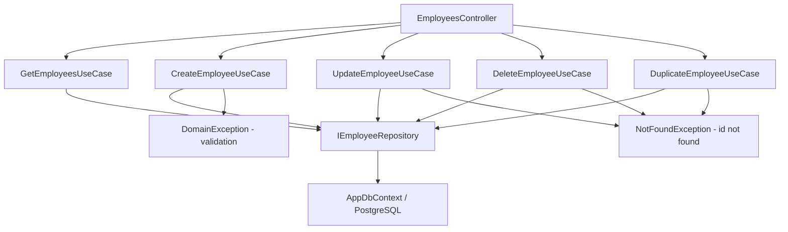

# Employees — Feature Document (BE)

> **Jira:** — | **Branch:** `dev` | **Updated:** 2026-04-26

---

## PRD Summary

> API quản lý nhân viên cho hệ thống Lamour Spa & Cosmetics.

- **Goal:** Cung cấp CRUD API đầy đủ cho module Nhân Viên, bao gồm đơn vị công tác và nhân bản.
- **User story:** As a Lamour admin, I want to manage employee records via a REST API so that the WPF desktop client can display and edit staff data.
- **Acceptance criteria:**
  - [x] `GET /api/v1/employees` trả danh sách tất cả nhân viên
  - [x] `POST /api/v1/employees` tạo nhân viên mới với role + unit
  - [x] `PUT /api/v1/employees/{id}` cập nhật thông tin nhân viên
  - [x] `DELETE /api/v1/employees/{id}` xóa nhân viên
  - [x] `POST /api/v1/employees/{id}/duplicate` nhân bản nhân viên
  - [x] Field `unit` (đơn vị công tác) — enum cố định, required, default `Spa`

---

## Business Rules

| Rule | Description |
|------|-------------|
| Tên bắt buộc | `name` không được để trống — ném `DomainException` |
| SĐT bắt buộc | `phone` không được để trống — ném `DomainException` |
| Role hợp lệ | Phải là `Admin`, `Cashier`, hoặc `Warehouse` (case-insensitive) |
| Unit hợp lệ | Phải là `PGD`, `PKD`, `Spa`, `GD`, hoặc `Kho` (case-insensitive) |
| Mật khẩu | Nếu `password` trống → dùng `phone` làm mật khẩu mặc định |
| Mật khẩu hash | SHA256 base64 — không bao giờ lưu raw password |
| AsNoTracking | Tất cả read queries dùng `AsNoTracking()` |
| Immutable hash | Password chỉ update khi `password` field trong request không trống |

---

## Architecture Overview

### Key Components

| Layer | File | Role |
|-------|------|------|
| Controller | `Lamour.Api/Controllers/EmployeesController.cs` | HTTP entry point, 5 actions |
| UseCase | `UseCases/GetEmployeesUseCase.cs` | Fetch & map all employees |
| UseCase | `UseCases/CreateEmployeeUseCase.cs` | Validate + hash password + persist |
| UseCase | `UseCases/UpdateEmployeeUseCase.cs` | Validate + optional re-hash + persist |
| UseCase | `UseCases/DeleteEmployeeUseCase.cs` | Find + delete |
| UseCase | `UseCases/DuplicateEmployeeUseCase.cs` | Clone employee record |
| Repository | `Repositories/IEmployeeRepository.cs` | Data access contract |
| Repository | `Lamour.Infrastructure/Repositories/EmployeeRepository.cs` | EF Core implementation |
| Entity | `Lamour.Domain/Entities/Employee.cs` | Domain model |
| Config | `Lamour.Infrastructure/Persistence/Configurations/EmployeeConfiguration.cs` | EF table mapping |

### Data Flow

```
HTTP Request
  → EmployeesController (action method)
  → IXxxEmployeeUseCase.ExecuteAsync()
  → IEmployeeRepository (GetAllAsync / GetByIdAsync / AddAsync / UpdateAsync / DeleteAsync)
  → AppDbContext (EF Core + PostgreSQL)
  ← Employee entity
  ← EmployeeResponseDto (mapped in GetEmployeesUseCase.MapToDto)
  ← IActionResult (Ok / CreatedAtAction / NoContent)
```



---

## Key Files & Symbols

### Domain
- [`Lamour.Domain/Entities/Employee.cs`](../../../../Lamour.Domain/Entities/Employee.cs) — Entity: `Id`, `Name`, `Phone`, `Role` (EmployeeRole), `Unit` (EmployeeUnit), `PasswordHash`, `IsActive`
- `enum EmployeeRole { Admin, Cashier, Warehouse }`
- `enum EmployeeUnit { PGD, PKD, Spa, GD, Kho }` — default `Spa`

### Application — Repositories
- [`Repositories/IEmployeeRepository.cs`](../Repositories/IEmployeeRepository.cs) — `GetAllAsync`, `GetByIdAsync`, `GetByPhoneAsync`, `AddAsync`, `UpdateAsync`, `DeleteAsync`

### Application — DTOs
- [`Dtos/EmployeeResponseDto.cs`](../Dtos/EmployeeResponseDto.cs) — `id`, `name`, `phone`, `role`, `unit`, `is_active`
- [`Dtos/CreateEmployeeRequestDto.cs`](../Dtos/CreateEmployeeRequestDto.cs) — `name`, `phone`, `role`, `unit`, `password`, `is_active`
- [`Dtos/UpdateEmployeeRequestDto.cs`](../Dtos/UpdateEmployeeRequestDto.cs) — same fields, `password` nullable

### Application — UseCases
- [`UseCases/GetEmployeesUseCase.cs`](../UseCases/GetEmployeesUseCase.cs) — `ExecuteAsync()` → `IEnumerable<EmployeeResponseDto>`; `MapToDto(Employee)` static helper
- [`UseCases/CreateEmployeeUseCase.cs`](../UseCases/CreateEmployeeUseCase.cs) — validate → parse Role + Unit → hash password → `AddAsync`
- [`UseCases/UpdateEmployeeUseCase.cs`](../UseCases/UpdateEmployeeUseCase.cs) — `GetByIdAsync` → validate → parse Role + Unit → optional re-hash → `UpdateAsync`
- [`UseCases/DeleteEmployeeUseCase.cs`](../UseCases/DeleteEmployeeUseCase.cs) — `GetByIdAsync` → `DeleteAsync`
- [`UseCases/DuplicateEmployeeUseCase.cs`](../UseCases/DuplicateEmployeeUseCase.cs) — Clone entity fields

### Infrastructure
- [`Lamour.Infrastructure/Repositories/EmployeeRepository.cs`](../../../../Lamour.Infrastructure/Repositories/EmployeeRepository.cs) — EF Core impl
- [`Lamour.Infrastructure/Persistence/Configurations/EmployeeConfiguration.cs`](../../../../Lamour.Infrastructure/Persistence/Configurations/EmployeeConfiguration.cs) — Table `employees`, columns: `id`, `name`, `phone`, `role`, `unit`, `password_hash`, `is_active`

---

## API Contracts

| Method | Endpoint | Input | Output |
|--------|----------|-------|--------|
| `GET` | `/api/v1/employees` | — | `EmployeeResponseDto[]` (200) |
| `POST` | `/api/v1/employees` | `CreateEmployeeRequestDto` | `EmployeeResponseDto` (201) |
| `PUT` | `/api/v1/employees/{id}` | `UpdateEmployeeRequestDto` | `EmployeeResponseDto` (200) |
| `DELETE` | `/api/v1/employees/{id}` | — | 204 No Content |
| `POST` | `/api/v1/employees/{id}/duplicate` | — | `EmployeeResponseDto` (201) |

### Request — Create
```json
{
  "name": "Nguyễn Văn A",
  "phone": "0912345678",
  "role": "Cashier",
  "unit": "Spa",
  "password": "",
  "is_active": true
}
```

### Response
```json
{
  "id": 1,
  "name": "Nguyễn Văn A",
  "phone": "0912345678",
  "role": "Cashier",
  "unit": "Spa",
  "is_active": true
}
```

---

## Edge Cases & Error Handling

| Scenario | Expected Behavior | Handled? |
|----------|------------------|----------|
| `name` trống | `DomainException` → 400 | ✅ |
| `phone` trống | `DomainException` → 400 | ✅ |
| `role` không hợp lệ | `DomainException` → 400 | ✅ |
| `unit` không hợp lệ | `DomainException` → 400 | ✅ |
| `id` không tồn tại | `NotFoundException` → 404 | ✅ |
| `password` trống khi tạo | Dùng `phone` làm mật khẩu | ✅ |
| `password` trống khi update | Giữ nguyên hash cũ | ✅ |

---

## Migrations

| Migration | Description |
|-----------|-------------|
| `20260425xxxxxx_EmployeesCreate` | Tạo bảng `employees` |
| `20260426020155_AddEmployeeUnit` | Thêm cột `unit` varchar(10), default `'PGD'` |
| `20260426020606_ChangeEmployeeUnitDefaultToSpa` | Đổi column default thành `'Spa'` |

---

## Test Coverage Notes

| Component | Test File | Coverage |
|-----------|-----------|----------|
| `GetEmployeesUseCase` | — | ❌ Missing |
| `CreateEmployeeUseCase` | — | ❌ Missing |
| `UpdateEmployeeUseCase` | — | ❌ Missing |
| `DeleteEmployeeUseCase` | — | ❌ Missing |
| `DuplicateEmployeeUseCase` | — | ❌ Missing |

**Suggested test cases:**
- [ ] Create: `name` trống → `DomainException`
- [ ] Create: `unit` không hợp lệ → `DomainException`
- [ ] Create: `password` trống → hash của `phone`
- [ ] Update: id không tồn tại → `NotFoundException`
- [ ] Update: `password` trống → hash cũ giữ nguyên
- [ ] Duplicate: entity cloned đúng, `id` khác source

---

## Notes

- `[Authorize]` enabled — yêu cầu Bearer JWT
- `MapToDto` là `internal static` trong `GetEmployeesUseCase` — dùng chung bởi Create + Update UseCase
- `PasswordHash` không bao giờ xuất hiện trong response DTO

---

*Updated by `/ct-ai-document` on 2026-04-26*
