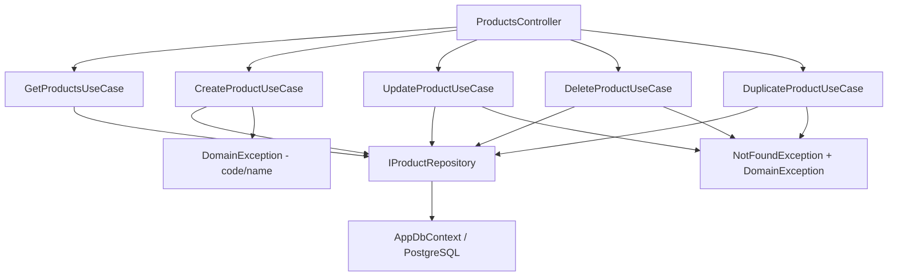

# Products — Feature Document (BE)

> **Jira:** — | **Branch:** `dev` | **Generated:** 2026-04-25

---

## PRD Summary

> API quản lý danh sách hàng hóa (sản phẩm mỹ phẩm) cho hệ thống Lamour.

- **Goal:** Cung cấp CRUD API đầy đủ cho module Sản Phẩm, kèm kiểm tra unique code và nhân bản.
- **User story:** As a Lamour warehouse manager, I want to manage product inventory via a REST API so that the WPF desktop client can list, create, update, and delete products.
- **Acceptance criteria:**
  - [x] `GET /api/v1/products` trả danh sách tất cả sản phẩm
  - [x] `POST /api/v1/products` tạo mới, validate `code` unique + `name` required
  - [x] `PUT /api/v1/products/{id}` cập nhật, validate unique code (exclude self)
  - [x] `DELETE /api/v1/products/{id}` xóa sản phẩm
  - [x] `POST /api/v1/products/{id}/duplicate` nhân bản với code suffix `_COPY`

---

## Business Rules

| Rule | Description |
|------|-------------|
| Code unique | `code` unique case-insensitive — `DomainException` nếu trùng |
| Code required | `code` không được trống |
| Name required | `name` không được trống |
| Stock quantity | Số lượng tồn kho (`stock_quantity`) lưu tại DB, tăng/giảm qua import/export invoice |
| Duplicate code | Khi nhân bản: code mới = `{original_code}_COPY`; lỗi nếu `_COPY` đã tồn tại |
| is_active | Sản phẩm có thể ngừng kinh doanh (`is_active = false`) |

---

## Architecture Overview

### Key Components

| Layer | File | Role |
|-------|------|------|
| Controller | `Lamour.Api/Controllers/ProductsController.cs` | 5 HTTP actions |
| UseCase | `UseCases/GetProductsUseCase.cs` | Fetch all + map to DTO |
| UseCase | `UseCases/CreateProductUseCase.cs` | Validate code/name → persist |
| UseCase | `UseCases/UpdateProductUseCase.cs` | Find → validate → update |
| UseCase | `UseCases/DeleteProductUseCase.cs` | Find → delete |
| UseCase | `UseCases/DuplicateProductUseCase.cs` | Clone với `_COPY` code |
| Repository | `Repositories/IProductRepository.cs` | Data access contract |
| Repository | `Lamour.Infrastructure/Repositories/ProductRepository.cs` | EF Core implementation |
| Entity | `Lamour.Domain/Entities/Product.cs` | Domain model |
| Config | `Lamour.Infrastructure/Persistence/Configurations/ProductConfiguration.cs` | EF table mapping |

### Data Flow

```
HTTP Request
  → ProductsController
  → IXxxProductUseCase.ExecuteAsync()
  → IProductRepository
  → AppDbContext (EF Core + PostgreSQL table: products)
  ← Product entity → ProductResponseDto
  ← IActionResult
```



---

## Key Files & Symbols

### Domain
- [`Lamour.Domain/Entities/Product.cs`](../../../../Lamour.Domain/Entities/Product.cs) — `Id`, `Code`, `Name`, `Category`, `Unit`, `CostPrice`, `SellingPrice`, `StockQuantity`, `IsActive`

### Application — Repositories
- [`Repositories/IProductRepository.cs`](../Repositories/IProductRepository.cs) — `GetAllAsync`, `GetByIdAsync`, `CodeExistsAsync`, `AddAsync`, `UpdateAsync`, `DeleteAsync`

### Application — DTOs
- [`Dtos/ProductResponseDto.cs`](../Dtos/ProductResponseDto.cs) — `id`, `code`, `name`, `category`, `unit`, `cost_price`, `selling_price`, `stock_quantity`, `is_active`
- [`Dtos/CreateProductRequestDto.cs`](../Dtos/CreateProductRequestDto.cs) — All fields, `is_active` defaults `true`
- [`Dtos/UpdateProductRequestDto.cs`](../Dtos/UpdateProductRequestDto.cs) — Same fields

### Application — UseCases
- [`UseCases/GetProductsUseCase.cs`](../UseCases/GetProductsUseCase.cs) — `ExecuteAsync()` → `IEnumerable<ProductResponseDto>`
- [`UseCases/CreateProductUseCase.cs`](../UseCases/CreateProductUseCase.cs) — Validate + `CodeExistsAsync` + `AddAsync`
- [`UseCases/UpdateProductUseCase.cs`](../UseCases/UpdateProductUseCase.cs) — `GetByIdAsync` → validate → `UpdateAsync`
- [`UseCases/DeleteProductUseCase.cs`](../UseCases/DeleteProductUseCase.cs) — `GetByIdAsync` → `DeleteAsync`
- [`UseCases/DuplicateProductUseCase.cs`](../UseCases/DuplicateProductUseCase.cs) — Clone + `{code}_COPY`

---

## API Contracts

| Method | Endpoint | Input | Output |
|--------|----------|-------|--------|
| `GET` | `/api/v1/products` | — | `ProductResponseDto[]` |
| `POST` | `/api/v1/products` | `CreateProductRequestDto` | `ProductResponseDto` (201) |
| `PUT` | `/api/v1/products/{id}` | `UpdateProductRequestDto` | `ProductResponseDto` (200) |
| `DELETE` | `/api/v1/products/{id}` | — | 204 No Content |
| `POST` | `/api/v1/products/{id}/duplicate` | — | `ProductResponseDto` (201) |

### Request — Create
```json
{
  "code": "SP001",
  "name": "Kem dưỡng trắng da",
  "category": "Dưỡng da",
  "unit": "Hộp",
  "cost_price": 150000,
  "selling_price": 220000,
  "stock_quantity": 100,
  "is_active": true
}
```

### Response
```json
{
  "id": 1,
  "code": "SP001",
  "name": "Kem dưỡng trắng da",
  "category": "Dưỡng da",
  "unit": "Hộp",
  "cost_price": 150000.00,
  "selling_price": 220000.00,
  "stock_quantity": 100,
  "is_active": true
}
```

---

## Edge Cases & Error Handling

| Scenario | Expected Behavior | Handled? |
|----------|------------------|----------|
| `code` trống | `DomainException` → 400 | ✅ |
| `name` trống | `DomainException` → 400 | ✅ |
| `code` đã tồn tại (Create) | `DomainException` → 400 | ✅ |
| `code` trùng khi Update (exclude self) | `DomainException` → 400 | ✅ |
| `id` không tồn tại | `NotFoundException` → 404 | ✅ |
| Duplicate với `_COPY` đã tồn tại | `DomainException` → 400 | ✅ |
| `stock_quantity` âm | Không validate tại đây — validate ở ExportInvoice | ❌ Not here |

---

## Test Coverage Notes

| Component | Test File | Coverage |
|-----------|-----------|----------|
| `GetProductsUseCase` | — | ❌ Missing |
| `CreateProductUseCase` | — | ❌ Missing |
| `UpdateProductUseCase` | — | ❌ Missing |
| `DeleteProductUseCase` | — | ❌ Missing |
| `DuplicateProductUseCase` | — | ❌ Missing |
| `ProductRepository` | — | ❌ Missing |

**Suggested test cases:**
- [ ] Create: code/name trống → `DomainException`
- [ ] Create: code trùng → `DomainException`
- [ ] Update: id không tồn tại → `NotFoundException`
- [ ] Duplicate: code `_COPY` đã tồn tại → `DomainException`
- [ ] GetAll: empty DB → trả empty list (không throw)

---

## Notes

- `[Authorize]` tạm thời bị comment — TODO restore khi WPF auth xong
- EF Migration: `20260425045914_ProductsCreate`
- `StockQuantity` được quản lý bởi ImportInvoice / ExportInvoice (chưa implement)

---

*Generated by `/ct-ai-document` on 2026-04-25*
