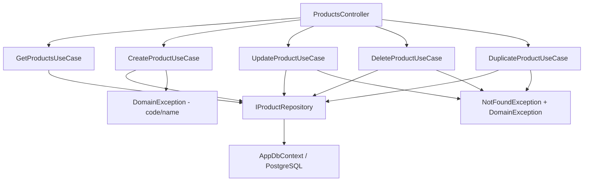

# Products — Feature Document (BE)

> **Jira:** — | **Branch:** `dev` | **Generated:** 2026-04-25 | **Updated:** 2026-08-09 (thêm ~20 field cho popup "Sửa Vật tư, hàng hoá, dịch vụ" — xem changelog cuối file) | 2026-07-25 (Category thành master-data FK riêng — xem [`categories.md`](../../Categories/docs/categories.md); bỏ validate CostPrice/SellingPrice > 0)

---

## PRD Summary

> API quản lý danh sách hàng hóa (sản phẩm mỹ phẩm) cho hệ thống Lamour.

- **Goal:** Cung cấp CRUD API đầy đủ cho module Sản Phẩm, kèm kiểm tra unique code và nhân bản.
- **User story:** As a Lamour warehouse manager, I want to manage product inventory via a REST API so that the WPF desktop client can list, create, update, and delete products.
- **Acceptance criteria:**
  - [x] `GET /api/v1/products` trả danh sách tất cả sản phẩm
  - [x] `POST /api/v1/products` tạo mới, validate `code` unique + `name` required
  - [x] `PUT /api/v1/products/{id}` cập nhật, validate unique code (exclude self)
  - [x] `DELETE /api/v1/products/{id}` xóa sản phẩm
  - [x] `POST /api/v1/products/{id}/duplicate` nhân bản với code suffix `_COPY`

---

## Business Rules

| Rule | Description |
|------|-------------|
| Code unique | `code` unique case-insensitive — `DomainException` nếu trùng; để trống thì bỏ qua unique check |
| Code optional | `code` không bắt buộc — DB index có filter `WHERE code <> ''` |
| Name required | `name` không được trống — `DomainException` |
| Category là FK (2026-07-25) | `category_id` (int) phải trỏ tới 1 `Category` đã tồn tại — `CreateProductUseCase`/`UpdateProductUseCase` gọi `ICategoryRepository.GetByIdAsync` trước khi lưu, throw `DomainException` nếu không tìm thấy. Trước đây là string tự do bắt buộc không rỗng — xem [`categories.md`](../../Categories/docs/categories.md) cho chi tiết entity Category + migration backfill |
| ~~CostPrice > 0~~ | ~~`cost_price` phải lớn hơn 0~~ — **Bỏ 2026-07-25** theo yêu cầu, giờ chấp nhận mọi giá trị kể cả 0 |
| ~~SellingPrice > 0~~ | ~~`selling_price` phải lớn hơn 0~~ — **Bỏ 2026-07-25** theo yêu cầu, giờ chấp nhận mọi giá trị kể cả 0 |
| Stock quantity | `stock_quantity` lưu tại DB, tăng/giảm qua import/export invoice |
| Duplicate code | Khi nhân bản: code mới = `{original_code}_COPY`; lỗi nếu `_COPY` đã tồn tại |
| is_active | Sản phẩm có thể ngừng kinh doanh (`is_active = false`) |
| vat_rate | Thuế suất GTGT — enum `VatRateType`: `Zero`, `Five`, `Eight`, `Ten`, `KCT`, `KKKNT`, `KHAC`; nullable |
| tax_reduction_type | Có giảm thuế — enum `TaxReductionStatus`: `CoGiamThue`, `ChuaGiamThue`, `ChuaXacDinh`; nullable |
| import_tax_rate | Thuế suất NK (%) — `decimal?`, nullable |
| export_tax_rate | Thuế suất XK (%) — `decimal?`, nullable |
| excise_tax_group | Nhóm thuế tiêu thụ đặc biệt — `string?`, nullable |

---

## Architecture Overview

### Key Components

| Layer | File | Role |
|-------|------|------|
| Controller | `Lamour.Api/Controllers/ProductsController.cs` | 5 HTTP actions, `[Authorize]` active |
| UseCase | `UseCases/GetProductsUseCase.cs` | Fetch all + map to DTO (`CategoryName` từ `p.Category.Name` navigation) |
| UseCase | `UseCases/CreateProductUseCase.cs` | Validate `CategoryId` tồn tại (qua `ICategoryRepository`) → persist; `ParseVatRate`, `ParseTaxReductionStatus` |
| UseCase | `UseCases/UpdateProductUseCase.cs` | Find → validate `CategoryId` → update |
| UseCase | `UseCases/DeleteProductUseCase.cs` | Find → delete |
| UseCase | `UseCases/DuplicateProductUseCase.cs` | Clone với `_COPY` code, giữ nguyên `CategoryId` |
| Repository | `Repositories/IProductRepository.cs` | `GetAllAsync`, `GetByIdAsync`, `GetByIdTrackedAsync`, `CodeExistsAsync`, `AddAsync`, `UpdateAsync`, `DeleteAsync` |
| Repository | `Lamour.Infrastructure/Repositories/ProductRepository.cs` | EF Core implementation — `GetAllAsync`/`GetByIdAsync` dùng `.Include(p => p.Category)` (2026-07-25, cần cho `CategoryName` ở response) |
| Entity | `Lamour.Domain/Entities/Product.cs` | Domain model — `CategoryId` (int, FK) + `Category` navigation (2026-07-25, trước đây là `string Category`) + 8 field cơ bản khác + 5 tax fields |
| Enum | `Lamour.Domain/Enums/VatRateType.cs` | `Zero`, `Five`, `Eight`, `Ten`, `KCT`, `KKKNT`, `KHAC` |
| Enum | `Lamour.Domain/Enums/TaxReductionStatus.cs` | `CoGiamThue`, `ChuaGiamThue`, `ChuaXacDinh` |
| Config | `Lamour.Infrastructure/Persistence/Configurations/ProductConfiguration.cs` | EF table mapping — `CategoryId` FK (`OnDelete: Restrict`) tới `Categories`, còn lại 13 columns khác |

### Data Flow

```
HTTP Request
  → ProductsController
  → IXxxProductUseCase.ExecuteAsync()
  → IProductRepository
  → AppDbContext (EF Core + PostgreSQL table: products)
  ← Product entity → ProductResponseDto
  ← IActionResult
```



---

## Key Files & Symbols

### Domain
- [`Lamour.Domain/Entities/Product.cs`](../../../../Lamour.Domain/Entities/Product.cs) — `Id`, `Code`, `Name`, `CategoryId` + `Category` navigation (2026-07-25, trước là `string Category`), `Unit`, `CostPrice`, `SellingPrice`, `StockQuantity`, `IsActive`, `VatRate`, `TaxReductionType`, `ImportTaxRate`, `ExportTaxRate`, `ExciseTaxGroup`
- [`Lamour.Domain/Enums/VatRateType.cs`](../../../../Lamour.Domain/Enums/VatRateType.cs) — enum cho `vat_rate`
- [`Lamour.Domain/Enums/TaxReductionStatus.cs`](../../../../Lamour.Domain/Enums/TaxReductionStatus.cs) — enum cho `tax_reduction_type`

### Application — Repositories
- [`Repositories/IProductRepository.cs`](../Repositories/IProductRepository.cs) — `GetAllAsync`, `GetByIdAsync`, `CodeExistsAsync`, `AddAsync`, `UpdateAsync`, `DeleteAsync`
- [`../../Categories/Repositories/ICategoryRepository.cs`](../../Categories/Repositories/ICategoryRepository.cs) — injected vào `CreateProductUseCase`/`UpdateProductUseCase` để validate `CategoryId` tồn tại (2026-07-25)

### Application — DTOs
- [`Dtos/ProductResponseDto.cs`](../Dtos/ProductResponseDto.cs) — `id`, `code`, `name`, `category_id`, `category_name` (2026-07-25, thay cho `category` string), `unit`, `cost_price`, `selling_price`, `stock_quantity`, `is_active`, `vat_rate`, `tax_reduction_type`, `import_tax_rate`, `export_tax_rate`, `excise_tax_group`
- [`Dtos/CreateProductRequestDto.cs`](../Dtos/CreateProductRequestDto.cs) — `category_id` (int) thay cho `category` (string); `is_active` mặc định `true`, 5 tax fields nullable
- [`Dtos/UpdateProductRequestDto.cs`](../Dtos/UpdateProductRequestDto.cs) — Tương tự Create

### Application — UseCases
- [`UseCases/GetProductsUseCase.cs`](../UseCases/GetProductsUseCase.cs) — `ExecuteAsync()` → `IEnumerable<ProductResponseDto>`
- [`UseCases/CreateProductUseCase.cs`](../UseCases/CreateProductUseCase.cs) — Validate (Name required; `CategoryId` phải tồn tại) + `CodeExistsAsync` + `AddAsync`; `MapToDto` static dùng chung bởi Update/Duplicate/Get
- [`UseCases/UpdateProductUseCase.cs`](../UseCases/UpdateProductUseCase.cs) — `GetByIdAsync` → validate `CategoryId` → `UpdateAsync`
- [`UseCases/DeleteProductUseCase.cs`](../UseCases/DeleteProductUseCase.cs) — `GetByIdAsync` → `DeleteAsync`
- [`UseCases/DuplicateProductUseCase.cs`](../UseCases/DuplicateProductUseCase.cs) — Clone + `{code}_COPY`, giữ nguyên `CategoryId`

---

## API Contracts

| Method | Endpoint | Input | Output |
|--------|----------|-------|--------|
| `GET` | `/api/v1/products` | — | `ProductResponseDto[]` |
| `POST` | `/api/v1/products` | `CreateProductRequestDto` | `ProductResponseDto` (201) |
| `PUT` | `/api/v1/products/{id}` | `UpdateProductRequestDto` | `ProductResponseDto` (200) |
| `DELETE` | `/api/v1/products/{id}` | — | 204 No Content |
| `POST` | `/api/v1/products/{id}/duplicate` | — | `ProductResponseDto` (201) |

### Request — Create / Update
```json
{
  "code": "SP001",
  "name": "Kem dưỡng trắng da",
  "category_id": 1,
  "unit": "Hộp",
  "cost_price": 150000,
  "selling_price": 220000,
  "stock_quantity": 100,
  "is_active": true,
  "vat_rate": "Ten",
  "tax_reduction_type": "CoGiamThue",
  "import_tax_rate": 5.0,
  "export_tax_rate": null,
  "excise_tax_group": null
}
```

> **Giá trị hợp lệ:**
> - `category_id`: phải trỏ tới 1 `Category` đã tồn tại (xem [`categories.md`](../../Categories/docs/categories.md)) — 400 `DomainException` nếu không tìm thấy
> - `vat_rate`: `"Zero"` | `"Five"` | `"Eight"` | `"Ten"` | `"KCT"` | `"KKKNT"` | `"KHAC"` | `null`
> - `tax_reduction_type`: `"CoGiamThue"` | `"ChuaGiamThue"` | `"ChuaXacDinh"` | `null`
> - `cost_price`/`selling_price`: **không còn validate > 0** (bỏ 2026-07-25) — chấp nhận mọi giá trị kể cả 0

### Response
```json
{
  "id": 1,
  "code": "SP001",
  "name": "Kem dưỡng trắng da",
  "category_id": 1,
  "category_name": "Dưỡng da",
  "unit": "Hộp",
  "cost_price": 150000.00,
  "selling_price": 220000.00,
  "stock_quantity": 100,
  "is_active": true,
  "vat_rate": "Ten",
  "tax_reduction_type": "CoGiamThue",
  "import_tax_rate": 5.00,
  "export_tax_rate": null,
  "excise_tax_group": null
}
```

---

## Edge Cases & Error Handling

| Scenario | Expected Behavior | Handled? |
|----------|------------------|----------|
| `code` trống | Cho phép — empty code được (không unique check) | ✅ |
| `name` trống | `DomainException` → 400 | ✅ |
| `category_id` không tồn tại (2026-07-25) | `DomainException` → 400 (`ICategoryRepository.GetByIdAsync` trả `null`) | ✅ |
| ~~`cost_price` <= 0~~ / ~~`selling_price` <= 0~~ | ~~`DomainException` → 400~~ — **Bỏ 2026-07-25**, không còn validate | ✅ Removed |
| `code` đã tồn tại (Create) | `DomainException` → 400 | ✅ |
| `code` trùng khi Update (exclude self) | `DomainException` → 400 | ✅ |
| `id` không tồn tại | `NotFoundException` → 404 | ✅ |
| Duplicate với `_COPY` đã tồn tại | `DomainException` → 400 | ✅ |
| `vat_rate` / `tax_reduction_type` sai giá trị | Parse fail → lưu `null`, không throw | ✅ |
| `stock_quantity` âm | Không validate tại đây — validate ở ExportInvoice | ❌ Not here |

---

## Test Coverage Notes

| Component | Test File | Coverage |
|-----------|-----------|----------|
| `GetProductsUseCase` | — | ❌ Missing |
| `CreateProductUseCase` | — | ❌ Missing |
| `UpdateProductUseCase` | — | ❌ Missing |
| `DeleteProductUseCase` | — | ❌ Missing |
| `DuplicateProductUseCase` | — | ❌ Missing |
| `ProductRepository` | — | ❌ Missing |

**Suggested test cases:**
- [ ] Create: code/name trống → `DomainException`
- [ ] Create: code trùng → `DomainException`
- [ ] Update: id không tồn tại → `NotFoundException`
- [ ] Duplicate: code `_COPY` đã tồn tại → `DomainException`
- [ ] GetAll: empty DB → trả empty list (không throw)

---

## Notes

- `[Authorize]` đã active — WPF gửi Bearer token khi call API
- EF Migration: `20260425045914_ProductsCreate` (bao gồm cả 5 tax columns); `20260725093244_CategoriesCreate` (2026-07-25) đổi `category` string → `category_id` FK, xem [`categories.md`](../../Categories/docs/categories.md) cho chi tiết migration + backfill
- `StockQuantity` được quản lý bởi ImportInvoice / ExportInvoice (chưa implement) — **lưu ý:** Sales Order (`CreateSalesOrderUseCase`/`UpdateSalesOrderUseCase`) hiện đã tự trừ/hoàn `StockQuantity` khi ghi sổ/xóa đơn hàng bán, note "chưa implement" ở trên đã lỗi thời cho phần Sales
- `TaxReductionType` dùng enum `TaxReductionStatus` riêng (không dùng `VatRateType`) — các giá trị: `CoGiamThue`, `ChuaGiamThue`, `ChuaXacDinh`
- **Category là FK (2026-07-25)**: `ProductRepository.GetAllAsync`/`GetByIdAsync` phải `.Include(p => p.Category)` để `MapToDto` không NRE khi đọc `p.Category.Name`; `Create/UpdateProductUseCase` set thủ công `created.Category`/`updated.Category` sau khi gọi repo (không dựa vào EF tự nạp navigation sau `AddAsync`/`UpdateAsync`) để response trả đúng `category_name` ngay lập tức không cần round-trip DB thêm lần nữa
- 2 nơi khác cũng đọc `Product.Category` cần đồng bộ khi sửa entity này: `SalesOrderRepository.GetReportLinesAsync`/`SalesReturnRepository.GetReportLinesAsync` (filter theo `category`, dùng cho báo cáo bán hàng) — đã đổi sang `l.Product.Category.Name`

### WPF Desktop Fix (2026-05-29)

Dropdown "Có giảm thuế" trên WPF bị bind nhầm vào `VatRateOptions` (`VatRateType`) thay vì `TaxReductionStatus`. Đã fix:

| File (desktop-lamour) | Thay đổi |
|-----------------------|----------|
| `Domain/Models/TaxReductionStatus.cs` | Tạo mới enum `CoGiamThue`, `ChuaGiamThue`, `ChuaXacDinh` |
| `Shared/Converters/TaxReductionStatusDisplayConverter.cs` | Converter hiển thị "Có giảm thuế" / "Không giảm thuế" / "Chưa xác định" |
| `Shared/AppConverters.xaml` | Đăng ký `TaxReductionStatusDisplayConverter` resource |
| `Domain/Models/Product.cs` | `VatRateType? TaxReductionType` → `TaxReductionStatus?` |
| `Domain/UseCases/CreateProductInput.cs` | `VatRateType? TaxReductionType` → `TaxReductionStatus?` |
| `Domain/UseCases/UpdateProductInput.cs` | `VatRateType? TaxReductionType` → `TaxReductionStatus?` |
| `ViewModels/ProductFormViewModel.cs` | Thêm `TaxReductionStatusOptions`; default khi thêm mới = `CoGiamThue` |
| `Views/ProductFormWindow.xaml` | `ItemsSource` → `TaxReductionStatusOptions`; Converter → `TaxReductionStatusDisplayConverter` |
| `Data/Repositories/ProductRepository.cs` | `MapToModel`: parse `TaxReductionType` as `TaxReductionStatus` thay vì `VatRateType` |

---

## Changelog — 2026-08-09: Redesign popup "Sửa Vật tư, hàng hoá, dịch vụ"

> User cung cấp ảnh chụp màn hình MISA-style "Sửa Vật tư, hàng hóa, dịch vụ" và yêu cầu áp dụng vào popup thêm/sửa sản phẩm. Scope chốt qua `/ct-be-to-desktop`: chỉ header + tab "Ngầm định", tách riêng tab "Thuế" (không làm 3 tab còn lại: Chiết khấu/Đơn vị chuyển đổi/Mã quy cách-hình ảnh).

**~20 field mới trên `Product`** (toàn bộ additive, không đổi/xóa field cũ):

| Field | Type | Mô tả |
|---|---|---|
| `Nature` | `ProductNature` enum (`VatTuHangHoa`/`DichVu`) | "Tính chất" |
| `Description` | `string?` | "Mô tả" |
| `ProductUnitId` + navigation `ProductUnit` | `int?` FK → `product_units` | "ĐVT chính" — **không thay thế** `Unit` (string) hiện có; `Create/UpdateProductUseCase` tự đồng bộ `Unit = productUnit.Name` khi có chọn, để không phá luồng Sales/SalesReturn/WarehouseReceipt đang đọc `product.Unit` trực tiếp |
| `WarrantyPeriod` | `string?` | "Thời hạn BH" |
| `MinStockQuantity` | `int` | "Số lượng tồn tối thiểu" |
| `Origin` | `string?` | "Nguồn gốc" |
| `PurchaseDescription` / `SaleDescription` | `string?` | "Diễn giải khi mua"/"khi bán" |
| `DefaultWarehouseId` + navigation `DefaultWarehouse` | `int?` FK → `warehouses` | "Kho ngầm định" |
| `StockAccountId`/`RevenueAccountId`/`DiscountAccountId`/`PriceReductionAccountId`/`ReturnAccountId`/`CostAccountId` + 6 navigation tương ứng | `int?` FK → `account_settings` (×6, mỗi field 1 quan hệ riêng) | "Tài khoản kho"/"TK doanh thu"/"TK chiết khấu"/"TK giảm giá"/"TK trả lại"/"TK chi phí" |
| `TradeDiscountRate` | `decimal` | "Tỷ lệ CKMH (%)" |
| `SpecialGoodsType` | `string?` | "Loại HH đặc trưng" |
| `LatestPurchasePrice` | `decimal` | "Đơn giá mua gần nhất" (field mới — khác `CostPrice` hiện có, giờ đóng vai trò "Đơn giá mua cố định") |
| `IsPromotionalGood` | `bool` | "Là hàng khuyến mại" (cấp sản phẩm — khác `SalesOrderLine.IsPromotion` là cấp dòng đơn hàng) |

**FK delete behavior:** toàn bộ 8 FK mới (`ProductUnitId`, `DefaultWarehouseId`, 6× Account) dùng `OnDelete: SetNull` — xóa 1 `ProductUnit`/`Warehouse`/`AccountSetting` đang được Product tham chiếu sẽ chỉ tự set field đó về `null`, không chặn xóa (khác với `Category` dùng `Restrict` + `IsInUseAsync` guard). Lý do: các danh mục cài đặt này (`product-units.md`, `account-settings.md`) hiện chưa có UI nào wire chọn *tại đây* để user thấy hậu quả, nên chấp nhận rủi ro nhỏ này để tránh phải thêm `IsInUseAsync` guard cho cả 3 repository cùng lúc.

**Migration** `ExtendProductForVTHHForm` (`20260809110425_...`) — thuần additive (`AddColumn` + `AddForeignKey` + `CreateIndex`), không `DropColumn`/`AlterColumn` nào trên data cũ. Cùng migration này cũng seed 2 warehouse mới (`HH`/`TB`) — xem [`warehouses.md`](../../Warehouses/docs/warehouses.md).

**Không đổi**: `ProductsController` (routes cũ giữ nguyên), `IProductRepository` interface (chỉ thêm `.Include()` cho 8 navigation mới trong `GetAllAsync`/`GetByIdAsync`), business rules Code/Name/CategoryId hiện có.

**WPF**: `ProductFormWindow` đổi từ form đơn giản (1 cột, không tab) sang header 900px-wide + `TabControl` 2 tab (Ngầm định/Thuế); thêm nút "💾 Cất & Thêm" (lưu xong reset về Add mode ngay, không đóng popup). Chi tiết đầy đủ xem [`product-list.md`](../../../../../../desktop-lamour/src/DesktopLamour/Features/HomePage/ProductList/docs/product-list.md) (WPF-side doc).

---

*Generated by `/ct-ai-document` on 2026-04-25*
