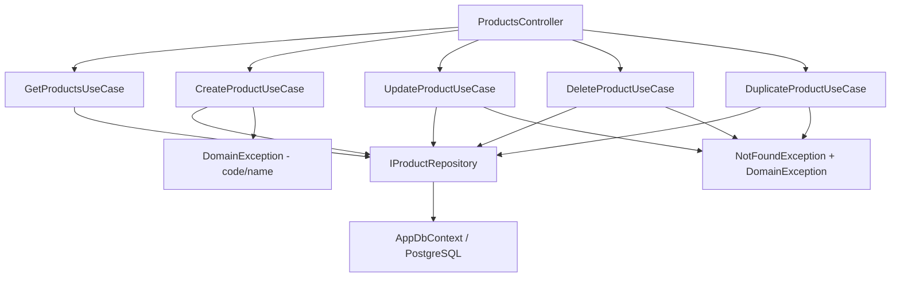

# Products — Feature Document (BE)

> **Jira:** — | **Branch:** `dev` | **Generated:** 2026-04-25 | **Updated:** 2026-05-29

---

## PRD Summary

> API quản lý danh sách hàng hóa (sản phẩm mỹ phẩm) cho hệ thống Lamour.

- **Goal:** Cung cấp CRUD API đầy đủ cho module Sản Phẩm, kèm kiểm tra unique code và nhân bản.
- **User story:** As a Lamour warehouse manager, I want to manage product inventory via a REST API so that the WPF desktop client can list, create, update, and delete products.
- **Acceptance criteria:**
  - [x] `GET /api/v1/products` trả danh sách tất cả sản phẩm
  - [x] `POST /api/v1/products` tạo mới, validate `code` unique + `name` required
  - [x] `PUT /api/v1/products/{id}` cập nhật, validate unique code (exclude self)
  - [x] `DELETE /api/v1/products/{id}` xóa sản phẩm
  - [x] `POST /api/v1/products/{id}/duplicate` nhân bản với code suffix `_COPY`

---

## Business Rules

| Rule | Description |
|------|-------------|
| Code unique | `code` unique case-insensitive — `DomainException` nếu trùng; để trống thì bỏ qua unique check |
| Code optional | `code` không bắt buộc — DB index có filter `WHERE code <> ''` |
| Name required | `name` không được trống — `DomainException` |
| Category required | `category` không được trống — `DomainException` |
| CostPrice > 0 | `cost_price` phải lớn hơn 0 — `DomainException` |
| SellingPrice > 0 | `selling_price` phải lớn hơn 0 — `DomainException` |
| Stock quantity | `stock_quantity` lưu tại DB, tăng/giảm qua import/export invoice |
| Duplicate code | Khi nhân bản: code mới = `{original_code}_COPY`; lỗi nếu `_COPY` đã tồn tại |
| is_active | Sản phẩm có thể ngừng kinh doanh (`is_active = false`) |
| vat_rate | Thuế suất GTGT — enum `VatRateType`: `Zero`, `Five`, `Eight`, `Ten`, `KCT`, `KKKNT`, `KHAC`; nullable |
| tax_reduction_type | Có giảm thuế — enum `TaxReductionStatus`: `CoGiamThue`, `ChuaGiamThue`, `ChuaXacDinh`; nullable |
| import_tax_rate | Thuế suất NK (%) — `decimal?`, nullable |
| export_tax_rate | Thuế suất XK (%) — `decimal?`, nullable |
| excise_tax_group | Nhóm thuế tiêu thụ đặc biệt — `string?`, nullable |

---

## Architecture Overview

### Key Components

| Layer | File | Role |
|-------|------|------|
| Controller | `Lamour.Api/Controllers/ProductsController.cs` | 5 HTTP actions, `[Authorize]` active |
| UseCase | `UseCases/GetProductsUseCase.cs` | Fetch all + map to DTO |
| UseCase | `UseCases/CreateProductUseCase.cs` | Validate → persist; `ParseVatRate`, `ParseTaxReductionStatus` |
| UseCase | `UseCases/UpdateProductUseCase.cs` | Find → validate → update |
| UseCase | `UseCases/DeleteProductUseCase.cs` | Find → delete |
| UseCase | `UseCases/DuplicateProductUseCase.cs` | Clone với `_COPY` code |
| Repository | `Repositories/IProductRepository.cs` | `GetAllAsync`, `GetByIdAsync`, `GetByIdTrackedAsync`, `CodeExistsAsync`, `AddAsync`, `UpdateAsync`, `DeleteAsync` |
| Repository | `Lamour.Infrastructure/Repositories/ProductRepository.cs` | EF Core implementation |
| Entity | `Lamour.Domain/Entities/Product.cs` | Domain model — 9 fields cơ bản + 5 tax fields |
| Enum | `Lamour.Domain/Enums/VatRateType.cs` | `Zero`, `Five`, `Eight`, `Ten`, `KCT`, `KKKNT`, `KHAC` |
| Enum | `Lamour.Domain/Enums/TaxReductionStatus.cs` | `CoGiamThue`, `ChuaGiamThue`, `ChuaXacDinh` |
| Config | `Lamour.Infrastructure/Persistence/Configurations/ProductConfiguration.cs` | EF table mapping — tất cả 14 columns |

### Data Flow

```
HTTP Request
  → ProductsController
  → IXxxProductUseCase.ExecuteAsync()
  → IProductRepository
  → AppDbContext (EF Core + PostgreSQL table: products)
  ← Product entity → ProductResponseDto
  ← IActionResult
```



---

## Key Files & Symbols

### Domain
- [`Lamour.Domain/Entities/Product.cs`](../../../../Lamour.Domain/Entities/Product.cs) — `Id`, `Code`, `Name`, `Category`, `Unit`, `CostPrice`, `SellingPrice`, `StockQuantity`, `IsActive`, `VatRate`, `TaxReductionType`, `ImportTaxRate`, `ExportTaxRate`, `ExciseTaxGroup`
- [`Lamour.Domain/Enums/VatRateType.cs`](../../../../Lamour.Domain/Enums/VatRateType.cs) — enum cho `vat_rate`
- [`Lamour.Domain/Enums/TaxReductionStatus.cs`](../../../../Lamour.Domain/Enums/TaxReductionStatus.cs) — enum cho `tax_reduction_type`

### Application — Repositories
- [`Repositories/IProductRepository.cs`](../Repositories/IProductRepository.cs) — `GetAllAsync`, `GetByIdAsync`, `CodeExistsAsync`, `AddAsync`, `UpdateAsync`, `DeleteAsync`

### Application — DTOs
- [`Dtos/ProductResponseDto.cs`](../Dtos/ProductResponseDto.cs) — `id`, `code`, `name`, `category`, `unit`, `cost_price`, `selling_price`, `stock_quantity`, `is_active`, `vat_rate`, `tax_reduction_type`, `import_tax_rate`, `export_tax_rate`, `excise_tax_group`
- [`Dtos/CreateProductRequestDto.cs`](../Dtos/CreateProductRequestDto.cs) — Tất cả fields trên, `is_active` mặc định `true`, 5 tax fields nullable
- [`Dtos/UpdateProductRequestDto.cs`](../Dtos/UpdateProductRequestDto.cs) — Tương tự Create

### Application — UseCases
- [`UseCases/GetProductsUseCase.cs`](../UseCases/GetProductsUseCase.cs) — `ExecuteAsync()` → `IEnumerable<ProductResponseDto>`
- [`UseCases/CreateProductUseCase.cs`](../UseCases/CreateProductUseCase.cs) — Validate + `CodeExistsAsync` + `AddAsync`
- [`UseCases/UpdateProductUseCase.cs`](../UseCases/UpdateProductUseCase.cs) — `GetByIdAsync` → validate → `UpdateAsync`
- [`UseCases/DeleteProductUseCase.cs`](../UseCases/DeleteProductUseCase.cs) — `GetByIdAsync` → `DeleteAsync`
- [`UseCases/DuplicateProductUseCase.cs`](../UseCases/DuplicateProductUseCase.cs) — Clone + `{code}_COPY`

---

## API Contracts

| Method | Endpoint | Input | Output |
|--------|----------|-------|--------|
| `GET` | `/api/v1/products` | — | `ProductResponseDto[]` |
| `POST` | `/api/v1/products` | `CreateProductRequestDto` | `ProductResponseDto` (201) |
| `PUT` | `/api/v1/products/{id}` | `UpdateProductRequestDto` | `ProductResponseDto` (200) |
| `DELETE` | `/api/v1/products/{id}` | — | 204 No Content |
| `POST` | `/api/v1/products/{id}/duplicate` | — | `ProductResponseDto` (201) |

### Request — Create / Update
```json
{
  "code": "SP001",
  "name": "Kem dưỡng trắng da",
  "category": "Dưỡng da",
  "unit": "Hộp",
  "cost_price": 150000,
  "selling_price": 220000,
  "stock_quantity": 100,
  "is_active": true,
  "vat_rate": "Ten",
  "tax_reduction_type": "CoGiamThue",
  "import_tax_rate": 5.0,
  "export_tax_rate": null,
  "excise_tax_group": null
}
```

> **Giá trị hợp lệ:**
> - `vat_rate`: `"Zero"` | `"Five"` | `"Eight"` | `"Ten"` | `"KCT"` | `"KKKNT"` | `"KHAC"` | `null`
> - `tax_reduction_type`: `"CoGiamThue"` | `"ChuaGiamThue"` | `"ChuaXacDinh"` | `null`

### Response
```json
{
  "id": 1,
  "code": "SP001",
  "name": "Kem dưỡng trắng da",
  "category": "Dưỡng da",
  "unit": "Hộp",
  "cost_price": 150000.00,
  "selling_price": 220000.00,
  "stock_quantity": 100,
  "is_active": true,
  "vat_rate": "Ten",
  "tax_reduction_type": "CoGiamThue",
  "import_tax_rate": 5.00,
  "export_tax_rate": null,
  "excise_tax_group": null
}
```

---

## Edge Cases & Error Handling

| Scenario | Expected Behavior | Handled? |
|----------|------------------|----------|
| `code` trống | Cho phép — empty code được (không unique check) | ✅ |
| `name` trống | `DomainException` → 400 | ✅ |
| `category` trống | `DomainException` → 400 | ✅ |
| `cost_price` <= 0 | `DomainException` → 400 | ✅ |
| `selling_price` <= 0 | `DomainException` → 400 | ✅ |
| `code` đã tồn tại (Create) | `DomainException` → 400 | ✅ |
| `code` trùng khi Update (exclude self) | `DomainException` → 400 | ✅ |
| `id` không tồn tại | `NotFoundException` → 404 | ✅ |
| Duplicate với `_COPY` đã tồn tại | `DomainException` → 400 | ✅ |
| `vat_rate` / `tax_reduction_type` sai giá trị | Parse fail → lưu `null`, không throw | ✅ |
| `stock_quantity` âm | Không validate tại đây — validate ở ExportInvoice | ❌ Not here |

---

## Test Coverage Notes

| Component | Test File | Coverage |
|-----------|-----------|----------|
| `GetProductsUseCase` | — | ❌ Missing |
| `CreateProductUseCase` | — | ❌ Missing |
| `UpdateProductUseCase` | — | ❌ Missing |
| `DeleteProductUseCase` | — | ❌ Missing |
| `DuplicateProductUseCase` | — | ❌ Missing |
| `ProductRepository` | — | ❌ Missing |

**Suggested test cases:**
- [ ] Create: code/name trống → `DomainException`
- [ ] Create: code trùng → `DomainException`
- [ ] Update: id không tồn tại → `NotFoundException`
- [ ] Duplicate: code `_COPY` đã tồn tại → `DomainException`
- [ ] GetAll: empty DB → trả empty list (không throw)

---

## Notes

- `[Authorize]` đã active — WPF gửi Bearer token khi call API
- EF Migration: `20260425045914_ProductsCreate` (bao gồm cả 5 tax columns)
- `StockQuantity` được quản lý bởi ImportInvoice / ExportInvoice (chưa implement)
- `TaxReductionType` dùng enum `TaxReductionStatus` riêng (không dùng `VatRateType`) — các giá trị: `CoGiamThue`, `ChuaGiamThue`, `ChuaXacDinh`

### WPF Desktop Fix (2026-05-29)

Dropdown "Có giảm thuế" trên WPF bị bind nhầm vào `VatRateOptions` (`VatRateType`) thay vì `TaxReductionStatus`. Đã fix:

| File (desktop-lamour) | Thay đổi |
|-----------------------|----------|
| `Domain/Models/TaxReductionStatus.cs` | Tạo mới enum `CoGiamThue`, `ChuaGiamThue`, `ChuaXacDinh` |
| `Shared/Converters/TaxReductionStatusDisplayConverter.cs` | Converter hiển thị "Có giảm thuế" / "Không giảm thuế" / "Chưa xác định" |
| `Shared/AppConverters.xaml` | Đăng ký `TaxReductionStatusDisplayConverter` resource |
| `Domain/Models/Product.cs` | `VatRateType? TaxReductionType` → `TaxReductionStatus?` |
| `Domain/UseCases/CreateProductInput.cs` | `VatRateType? TaxReductionType` → `TaxReductionStatus?` |
| `Domain/UseCases/UpdateProductInput.cs` | `VatRateType? TaxReductionType` → `TaxReductionStatus?` |
| `ViewModels/ProductFormViewModel.cs` | Thêm `TaxReductionStatusOptions`; default khi thêm mới = `CoGiamThue` |
| `Views/ProductFormWindow.xaml` | `ItemsSource` → `TaxReductionStatusOptions`; Converter → `TaxReductionStatusDisplayConverter` |
| `Data/Repositories/ProductRepository.cs` | `MapToModel`: parse `TaxReductionType` as `TaxReductionStatus` thay vì `VatRateType` |

---

*Generated by `/ct-ai-document` on 2026-04-25*
