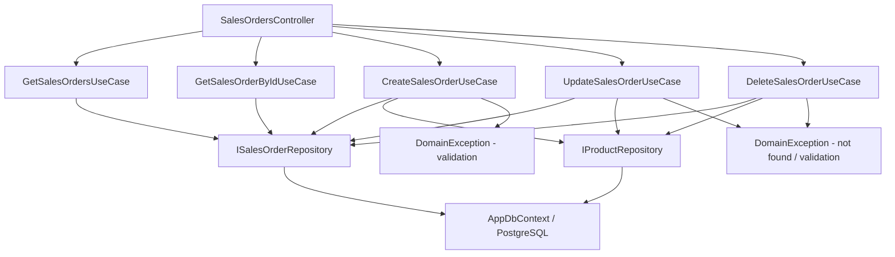

# Sales Orders — Feature Document (BE)

> **Jira:** — | **Branch:** `dev` | **Generated:** 2026-05-01

---

## PRD Summary

> API quản lý đơn hàng bán (Sales Orders) cho hệ thống Lamour Spa & Cosmetics.

- **Goal:** Cung cấp CRUD API đầy đủ cho module Bán Hàng, tự động điều chỉnh tồn kho khi tạo/sửa/xóa đơn.
- **User story:** As a Lamour admin, I want to manage sales orders via a REST API so that the WPF desktop client can create and track customer sales with automatic stock deduction.
- **Acceptance criteria:**
  - [x] `GET /api/v1/sales-orders` trả danh sách tất cả đơn hàng kèm lines
  - [x] `GET /api/v1/sales-orders/{id}` trả chi tiết một đơn hàng
  - [x] `POST /api/v1/sales-orders` tạo mới, trừ tồn kho cho từng line (ngoại trừ line khuyến mại)
  - [x] `PUT /api/v1/sales-orders/{id}` cập nhật, hoàn tồn kho cũ rồi trừ tồn kho mới
  - [x] `DELETE /api/v1/sales-orders/{id}` xóa, hoàn tồn kho về khi xóa

---

## Business Rules

| Rule | Description |
|------|-------------|
| Số chứng từ | Prefix `BC`, format `BC{5 digits}` (BC00001...) — sinh tại WPF client |
| Ít nhất 1 line | Đơn hàng phải có ít nhất 1 dòng chi tiết — `DomainException` nếu vi phạm |
| Hàng còn kinh doanh | Chỉ cho phép `IsActive = true` — `DomainException` nếu sản phẩm đã ngưng |
| Trừ tồn kho | Khi tạo/cập nhật: trừ `StockQuantity` cho mỗi line không phải khuyến mại |
| Hoàn tồn kho | Khi sửa: hoàn tồn kho cũ trước, rồi trừ tồn kho mới |
| Hoàn tồn kho khi xóa | Khi xóa: hoàn toàn bộ tồn kho từ các line không phải khuyến mại |
| Line khuyến mại | `IsPromotion = true` → không trừ/hoàn tồn kho |
| Tỷ lệ chiết khấu | `DiscountRate` (0–100%) per line — BE clamp `Math.Max(0, Math.Min(100, dto.DiscountRate))` |
| Tính Thành tiền | `Amount = Quantity × UnitPrice × (1 − DiscountRate / 100)` — BE tính server-side, bỏ qua `amount` từ client |
| Denormalize | `ProductCode`, `ProductName` được copy vào line tại thời điểm tạo — không phụ thuộc sản phẩm sau này |
| DateTime UTC | Lưu `DateTime.UtcNow`, WPF convert sang local time khi hiển thị |
| TK mặc định | `ReceivableAccount = "131"`, `RevenueAccount = "511"` |
| Tổng tiền | `TotalAmount = SUM(line.Amount)` (net sau chiết khấu) tính tại BE |

---

## Architecture Overview

### Key Components

| Layer | File | Role |
|-------|------|------|
| Controller | `Lamour.Api/Controllers/SalesOrdersController.cs` | HTTP entry point, 5 actions |
| UseCase | `UseCases/GetSalesOrdersUseCase.cs` | Fetch & map tất cả đơn hàng |
| UseCase | `UseCases/GetSalesOrderByIdUseCase.cs` | Fetch một đơn theo id |
| UseCase | `UseCases/CreateSalesOrderUseCase.cs` | Validate → persist → trừ tồn kho |
| UseCase | `UseCases/UpdateSalesOrderUseCase.cs` | Hoàn tồn kho cũ → update → trừ tồn kho mới |
| UseCase | `UseCases/DeleteSalesOrderUseCase.cs` | Hoàn tồn kho → xóa |
| Repository | `Repositories/ISalesOrderRepository.cs` | Data access contract |
| Repository | `Lamour.Infrastructure/Repositories/SalesOrderRepository.cs` | EF Core implementation |
| Entity | `Lamour.Domain/Entities/SalesOrder.cs` | Domain model (header + lines) |
| Config | `Lamour.Infrastructure/Persistence/Configurations/SalesOrderConfiguration.cs` | EF table mapping |

### Data Flow

```
HTTP Request
  → SalesOrdersController (action method)
  → IXxxSalesOrderUseCase.ExecuteAsync()
  → ISalesOrderRepository (GetAllAsync / GetByIdAsync / AddAsync / UpdateAsync / DeleteAsync)
  → IProductRepository (GetByIdAsync / GetByIdTrackedAsync / UpdateAsync) — stock ops
  → AppDbContext (EF Core + PostgreSQL)
  ← SalesOrder entity + Lines
  ← SalesOrderResponseDto (mapped in UseCase)
  ← IActionResult (Ok / Created / NoContent)
```



---

## Key Files & Symbols

### Domain
- [`Lamour.Domain/Entities/SalesOrder.cs`](../../../../Lamour.Domain/Entities/SalesOrder.cs) — Entity header: `Id`, `DocumentNumber`, `AccountingDate`, `DocumentDate`, `CustomerId`, `EmployeeId`, `Description`, `Reference`, `PaymentTerms`, `PaymentDueDays`, `PaymentDueDate`, `Notes`, `DeliveryMethod`, `PaymentMethod`, `TotalAmount`, `CreatedAt`
- [`Lamour.Domain/Entities/SalesOrderLine.cs`](../../../../Lamour.Domain/Entities/SalesOrder.cs) — Line (nested in same file): `ProductId`, `ProductCode`, `ProductName`, `IsPromotion`, `Unit`, `Quantity`, `UnitPrice`, `DiscountRate`, `Amount`, `ReceivableAccount`, `RevenueAccount`

### Application — Repositories
- [`Repositories/ISalesOrderRepository.cs`](../Repositories/ISalesOrderRepository.cs) — `GetAllAsync`, `GetByIdAsync`, `GetByIdTrackedAsync`, `AddAsync`, `UpdateAsync`, `DeleteAsync`, `SaveChangesAsync`

### Application — DTOs
- [`Dtos/SalesOrderResponseDto.cs`](../Dtos/SalesOrderResponseDto.cs) — Response: 18 fields snake_case + `lines[]`
- [`Dtos/CreateSalesOrderRequestDto.cs`](../Dtos/CreateSalesOrderRequestDto.cs) — Create: 14 header fields + `lines[]`
- [`Dtos/UpdateSalesOrderRequestDto.cs`](../Dtos/UpdateSalesOrderRequestDto.cs) — Update: same shape as Create
- [`Dtos/SalesOrderLineDto.cs`](../Dtos/SalesOrderLineDto.cs) — Line: 12 fields (shared cho cả request và response); thêm `discount_rate` (decimal, default 0)

### Application — UseCases
- [`UseCases/GetSalesOrdersUseCase.cs`](../UseCases/GetSalesOrdersUseCase.cs) — `ExecuteAsync()` → `IEnumerable<SalesOrderResponseDto>`; chứa `internal static MapToDto()` dùng chung
- [`UseCases/GetSalesOrderByIdUseCase.cs`](../UseCases/GetSalesOrderByIdUseCase.cs) — `ExecuteAsync(id)` → `SalesOrderResponseDto?`
- [`UseCases/CreateSalesOrderUseCase.cs`](../UseCases/CreateSalesOrderUseCase.cs) — Validate lines → clamp DiscountRate → tính `Amount = Qty × UnitPrice × (1 − CK/100)` → `AddAsync` → trừ stock
- [`UseCases/UpdateSalesOrderUseCase.cs`](../UseCases/UpdateSalesOrderUseCase.cs) — `GetByIdTrackedAsync` → hoàn stock cũ → tính Amount mới → update → trừ stock mới
- [`UseCases/DeleteSalesOrderUseCase.cs`](../UseCases/DeleteSalesOrderUseCase.cs) — `GetByIdTrackedAsync` → hoàn stock → `DeleteAsync`

### Infrastructure
- [`Lamour.Infrastructure/Repositories/SalesOrderRepository.cs`](../../../../Lamour.Infrastructure/Repositories/SalesOrderRepository.cs) — EF Core impl; `GetAllAsync` / `GetByIdAsync` dùng `AsNoTracking()` + `Include(Lines).ThenInclude(Product)`
- [`Lamour.Infrastructure/Persistence/Configurations/SalesOrderConfiguration.cs`](../../../../Lamour.Infrastructure/Persistence/Configurations/SalesOrderConfiguration.cs) — Table `sales_orders` + `sales_order_lines`, unique index trên `document_number`

---

## API Contracts

| Method | Endpoint | Input | Output |
|--------|----------|-------|--------|
| `GET` | `/api/v1/sales-orders` | — | `SalesOrderResponseDto[]` |
| `GET` | `/api/v1/sales-orders/{id}` | — | `SalesOrderResponseDto` (200) / 404 |
| `POST` | `/api/v1/sales-orders` | `CreateSalesOrderRequestDto` | `SalesOrderResponseDto` (201) |
| `PUT` | `/api/v1/sales-orders/{id}` | `UpdateSalesOrderRequestDto` | `SalesOrderResponseDto` (200) |
| `DELETE` | `/api/v1/sales-orders/{id}` | — | 204 No Content |

### Request — Create / Update
```json
{
  "document_number": "BC00001",
  "accounting_date": "2026-05-01T00:00:00",
  "document_date": "2026-05-01T00:00:00",
  "customer_id": 1,
  "employee_id": 2,
  "description": "Bán hàng CHI NHI",
  "reference": null,
  "payment_terms": "TM/CK",
  "payment_due_days": 30,
  "payment_due_date": "2026-05-31T00:00:00",
  "notes": null,
  "delivery_method": null,
  "payment_method": "Tiền mặt",
  "lines": [
    {
      "product_id": 5,
      "product_code": "SP001",
      "product_name": "Kem dưỡng da",
      "is_promotion": false,
      "unit": "Hộp",
      "quantity": 2,
      "unit_price": 150000,
      "discount_rate": 10,
      "amount": 270000,
      "receivable_account": "131",
      "revenue_account": "511"
    }
  ]
}
```

### Response
```json
{
  "id": 1,
  "document_number": "BC00001",
  "accounting_date": "2026-05-01T00:00:00Z",
  "document_date": "2026-05-01T00:00:00Z",
  "customer_id": 1,
  "customer_name": "CHI NHI",
  "employee_id": 2,
  "employee_name": "Nguyễn Văn A",
  "description": "Bán hàng CHI NHI",
  "reference": null,
  "payment_terms": "TM/CK",
  "payment_due_days": 30,
  "payment_due_date": "2026-05-31T00:00:00Z",
  "notes": null,
  "delivery_method": null,
  "payment_method": "Tiền mặt",
  "total_amount": 300000,
  "created_at": "2026-05-01T08:00:00Z",
  "lines": [
    {
      "id": 1,
      "product_id": 5,
      "product_code": "SP001",
      "product_name": "Kem dưỡng da",
      "is_promotion": false,
      "unit": "Hộp",
      "quantity": 2,
      "unit_price": 150000,
      "discount_rate": 10,
      "amount": 270000,
      "receivable_account": "131",
      "revenue_account": "511"
    }
  ]
}
```

---

## Edge Cases & Error Handling

| Scenario | Expected Behavior | Handled? |
|----------|------------------|----------|
| `lines` rỗng | `DomainException` → 400 | ✅ |
| `product_id` không tồn tại | `DomainException` → 400 | ✅ |
| Sản phẩm đã ngưng (`IsActive = false`) | `DomainException` → 400 | ✅ |
| `id` không tồn tại (PUT/DELETE) | `DomainException` → 400 (cần đổi sang `NotFoundException` → 404) | ⚠️ |
| Tồn kho âm sau bán | Không có guard — stock có thể âm | ❌ Cần fix |
| Nhiều SaveChanges (không transaction) | Stock có thể không đồng bộ nếu crash giữa chừng | ❌ Cần fix |
| Database unreachable | `GlobalExceptionHandler` → 500 | ✅ |
| `document_number` trùng | PostgreSQL unique constraint → 500 | ⚠️ Cần handle |

---

## Known Issues (từ code review 2026-05-01)

| # | Severity | Mô tả | Fix |
|---|---|---|---|
| 1 | 🔴 Critical | Không có stock guard — `StockQuantity` có thể âm | Thêm `if (product.StockQuantity < line.Quantity) throw DomainException(...)` trước khi trừ |
| 2 | 🔴 Critical | Không có DB transaction — Create/Update/Delete dùng nhiều `SaveChanges` riêng biệt | Wrap bằng `IDbContextTransaction` hoặc dùng Unit of Work |
| 3 | 🟠 High | `DomainException` cho not-found trong Update/Delete → trả về 400 thay vì 404 | Đổi sang `NotFoundException` |
| 4 | 🟠 High | Không có trường `Status` trên entity — không phân biệt Draft/Confirmed | Thêm `Status` enum |
| 5 | 🟡 Medium | `MapToDto` đặt trong `GetSalesOrdersUseCase` nhưng được gọi bởi UseCase khác | Extract sang `SalesOrderMapper` static class |
| 6 | 🟡 Medium | N+1 trong stock loop: load product lần 2 sau khi đã load trong vòng validate | Cache vào `Dictionary<int, Product>` |

---

## DI Registration (`Program.cs`)

```csharp
// ── Sales DI ──────────────────────────────────────────────────────────────────
builder.Services.AddScoped<ISalesOrderRepository, SalesOrderRepository>();
builder.Services.AddScoped<IGetSalesOrdersUseCase, GetSalesOrdersUseCase>();
builder.Services.AddScoped<IGetSalesOrderByIdUseCase, GetSalesOrderByIdUseCase>();
builder.Services.AddScoped<ICreateSalesOrderUseCase, CreateSalesOrderUseCase>();
builder.Services.AddScoped<IUpdateSalesOrderUseCase, UpdateSalesOrderUseCase>();
builder.Services.AddScoped<IDeleteSalesOrderUseCase, DeleteSalesOrderUseCase>();
```

---

## EF Migration

```bash
export PATH="$PATH:$HOME/.dotnet/tools"
dotnet ef migrations add SalesOrdersCreate \
  --project src/Lamour.Infrastructure \
  --startup-project src/Lamour.Api
dotnet ef database update \
  --project src/Lamour.Infrastructure \
  --startup-project src/Lamour.Api
```

Tables created: `sales_orders`, `sales_order_lines`

**Migration 2 — `AddDiscountRateToSalesOrderLines` (2026-05-01):**
```bash
dotnet ef migrations add AddDiscountRateToSalesOrderLines \
  --project src/Lamour.Infrastructure \
  --startup-project src/Lamour.Api
dotnet ef database update \
  --project src/Lamour.Infrastructure \
  --startup-project src/Lamour.Api
```
Column added: `discount_rate numeric(5,2) NOT NULL DEFAULT 0`

---

## Test Coverage Notes

| Component | Test File | Coverage |
|-----------|-----------|----------|
| `GetSalesOrdersUseCase` | — | ❌ Missing |
| `CreateSalesOrderUseCase` | — | ❌ Missing |
| `UpdateSalesOrderUseCase` | — | ❌ Missing |
| `DeleteSalesOrderUseCase` | — | ❌ Missing |
| `SalesOrderRepository` | — | ❌ Missing |

**Suggested test cases:**
- [ ] Create: `lines` rỗng → `DomainException`
- [ ] Create: `product_id` không tồn tại → `DomainException`
- [ ] Create: sản phẩm ngưng kinh doanh → `DomainException`
- [ ] Create: `is_promotion = true` → tồn kho không thay đổi
- [ ] Create: `is_promotion = false` → tồn kho giảm đúng số lượng
- [ ] Update: id không tồn tại → NotFoundException (sau khi fix)
- [ ] Update: tồn kho cũ được hoàn trước khi trừ mới
- [ ] Delete: tồn kho được hoàn lại
- [ ] Delete: id không tồn tại → NotFoundException (sau khi fix)

---

## Notes

- `[Authorize]` đang bật trên controller — WPF cần gửi Bearer JWT
- `SalesOrderLine` được lưu trong cùng file với `SalesOrder` entity
- `SalesOrderLineConfiguration` được đặt trong cùng file với `SalesOrderConfiguration` — cả hai đều tự động được đăng ký qua `ApplyConfigurationsFromAssembly`
- `IProductRepository.GetByIdTrackedAsync` được thêm mới cho Sales (và các module khác cần tracked update)

---

*Generated by `/ct-ai-document` on 2026-05-01 — Updated 2026-05-01: thêm DiscountRate per line, đổi prefix BH → BC*
