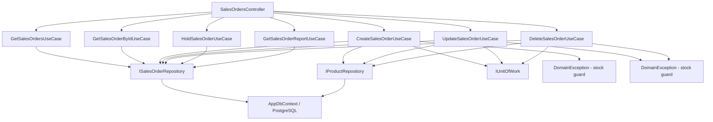

# Sales Orders — Feature Document (BE)

> **Jira:** — | **Branch:** `dev` | **Generated:** 2026-05-01 | **Last updated:** 2026-08-09 (fix bug: Sửa đơn Treo + Ghi sổ không đổi status về Normal)

---

## PRD Summary

> API quản lý đơn hàng bán (Sales Orders) cho hệ thống Lamour Spa & Cosmetics.

- **Goal:** Cung cấp CRUD API đầy đủ cho module Bán Hàng, tự động điều chỉnh tồn kho khi tạo/sửa/xóa đơn, hỗ trợ treo đơn.
- **User story:** As a Lamour admin, I want to manage sales orders via a REST API so that the WPF desktop client can create, hold, and track customer sales with automatic stock deduction.
- **Acceptance criteria:**
  - [x] `GET /api/v1/sales-orders` trả danh sách tất cả đơn hàng kèm lines
  - [x] `GET /api/v1/sales-orders/{id}` trả chi tiết một đơn hàng
  - [x] `POST /api/v1/sales-orders` tạo mới, mặc định Status = Normal (Ghi sổ), trừ tồn kho cho từng line (ngoại trừ line khuyến mại)
  - [x] `PUT /api/v1/sales-orders/{id}` cập nhật, hoàn tồn kho cũ rồi trừ tồn kho mới
  - [x] `DELETE /api/v1/sales-orders/{id}` xóa, hoàn tồn kho về khi xóa
  - [x] `GET /api/v1/sales-orders/next-code` trả số chứng từ tiếp theo dạng `XK{5 digits}`
  - [x] `PUT /api/v1/sales-orders/{id}/hold` treo đơn (Status → Held)
  - [x] `GET /api/v1/sales-orders/report` báo cáo chi tiết dòng bán hàng, lọc theo mặt hàng/nhân viên/khách hàng/khoảng ngày
  - [x] Stock guard: kiểm tra tất cả sản phẩm trước khi trừ kho, gom tất cả lỗi rồi throw 1 lần
  - [x] DB transaction: Create/Update/Delete dùng `IUnitOfWork` — rollback khi lỗi

---

## Business Rules

| Rule | Description |
|------|-------------|
| Số chứng từ | Prefix `XK`, format `XK{5 digits}` (XK00001...) — sinh tại WPF client |
| Ít nhất 1 line | Đơn hàng phải có ít nhất 1 dòng chi tiết — `DomainException` nếu vi phạm |
| Hàng còn kinh doanh | Chỉ cho phép `IsActive = true` — `DomainException` nếu sản phẩm đã ngưng |
| Stock guard | Trước khi trừ kho: kiểm tra **tất cả** lines. Nếu bất kỳ sản phẩm nào không đủ kho → gom tất cả lỗi thành 1 message rồi throw `DomainException` — không dừng sớm |
| Trừ tồn kho | Khi tạo/cập nhật: trừ `StockQuantity` cho mỗi line không phải khuyến mại |
| Hoàn tồn kho | Khi sửa: hoàn tồn kho cũ trước, rồi trừ tồn kho mới |
| Hoàn tồn kho khi xóa | Khi xóa: hoàn toàn bộ tồn kho từ các line không phải khuyến mại |
| Line khuyến mại | `IsPromotion = true` → không trừ/hoàn tồn kho |
| Tỷ lệ chiết khấu | `DiscountRate` (0–100%) per line — BE clamp `Math.Max(0, Math.Min(100, dto.DiscountRate))` |
| Tính Thành tiền | `Amount = Quantity × UnitPrice × (1 − DiscountRate / 100)` — BE tính server-side, bỏ qua `amount` từ client, **trừ khi** `is_amount_manual = true` (xem rule "Thành tiền thủ công" bên dưới) |
| Thành tiền thủ công (2026-08-04) | `SalesOrderLineDto.IsAmountManual` (bool) — nếu `true` và dòng không phải khuyến mại: BE dùng thẳng `dto.Amount` do client gửi thay vì tự tính từ `Quantity × UnitPrice × (1 − DiscountRate/100)`; validate `Amount >= 0` (`DomainException` nếu âm). `UnitPrice`/`DiscountRate` vẫn được lưu như bình thường (chỉ dùng để hiển thị/tham khảo, không dùng để tính `Amount` khi ở chế độ thủ công). `TaxAmount = Amount × TaxRate / 100` vẫn tính như cũ dựa trên `Amount` cuối cùng (dù thủ công hay auto-calc) |
| Thành tiền thủ công + khuyến mại | `IsPromotion = true` luôn thắng: `Amount` bị ép về `0` và `IsAmountManual` bị ép về `false`, bất kể client gửi gì lên (nhất quán với rule "Line khuyến mại" hiện có) |
| Tính thuế (2026-07-15) | `TaxRate` lấy từ `Product.VatRate` tại thời điểm ghi sổ (không tin client): `Five→5`, `Eight→8`, `Ten→10`, còn lại (`Zero`/`KCT`/`KKKNT`/`KHAC`/null) → `0`. `TaxAmount = Amount × TaxRate / 100` — xem `SalesOrderTaxCalculator.ToPercent()` |
| Denormalize | `ProductCode`, `ProductName`, `TaxRate`, `IsDepositProduct` (2026-08-19) được copy vào line tại thời điểm tạo — không phụ thuộc sản phẩm/thuế suất sản phẩm thay đổi sau này |
| Dòng "Đặt cọc" không cần chọn Kho (2026-08-19) | `SalesOrderLine.WarehouseId` là `int?` (nullable) — khi `Product.IsDepositProduct = true`, BE luôn ép `WarehouseId = null` bất kể client gửi gì lên, bỏ qua toàn bộ validate/adjust tồn kho theo kho (giống cách dòng khuyến mại được loại trừ). Line không phải Đặt cọc vẫn bắt buộc `WarehouseId` hợp lệ (FK tới `warehouses`) như cũ |
| `SalesOrderLine.IsDepositProduct` (mới 2026-08-19) | Denormalize từ `Product.IsDepositProduct` tại thời điểm ghi sổ (set trong `CreateSalesOrderUseCase`/`UpdateSalesOrderUseCase`), trả về qua `SalesOrderLineDto.is_deposit_product`. Lý do thêm: hóa đơn in cần biết dòng nào là "Đặt cọc" để ẩn cột Đơn giá/CK/Thuế suất, nhưng `AddAsync`/`GetAllAsync`/`GetByIdAsync` không `.Include(l => l.Product)` nên không thể dựa vào navigation property lúc map DTO — phải denormalize thay vì query lại |
| DateTime UTC | Lưu `DateTime.UtcNow`, WPF convert sang local time khi hiển thị |
| TK mặc định | `ReceivableAccount = "131"`, `RevenueAccount = "511"` |
| Tổng tiền | `TotalAmount = SUM(line.Amount)` (net sau chiết khấu, **chưa thuế**); `TotalTaxAmount = SUM(line.TaxAmount)`; `GrandTotal = TotalAmount + TotalTaxAmount` (tổng thanh toán thật) — tất cả tính tại BE |
| DB Transaction | Mỗi mutation UseCase dùng `IUnitOfWork.BeginAsync` → `CommitAsync` hoặc `RollbackAsync` |
| SalesOrderStatus | `Normal=0` (Ghi sổ — mặc định khi tạo đơn), `Held=1` (treo đơn) |
| Treo đơn | `HoldSalesOrderUseCase` → Status = Held. Có thể treo bất kể trạng thái hiện tại |
| Bỏ treo (2026-08-09) | Không có action "un-hold" riêng — `UpdateSalesOrderUseCase` (nút "💾 Ghi sổ" khi Sửa) luôn set `Status = Normal` sau khi lưu, bất kể trạng thái trước đó là gì. "Ghi sổ" = post lại đơn; chỉ nút "⏸ Treo" riêng mới giữ/đưa về Treo |
| Immutability | Không còn — mọi đơn hàng (Ghi sổ hoặc Treo) đều có thể sửa/xóa bình thường (2026-07-16, bỏ bước xác nhận) |
| Báo cáo là cấp DÒNG, không phải cấp CHỨNG TỪ | `GET /report` trả về danh sách `SalesOrderLine` (kèm thông tin chứng từ cha), không phải `SalesOrder` — vì lọc theo "mặt hàng" (`product_ids`) là field ở dòng chi tiết, một chứng từ có thể có dòng khớp và dòng không khớp |
| Báo cáo filter | `product_ids` (list, OR giữa các sản phẩm)/`employee_id`/`customer_id`/`unit`/`category`/`from_date`/`to_date` đều optional, kết hợp **AND** giữa các field khác nhau — bỏ qua field nào không truyền (2026-07-18) |
| Báo cáo khoảng ngày | Lọc theo `SalesOrder.AccountingDate`, không phải `DocumentDate` |
| Báo cáo lọc theo ĐVT | `unit` so khớp `SalesOrderLine.Unit` (đã denormalize sẵn trên dòng, không cần join `Product`) |
| Báo cáo lọc theo Nhóm VTHH | `category` so khớp `Product.Category` — field này KHÔNG có trên `SalesOrderLine`, phải `.Include(l => l.Product)` để lọc |
| Summary-report gộp bán hàng + trả lại (2026-07-18) | `GET /summary-report` gọi CẢ `ISalesOrderRepository.GetReportLinesAsync` VÀ `ISalesReturnRepository.GetReportLinesAsync` (cùng bộ filter), rồi merge trong C# (không phải SQL join) theo key `(ProductId, CustomerId, EmployeeId)` — tránh viết 1 query LINQ phức tạp union 2 bảng khác nhau |
| Summary-report công thức | `SalesAmount` = Σ(Quantity×UnitPrice) gross; `DiscountAmount` = Σ(Quantity×UnitPrice×DiscountRate/100); `ReturnValue` = Σ(SalesReturnLine.Amount − SalesReturnLine.DiscountAmount) (net); `NetRevenue` = SalesAmount − DiscountAmount − ReturnValue. "Giá trị giảm giá" (price-reduction riêng biệt với chiết khấu) KHÔNG được model trong domain — WPF hiển thị cột này nhưng luôn = 0 |
| Summary-report không có sản phẩm/KH/NV không hoạt động | Chỉ trả về các triple `(product, customer, employee)` có ít nhất 1 dòng bán HOẶC trả lại trong kỳ lọc — sản phẩm không bán được trong kỳ sẽ KHÔNG xuất hiện trong kết quả (khác với ảnh tham chiếu MISA vốn liệt kê mọi sản phẩm kể cả SL=0) |

---

## Architecture Overview

### Key Components

| Layer | File | Role |
|-------|------|------|
| Controller | `Lamour.Api/Controllers/SalesOrdersController.cs` | HTTP entry point, 7 actions |
| Abstraction | `Lamour.Application/Abstractions/IUnitOfWork.cs` | DB transaction interface |
| Infrastructure | `Lamour.Infrastructure/Persistence/UnitOfWork.cs` | `IDbContextTransaction` implementation |
| UseCase | `UseCases/GetSalesOrdersUseCase.cs` | Fetch & map tất cả đơn hàng |
| UseCase | `UseCases/GetSalesOrderByIdUseCase.cs` | Fetch một đơn theo id |
| UseCase | `UseCases/GetNextSalesOrderCodeUseCase.cs` | Trả số chứng từ tiếp theo (lightweight, không JOIN) |
| UseCase | `UseCases/CreateSalesOrderUseCase.cs` | Stock guard → tính `TaxRate`/`TaxAmount` từ `Product.VatRate` → IUnitOfWork transaction → persist → trừ tồn kho |
| UseCase | `UseCases/UpdateSalesOrderUseCase.cs` | Stock guard → tính lại `TaxRate`/`TaxAmount` → IUnitOfWork → hoàn cũ → trừ mới |
| Helper | `SalesOrderTaxCalculator.cs` | `ToPercent(VatRateType?)` — map enum VAT sang % dùng chung cho Create/Update |
| UseCase | `UseCases/DeleteSalesOrderUseCase.cs` | IUnitOfWork → hoàn kho → xóa |
| UseCase | `UseCases/HoldSalesOrderUseCase.cs` | Status = Held |
| UseCase | `UseCases/GetSalesOrderReportUseCase.cs` | Nhận filter (product/employee/customer/date range) → `GetReportLinesAsync` → map sang `SalesOrderReportLineDto` |
| Repository | `Repositories/ISalesOrderRepository.cs` | Data access contract |
| Repository | `Lamour.Infrastructure/Repositories/SalesOrderRepository.cs` | EF Core implementation |
| Entity | `Lamour.Domain/Entities/SalesOrder.cs` | Domain model + `SalesOrderStatus` enum |
| Config | `Lamour.Infrastructure/Persistence/Configurations/SalesOrderConfiguration.cs` | EF table mapping + `status` column |

### Data Flow

```
HTTP Request
  → SalesOrdersController (action method)
  → IXxxSalesOrderUseCase.ExecuteAsync()
  → IUnitOfWork.BeginAsync()                    ← transaction start (Create/Update/Delete)
  → ISalesOrderRepository (GetAllAsync / GetByIdAsync / AddAsync / UpdateAsync / DeleteAsync)
  → IProductRepository (GetByIdAsync / GetByIdTrackedAsync / UpdateAsync) — stock ops
  → AppDbContext (EF Core + PostgreSQL)
  → IUnitOfWork.CommitAsync()                   ← commit on success
  ← on error: IUnitOfWork.RollbackAsync()       ← rollback
  ← SalesOrder entity + Lines
  ← SalesOrderResponseDto (mapped in UseCase)
  ← IActionResult (Ok / Created / NoContent)
```



---

## Key Files & Symbols

### Domain
- [`Lamour.Domain/Entities/SalesOrder.cs`](../../../../Lamour.Domain/Entities/SalesOrder.cs) — Entity header + `SalesOrderStatus` enum (`Normal=0`, `Held=1`) + `Status` property (default `Normal`)
- [`Lamour.Domain/Entities/SalesOrderLine.cs`](../../../../Lamour.Domain/Entities/SalesOrder.cs) — Line (nested in same file): `ProductId`, `ProductCode`, `ProductName`, `IsPromotion`, `Unit`, `Quantity`, `UnitPrice`, `DiscountRate`, `Amount`, `IsAmountManual` (2026-08-04), `ReceivableAccount`, `RevenueAccount`

### Application — Abstractions
- [`Lamour.Application/Abstractions/IUnitOfWork.cs`](../../../Abstractions/IUnitOfWork.cs) — `BeginAsync`, `CommitAsync`, `RollbackAsync` (CancellationToken ct = default)

### Infrastructure — UnitOfWork
- [`Lamour.Infrastructure/Persistence/UnitOfWork.cs`](../../../../Lamour.Infrastructure/Persistence/UnitOfWork.cs) — Wraps `IDbContextTransaction`; registered as `Scoped` in DI

### Application — Repositories
- [`Repositories/ISalesOrderRepository.cs`](../Repositories/ISalesOrderRepository.cs) — `GetAllAsync`, `GetByIdAsync`, `GetByIdTrackedAsync`, `AddAsync`, `UpdateAsync`, `DeleteAsync`, `SaveChangesAsync`, `GetNextCodeNumberAsync`, `GetReportLinesAsync(productIds?, employeeId?, customerId?, unit?, category?, fromDate?, toDate?)` (2026-07-16, extended 2026-07-18)

### Application — DTOs
- [`Dtos/SalesOrderResponseDto.cs`](../Dtos/SalesOrderResponseDto.cs) — Response: 21 fields snake_case + `lines[]` + `status` (int); thêm `total_tax_amount`, `grand_total` (2026-07-15)
- [`Dtos/CreateSalesOrderRequestDto.cs`](../Dtos/CreateSalesOrderRequestDto.cs) — Create: 14 header fields + `lines[]`
- [`Dtos/UpdateSalesOrderRequestDto.cs`](../Dtos/UpdateSalesOrderRequestDto.cs) — Update: same shape as Create
- [`Dtos/SalesOrderLineDto.cs`](../Dtos/SalesOrderLineDto.cs) — Line: 15 fields (shared cho cả request và response); `discount_rate` (decimal, default 0); thêm `tax_rate`, `tax_amount` (2026-07-15) — BE luôn tự tính từ `Product.VatRate`, bỏ qua giá trị client gửi lên (giống `amount`); thêm `is_amount_manual` (bool, 2026-08-04) — khi `true` (và không phải khuyến mại), BE dùng thẳng `amount` client gửi thay vì tự tính
- [`Dtos/SalesOrderReportLineDto.cs`](../Dtos/SalesOrderReportLineDto.cs) — Báo cáo (2026-07-16, +2 fields 2026-07-18): 18 fields snake_case — 1 dòng chi tiết kèm thông tin chứng từ cha (`order_id`, `document_number`, `accounting_date`, `customer_id`, `customer_name`, `employee_id`, `employee_name`) + thông tin dòng (`product_id`, `product_code`, `product_name`, `unit`, `category`, `quantity`, `unit_price`, `discount_rate`, `amount`, `tax_rate`, `tax_amount`) — `category` lấy từ `Product.Category` (không denormalize trên line, có thể null nếu sản phẩm bị xóa)
- [`Dtos/SalesOrderSummaryLineDto.cs`](../Dtos/SalesOrderSummaryLineDto.cs) (2026-07-18) — Báo cáo TỔNG HỢP: 1 dòng = 1 triple `(product, customer, employee)` đã cộng dồn cả kỳ — `product_id/code/name`, `unit`, `customer_id/code/name`, `employee_id/code/name` (nullable) + `quantity_sold`, `sales_amount` (gross), `discount_amount`, `return_quantity`, `return_value` (net), `net_revenue`

### Application — UseCases
- [`UseCases/GetSalesOrdersUseCase.cs`](../UseCases/GetSalesOrdersUseCase.cs) — `ExecuteAsync()` → `IEnumerable<SalesOrderResponseDto>`; chứa `internal static MapToDto()` dùng chung (maps `Status`)
- [`UseCases/GetNextSalesOrderCodeUseCase.cs`](../UseCases/GetNextSalesOrderCodeUseCase.cs) — `ExecuteAsync()` → `string` (`XK00001`...)
- [`UseCases/GetSalesOrderByIdUseCase.cs`](../UseCases/GetSalesOrderByIdUseCase.cs) — `ExecuteAsync(id)` → `SalesOrderResponseDto?`
- [`UseCases/CreateSalesOrderUseCase.cs`](../UseCases/CreateSalesOrderUseCase.cs) — Stock guard (collect all errors) → `IUnitOfWork` transaction → `AddAsync` → trừ stock
- [`UseCases/UpdateSalesOrderUseCase.cs`](../UseCases/UpdateSalesOrderUseCase.cs) — Stock guard → `IUnitOfWork` → hoàn stock cũ → trừ stock mới
- [`UseCases/DeleteSalesOrderUseCase.cs`](../UseCases/DeleteSalesOrderUseCase.cs) — `IUnitOfWork` → hoàn stock → xóa
- [`UseCases/HoldSalesOrderUseCase.cs`](../UseCases/HoldSalesOrderUseCase.cs) — `GetByIdTrackedAsync` → `Status = Held` → `SaveChangesAsync`
- [`UseCases/GetSalesOrderReportUseCase.cs`](../UseCases/GetSalesOrderReportUseCase.cs) — `ExecuteAsync(productIds?, employeeId?, customerId?, unit?, category?, fromDate?, toDate?)` → `GetReportLinesAsync` → map `SalesOrderLine` (+ parent `SalesOrder`/`Customer`/`Employee`/`Product`) → `IEnumerable<SalesOrderReportLineDto>`
- [`UseCases/GetSalesOrderSummaryReportUseCase.cs`](../UseCases/GetSalesOrderSummaryReportUseCase.cs) (2026-07-18) — gọi CẢ `ISalesOrderRepository.GetReportLinesAsync` VÀ `ISalesReturnRepository.GetReportLinesAsync` (cùng filter), merge trong C# theo `(ProductId, CustomerId, EmployeeId)` key vào `Dictionary`, tính `SalesAmount`/`DiscountAmount` từ sales lines, `ReturnQuantity`/`ReturnValue` từ return lines, `NetRevenue` = SalesAmount − DiscountAmount − ReturnValue → `IEnumerable<SalesOrderSummaryLineDto>`

### Infrastructure
- [`Lamour.Infrastructure/Repositories/SalesOrderRepository.cs`](../../../../Lamour.Infrastructure/Repositories/SalesOrderRepository.cs) — EF Core impl; `GetAllAsync` / `GetByIdAsync` dùng `AsNoTracking()` + `Include(Lines)`; `GetReportLinesAsync` (2026-07-16, extended 2026-07-18) query trực tiếp trên `SalesOrderLines` (`Include(l => l.SalesOrder).ThenInclude(o => o.Customer)` / `.Employee`, `Include(l => l.Product)` — thêm 2026-07-18 để lọc theo `category`), filter động theo từng field truyền vào; `product_ids` dùng `.Contains()` (OR nội bộ)
- [`Lamour.Infrastructure/Persistence/Configurations/SalesOrderConfiguration.cs`](../../../../Lamour.Infrastructure/Persistence/Configurations/SalesOrderConfiguration.cs) — Table `sales_orders` + `sales_order_lines`; column `status` (`int`, default 0)

---

## API Contracts

| Method | Endpoint | Input | Output |
|--------|----------|-------|--------|
| `GET` | `/api/v1/sales-orders` | — | `SalesOrderResponseDto[]` |
| `GET` | `/api/v1/sales-orders/{id}` | — | `SalesOrderResponseDto` (200) / 404 |
| `GET` | `/api/v1/sales-orders/next-code` | — | `{ "code": "XK00006" }` (200) |
| `POST` | `/api/v1/sales-orders` | `CreateSalesOrderRequestDto` | `SalesOrderResponseDto` (201) |
| `PUT` | `/api/v1/sales-orders/{id}` | `UpdateSalesOrderRequestDto` | `SalesOrderResponseDto` (200) |
| `DELETE` | `/api/v1/sales-orders/{id}` | — | 204 No Content |
| `PUT` | `/api/v1/sales-orders/{id}/hold` | — | `SalesOrderResponseDto` (200) |
| `GET` | `/api/v1/sales-orders/report?product_ids=&employee_id=&customer_id=&unit=&category=&from_date=&to_date=` | — (query only) | `SalesOrderReportLineDto[]` (200) — báo cáo cấp DÒNG chi tiết; không còn dùng bởi trang báo cáo tổng hợp từ 2026-07-18, nhưng **dùng lại bởi màn "Sổ chi tiết bán hàng" (drill-down) từ 2026-07-31** — xem `desktop-lamour/.../Sales/docs/sales.md` |
| `GET` | `/api/v1/sales-orders/summary-report?product_ids=&employee_id=&customer_id=&unit=&category=&from_date=&to_date=` | — (query only) | `SalesOrderSummaryLineDto[]` (200) — báo cáo TỔNG HỢP theo (product, customer, employee) triple, gộp cả dữ liệu bán hàng và hàng bán bị trả lại (2026-07-18) |

### Request — Create / Update
```json
{
  "document_number": "XK00001",
  "accounting_date": "2026-05-01T00:00:00",
  "document_date": "2026-05-01T00:00:00",
  "customer_id": 1,
  "customer_name_override": null,
  "customer_address_override": null,
  "employee_id": 2,
  "description": "Bán hàng CHI NHI",
  "reference": null,
  "payment_terms": "TM/CK",
  "payment_due_days": 30,
  "payment_due_date": "2026-05-31T00:00:00",
  "notes": null,
  "delivery_method": null,
  "payment_method": "Tiền mặt",
  "lines": [
    {
      "product_id": 5,
      "product_code": "SP001",
      "product_name": "Kem dưỡng da",
      "is_promotion": false,
      "unit": "Hộp",
      "quantity": 2,
      "unit_price": 150000,
      "discount_rate": 10,
      "amount": 270000,
      "tax_rate": 8,
      "tax_amount": 21600,
      "receivable_account": "131",
      "revenue_account": "511"
    }
  ]
}
```

> `tax_rate`/`tax_amount` gửi lên (nếu có) bị **bỏ qua** — BE luôn tự tra `Product.VatRate` thật tại thời điểm ghi sổ.
> `customer_name_override`/`customer_address_override` (2026-08-22): tên/địa chỉ khách hàng hiển thị tuỳ chỉnh cho riêng chứng từ này — `null` = không override, dùng thẳng `Customer.Name`/`Customer.Address` thật (tự đổi theo nếu khách hàng được đổi tên/địa chỉ sau này). Không đổi `customer_id`/công nợ liên quan — thuần hiển thị/in.

### Response (includes `status`, `total_tax_amount`, `grand_total`)
```json
{
  "id": 1,
  "document_number": "XK00001",
  "accounting_date": "2026-05-01T00:00:00Z",
  "document_date": "2026-05-01T00:00:00Z",
  "customer_id": 1,
  "customer_name": "CHI NHI",
  "customer_name_override": null,
  "customer_address": "123 Nguyễn Trãi, Q.1",
  "customer_address_override": null,
  "employee_id": 2,
  "employee_name": "Nguyễn Văn A",
  "description": "Bán hàng CHI NHI",
  "reference": null,
  "payment_terms": "TM/CK",
  "payment_due_days": 30,
  "payment_due_date": "2026-05-31T00:00:00Z",
  "notes": null,
  "delivery_method": null,
  "payment_method": "Tiền mặt",
  "total_amount": 270000,
  "total_tax_amount": 21600,
  "grand_total": 291600,
  "status": 0,
  "created_at": "2026-05-01T08:00:00Z",
  "lines": [ ... ]
}
```

`status` values: `0` = Normal (Ghi sổ — mặc định khi tạo), `1` = Held (Treo)

`customer_name`/`customer_address` = giá trị đã RESOLVE (`CustomerNameOverride ?? Customer.Name`, `CustomerAddressOverride ?? Customer.Address`) — dùng để hiển thị/in trực tiếp. `customer_name_override`/`customer_address_override` = giá trị RAW (có thể `null`) — WPF cần giá trị raw này để nạp lại đúng vào ô nhập khi mở lại chứng từ để sửa (không phải để hiển thị).

### Request/Response — Report (2026-07-16, extended 2026-07-18)

```
GET /api/v1/sales-orders/report?product_ids=5&product_ids=8&employee_id=2&unit=Hộp&category=Serum&from_date=2026-07-01&to_date=2026-07-31
```

Tất cả 7 query param optional, kết hợp AND (riêng `product_ids` là OR nội bộ giữa các id truyền vào) — bỏ trống param nào thì không lọc theo field đó. `product_ids` binds từ nhiều key lặp lại (`product_ids=5&product_ids=8`), không phải chuỗi phân tách dấu phẩy.

```json
[
  {
    "order_id": 1,
    "document_number": "XK00001",
    "accounting_date": "2026-07-16T00:00:00Z",
    "customer_id": 1,
    "customer_name": "CHI NHI",
    "employee_id": 2,
    "employee_name": "Nguyễn Văn A",
    "product_id": 5,
    "product_code": "SP001",
    "product_name": "Kem dưỡng da",
    "unit": "Hộp",
    "category": "Serum",
    "quantity": 2,
    "unit_price": 150000,
    "discount_rate": 10,
    "amount": 270000,
    "tax_rate": 8,
    "tax_amount": 21600
  }
]
```

Mỗi phần tử là **1 dòng** (`SalesOrderLine`), không phải 1 chứng từ — một `document_number` có thể xuất hiện nhiều lần nếu chứng từ đó có nhiều dòng khớp filter.

---

## Stock Guard Pattern (2026-06-11)

All lines are validated **before** any mutation. Errors are collected into a list and thrown together:

```csharp
var stockErrors = new List<string>();
foreach (var dto in request.Lines)
{
    var product = await _productRepo.GetByIdAsync(dto.ProductId, ct);
    if (!dto.IsPromotion && product.StockQuantity < dto.Quantity)
        stockErrors.Add($"• {product.Name}: có {product.StockQuantity}, cần {dto.Quantity}");
}
if (stockErrors.Count > 0)
    throw new DomainException("Các sản phẩm không đủ tồn kho:\n" + string.Join("\n", stockErrors));
```

WPF nhận message này và hiển thị `MessageBox.Show(ex.Message, "Không thể ghi sổ", ...)`.

---

## IUnitOfWork Pattern (2026-06-11)

```csharp
// Lamour.Application/Abstractions/IUnitOfWork.cs
public interface IUnitOfWork
{
    Task BeginAsync(CancellationToken ct = default);
    Task CommitAsync(CancellationToken ct = default);
    Task RollbackAsync(CancellationToken ct = default);
}

// Usage in CreateSalesOrderUseCase / UpdateSalesOrderUseCase / DeleteSalesOrderUseCase
await _uow.BeginAsync(ct);
try
{
    // ... AddAsync / UpdateAsync / DeleteAsync + stock ops ...
    await _uow.CommitAsync(ct);
}
catch
{
    await _uow.RollbackAsync(ct);
    throw;
}
```

---

## Edge Cases & Error Handling

| Scenario | Expected Behavior | Handled? |
|----------|------------------|----------|
| `lines` rỗng | `DomainException` → 400 | ✅ |
| `product_id` không tồn tại | `DomainException` → 400 | ✅ |
| Sản phẩm đã ngưng (`IsActive = false`) | `DomainException` → 400 | ✅ |
| `id` không tồn tại (PUT/DELETE) | `DomainException` → 400 (cần đổi sang `NotFoundException` → 404) | ⚠️ |
| Tồn kho không đủ — 1 sản phẩm | `DomainException` với message riêng → 400 | ✅ |
| Tồn kho không đủ — nhiều sản phẩm | Gom tất cả lỗi → 1 `DomainException` → 400 | ✅ |
| Crash giữa chừng (nhiều SaveChanges) | `IUnitOfWork` rollback toàn bộ transaction | ✅ |
| Database unreachable | `GlobalExceptionHandler` → 500 | ✅ |
| `document_number` trùng | PostgreSQL unique constraint → 500 | ⚠️ Cần handle |
| Report: không truyền filter nào | Trả về toàn bộ dòng của mọi chứng từ | ✅ |
| Report: không có dòng nào khớp | Trả về mảng rỗng `[]` (200) | ✅ |
| Report: `employee_id`/`customer_id` không tồn tại | Trả về mảng rỗng (không throw 404) | ✅ |
| `is_amount_manual = true` với `amount < 0` | `DomainException` → 400 | ✅ |
| `is_amount_manual = true` trên dòng khuyến mại | Bị ép về `false`/`Amount = 0` (khuyến mại luôn thắng) | ✅ |

---

## Known Issues

| # | Severity | Mô tả | Fix |
|---|---|---|---|
| ~~1~~ | ~~🔴 Critical~~ | ~~Không có stock guard — `StockQuantity` có thể âm~~ | ✅ **Fixed 2026-06-11** — collect-all-errors guard |
| ~~2~~ | ~~🔴 Critical~~ | ~~Không có DB transaction — nhiều `SaveChanges` riêng biệt~~ | ✅ **Fixed 2026-06-11** — `IUnitOfWork` pattern |
| 3 | 🟠 High | `DomainException` cho not-found trong Update/Delete → trả về 400 thay vì 404 | Đổi sang `NotFoundException` |
| ~~4~~ | ~~🟠 High~~ | ~~Không có trường `Status` — không phân biệt Draft/Confirmed~~ | ✅ **Fixed 2026-06-11** — `SalesOrderStatus` enum; **Confirmed status bị bỏ lại 2026-07-16** |
| 5 | 🟡 Medium | `MapToDto` đặt trong `GetSalesOrdersUseCase` nhưng được gọi bởi UseCase khác | Extract sang `SalesOrderMapper` static class |
| 6 | 🟡 Medium | N+1 trong stock loop: load product trong validate loop, rồi load lại khi trừ | Cache vào `Dictionary<int, Product>` |
| ~~7~~ | ~~🟠 High~~ | ~~Sản phẩm có `VatRate` (8%/5%/10%) nhưng đơn hàng bỏ qua hoàn toàn, không tính thuế~~ | ✅ **Fixed 2026-07-15** — `TaxRate`/`TaxAmount` denormalize từ `Product.VatRate`, `TotalTaxAmount`/`GrandTotal` trên `SalesOrder` |

---

## DI Registration (`Program.cs`)

```csharp
// ── UnitOfWork ────────────────────────────────────────────────────────────────
builder.Services.AddScoped<IUnitOfWork, UnitOfWork>();

// ── Sales DI ──────────────────────────────────────────────────────────────────
builder.Services.AddScoped<ISalesOrderRepository, SalesOrderRepository>();
builder.Services.AddScoped<IGetSalesOrdersUseCase, GetSalesOrdersUseCase>();
builder.Services.AddScoped<IGetSalesOrderByIdUseCase, GetSalesOrderByIdUseCase>();
builder.Services.AddScoped<IGetNextSalesOrderCodeUseCase, GetNextSalesOrderCodeUseCase>();
builder.Services.AddScoped<ICreateSalesOrderUseCase, CreateSalesOrderUseCase>();
builder.Services.AddScoped<IUpdateSalesOrderUseCase, UpdateSalesOrderUseCase>();
builder.Services.AddScoped<IDeleteSalesOrderUseCase, DeleteSalesOrderUseCase>();
builder.Services.AddScoped<IHoldSalesOrderUseCase, HoldSalesOrderUseCase>();
builder.Services.AddScoped<IGetSalesOrderReportUseCase, GetSalesOrderReportUseCase>();
```

---

## EF Migration

```bash
export PATH="$PATH:$HOME/.dotnet/tools"
dotnet ef migrations add SalesOrdersCreate \
  --project src/Lamour.Infrastructure \
  --startup-project src/Lamour.Api
dotnet ef database update \
  --project src/Lamour.Infrastructure \
  --startup-project src/Lamour.Api
```

Tables created: `sales_orders`, `sales_order_lines`

**Migration 2 — `AddDiscountRateToSalesOrderLines` (2026-05-01):**
Column added: `discount_rate numeric(5,2) NOT NULL DEFAULT 0`

**Migration 3 — `RenameSalesOrderColumnsToSnakeCase` (2026-05-23):**
Renamed tất cả 17 cột `sales_orders` + 13 cột `sales_order_lines` từ PascalCase → snake_case.
Root cause: thiếu `HasColumnName()` trong `SalesOrderConfiguration`.

**Migration 4 — `SalesOrderStatus` (2026-06-11):**
```bash
dotnet ef migrations add SalesOrderStatus \
  --project src/Lamour.Infrastructure \
  --startup-project src/Lamour.Api
dotnet ef database update \
  --project src/Lamour.Infrastructure \
  --startup-project src/Lamour.Api
```
Column added: `status int NOT NULL DEFAULT 0` trên bảng `sales_orders`.

**Migration 5 — `AddTaxToSalesOrder` (2026-07-15):**
```bash
dotnet ef migrations add AddTaxToSalesOrder \
  --project src/Lamour.Infrastructure \
  --startup-project src/Lamour.Api
dotnet ef database update \
  --project src/Lamour.Infrastructure \
  --startup-project src/Lamour.Api
```
Columns added:
- `sales_order_lines.tax_rate numeric(5,2) NOT NULL DEFAULT 0`
- `sales_order_lines.tax_amount numeric(18,2) NOT NULL DEFAULT 0`
- `sales_orders.total_tax_amount numeric(18,2) NOT NULL DEFAULT 0`
- `sales_orders.grand_total numeric(18,2) NOT NULL DEFAULT 0`

Fix cho bug: sản phẩm có `VatRate` (8%/5%/10%) nhưng đơn hàng bỏ qua hoàn toàn, không tính thuế. Đơn hàng cũ (trước migration) có `tax_rate`/`tax_amount`/`total_tax_amount`/`grand_total` = 0 — không backfill vì tại thời điểm ghi sổ cũ, thuế suất sản phẩm chưa được biết/denormalize.

**Migration 6 — `AddIsAmountManualToSalesOrderLines` (2026-08-04):**
```bash
dotnet ef migrations add AddIsAmountManualToSalesOrderLines \
  --project src/Lamour.Infrastructure \
  --startup-project src/Lamour.Api
dotnet ef database update \
  --project src/Lamour.Infrastructure \
  --startup-project src/Lamour.Api
```
Column added: `sales_order_lines.is_amount_manual boolean NOT NULL DEFAULT FALSE`.

**Migration 7 — `MakeSalesOrderLineWarehouseOptional` (2026-08-19):**
```bash
dotnet ef migrations add MakeSalesOrderLineWarehouseOptional \
  --project src/Lamour.Infrastructure \
  --startup-project src/Lamour.Api
dotnet ef database update \
  --project src/Lamour.Infrastructure \
  --startup-project src/Lamour.Api
```
Column changed: `sales_order_lines.warehouse_id` → nullable (`DROP NOT NULL`).

Fix cho bug: dòng "Đặt cọc" (`Product.IsDepositProduct = true`) không có Kho thật để chọn (WPF `DepositProductPickerItem` không cung cấp `WarehouseId`, mặc định gửi `0`) — nhưng `warehouse_id` trước đó là FK bắt buộc (`Restrict`) tới bảng `warehouses` (chỉ có id `1/4/5` seed sẵn), nên insert vi phạm FK constraint → exception không phải `DomainException` → `GlobalExceptionHandler` trả 500 `"An unexpected error occurred."` (WPF hiển thị "Không thể ghi sổ"). Fix: `SalesOrderLine.WarehouseId`/`Warehouse` đổi sang nullable; `CreateSalesOrderUseCase`/`UpdateSalesOrderUseCase` ép `WarehouseId = null` khi `product.IsDepositProduct` bất kể client gửi gì lên (giống cách ép giá/CK/thuế = 0 cho dòng khuyến mại). Các UseCase khác đọc `line.WarehouseId` sau khi đã `continue` qua dòng Đặt cọc nên an toàn dùng `.Value`. Side-fix: `GetWarehouseTransactionsUseCase.MapSalesOrder` và `InventoryRepository.GetExportQtyByProductAsync` cũng loại dòng có `WarehouseId == null` khỏi báo cáo Kho/tồn kho (trước đây dòng Đặt cọc bị lẫn vào báo cáo "Xuất kho bán hàng" dù không phải hàng thật — bug có sẵn, tiện fix luôn).

⚠️ **Cần chạy migration này trên môi trường deploy (Windows Server)** trước khi dùng lại tính năng "Đặt cọc" qua Sales Order — xem mục Deployment trong `CLAUDE.md`.

**Migration 8 — `AddIsDepositProductToSalesOrderLines` (2026-08-19):**
```bash
dotnet ef migrations add AddIsDepositProductToSalesOrderLines \
  --project src/Lamour.Infrastructure \
  --startup-project src/Lamour.Api
dotnet ef database update \
  --project src/Lamour.Infrastructure \
  --startup-project src/Lamour.Api
```
Column added: `sales_order_lines.is_deposit_product boolean NOT NULL DEFAULT FALSE`. Kèm data-migration backfill 1 lần cho dòng cũ: `UPDATE sales_order_lines SET is_deposit_product = true FROM products WHERE product_id = products.id AND products.is_deposit_product = true`.

Lý do: UI In Hoá Đơn cần ẩn cột Đơn giá/CK/Thuế suất cho dòng "Đặt cọc" (số tiền nhập tay qua Thành tiền thủ công, không phải Quantity×UnitPrice). `SalesOrderRepository.AddAsync`/`GetAllAsync`/`GetByIdAsync` không `.Include(l => l.Product)` nên WPF không thể tự suy ra dòng nào là Đặt cọc từ response — phải denormalize flag này lên chính `SalesOrderLine` (giống `ProductCode`/`ProductName`/`TaxRate`) thay vì thêm `.Include()` ở nhiều nơi.

⚠️ **Cần chạy migration này trên môi trường deploy (Windows Server)** trước khi build/deploy `Lamour.Api` mới.

**Migration 9 — `AddCustomerNameOverrideToSalesOrder` (2026-08-22):**
```bash
dotnet ef migrations add AddCustomerNameOverrideToSalesOrder \
  --project src/Lamour.Infrastructure \
  --startup-project src/Lamour.Api
dotnet ef database update \
  --project src/Lamour.Infrastructure \
  --startup-project src/Lamour.Api
```
Column added: `sales_orders.customer_name_override character varying(200)` (nullable, không default). Xem changelog `2026-08-22` ở cuối file.

⚠️ **Cần chạy migration này trên môi trường deploy (Windows Server)** trước khi build/deploy `Lamour.Api` mới.

**Migration 10 — `AddCustomerAddressOverrideToSalesOrder` (2026-08-22):**
```bash
dotnet ef migrations add AddCustomerAddressOverrideToSalesOrder \
  --project src/Lamour.Infrastructure \
  --startup-project src/Lamour.Api
dotnet ef database update \
  --project src/Lamour.Infrastructure \
  --startup-project src/Lamour.Api
```
Column added: `sales_orders.customer_address_override character varying(500)` (nullable, khớp `Customer.Address` maxlength). Cùng đợt với Migration 9 — xem changelog.

⚠️ **Cần chạy migration này trên môi trường deploy (Windows Server)** trước khi build/deploy `Lamour.Api` mới.

---

## Test Coverage Notes

| Component | Test File | Coverage |
|-----------|-----------|----------|
| `GetSalesOrdersUseCase` | — | ❌ Missing |
| `CreateSalesOrderUseCase` (Amount thủ công / khuyến mại) | [`tests/Lamour.Application.Tests/Features/Sales/UseCases/SalesOrderAmountManualTests.cs`](../../../../../tests/Lamour.Application.Tests/Features/Sales/UseCases/SalesOrderAmountManualTests.cs) | ✅ 4 cases |
| `UpdateSalesOrderUseCase` (Amount thủ công) | cùng file trên | ✅ 2 cases |
| `CreateSalesOrderUseCase` (các nhánh khác: stock guard, ...) | — | ❌ Missing |
| `UpdateSalesOrderUseCase` (các nhánh khác) | — | ❌ Missing |
| `DeleteSalesOrderUseCase` | — | ❌ Missing |
| `HoldSalesOrderUseCase` | — | ❌ Missing |
| `GetSalesOrderReportUseCase` | — | ❌ Missing |
| `SalesOrderRepository` | — | ❌ Missing |

> Test project mới `tests/Lamour.Application.Tests` (xUnit + Moq, tạo lần đầu 2026-08-04 — trước đó repo chưa có test project nào). Chạy: `dotnet test tests/Lamour.Application.Tests`.

**Suggested test cases:**
- [ ] Create: `lines` rỗng → `DomainException`
- [ ] Create: `product_id` không tồn tại → `DomainException`
- [ ] Create: sản phẩm ngưng kinh doanh → `DomainException`
- [ ] Create: `is_promotion = true` → tồn kho không thay đổi
- [ ] Create: `is_promotion = false` → tồn kho giảm đúng số lượng
- [ ] Create: 2 sản phẩm không đủ kho → message gom cả 2 lỗi
- [ ] Create: lỗi giữa transaction → rollback, không có gì thay đổi trong DB
- [ ] Update: id không tồn tại → NotFoundException (sau khi fix)
- [ ] Delete: tồn kho được hoàn lại
- [ ] Report: không filter nào → trả tất cả dòng của mọi chứng từ
- [ ] Report: `product_id` khớp 1 dòng trong chứng từ có nhiều dòng → chỉ trả dòng khớp, không trả cả chứng từ
- [ ] Report: kết hợp `employee_id` + khoảng ngày → chỉ trả dòng thỏa cả 2 điều kiện (AND)
- [ ] Report: không có dòng nào khớp → mảng rỗng, không throw

---

## Notes

- `[Authorize]` đang bật trên controller — WPF cần gửi Bearer JWT
- `SalesOrderLine` được lưu trong cùng file với `SalesOrder` entity
- `SalesOrderLineConfiguration` đặt trong cùng file với `SalesOrderConfiguration`
- `IProductRepository.GetByIdTrackedAsync` được dùng cho stock mutation (tracked update)
- `GET /api/v1/sales-orders/next-code` là endpoint lightweight — chỉ query cột `document_number`
- `IUnitOfWork` inject vào Application layer (không phụ thuộc EF Core types)

---

*Generated by `/ct-ai-document` on 2026-05-01*
*Updated 2026-05-01: thêm DiscountRate per line, đổi prefix BH → BC*
*Updated 2026-05-23: thêm `GET next-code` endpoint + `GetNextSalesOrderCodeUseCase`; migration 3 rename columns sang snake_case; cập nhật DI*
*Updated 2026-06-11: thêm stock guard (collect-all-errors), IUnitOfWork DB transaction, SalesOrderStatus enum (Normal/Held/Confirmed), Hold/Confirm endpoints, Confirmed immutability; migration 4 SalesOrderStatus; cập nhật DI*
*Updated 2026-07-15: fix bug thuế sản phẩm không được tính khi ghi sổ — thêm `TaxRate`/`TaxAmount` per line (denormalize từ `Product.VatRate`), `TotalTaxAmount`/`GrandTotal` trên `SalesOrder`; thêm `SalesOrderTaxCalculator.ToPercent()`; migration 5 `AddTaxToSalesOrder`*
*Updated 2026-07-16: bỏ status `Confirmed` và toàn bộ workflow xác nhận đơn (business requirement: đơn ghi sổ ngay khi tạo, không cần bước xác nhận riêng) — xóa `SalesOrderStatus.Confirmed`, `PUT /{id}/confirm`, `ConfirmSalesOrderUseCase`/`IConfirmSalesOrderUseCase`, DI registration; xóa toàn bộ guard bất biến "đã xác nhận" khỏi Update/Delete/Hold — mọi đơn hàng giờ luôn có thể sửa/xóa/treo; `CreateSalesOrderUseCase` đổi default `Status` từ `Held` → `Normal` (Ghi sổ). Không cần EF migration (cột `status` vẫn là `int`, DB local không có dữ liệu cũ status=2)*
*Updated 2026-07-16 (Báo cáo bán hàng): thêm `GET /api/v1/sales-orders/report` — báo cáo cấp DÒNG chi tiết (không phải cấp chứng từ) vì lọc theo mặt hàng là field ở `SalesOrderLine`; filter optional `product_id`/`employee_id`/`customer_id`/`from_date`/`to_date` (kết hợp AND, lọc theo `AccountingDate`); thêm `SalesOrderReportLineDto`, `ISalesOrderRepository.GetReportLinesAsync` (join `SalesOrderLine` → `SalesOrder`/`Customer`/`Employee`, `AsNoTracking`), `GetSalesOrderReportUseCase`/`IGetSalesOrderReportUseCase`; đăng ký DI trong `Program.cs`. Không cần migration EF (chỉ thêm 1 query mới, không đổi schema). WPF: thêm nút "📊 Báo cáo" trên `SalesOrderListView` mở popup filter, sau đó điều hướng sang trang báo cáo riêng với DataGrid + xuất Excel/in — xem `desktop-lamour/.../Sales/docs/sales.md` để biết chi tiết phía client*
*Updated 2026-07-18 (mở rộng bộ lọc báo cáo theo thiết kế popup mới): `product_id` (single) → `product_ids` (`int[]?`, ASP.NET Core bind nhiều key lặp lại `product_ids=1&product_ids=2`, OR nội bộ qua `.Contains()`); thêm 2 filter mới `unit` (so khớp `SalesOrderLine.Unit` — đã denormalize sẵn) và `category` (so khớp `Product.Category` — KHÔNG có trên `SalesOrderLine`, phải thêm `.Include(l => l.Product)` vào `GetReportLinesAsync`); `SalesOrderReportLineDto` thêm 2 field `unit`/`category`. Đổi signature `ISalesOrderRepository.GetReportLinesAsync`, `IGetSalesOrderReportUseCase.ExecuteAsync`, `SalesOrdersController.GetReport`. Không cần migration EF (Category đọc qua join, Unit đã có sẵn trên line từ trước). WPF: redesign `SalesOrderReportFilterWindow` để khớp UI tham chiếu — thêm "Kỳ báo cáo" (period presets), "Đơn vị tính"/"Nhóm VTHH" dropdown (derive distinct values từ Products đã load, không cần API mới), đổi ô "Mặt hàng" từ single-select sang checklist multi-select — xem `desktop-lamour/.../Sales/docs/sales.md` để biết chi tiết phía client*
*Updated 2026-07-18 (summary-report — thay thế màn hình báo cáo bằng bảng tổng hợp kiểu MISA): thêm `GET /api/v1/sales-orders/summary-report` — báo cáo TỔNG HỢP theo `(product, customer, employee)` triple, cộng dồn cả kỳ lọc, gộp CẢ dữ liệu bán hàng (`ISalesOrderRepository.GetReportLinesAsync`) VÀ hàng bán bị trả lại (`ISalesReturnRepository.GetReportLinesAsync`, method mới thêm — mirror pattern của Sales, filter giống hệt: productIds/employeeId/customerId/unit/category/fromDate/toDate lọc theo `SalesReturn.AccountingDate`). Merge 2 nguồn trong C# (không phải SQL) theo key `(ProductId, CustomerId, EmployeeId)` vào `Dictionary` — tránh viết 1 query LINQ union 2 bảng khác nhau. Công thức: `SalesAmount` = Σ(Qty×UnitPrice) gross; `DiscountAmount` = Σ(Qty×UnitPrice×DiscountRate/100); `ReturnValue` = Σ(SalesReturnLine.Amount − DiscountAmount) net; `NetRevenue` = SalesAmount − DiscountAmount − ReturnValue. Thêm mới: `Dtos/SalesOrderSummaryLineDto.cs`, `UseCases/GetSalesOrderSummaryReportUseCase.cs`, `AppDbContext.SalesReturnLines` DbSet (trước đây chưa expose), `ISalesReturnRepository.GetReportLinesAsync`. Route mới `GET summary-report` trên `SalesOrdersController`; DI trong `Program.cs`. Không cần EF migration (không đổi schema, chỉ thêm query). "Giá trị giảm giá" (price-reduction riêng biệt với chiết khấu) KHÔNG được model trong domain — cột này ở WPF luôn = 0. Summary-report chỉ trả về triple có ít nhất 1 hoạt động (bán hoặc trả) trong kỳ — sản phẩm/KH/NV không hoạt động sẽ không xuất hiện (khác ảnh tham chiếu MISA vốn liệt kê cả SL=0). WPF: `SalesOrderReportView` đổi hẳn từ bảng chi tiết-per-dòng-chứng-từ sang bảng tổng hợp-per-nhóm (endpoint `/report` cũ vẫn giữ nguyên, không xóa, nhưng WPF không còn gọi tới) — xem `desktop-lamour/.../Sales/docs/sales.md`*
*Updated 2026-07-31 (WPF hồi sinh `GET /report` cho drill-down — không đổi code BE): endpoint cấp DÒNG `GET /api/v1/sales-orders/report` (bị bỏ rơi từ 2026-07-18 khi WPF chuyển hẳn sang `/summary-report`) giờ được gọi lại bởi màn "Sổ chi tiết bán hàng" mới (`SalesOrderReportDetailView`/`ViewModel`) — double-click 1 dòng trong báo cáo tổng hợp sẽ gọi `GET /report` với `product_id`/`customer_id`/`employee_id` narrow theo đúng dòng đó (kế thừa `unit`/`category`/`from_date`/`to_date` từ filter gốc). Route, DTO, UseCase, Repository method đều KHÔNG đổi gì (đã đúng sẵn từ 2026-07-18) — chỉ cập nhật lại ghi chú "không còn dùng bởi WPF" ở API Contracts cho khớp thực tế. Known gap: `/report` chỉ trả `SalesOrderLine`, không gộp `SalesReturnLine` như `/summary-report` — nếu cần sổ chi tiết khớp tuyệt đối với "Doanh thu thuần" (đã gộp trả lại), cần thêm bước merge tương tự `GetSalesOrderSummaryReportUseCase` — chưa làm, ngoài phạm vi lần này. Xem `desktop-lamour/.../Sales/docs/sales.md` để biết chi tiết phía client (ID plumbing trên `ReportDisplayRow`, `DrillDownCommand`, navigation route mới).*
*Updated 2026-08-04 (popup "Chứng từ bán hàng" — cho phép gõ tay Thành tiền): thêm `SalesOrderLine.IsAmountManual` (bool, default false) + `SalesOrderLineDto.is_amount_manual` — khi `true` (và dòng không phải khuyến mại), `CreateSalesOrderUseCase`/`UpdateSalesOrderUseCase` dùng thẳng `amount` client gửi thay vì tự tính `Quantity × UnitPrice × (1 − DiscountRate/100)`; validate `Amount >= 0` (`DomainException` nếu âm); dòng khuyến mại luôn ép `Amount = 0`/`IsAmountManual = false` bất kể client gửi gì. `TaxAmount` vẫn tính từ `Amount` cuối cùng như cũ. Migration 6 `AddIsAmountManualToSalesOrderLines`. Không đổi route/contract shape khác — chỉ thêm 1 field trên `SalesOrderLineDto` (dùng chung request/response). Tạo mới test project `tests/Lamour.Application.Tests` (repo trước đó chưa có test project nào) với 6 test case cho Create/Update ở chế độ thủ công. WPF: `SalesOrderWindow.xaml` cột "Thành tiền" đổi từ read-only sang editable, tự bật `IsAmountManual` khi user gõ tay, tự tắt khi user sửa lại Đơn giá/SL/CK% của dòng đó — xem `desktop-lamour/.../Sales/docs/sales.md` để biết chi tiết phía client.*
*Updated 2026-08-09 (fix bug: Sửa đơn đang Treo + Ghi sổ không đổi status): user báo "list chứng từ bán hàng không update" khi đổi Treo → Ghi sổ; điều tra xác nhận đây KHÔNG phải bug refresh (WPF `EditSalesOrderAsync` đã reload đầy đủ `LoadSalesOrdersCommand` sau `ShowDialog()==true`) mà là bug data ở BE — `UpdateSalesOrderUseCase` trước đó không đụng field `Status` (chỉ `CreateSalesOrderUseCase` set `Status=Normal` lúc tạo mới, `HoldSalesOrderUseCase` set `Status=Held`, nhưng KHÔNG có action nào set về lại `Normal` sau khi treo) — nên đơn đang Held mà Sửa+Ghi sổ thì `Status` giữ nguyên `Held` trong DB, WPF reload đúng data (vẫn đúng là Held) nên list "trông như không update" dù thực ra đã update đúng theo data sai. Fix: thêm 1 dòng `order.Status = SalesOrderStatus.Normal;` trong `UpdateSalesOrderUseCase.ExecuteAsync` (đặt cùng chỗ set các field header khác) — khớp hành vi `CreateSalesOrderUseCase`, nút "💾 Ghi sổ" giờ luôn post đơn về Normal bất kể trạng thái trước đó, chỉ nút "⏸ Treo" riêng mới giữ Treo. Không cần EF migration (không đổi schema). Không cần sửa WPF (cơ chế reload đã đúng sẵn, chỉ thiếu đúng data từ BE). BE build 0 lỗi.*
*Updated 2026-08-15 (đổi prefix số chứng từ BC → XK, toàn project): yêu cầu ban đầu nhân dịp update màn "Kho" gộp Nhập/Xuất kho — thay vì sinh 1 số XK riêng cho dòng "Xuất kho" (derived), user chọn đơn giản hơn: đổi hẳn tiền tố Sales Order từ `BC` sang `XK` để số chứng từ Sales Order TỰ NHIÊN đã là số dùng cho dòng Xuất kho trong màn Kho, không cần sinh thêm số song song. `GetNextSalesOrderCodeUseCase` (`$"BC{n:D5}"` → `$"XK{n:D5}"`) và `SalesOrderRepository.GetNextCodeNumberAsync` (`const string prefix = "BC"` → `"XK"`) đổi theo. **Dữ liệu cũ**: UPDATE trực tiếp 14 `sales_orders` hiện có (`BC00001`..`BC00014` → `XK00001`..`XK00014`, theo yêu cầu "đổi luôn cho nhất quán") — không cần migration EF (chỉ đổi data, không đổi schema); đã kiểm tra không có bảng nào khác lưu denormalized text copy của số này (`sales_return_lines.sales_order_number` là free-text riêng, hiện đang rỗng; `deposit_deductions.sales_order_id` là FK int, tự động phản ánh tên mới qua navigation). Phát hiện thêm & fix: `tests/Lamour.Application.Tests/.../SalesOrderAmountManualTests.cs` đang gọi constructor `CreateSalesOrderUseCase`/`UpdateSalesOrderUseCase` cũ (4 tham số, thiếu `IDepositRepository` đã thêm ở phiên trước khi xây tính năng Đặt cọc-qua-Sales-Order) — test project trước đó chưa từng được build lại nên lỗi này chưa bị phát hiện; đã thêm `Mock<IDepositRepository>` vào `MakeMocks()` và cập nhật cả 6 lời gọi constructor, `dotnet test` pass lại đủ 6/6. WPF: 2 default fallback hardcode `"BC00001"` (`SalesOrderService.GetNextCodeAsync` khi BE lỗi, `SalesOrderViewModel._documentNumber`/`_nextDocumentNumber`) đổi thành `"XK00001"`.*
*Updated 2026-08-19 (UI In Hoá Đơn — ẩn Đơn giá/CK/Thuế suất cho dòng "Đặt cọc"): thêm `SalesOrderLine.IsDepositProduct` (denormalize từ `Product.IsDepositProduct` lúc ghi sổ) + `SalesOrderLineDto.is_deposit_product`; migration 8 `AddIsDepositProductToSalesOrderLines` kèm backfill data cũ. WPF: `SalesOrderPrintWindow.BuildInvoiceDocument` — dòng có `IsDepositProduct = true` để trống 3 cột Đơn giá/CK/Thuế suất (giữ nguyên SL/Thành tiền/Tổng cộng), giống cách dòng khuyến mại ẩn cột không áp dụng; `SalesOrderLineItem` thêm property cùng tên, set trong `SelectedProduct` setter khi chọn 1 `Product` thật; `ToLineDto`/`PopulateFormFromCurrent` trong `SalesOrderViewModel` wire xuyên suốt.*
*Updated 2026-08-22 (WPF-only — migrate product picker sang `AppSearchableComboBox` + fix loạt bug UX popup "Chứng từ bán hàng"): cột "Mã hàng"/"Tên hàng" trước đó dùng `ComboBox` thường + ~80 dòng code-behind chắp vá (`OnProductCellTextChanged`, `PreparingCellForEdit`, `RestoreTypedTextDeferred` — chống lỗi WPF mất ký tự đầu khi gõ + xung đột với bộ gõ tiếng Việt) — thay hẳn bằng `controls:AppSearchableComboBox` (đã dùng cho "Phiếu nhập kho" trước đó cùng đợt), xoá toàn bộ code-behind vá lỗi cũ; `SalesOrderViewModel.FilterProductsByCode/ByName` (lọc `Products` mỗi keystroke) không cần nữa vì `AppSearchableComboBox` tự lọc nội bộ — `ResetProductFilter()` đơn giản hoá thành Clear+Add thẳng. "Trừ cọc" (`DepositProductPickerItem` trộn vào `Products`) không đổi hành vi. Fix kèm theo, không liên quan trực tiếp control nhưng phát hiện trong lúc test: (1) checkbox "Hàng KM" dùng `DataGridCheckBoxColumn` bị lỗi kinh điển WPF — click đầu tiên trên 1 cell chưa "current" chỉ chọn cell, không thật sự toggle `IsPromotion` (Tổng tiền hàng không giảm dù tick) — đổi sang `DataGridTemplateColumn` với `CheckBox` thẳng trong `CellTemplate` (luôn tương tác được, không cần "vào edit mode"); (2) cột "Thuế suất" hiện `800%` thay vì `8%` — `ConverterParameter="0\%"` viết trong cú pháp `{Binding ...}` rút gọn bị nuốt mất dấu `\` (ngữ pháp escape của MarkupExtension), khiến `BlankPreserveConverter` nhận `"0%"` (format percent chuẩn .NET tự nhân 100 lần) — sửa bằng cách viết `<DataGridTextColumn.Binding><Binding ConverterParameter="0\%".../></DataGridTextColumn.Binding>` dạng mở rộng (attribute XML thường, không qua luật escape của MarkupExtension); (3) banner lỗi (ví dụ "không đủ tồn kho") không tự ẩn sau khi user sửa/xoá dòng gây lỗi, phải bấm "Ghi sổ" lại mới mất — `OnLinesOrTotalsChanged()` (hook đã có sẵn, chạy mỗi khi Lines đổi) giờ tự `HasError = false` mỗi lần; (4) chọn xong 1 sản phẩm trong `AppSearchableComboBox` (click item) không thấy các cột phụ thuộc (ĐVT/Đơn giá/TK...) tự điền ngay — do DataGrid không tự vẽ lại các cell khác cùng dòng khi dòng đó còn ở trạng thái edit của riêng cell Mã/Tên hàng (dù ViewModel đã set đúng); fix bằng `AppSearchableComboBox` thêm `RoutedEvent SelectionCommittedEvent` (bubble, chỉ bắn khi user click chọn thật — không bắn khi gõ tay), `SalesOrderWindow` bắt event này trên `LinesDataGrid` và gọi `CommitEdit(DataGridEditingUnit.Row, true)` (qua `Dispatcher.BeginInvoke(ContextIdle)` để tránh đụng state máy edit nội bộ DataGrid). Không đổi BE, không cần migration. Known follow-up chưa làm: `SalesReturnWindow` vẫn dùng pattern `ComboBox` cũ giống Sales trước khi sửa (candidate migrate tương tự); 6 màn khác (`SupplierListView`, `ProductListView`, `EmployeeListView`, `WarehouseSettingListView`, `SalesOrderReportFilterWindow`, `BulkCustomerReceiptSearchWindow`) vẫn dùng `DataGridCheckBoxColumn` — có thể mang lỗi tương tự (1) nhưng chưa audit/fix.*
*Updated 2026-08-22 (Trừ cọc — fix mất khoản trừ khi mở lại chứng từ + tự gợi ý số tiền trừ): phát hiện qua audit sau khi user hỏi lại logic Trừ cọc — lúc TẠO MỚI + in ngay thì tổng thanh toán đã tính đúng (`GrandTotal = TotalPayment + TotalTaxAmount + Σ(dòng Trừ cọc, Amount âm)`), nhưng `PopulateFormFromCurrentAsync` (mở lại 1 chứng từ đã lưu) chỉ nạp lại `SalesOrderLine` thật, không nạp lại `DepositDeduction` đã ghi sổ trước đó (đây là entity riêng, không phải 1 `SalesOrderLine`) — mở lại chứng từ có Trừ cọc sẽ hiện lại tổng TRƯỚC khi trừ (sai), in lại từ màn này cũng in sai theo. Fix: `PopulateFormFromCurrentAsync` gọi thêm `IGetDepositDeductionsUseCase.ExecuteAsync(salesOrderId: CurrentOrder.Id)` (API đã có sẵn, không cần sửa BE), dựng lại 1 dòng "Trừ cọc" cho mỗi `DepositDeduction` tìm được, đánh dấu `IsLocked = true` (property mới trên `SalesOrderLineItem`) — hiển thị đúng số nhưng KHOÁ không cho sửa/xoá (tránh gọi lại `CreateDepositDeductionUseCase` lúc Lưu và tạo bản ghi trùng lặp); `RemoveLine` chặn xoá dòng `IsLocked`, `SalesOrderWindow.xaml` thêm style `DisabledWhenLocked` áp cho đúng 3 cột Mã/Tên hàng/Thành tiền (3 cột duy nhất còn sửa được ở dòng Trừ cọc chưa khoá). Kèm UX cải thiện theo yêu cầu tiếp theo: chọn "Trừ cọc" trong dropdown giờ tự điền sẵn "Thành tiền" gợi ý = `min(số dư còn lại của cọc, TotalPayment + TotalTaxAmount hiện tại)` thay vì để trống — wiring qua `AttachLineHandlers` (helper mới, gộp chung logic PropertyChanged trước đây trùng lặp giữa `AddLine()` và `PopulateFormFromCurrentAsync`), bắt trên `LinkedDeposit` property-changed (không phải `SelectedProduct` — property đó bắn PropertyChanged NGAY khi gán, trước khi nhánh `DepositProductPickerItem` trong setter kịp gán `LinkedDeposit`). Không đổi BE, không cần migration (endpoint deposit-deductions theo `sales_order_id` đã tồn tại từ trước).*
*Updated 2026-08-22 (popup "Chứng từ bán hàng" — tách "Khách hàng" thành "Mã số KH"/"Tên Khách hàng" tuỳ chỉnh + "Địa chỉ" tuỳ chỉnh + ẩn "Tham chiếu"): thêm `SalesOrder.CustomerNameOverride`/`CustomerAddressOverride` (`string?`, migration 9 + 10 — xem mục EF Migration) — tên/địa chỉ khách hàng hiển thị tuỳ chỉnh riêng cho 1 chứng từ, KHÔNG đổi `CustomerId`/công nợ. `GetSalesOrdersUseCase.MapToDto` (dùng chung bởi Create/Update/GetById/GetAll) trả `customer_name`/`customer_address` đã RESOLVE (`Override ?? Customer.Name/Address`) song song 2 field RAW `customer_name_override`/`customer_address_override` (WPF cần raw để nạp lại đúng ô nhập khi mở lại chứng từ). Chỉ override khi text thực sự khác giá trị thật đang chọn (`ResolveCustomerNameOverride()`/`ResolveCustomerAddressOverride()` ở WPF) — nếu khớp thì gửi `null`, để tên/địa chỉ tự đổi theo nếu khách hàng được sửa lại sau này. WPF: "Khách hàng" tách 2 ô cùng hàng — "Mã số KH" giữ nguyên `AppSearchableComboBox` cũ (set `CustomerId`); "Tên Khách hàng" dùng control MỚI tự viết `Shared/Controls/AppSuggestTextBox` (không sửa `AppSearchableComboBox` chung — control đó tự trả Text về giá trị đã chọn khi rời ô nếu không khớp, phá mất ý override tự do) — gợi ý theo tên khi gõ nhưng KHÔNG tự trả về tên cũ khi rời ô; chọn 1 gợi ý đồng thời đồng bộ lại `SelectedCustomer` qua `CustomerNameSuggestionPickedCommand`. "Địa chỉ" (field mới, `AppTextField` thường — không cần gợi ý) đặt trên "Diễn giải" trong layout. Cả 2 field tự điền từ `Customer.Name`/`Customer.Address` khi chọn khách hàng nhưng cho gõ đè; đổi "Tên Khách hàng" (từ bất kỳ nguồn nào) luôn đè lại "Diễn giải" = `"Bán hàng {tên}"` (giữ hành vi cũ, chỉ đổi nguồn). "Tham chiếu" ẩn khỏi UI popup này (`Visibility="Collapsed"`) theo yêu cầu — field/cột `Reference` ở BE và WPF giữ nguyên, không xoá. In hoá đơn: `SalesOrderPrintWindow` dùng `order.CustomerAddress` (đã resolve) thay `SelectedCustomer.Address` trực tiếp; dòng "Điện thoại" bị ẨN HOÀN TOÀN (không chỉ để trống sau dấu `:`) khi `CustomerNameOverride` có giá trị (tên đã bị đổi khác tên thật) — số điện thoại thật không còn khớp tên hiển thị nên không in ra; áp dụng cho cả in ngay sau khi Ghi sổ và in preview chưa lưu (`BuildPreviewOrderDto` cũng set `CustomerNameOverride`/`CustomerAddressOverride`/`CustomerAddress` để `ShowPrintPreview` biết ẩn SĐT hay không dù chưa gọi BE).*
