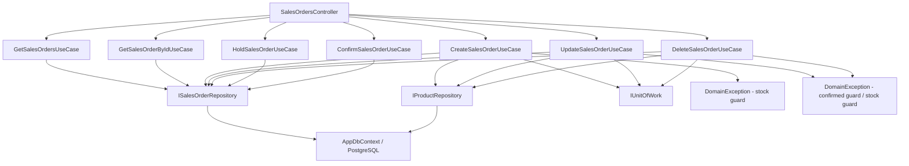

# Sales Orders — Feature Document (BE)

> **Jira:** — | **Branch:** `dev` | **Generated:** 2026-05-01 | **Last updated:** 2026-06-11

---

## PRD Summary

> API quản lý đơn hàng bán (Sales Orders) cho hệ thống Lamour Spa & Cosmetics.

- **Goal:** Cung cấp CRUD API đầy đủ cho module Bán Hàng, tự động điều chỉnh tồn kho khi tạo/sửa/xóa đơn, hỗ trợ treo đơn và xác nhận đơn.
- **User story:** As a Lamour admin, I want to manage sales orders via a REST API so that the WPF desktop client can create, hold, confirm, and track customer sales with automatic stock deduction.
- **Acceptance criteria:**
  - [x] `GET /api/v1/sales-orders` trả danh sách tất cả đơn hàng kèm lines
  - [x] `GET /api/v1/sales-orders/{id}` trả chi tiết một đơn hàng
  - [x] `POST /api/v1/sales-orders` tạo mới, trừ tồn kho cho từng line (ngoại trừ line khuyến mại)
  - [x] `PUT /api/v1/sales-orders/{id}` cập nhật, hoàn tồn kho cũ rồi trừ tồn kho mới
  - [x] `DELETE /api/v1/sales-orders/{id}` xóa, hoàn tồn kho về khi xóa
  - [x] `GET /api/v1/sales-orders/next-code` trả số chứng từ tiếp theo dạng `BC{5 digits}`
  - [x] `PUT /api/v1/sales-orders/{id}/hold` treo đơn (Status → Held)
  - [x] `PUT /api/v1/sales-orders/{id}/confirm` xác nhận đơn (Status → Confirmed; bất biến sau đó)
  - [x] Stock guard: kiểm tra tất cả sản phẩm trước khi trừ kho, gom tất cả lỗi rồi throw 1 lần
  - [x] DB transaction: Create/Update/Delete dùng `IUnitOfWork` — rollback khi lỗi
  - [x] Đơn đã Confirmed không thể sửa hoặc xóa

---

## Business Rules

| Rule | Description |
|------|-------------|
| Số chứng từ | Prefix `BC`, format `BC{5 digits}` (BC00001...) — sinh tại WPF client |
| Ít nhất 1 line | Đơn hàng phải có ít nhất 1 dòng chi tiết — `DomainException` nếu vi phạm |
| Hàng còn kinh doanh | Chỉ cho phép `IsActive = true` — `DomainException` nếu sản phẩm đã ngưng |
| Stock guard | Trước khi trừ kho: kiểm tra **tất cả** lines. Nếu bất kỳ sản phẩm nào không đủ kho → gom tất cả lỗi thành 1 message rồi throw `DomainException` — không dừng sớm |
| Trừ tồn kho | Khi tạo/cập nhật: trừ `StockQuantity` cho mỗi line không phải khuyến mại |
| Hoàn tồn kho | Khi sửa: hoàn tồn kho cũ trước, rồi trừ tồn kho mới |
| Hoàn tồn kho khi xóa | Khi xóa: hoàn toàn bộ tồn kho từ các line không phải khuyến mại |
| Line khuyến mại | `IsPromotion = true` → không trừ/hoàn tồn kho |
| Tỷ lệ chiết khấu | `DiscountRate` (0–100%) per line — BE clamp `Math.Max(0, Math.Min(100, dto.DiscountRate))` |
| Tính Thành tiền | `Amount = Quantity × UnitPrice × (1 − DiscountRate / 100)` — BE tính server-side, bỏ qua `amount` từ client |
| Denormalize | `ProductCode`, `ProductName` được copy vào line tại thời điểm tạo — không phụ thuộc sản phẩm sau này |
| DateTime UTC | Lưu `DateTime.UtcNow`, WPF convert sang local time khi hiển thị |
| TK mặc định | `ReceivableAccount = "131"`, `RevenueAccount = "511"` |
| Tổng tiền | `TotalAmount = SUM(line.Amount)` (net sau chiết khấu) tính tại BE |
| DB Transaction | Mỗi mutation UseCase dùng `IUnitOfWork.BeginAsync` → `CommitAsync` hoặc `RollbackAsync` |
| SalesOrderStatus | `Normal=0` (mặc định), `Held=1` (treo đơn), `Confirmed=2` (đã xác nhận — bất biến) |
| Immutability | Đơn `Confirmed` không thể sửa (`UpdateSalesOrderUseCase`) hoặc xóa (`DeleteSalesOrderUseCase`) — throw `DomainException` |
| Treo đơn | `HoldSalesOrderUseCase` → Status = Held. Nếu đã Confirmed → `DomainException` |
| Xác nhận đơn | `ConfirmSalesOrderUseCase` → Status = Confirmed. Nếu đã Confirmed → `DomainException` |

---

## Architecture Overview

### Key Components

| Layer | File | Role |
|-------|------|------|
| Controller | `Lamour.Api/Controllers/SalesOrdersController.cs` | HTTP entry point, 7 actions |
| Abstraction | `Lamour.Application/Abstractions/IUnitOfWork.cs` | DB transaction interface |
| Infrastructure | `Lamour.Infrastructure/Persistence/UnitOfWork.cs` | `IDbContextTransaction` implementation |
| UseCase | `UseCases/GetSalesOrdersUseCase.cs` | Fetch & map tất cả đơn hàng |
| UseCase | `UseCases/GetSalesOrderByIdUseCase.cs` | Fetch một đơn theo id |
| UseCase | `UseCases/GetNextSalesOrderCodeUseCase.cs` | Trả số chứng từ tiếp theo (lightweight, không JOIN) |
| UseCase | `UseCases/CreateSalesOrderUseCase.cs` | Stock guard → IUnitOfWork transaction → persist → trừ tồn kho |
| UseCase | `UseCases/UpdateSalesOrderUseCase.cs` | Confirmed guard → stock guard → IUnitOfWork → hoàn cũ → trừ mới |
| UseCase | `UseCases/DeleteSalesOrderUseCase.cs` | Confirmed guard → IUnitOfWork → hoàn kho → xóa |
| UseCase | `UseCases/HoldSalesOrderUseCase.cs` | Confirmed guard → Status = Held |
| UseCase | `UseCases/ConfirmSalesOrderUseCase.cs` | Already-confirmed guard → Status = Confirmed |
| Repository | `Repositories/ISalesOrderRepository.cs` | Data access contract |
| Repository | `Lamour.Infrastructure/Repositories/SalesOrderRepository.cs` | EF Core implementation |
| Entity | `Lamour.Domain/Entities/SalesOrder.cs` | Domain model + `SalesOrderStatus` enum |
| Config | `Lamour.Infrastructure/Persistence/Configurations/SalesOrderConfiguration.cs` | EF table mapping + `status` column |

### Data Flow

```
HTTP Request
  → SalesOrdersController (action method)
  → IXxxSalesOrderUseCase.ExecuteAsync()
  → IUnitOfWork.BeginAsync()                    ← transaction start (Create/Update/Delete)
  → ISalesOrderRepository (GetAllAsync / GetByIdAsync / AddAsync / UpdateAsync / DeleteAsync)
  → IProductRepository (GetByIdAsync / GetByIdTrackedAsync / UpdateAsync) — stock ops
  → AppDbContext (EF Core + PostgreSQL)
  → IUnitOfWork.CommitAsync()                   ← commit on success
  ← on error: IUnitOfWork.RollbackAsync()       ← rollback
  ← SalesOrder entity + Lines
  ← SalesOrderResponseDto (mapped in UseCase)
  ← IActionResult (Ok / Created / NoContent)
```



---

## Key Files & Symbols

### Domain
- [`Lamour.Domain/Entities/SalesOrder.cs`](../../../../Lamour.Domain/Entities/SalesOrder.cs) — Entity header + `SalesOrderStatus` enum (`Normal=0`, `Held=1`, `Confirmed=2`) + `Status` property (default `Normal`)
- [`Lamour.Domain/Entities/SalesOrderLine.cs`](../../../../Lamour.Domain/Entities/SalesOrder.cs) — Line (nested in same file): `ProductId`, `ProductCode`, `ProductName`, `IsPromotion`, `Unit`, `Quantity`, `UnitPrice`, `DiscountRate`, `Amount`, `ReceivableAccount`, `RevenueAccount`

### Application — Abstractions
- [`Lamour.Application/Abstractions/IUnitOfWork.cs`](../../../Abstractions/IUnitOfWork.cs) — `BeginAsync`, `CommitAsync`, `RollbackAsync` (CancellationToken ct = default)

### Infrastructure — UnitOfWork
- [`Lamour.Infrastructure/Persistence/UnitOfWork.cs`](../../../../Lamour.Infrastructure/Persistence/UnitOfWork.cs) — Wraps `IDbContextTransaction`; registered as `Scoped` in DI

### Application — Repositories
- [`Repositories/ISalesOrderRepository.cs`](../Repositories/ISalesOrderRepository.cs) — `GetAllAsync`, `GetByIdAsync`, `GetByIdTrackedAsync`, `AddAsync`, `UpdateAsync`, `DeleteAsync`, `SaveChangesAsync`, `GetNextCodeNumberAsync`

### Application — DTOs
- [`Dtos/SalesOrderResponseDto.cs`](../Dtos/SalesOrderResponseDto.cs) — Response: 19 fields snake_case + `lines[]` + `status` (int)
- [`Dtos/CreateSalesOrderRequestDto.cs`](../Dtos/CreateSalesOrderRequestDto.cs) — Create: 14 header fields + `lines[]`
- [`Dtos/UpdateSalesOrderRequestDto.cs`](../Dtos/UpdateSalesOrderRequestDto.cs) — Update: same shape as Create
- [`Dtos/SalesOrderLineDto.cs`](../Dtos/SalesOrderLineDto.cs) — Line: 12 fields (shared cho cả request và response); `discount_rate` (decimal, default 0)

### Application — UseCases
- [`UseCases/GetSalesOrdersUseCase.cs`](../UseCases/GetSalesOrdersUseCase.cs) — `ExecuteAsync()` → `IEnumerable<SalesOrderResponseDto>`; chứa `internal static MapToDto()` dùng chung (maps `Status`)
- [`UseCases/GetNextSalesOrderCodeUseCase.cs`](../UseCases/GetNextSalesOrderCodeUseCase.cs) — `ExecuteAsync()` → `string` (`BC00001`...)
- [`UseCases/GetSalesOrderByIdUseCase.cs`](../UseCases/GetSalesOrderByIdUseCase.cs) — `ExecuteAsync(id)` → `SalesOrderResponseDto?`
- [`UseCases/CreateSalesOrderUseCase.cs`](../UseCases/CreateSalesOrderUseCase.cs) — Stock guard (collect all errors) → `IUnitOfWork` transaction → `AddAsync` → trừ stock
- [`UseCases/UpdateSalesOrderUseCase.cs`](../UseCases/UpdateSalesOrderUseCase.cs) — Confirmed guard → stock guard → `IUnitOfWork` → hoàn stock cũ → trừ stock mới
- [`UseCases/DeleteSalesOrderUseCase.cs`](../UseCases/DeleteSalesOrderUseCase.cs) — Confirmed guard → `IUnitOfWork` → hoàn stock → xóa
- [`UseCases/HoldSalesOrderUseCase.cs`](../UseCases/HoldSalesOrderUseCase.cs) — `GetByIdTrackedAsync` → Confirmed guard → `Status = Held` → `SaveChangesAsync`
- [`UseCases/ConfirmSalesOrderUseCase.cs`](../UseCases/ConfirmSalesOrderUseCase.cs) — `GetByIdTrackedAsync` → already-confirmed guard → `Status = Confirmed` → `SaveChangesAsync`

### Infrastructure
- [`Lamour.Infrastructure/Repositories/SalesOrderRepository.cs`](../../../../Lamour.Infrastructure/Repositories/SalesOrderRepository.cs) — EF Core impl; `GetAllAsync` / `GetByIdAsync` dùng `AsNoTracking()` + `Include(Lines)`
- [`Lamour.Infrastructure/Persistence/Configurations/SalesOrderConfiguration.cs`](../../../../Lamour.Infrastructure/Persistence/Configurations/SalesOrderConfiguration.cs) — Table `sales_orders` + `sales_order_lines`; column `status` (`int`, default 0)

---

## API Contracts

| Method | Endpoint | Input | Output |
|--------|----------|-------|--------|
| `GET` | `/api/v1/sales-orders` | — | `SalesOrderResponseDto[]` |
| `GET` | `/api/v1/sales-orders/{id}` | — | `SalesOrderResponseDto` (200) / 404 |
| `GET` | `/api/v1/sales-orders/next-code` | — | `{ "code": "BC00006" }` (200) |
| `POST` | `/api/v1/sales-orders` | `CreateSalesOrderRequestDto` | `SalesOrderResponseDto` (201) |
| `PUT` | `/api/v1/sales-orders/{id}` | `UpdateSalesOrderRequestDto` | `SalesOrderResponseDto` (200) |
| `DELETE` | `/api/v1/sales-orders/{id}` | — | 204 No Content |
| `PUT` | `/api/v1/sales-orders/{id}/hold` | — | `SalesOrderResponseDto` (200) |
| `PUT` | `/api/v1/sales-orders/{id}/confirm` | — | `SalesOrderResponseDto` (200) |

### Request — Create / Update
```json
{
  "document_number": "BC00001",
  "accounting_date": "2026-05-01T00:00:00",
  "document_date": "2026-05-01T00:00:00",
  "customer_id": 1,
  "employee_id": 2,
  "description": "Bán hàng CHI NHI",
  "reference": null,
  "payment_terms": "TM/CK",
  "payment_due_days": 30,
  "payment_due_date": "2026-05-31T00:00:00",
  "notes": null,
  "delivery_method": null,
  "payment_method": "Tiền mặt",
  "lines": [
    {
      "product_id": 5,
      "product_code": "SP001",
      "product_name": "Kem dưỡng da",
      "is_promotion": false,
      "unit": "Hộp",
      "quantity": 2,
      "unit_price": 150000,
      "discount_rate": 10,
      "amount": 270000,
      "receivable_account": "131",
      "revenue_account": "511"
    }
  ]
}
```

### Response (includes `status`)
```json
{
  "id": 1,
  "document_number": "BC00001",
  "accounting_date": "2026-05-01T00:00:00Z",
  "document_date": "2026-05-01T00:00:00Z",
  "customer_id": 1,
  "customer_name": "CHI NHI",
  "employee_id": 2,
  "employee_name": "Nguyễn Văn A",
  "description": "Bán hàng CHI NHI",
  "reference": null,
  "payment_terms": "TM/CK",
  "payment_due_days": 30,
  "payment_due_date": "2026-05-31T00:00:00Z",
  "notes": null,
  "delivery_method": null,
  "payment_method": "Tiền mặt",
  "total_amount": 270000,
  "status": 0,
  "created_at": "2026-05-01T08:00:00Z",
  "lines": [ ... ]
}
```

`status` values: `0` = Normal, `1` = Held (Treo), `2` = Confirmed (Xác nhận)

---

## Stock Guard Pattern (2026-06-11)

All lines are validated **before** any mutation. Errors are collected into a list and thrown together:

```csharp
var stockErrors = new List<string>();
foreach (var dto in request.Lines)
{
    var product = await _productRepo.GetByIdAsync(dto.ProductId, ct);
    if (!dto.IsPromotion && product.StockQuantity < dto.Quantity)
        stockErrors.Add($"• {product.Name}: có {product.StockQuantity}, cần {dto.Quantity}");
}
if (stockErrors.Count > 0)
    throw new DomainException("Các sản phẩm không đủ tồn kho:\n" + string.Join("\n", stockErrors));
```

WPF nhận message này và hiển thị `MessageBox.Show(ex.Message, "Không thể ghi sổ", ...)`.

---

## IUnitOfWork Pattern (2026-06-11)

```csharp
// Lamour.Application/Abstractions/IUnitOfWork.cs
public interface IUnitOfWork
{
    Task BeginAsync(CancellationToken ct = default);
    Task CommitAsync(CancellationToken ct = default);
    Task RollbackAsync(CancellationToken ct = default);
}

// Usage in CreateSalesOrderUseCase / UpdateSalesOrderUseCase / DeleteSalesOrderUseCase
await _uow.BeginAsync(ct);
try
{
    // ... AddAsync / UpdateAsync / DeleteAsync + stock ops ...
    await _uow.CommitAsync(ct);
}
catch
{
    await _uow.RollbackAsync(ct);
    throw;
}
```

---

## Edge Cases & Error Handling

| Scenario | Expected Behavior | Handled? |
|----------|------------------|----------|
| `lines` rỗng | `DomainException` → 400 | ✅ |
| `product_id` không tồn tại | `DomainException` → 400 | ✅ |
| Sản phẩm đã ngưng (`IsActive = false`) | `DomainException` → 400 | ✅ |
| `id` không tồn tại (PUT/DELETE) | `DomainException` → 400 (cần đổi sang `NotFoundException` → 404) | ⚠️ |
| Tồn kho không đủ — 1 sản phẩm | `DomainException` với message riêng → 400 | ✅ |
| Tồn kho không đủ — nhiều sản phẩm | Gom tất cả lỗi → 1 `DomainException` → 400 | ✅ |
| Crash giữa chừng (nhiều SaveChanges) | `IUnitOfWork` rollback toàn bộ transaction | ✅ |
| Sửa/xóa đơn đã Confirmed | `DomainException("Không thể chỉnh sửa/xóa đơn đã xác nhận.")` → 400 | ✅ |
| Treo đơn đã Confirmed | `DomainException` → 400 | ✅ |
| Xác nhận đơn đã Confirmed | `DomainException` → 400 | ✅ |
| Database unreachable | `GlobalExceptionHandler` → 500 | ✅ |
| `document_number` trùng | PostgreSQL unique constraint → 500 | ⚠️ Cần handle |

---

## Known Issues

| # | Severity | Mô tả | Fix |
|---|---|---|---|
| ~~1~~ | ~~🔴 Critical~~ | ~~Không có stock guard — `StockQuantity` có thể âm~~ | ✅ **Fixed 2026-06-11** — collect-all-errors guard |
| ~~2~~ | ~~🔴 Critical~~ | ~~Không có DB transaction — nhiều `SaveChanges` riêng biệt~~ | ✅ **Fixed 2026-06-11** — `IUnitOfWork` pattern |
| 3 | 🟠 High | `DomainException` cho not-found trong Update/Delete → trả về 400 thay vì 404 | Đổi sang `NotFoundException` |
| ~~4~~ | ~~🟠 High~~ | ~~Không có trường `Status` — không phân biệt Draft/Confirmed~~ | ✅ **Fixed 2026-06-11** — `SalesOrderStatus` enum |
| 5 | 🟡 Medium | `MapToDto` đặt trong `GetSalesOrdersUseCase` nhưng được gọi bởi UseCase khác | Extract sang `SalesOrderMapper` static class |
| 6 | 🟡 Medium | N+1 trong stock loop: load product trong validate loop, rồi load lại khi trừ | Cache vào `Dictionary<int, Product>` |

---

## DI Registration (`Program.cs`)

```csharp
// ── UnitOfWork ────────────────────────────────────────────────────────────────
builder.Services.AddScoped<IUnitOfWork, UnitOfWork>();

// ── Sales DI ──────────────────────────────────────────────────────────────────
builder.Services.AddScoped<ISalesOrderRepository, SalesOrderRepository>();
builder.Services.AddScoped<IGetSalesOrdersUseCase, GetSalesOrdersUseCase>();
builder.Services.AddScoped<IGetSalesOrderByIdUseCase, GetSalesOrderByIdUseCase>();
builder.Services.AddScoped<IGetNextSalesOrderCodeUseCase, GetNextSalesOrderCodeUseCase>();
builder.Services.AddScoped<ICreateSalesOrderUseCase, CreateSalesOrderUseCase>();
builder.Services.AddScoped<IUpdateSalesOrderUseCase, UpdateSalesOrderUseCase>();
builder.Services.AddScoped<IDeleteSalesOrderUseCase, DeleteSalesOrderUseCase>();
builder.Services.AddScoped<IHoldSalesOrderUseCase, HoldSalesOrderUseCase>();
builder.Services.AddScoped<IConfirmSalesOrderUseCase, ConfirmSalesOrderUseCase>();
```

---

## EF Migration

```bash
export PATH="$PATH:$HOME/.dotnet/tools"
dotnet ef migrations add SalesOrdersCreate \
  --project src/Lamour.Infrastructure \
  --startup-project src/Lamour.Api
dotnet ef database update \
  --project src/Lamour.Infrastructure \
  --startup-project src/Lamour.Api
```

Tables created: `sales_orders`, `sales_order_lines`

**Migration 2 — `AddDiscountRateToSalesOrderLines` (2026-05-01):**
Column added: `discount_rate numeric(5,2) NOT NULL DEFAULT 0`

**Migration 3 — `RenameSalesOrderColumnsToSnakeCase` (2026-05-23):**
Renamed tất cả 17 cột `sales_orders` + 13 cột `sales_order_lines` từ PascalCase → snake_case.
Root cause: thiếu `HasColumnName()` trong `SalesOrderConfiguration`.

**Migration 4 — `SalesOrderStatus` (2026-06-11):**
```bash
dotnet ef migrations add SalesOrderStatus \
  --project src/Lamour.Infrastructure \
  --startup-project src/Lamour.Api
dotnet ef database update \
  --project src/Lamour.Infrastructure \
  --startup-project src/Lamour.Api
```
Column added: `status int NOT NULL DEFAULT 0` trên bảng `sales_orders`.

---

## Test Coverage Notes

| Component | Test File | Coverage |
|-----------|-----------|----------|
| `GetSalesOrdersUseCase` | — | ❌ Missing |
| `CreateSalesOrderUseCase` | — | ❌ Missing |
| `UpdateSalesOrderUseCase` | — | ❌ Missing |
| `DeleteSalesOrderUseCase` | — | ❌ Missing |
| `HoldSalesOrderUseCase` | — | ❌ Missing |
| `ConfirmSalesOrderUseCase` | — | ❌ Missing |
| `SalesOrderRepository` | — | ❌ Missing |

**Suggested test cases:**
- [ ] Create: `lines` rỗng → `DomainException`
- [ ] Create: `product_id` không tồn tại → `DomainException`
- [ ] Create: sản phẩm ngưng kinh doanh → `DomainException`
- [ ] Create: `is_promotion = true` → tồn kho không thay đổi
- [ ] Create: `is_promotion = false` → tồn kho giảm đúng số lượng
- [ ] Create: 2 sản phẩm không đủ kho → message gom cả 2 lỗi
- [ ] Create: lỗi giữa transaction → rollback, không có gì thay đổi trong DB
- [ ] Update: Confirmed đơn → `DomainException`
- [ ] Delete: Confirmed đơn → `DomainException`
- [ ] Hold: Confirmed đơn → `DomainException`
- [ ] Confirm: đã Confirmed → `DomainException`
- [ ] Confirm: Normal → Status = 2 trong DB
- [ ] Update: id không tồn tại → NotFoundException (sau khi fix)
- [ ] Delete: tồn kho được hoàn lại

---

## Notes

- `[Authorize]` đang bật trên controller — WPF cần gửi Bearer JWT
- `SalesOrderLine` được lưu trong cùng file với `SalesOrder` entity
- `SalesOrderLineConfiguration` đặt trong cùng file với `SalesOrderConfiguration`
- `IProductRepository.GetByIdTrackedAsync` được dùng cho stock mutation (tracked update)
- `GET /api/v1/sales-orders/next-code` là endpoint lightweight — chỉ query cột `document_number`
- `IUnitOfWork` inject vào Application layer (không phụ thuộc EF Core types)

---

*Generated by `/ct-ai-document` on 2026-05-01*
*Updated 2026-05-01: thêm DiscountRate per line, đổi prefix BH → BC*
*Updated 2026-05-23: thêm `GET next-code` endpoint + `GetNextSalesOrderCodeUseCase`; migration 3 rename columns sang snake_case; cập nhật DI*
*Updated 2026-06-11: thêm stock guard (collect-all-errors), IUnitOfWork DB transaction, SalesOrderStatus enum (Normal/Held/Confirmed), Hold/Confirm endpoints, Confirmed immutability; migration 4 SalesOrderStatus; cập nhật DI*
