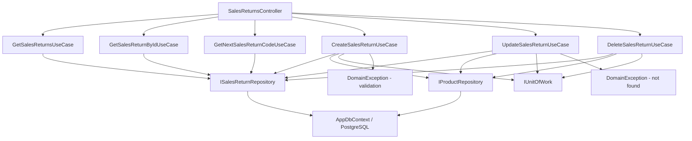

# Sales Returns — Feature Document (BE)

> **Jira:** — | **Branch:** `dev` | **Generated:** 2026-06-13 | **Last updated:** 2026-08-31

---

## PRD Summary

> API quản lý chứng từ hàng bán bị trả lại (Sales Return Documents) cho hệ thống Lamour Spa & Cosmetics.

- **Goal:** Cung cấp CRUD API cho module Chứng từ hàng bán bị trả lại, với workflow Draft/Confirmed ("Ghi sổ"/"Bỏ ghi") — tồn kho chỉ bị tác động khi Confirm, không phải khi Create.
- **User story:** As a Lamour admin, I want to manage sales return documents via a REST API so that the WPF desktop client can create, update, delete, and confirm/unconfirm return records with stock restoration happening only on confirmation.
- **Acceptance criteria:**
  - [x] `GET /api/v1/sales-returns` trả danh sách tất cả chứng từ kèm lines
  - [x] `GET /api/v1/sales-returns/{id}` trả chi tiết một chứng từ
  - [x] `POST /api/v1/sales-returns` tạo mới ở trạng thái `Draft` — KHÔNG tác động tồn kho
  - [x] `PUT /api/v1/sales-returns/{id}` cập nhật — chỉ cho phép khi `Draft`, replace toàn bộ lines, không tính lại tồn kho
  - [x] `DELETE /api/v1/sales-returns/{id}` xóa — chỉ cho phép khi `Draft`, không cần hoàn tác tồn kho
  - [x] `POST /api/v1/sales-returns/{id}/confirm` ("Ghi sổ") — cộng tồn kho cho từng line, chuyển `Draft` → `Confirmed`
  - [x] `POST /api/v1/sales-returns/{id}/unconfirm` ("Bỏ ghi") — trừ lại tồn kho (two-pass validate trước), chuyển `Confirmed` → `Draft`
  - [x] `GET /api/v1/sales-returns/next-code` trả số chứng từ tiếp theo dạng `BTL{5 digits}`
  - [x] `return_type` lưu vào DB: 0=GiảmTrừCôngNợ, 1=TrảLạiTiềnMặt
  - [x] DB transaction: Create/Update/Delete/Confirm/Unconfirm dùng `IUnitOfWork` — rollback khi lỗi
  - [x] Status/Confirm workflow: `SalesReturnStatus.Draft=0`, `Confirmed=1` — mirror `WarehouseReceiptStatus`

---

## Business Rules

| Rule | Description |
|------|-------------|
| Số chứng từ | Prefix `BTL`, format `BTL{5 digits}` (BTL00001...) — sinh tại WPF client |
| Ít nhất 1 line | Chứng từ phải có ít nhất 1 dòng chi tiết — `DomainException` nếu vi phạm |
| Hàng còn kinh doanh | Chỉ cho phép `IsActive = true` — `DomainException` nếu sản phẩm đã ngưng |
| Tính Amount | `Amount = Quantity × UnitPrice` (gross — trước chiết khấu) |
| Tính DiscountAmount | `DiscountAmount = Amount × DiscountRate / 100` — BE clamp `Math.Max(0, Math.Min(100, rate))` |
| Tổng tiền | `TotalAmount = SUM(line.Amount)`, `TotalDiscount = SUM(line.DiscountAmount)`, `TotalPayment = TotalAmount − TotalDiscount` |
| Trạng thái | `Draft` (mặc định khi tạo) → `Confirmed` (sau khi Ghi sổ) → có thể Bỏ ghi về lại `Draft` |
| Ghi sổ (Confirm) | Cộng `StockQuantity` cho mỗi line — chỉ cho phép khi đang `Draft` |
| Bỏ ghi (Unconfirm) | Trừ lại `StockQuantity` cho mỗi line — chỉ cho phép khi đang `Confirmed`; two-pass validate tồn kho đủ trước khi trừ |
| Sửa chứng từ | Chỉ cho phép khi `Draft` — `DomainException` nếu đã `Confirmed` (phải Bỏ ghi trước) |
| Xóa chứng từ | Chỉ cho phép khi `Draft` — `DomainException` nếu đã `Confirmed` (phải Bỏ ghi trước) |
| Denormalize | `ProductCode`, `ProductName` được copy vào line tại thời điểm tạo |
| TK mặc định | `ReturnAccount = "5212"`, `DebtAccount = "131"`, `DiscountAccount = "5211"` |
| return_type | `ReduceDebt = 0` (Giảm trừ công nợ), `CashRefund = 1` (Trả lại tiền mặt) |
| DateTime UTC | Lưu `DateTime.UtcNow`, WPF convert sang local time khi hiển thị |
| DB Transaction | Mỗi mutation UseCase (Create/Update/Delete/Confirm/Unconfirm) dùng `IUnitOfWork.BeginAsync` → `CommitAsync` hoặc `RollbackAsync` |

---

## Architecture Overview

### Key Components

| Layer | File | Role |
|-------|------|------|
| Controller | [`Lamour.Api/Controllers/SalesReturnsController.cs`](../../../../Lamour.Api/Controllers/SalesReturnsController.cs) | HTTP entry point, 8 actions (incl. confirm/unconfirm) |
| Abstraction | [`Lamour.Application/Abstractions/IUnitOfWork.cs`](../../../Abstractions/IUnitOfWork.cs) | DB transaction interface |
| Infrastructure | [`Lamour.Infrastructure/Persistence/UnitOfWork.cs`](../../../../Lamour.Infrastructure/Persistence/UnitOfWork.cs) | `IDbContextTransaction` implementation |
| UseCase | [`UseCases/GetSalesReturnsUseCase.cs`](../UseCases/GetSalesReturnsUseCase.cs) | Fetch & map tất cả chứng từ; chứa `internal static MapToDto()` |
| UseCase | [`UseCases/GetSalesReturnByIdUseCase.cs`](../UseCases/GetSalesReturnByIdUseCase.cs) | Fetch một chứng từ theo id |
| UseCase | [`UseCases/GetNextSalesReturnCodeUseCase.cs`](../UseCases/GetNextSalesReturnCodeUseCase.cs) | Trả số chứng từ tiếp theo (BTL00001...) |
| UseCase | [`UseCases/CreateSalesReturnUseCase.cs`](../UseCases/CreateSalesReturnUseCase.cs) | Validate products → IUnitOfWork → persist → cộng tồn kho |
| UseCase | [`UseCases/UpdateSalesReturnUseCase.cs`](../UseCases/UpdateSalesReturnUseCase.cs) | IUnitOfWork → hoàn kho cũ → cộng kho mới |
| UseCase | [`UseCases/DeleteSalesReturnUseCase.cs`](../UseCases/DeleteSalesReturnUseCase.cs) | IUnitOfWork → trừ kho lại → xóa |
| Repository | [`Repositories/ISalesReturnRepository.cs`](../Repositories/ISalesReturnRepository.cs) | Data access contract |
| Repository | [`Lamour.Infrastructure/Repositories/SalesReturnRepository.cs`](../../../../Lamour.Infrastructure/Repositories/SalesReturnRepository.cs) | EF Core implementation |
| Entity | [`Lamour.Domain/Entities/SalesReturn.cs`](../../../../Lamour.Domain/Entities/SalesReturn.cs) | `SalesReturn` + `SalesReturnLine` + `SalesReturnType` enum |
| Config | [`Lamour.Infrastructure/Persistence/Configurations/SalesReturnConfiguration.cs`](../../../../Lamour.Infrastructure/Persistence/Configurations/SalesReturnConfiguration.cs) | EF table mapping — `sales_returns` + `sales_return_lines` |

### Data Flow

```
HTTP Request
  → SalesReturnsController (action method)
  → IXxxSalesReturnUseCase.ExecuteAsync()
  → IUnitOfWork.BeginAsync()                     ← transaction start (Create/Update/Delete)
  → ISalesReturnRepository (GetAllAsync / GetByIdAsync / AddAsync / UpdateAsync / DeleteAsync)
  → IProductRepository (GetByIdAsync / GetByIdTrackedAsync / UpdateAsync) — stock ops
  → AppDbContext (EF Core + PostgreSQL)
  → IUnitOfWork.CommitAsync()                    ← commit on success
  ← on error: IUnitOfWork.RollbackAsync()        ← rollback
  ← SalesReturn entity + Lines
  ← SalesReturnResponseDto (mapped in GetSalesReturnsUseCase.MapToDto)
  ← IActionResult (Ok / Created / NoContent)
```



---

## Key Files & Symbols

### Domain
- [`Lamour.Domain/Entities/SalesReturn.cs`](../../../../Lamour.Domain/Entities/SalesReturn.cs) — `SalesReturn` entity + `SalesReturnLine` entity + `SalesReturnType` enum (`ReduceDebt=0`, `CashRefund=1`)

### Application — Repositories
- [`Repositories/ISalesReturnRepository.cs`](../Repositories/ISalesReturnRepository.cs) — `GetAllAsync`, `GetByIdAsync`, `GetByIdTrackedAsync`, `AddAsync`, `UpdateAsync`, `DeleteAsync`, `SaveChangesAsync`, `GetNextCodeNumberAsync`

### Application — DTOs
- [`Dtos/SalesReturnResponseDto.cs`](../Dtos/SalesReturnResponseDto.cs) — Response: 15 header fields snake_case + `lines[]`
- [`Dtos/CreateSalesReturnRequestDto.cs`](../Dtos/CreateSalesReturnRequestDto.cs) — Create: 9 header fields + `lines[]`
- [`Dtos/UpdateSalesReturnRequestDto.cs`](../Dtos/UpdateSalesReturnRequestDto.cs) — Update: same shape as Create
- [`Dtos/SalesReturnLineDto.cs`](../Dtos/SalesReturnLineDto.cs) — Line: 14 fields (shared cho cả request và response)

### Application — UseCases
- [`UseCases/GetSalesReturnsUseCase.cs`](../UseCases/GetSalesReturnsUseCase.cs) — `ExecuteAsync()` → `IEnumerable<SalesReturnResponseDto>`; chứa `internal static MapToDto()` dùng chung
- [`UseCases/GetNextSalesReturnCodeUseCase.cs`](../UseCases/GetNextSalesReturnCodeUseCase.cs) — `ExecuteAsync()` → `string` (`BTL00001`...)
- [`UseCases/GetSalesReturnByIdUseCase.cs`](../UseCases/GetSalesReturnByIdUseCase.cs) — `ExecuteAsync(id)` → `SalesReturnResponseDto?`
- [`UseCases/CreateSalesReturnUseCase.cs`](../UseCases/CreateSalesReturnUseCase.cs) — Validate products → `IUnitOfWork` transaction → `AddAsync` → cộng stock
- [`UseCases/UpdateSalesReturnUseCase.cs`](../UseCases/UpdateSalesReturnUseCase.cs) — `IUnitOfWork` → hoàn kho cũ → cộng kho mới
- [`UseCases/DeleteSalesReturnUseCase.cs`](../UseCases/DeleteSalesReturnUseCase.cs) — `IUnitOfWork` → trừ kho → xóa

### Infrastructure
- [`Lamour.Infrastructure/Repositories/SalesReturnRepository.cs`](../../../../Lamour.Infrastructure/Repositories/SalesReturnRepository.cs) — EF Core impl; `GetAllAsync` / `GetByIdAsync` dùng `AsNoTracking()` + `Include(Lines)`
- [`Lamour.Infrastructure/Persistence/Configurations/SalesReturnConfiguration.cs`](../../../../Lamour.Infrastructure/Persistence/Configurations/SalesReturnConfiguration.cs) — Table `sales_returns` + `sales_return_lines`; unique index trên `document_number`

---

## API Contracts

| Method | Endpoint | Input | Output |
|--------|----------|-------|--------|
| `GET` | `/api/v1/sales-returns` | — | `SalesReturnResponseDto[]` |
| `GET` | `/api/v1/sales-returns/{id}` | — | `SalesReturnResponseDto` (200) / 404 |
| `GET` | `/api/v1/sales-returns/next-code` | — | `{ "code": "BTL00006" }` (200) |
| `POST` | `/api/v1/sales-returns` | `CreateSalesReturnRequestDto` | `SalesReturnResponseDto` (201) |
| `PUT` | `/api/v1/sales-returns/{id}` | `UpdateSalesReturnRequestDto` | `SalesReturnResponseDto` (200) |
| `DELETE` | `/api/v1/sales-returns/{id}` | — | 204 No Content |
| `POST` | `/api/v1/sales-returns/{id}/confirm` | — | `SalesReturnResponseDto` (200) — "Ghi sổ" |
| `POST` | `/api/v1/sales-returns/{id}/unconfirm` | — | `SalesReturnResponseDto` (200) — "Bỏ ghi" |

### Request — Create / Update
```json
{
  "document_number": "BTL00001",
  "accounting_date": "2026-06-13T00:00:00",
  "document_date": "2026-06-13T00:00:00",
  "customer_id": 1,
  "employee_id": 7,
  "description": "Thu hồi HD 15695 ngày 24/6",
  "reference": null,
  "return_type": 0,
  "lines": [
    {
      "product_id": 36,
      "product_code": "SP036",
      "product_name": "Bubble Cleanser",
      "return_account": "5212",
      "debt_account": "131",
      "discount_account": "5211",
      "unit": "Chai",
      "quantity": 10,
      "unit_price": 450000,
      "amount": 4500000,
      "discount_rate": 35,
      "discount_amount": 1575000,
      "sales_order_number": "XK00046"
    }
  ]
}
```

### Response
```json
{
  "id": 1,
  "document_number": "BTL00001",
  "accounting_date": "2026-06-13T00:00:00Z",
  "document_date": "2026-06-13T00:00:00Z",
  "customer_id": 1,
  "customer_name": "PHAN THỊ BÍCH LIỀU",
  "employee_id": 7,
  "employee_name": "Nguyễn Văn A",
  "description": "Thu hồi HD 15695 ngày 24/6",
  "reference": null,
  "return_type": 0,
  "total_amount": 4500000,
  "total_discount": 1575000,
  "total_payment": 2925000,
  "created_at": "2026-06-13T08:00:00Z",
  "status": "Draft",
  "confirmed_at": null,
  "lines": [ ... ]
}
```

`status`: `"Draft"` | `"Confirmed"` (string — cùng convention `Status.ToString()` như `PaymentResponseDto`/`WarehouseReceiptResponseDto`, không phải số nguyên).

`return_type` values: `0` = GiảmTrừCôngNợ, `1` = TrảLạiTiềnMặt

---

## Stock Restoration Pattern

> **Đã đổi (2026-08-31):** Trước đây SalesReturn cộng kho ngay khi Create (và hoàn tác khi
> Update/Delete). Nay stock effect **chỉ xảy ra khi Confirm/Unconfirm** — giống hệt pattern của
> `WarehouseReceipt`/`Payment`. Create/Update/Delete không còn đụng tới `StockQuantity` nữa.

Ngược với SalesOrder (trừ kho khi tạo), SalesReturn **cộng kho khi Confirm** ("Ghi sổ"):

```csharp
// ConfirmSalesReturnUseCase — cộng kho (chỉ cho phép khi đang Draft)
foreach (var line in salesReturn.Lines)
{
    var product = await _productRepo.GetByIdTrackedAsync(line.ProductId, ct);
    if (product is not null)
    {
        product.StockQuantity += line.Quantity;  // ← cộng
        await _productRepo.UpdateAsync(product, ct);
    }
    await _stockRepo.AdjustQuantityAsync(line.ProductId, line.WarehouseId, line.Quantity, ct);
}
salesReturn.Status      = SalesReturnStatus.Confirmed;
salesReturn.ConfirmedAt = DateTime.UtcNow;

// UnconfirmSalesReturnUseCase — trừ lại kho (chỉ cho phép khi đang Confirmed)
// Two-pass: validate tồn đủ cho TẤT CẢ lines trước, rồi mới trừ — tránh trừ dở dang
foreach (var line in salesReturn.Lines)
{
    var product = await _productRepo.GetByIdTrackedAsync(line.ProductId, ct);
    if (product.StockQuantity < line.Quantity)
        throw new DomainException($"Không thể bỏ ghi vì tồn kho hiện tại của hàng hóa '{product.Name}' không đủ để hoàn tác...");
}
foreach (var line in salesReturn.Lines)
{
    var product = await _productRepo.GetByIdTrackedAsync(line.ProductId, ct);
    product.StockQuantity -= line.Quantity;  // ← trừ lại
    await _productRepo.UpdateAsync(product, ct);
    await _stockRepo.AdjustQuantityAsync(line.ProductId, line.WarehouseId, -line.Quantity, ct);
}
salesReturn.Status      = SalesReturnStatus.Draft;
salesReturn.ConfirmedAt = null;
```

Create/Update/Delete không còn thao tác tồn kho:
- **Create** — tạo mới, `Status = Draft` (property default), không cộng kho.
- **Update** — chỉ cho phép khi `Draft` (`DomainException` nếu `Confirmed`); replace toàn bộ `Lines` (Clear + Add), không tính lại tồn kho vì Draft chưa từng tác động kho.
- **Delete** — chỉ cho phép khi `Draft` (`DomainException` nếu `Confirmed`); không cần hoàn tác tồn kho.

---

## IUnitOfWork Pattern

```csharp
await _uow.BeginAsync(ct);
try
{
    // ... AddAsync / UpdateAsync / DeleteAsync + stock ops ...
    await _uow.CommitAsync(ct);
}
catch
{
    await _uow.RollbackAsync(ct);
    throw;
}
```

---

## Edge Cases & Error Handling

| Scenario | Expected Behavior | Handled? |
|----------|------------------|----------|
| `lines` rỗng | `DomainException` → 400 | ✅ |
| `product_id` không tồn tại | `DomainException` → 400 | ✅ |
| Sản phẩm đã ngưng (`IsActive = false`) | `DomainException` → 400 | ✅ |
| `id` không tồn tại (PUT/DELETE) | `DomainException` → 400 | ⚠️ Nên đổi sang `NotFoundException` → 404 |
| Crash giữa chừng (nhiều SaveChanges) | `IUnitOfWork` rollback toàn bộ transaction | ✅ |
| `document_number` trùng | PostgreSQL unique constraint → 500 | ⚠️ Cần handle |
| `discount_rate` ngoài 0–100 | BE clamp `Math.Max(0, Math.Min(100, rate))` | ✅ |
| Database unreachable | `GlobalExceptionHandler` → 500 | ✅ |

---

## DI Registration (`Program.cs`)

```csharp
// ── SalesReturn DI ────────────────────────────────────────────────────────────
builder.Services.AddScoped<ISalesReturnRepository, SalesReturnRepository>();
builder.Services.AddScoped<IGetSalesReturnsUseCase, GetSalesReturnsUseCase>();
builder.Services.AddScoped<IGetSalesReturnByIdUseCase, GetSalesReturnByIdUseCase>();
builder.Services.AddScoped<IGetNextSalesReturnCodeUseCase, GetNextSalesReturnCodeUseCase>();
builder.Services.AddScoped<ICreateSalesReturnUseCase, CreateSalesReturnUseCase>();
builder.Services.AddScoped<IUpdateSalesReturnUseCase, UpdateSalesReturnUseCase>();
builder.Services.AddScoped<IDeleteSalesReturnUseCase, DeleteSalesReturnUseCase>();
builder.Services.AddScoped<IConfirmSalesReturnUseCase, ConfirmSalesReturnUseCase>();
builder.Services.AddScoped<IUnconfirmSalesReturnUseCase, UnconfirmSalesReturnUseCase>();
```

---

## EF Migration

```bash
export PATH="$PATH:$HOME/.dotnet/tools"
dotnet ef migrations add SalesReturnCreate \
  --project src/Lamour.Infrastructure \
  --startup-project src/Lamour.Api
dotnet ef database update \
  --project src/Lamour.Infrastructure \
  --startup-project src/Lamour.Api
```

Tables created: `sales_returns`, `sales_return_lines`

**Migration — `SalesReturnCreate` (2026-06-13):**
- `sales_returns`: `id`, `document_number` (unique), `accounting_date`, `document_date`, `customer_id` (FK restrict), `employee_id` (FK set null), `description`, `reference`, `return_type` (int, default 0), `total_amount`, `total_discount`, `total_payment`, `created_at`
- `sales_return_lines`: `id`, `sales_return_id` (FK cascade), `product_id` (FK restrict), `product_code`, `product_name`, `return_account`, `debt_account`, `discount_account`, `unit`, `quantity`, `unit_price`, `amount`, `discount_rate` (default 0), `discount_amount`, `sales_order_number`

---

## WPF Client Integration

Module: `Features/HomePage/SalesReturn/`

| Layer | Files |
|-------|-------|
| DTOs | `Data/Services/Dtos/SalesReturnResponseDto.cs`, `SalesReturnLineDto.cs`, `CreateSalesReturnRequestDto.cs`, `UpdateSalesReturnRequestDto.cs` |
| Service | `Data/Services/ISalesReturnService.cs` + `SalesReturnService.cs` (typed HttpClient) |
| Repository | `Data/Repositories/ISalesReturnRepository.cs` + `SalesReturnRepository.cs` |
| Domain model | `Domain/Models/SalesReturnListItem.cs` — `ReturnTypeLabel` display |
| UseCases | `Domain/UseCases/` — Get, GetNextCode, Create, Update, Delete |

DI registered in `HomeServiceCollectionExtensions.cs` with `AddHttpClient<ISalesReturnService, SalesReturnService>`.

> **2026-08-28**: popup `SalesReturnWindow` trải qua redesign toàn diện (layout theo ảnh mẫu MISA, workflow "Ghi sổ → In Hoá Đơn" tự động, workflow "Lập PN → In Phiếu Nhập Kho", loạt fix bug "dòng trống vẫn hiện dữ liệu mặc định", fix "NV bán hàng" không tự liên kết) — thuần WPF-side, không đổi API contract nào ở trên. Xem doc riêng mới tạo: [`desktop-lamour/.../SalesReturn/docs/sales-return.md`](../../../../../../desktop-lamour/src/DesktopLamour/Features/HomePage/SalesReturn/docs/sales-return.md).

> **2026-08-31**: Thêm Draft/Confirmed status workflow cho BE (mirror `WarehouseReceiptStatus`) —
> `SalesReturnStatus.Draft=0` / `Confirmed=1` + `ConfirmedAt`, 2 endpoint mới `POST
> /api/v1/sales-returns/{id}/confirm` ("Ghi sổ") và `POST /api/v1/sales-returns/{id}/unconfirm`
> ("Bỏ ghi"). Stock effect (`StockQuantity += / -= line.Quantity`) chuyển từ Create sang Confirm;
> Update/Delete giờ yêu cầu `Status == Draft` (`DomainException` nếu đã Confirmed — phải Bỏ ghi
> trước). Rows đã tồn tại trước migration được backfill là `Confirmed` qua column-level default
> của EF migration (`HasDefaultValue(SalesReturnStatus.Confirmed)` + `HasSentinel(-1)` — xem comment
> trong `SalesReturnConfiguration.cs`), vì chúng đã được cộng kho tại thời điểm Create theo hành vi
> cũ — không cần fix data thủ công. Migration: `SalesReturnStatus`
> (`src/Lamour.Infrastructure/Migrations/`).

---

## Test Coverage Notes

| Component | Test File | Coverage |
|-----------|-----------|----------|
| `GetSalesReturnsUseCase` | — | ❌ Missing |
| `CreateSalesReturnUseCase` | — | ❌ Missing |
| `UpdateSalesReturnUseCase` | — | ❌ Missing |
| `DeleteSalesReturnUseCase` | — | ❌ Missing |
| `SalesReturnRepository` | — | ❌ Missing |

**Suggested test cases:**
- [ ] Create: `lines` rỗng → `DomainException`
- [ ] Create: `product_id` không tồn tại → `DomainException`
- [ ] Create: sản phẩm ngưng kinh doanh → `DomainException`
- [ ] Create: tạo thành công → `StockQuantity` tăng đúng số lượng
- [ ] Create: lỗi giữa transaction → rollback, stock không thay đổi
- [ ] Update: hoàn kho cũ + cộng kho mới đúng
- [ ] Delete: `StockQuantity` giảm lại đúng số lượng đã hoàn
- [ ] Delete: id không tồn tại → DomainException

---

## Notes

- `[Authorize]` tạm bỏ comment trên controller — TODO: restore khi WPF auth flow được wired
- `SalesReturnLine` và `SalesReturnLineConfiguration` đặt trong cùng file với entity cha
- `MapToDto` static helper đặt trong `GetSalesReturnsUseCase` — dùng chung bởi các UseCase khác
- Khác với SalesOrder: không có `IsPromotion` flag — tất cả lines đều ảnh hưởng tồn kho
- `Amount` = gross (qty × price), khác với SalesOrder nơi `Amount` = net (sau CK)
- `Số CT bán hàng` (`sales_order_number`) là free-text per line — không có FK ràng buộc với bảng `sales_orders`

---

*Generated by `/ct-ai-document` on 2026-06-13*
*Sources: local codebase only (no Jira/Confluence — MCP unavailable on this project)*
