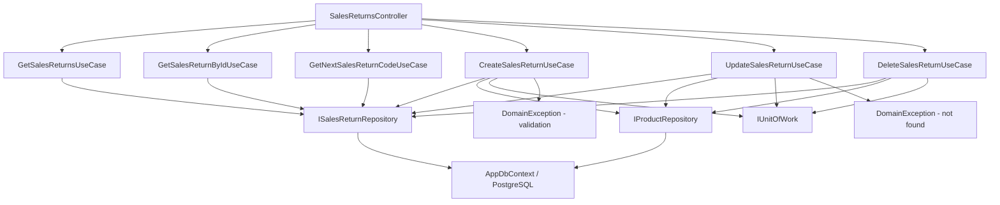

# Sales Returns — Feature Document (BE)

> **Jira:** — | **Branch:** `dev` | **Generated:** 2026-06-13 | **Last updated:** 2026-09-11 (cùng
> ngày, mục mới nhất) — **gộp "Nháp" (Draft) và "Treo" (Held) thành 1 trạng thái duy nhất "Treo"**,
> theo yêu cầu, sau khi rà code xác nhận không còn guard nghiệp vụ nào (BE lẫn WPF) phân biệt 2 giá
> trị này — chỉ khác label hiển thị. Áp dụng đồng bộ cho cả SalesOrder — xem "Update — 2026-09-11:
> gộp Nháp + Treo thành 1" ngay dưới. Trước đó cùng ngày: bug `GetSalesReturnsUseCase.MapToDto` thiếu
> field `WarehouseId` (API luôn trả `warehouse_id: 0`) — xem "Bug fix — 2026-09-11: warehouse_id
> luôn trả về 0...". Trước đó cùng ngày: **ĐẢO NGƯỢC quyết định 2026-09-10**: "Cất" = "Ghi sổ" ngay
> (1 lần bấm, không còn qua Treo trung gian) — xem "Update — 2026-09-11: Cất = Ghi sổ ngay". Trước
> đó cùng ngày: export HTML tĩnh của Review Artifact + đánh dấu điểm xác nhận #3 đã fix; 2026-09-09
> thêm validate Kho tồn tại ở Create/Update.

---

## Update — 2026-09-11: gộp "Nháp" (Draft) và "Treo" (Held) thành 1 trạng thái duy nhất "Treo"

Theo yêu cầu ("gộp status nháp & treo thành 1"), xác nhận phạm vi qua nhiều vòng `AskUserQuestion`
sau khi rà toàn bộ code (BE + WPF) để chắc chắn không bỏ sót chỗ nào thật sự còn phân biệt 2 trạng
thái này. Kết quả rà: **BE không có bất kỳ guard nào từng check `Status == Held` hay
`Status == Draft` riêng lẻ** — mọi UseCase chỉ dựa vào `== Confirmed`/`!= Confirmed`; Held và Draft
đã được đối xử giống hệt nhau trong mọi rule nghiệp vụ từ trước (chỉ khác label hiển thị ở WPF).

**Quyết định đã xác nhận:**
- Tên gọi chung: **"Treo"** (bỏ hẳn chữ "Nháp") — khác với đề xuất ban đầu của AI ("Nháp"), user chọn
  giữ "Treo".
- Dữ liệu cũ: **migrate hẳn** (không chỉ gộp ở tầng hiển thị) — 3 chứng từ đang Draft trong DB được
  chuyển sang Held qua migration mới, không giữ giá trị Draft nào trong DB nữa.
- Phạm vi: áp dụng đồng bộ cho **cả SalesOrder** (không chỉ SalesReturn như request gốc nêu tên).

| Thành phần | Trước | Sau (2026-09-11) |
|---|---|---|
| `UnconfirmSalesReturnUseCase` ("Bỏ ghi") | Đưa chứng từ về `Status = Draft` | Đưa về **`Status = Held`** |
| `UnconfirmSalesOrderUseCase` ("Bỏ ghi") | Đưa đơn về `Status = Draft` (2) | Đưa về **`Status = Held`** (1) |
| Migration mới `MergeSalesReturnDraftIntoHeld` | — | `UPDATE sales_returns SET status = 2 WHERE status = 0` — chuyển 3 chứng từ đang Draft sang Held. `Down()` KHÔNG revert (không thể phân biệt an toàn dòng nào vốn dĩ đã là Held từ trước migration) |
| `sales_orders` — có cần migration? | — | **Không** — kiểm `psql` trước khi làm: 0 dòng đang ở Draft(2), chỉ có Normal(0)/Held(1), không có gì để migrate |
| Enum `SalesReturnStatus.Draft`/`SalesOrderStatus.Draft` | — | **Giữ nguyên giá trị enum** (không xoá member, tránh breaking change/tương thích ngược) — chỉ không còn code nào GÁN MỚI giá trị này; mọi nơi ĐỌC Status coi Draft và Held là như nhau |

Verify: `dotnet build` 0 lỗi, `dotnet test` 6/6 pass. `dotnet ef database update` áp dụng thành công,
`psql` xác nhận `sales_returns` chỉ còn 2 giá trị status: `1` (Confirmed, 23 dòng) và `2` (Held, 7
dòng — 4 vốn đã Held + 3 vừa migrate từ Draft), không còn dòng nào ở `0` (Draft). **Chưa restart BE
process** (user tự quản lý — cần tự `dotnet run --project src/Lamour.Api` lại để nạp code mới).
**Chưa test thật trên UTM.**

Chi tiết thay đổi phía WPF (StatusLabel, StatusOptions, RowStyle, IsHeld) ở
`desktop-lamour/.../SalesReturn/docs/sales-return.md` và `Sales/docs/sales.md` mục cùng tên.

---

## Bug fix — 2026-09-11: `warehouse_id` luôn trả về 0 khi GET (Kho hiện trống khi mở lại chứng từ)

**Triệu chứng** (báo qua ảnh chụp màn hình thật, lần 2 — sau khi lần fix trước "Kho bị mất" ở
`Warehouses/docs/warehouses.md` KHÔNG giải quyết dứt điểm): thêm dòng mới, Kho hiện đúng "Hàng hoá";
Cất xong vẫn đúng; nhưng **đóng rồi mở lại chứng từ đã lưu → cột Kho trống trơn**, dù DB thật (kiểm
qua `psql`) cho thấy `warehouse_id = 4` (Hàng hoá, đang hoạt động — KHÔNG phải trường hợp Kho bị
ngưng hoạt động của lần fix trước).

**Cách tìm ra**: đối chiếu trực tiếp 3 nguồn — `psql` (DB thật: `warehouse_id = 4`) vs response JSON
thật từ `curl http://localhost:5282/api/v1/sales-returns` (`"warehouse_id": 0`) vs code
`GetSalesReturnsUseCase.MapToDto`. DB đúng, API sai → chắc chắn lỗi nằm ở tầng mapping BE, không
phải WPF.

**Root cause**: `GetSalesReturnsUseCase.MapToDto` (dùng chung bởi `GetSalesReturnsUseCase`,
`GetSalesReturnByIdUseCase`, và gián tiếp bởi `Create`/`UpdateSalesReturnUseCase` — tất cả đều gọi
lại đúng 1 hàm tĩnh này) khi map `SalesReturnLine` → `SalesReturnLineDto` **thiếu hẳn dòng
`WarehouseId = l.WarehouseId`** — trong khi các field tương tự khác (`ReturnAccount`, `DebtAccount`,
`ProductCode`...) đều có mặt đầy đủ. `WarehouseId` trong DTO vì vậy luôn giữ giá trị mặc định `0`.
Khớp đúng lý do 2 ảnh chụp đầu (Thêm/Cất trong CÙNG 1 phiên popup) vẫn hiện đúng "Hàng hoá": WPF
`SaveAsync` set `CurrentReturn = result` nhưng KHÔNG gọi lại `PopulateFormFromCurrent()` — dòng đang
sửa vẫn giữ nguyên `SelectedWarehouse` đã set cục bộ trước đó, chưa bao giờ thực sự đọc lại giá trị
từ response. Chỉ khi mở lại (fetch mới hoàn toàn qua GET, chạy `PopulateFormFromCurrent()` với DTO
mới) mới lộ ra `WarehouseId=0` từ BE.

**Fix**: 1 dòng — `GetSalesReturnsUseCase.cs`, thêm `WarehouseId = l.WarehouseId,` vào khối map
`SalesReturnLineDto`. Đối chiếu `Sales/UseCases/GetSalesOrdersUseCase.cs` (SalesOrder) — đã có sẵn
đúng dòng này (`WarehouseId = l.WarehouseId ?? 0`), xác nhận SalesOrder KHÔNG bị bug này, chỉ riêng
SalesReturn thiếu.

Verify: `dotnet build` 0 lỗi, `dotnet test` 6/6 pass. Restart lại `dotnet run --project src/Lamour.Api`
(đang chạy plain `dotnet run`, không phải `dotnet watch`, nên phải restart thủ công) rồi gọi lại
`curl http://localhost:5282/api/v1/sales-returns` — xác nhận `warehouse_id` giờ trả đúng `4` cho
đúng document/line vừa kiểm tra qua `psql` trước đó.

**Lưu ý quan hệ với lần fix "IsActive filter" trước**: lần fix đó (tách `Warehouses`/`_allWarehouses`
trong WPF) **vẫn đúng và vẫn cần giữ** — nó giải quyết đúng trường hợp dòng cũ trỏ tới 1 Kho ĐÃ NGƯNG
HOẠT ĐỘNG. Bug này (thiếu `WarehouseId` trong response) là 1 nguyên nhân KHÁC, nghiêm trọng hơn vì
ảnh hưởng MỌI chứng từ SalesReturn bất kể Kho gì — 2 lỗi cộng dồn khiến lần test đầu (Kho vẫn active)
tưởng như lần fix trước không có tác dụng.

## Update — 2026-09-11: "Cất" = "Ghi sổ" ngay (ĐẢO NGƯỢC quyết định 2026-09-10)

**Đây là lần đổi ý thứ 3 cho đúng 1 khúc logic này** (2026-09-07 bỏ hẳn Nháp→Ghi sổ tách biệt → 2026-09-10
tách lại "Cất"/"Ghi sổ" thành 2 bước với Treo trung gian → **2026-09-11 (hôm nay) đảo ngược lại**: "Cất"
= "Ghi sổ" luôn). Đọc kỹ mục này trước khi đọc "Update — 2026-09-10" ngay bên dưới — mục đó mô tả hành
vi ĐÃ LỖI THỜI, chỉ giữ lại vì giá trị lịch sử.

**Theo yêu cầu** — kèm 1 video quay màn hình MISA (phần mềm tham chiếu), đã tách frame xem trực tiếp
để xác nhận chính xác hành vi trước khi sửa (không đoán từ mô tả bằng lời): bấm "Cất" trên MISA →
toggle nhảy thẳng từ "Ghi sổ" sang "Bỏ ghi" ngay (tooltip "Bỏ ghi (Ctrl+B)"), dùng được luôn — không
có bước "bấm lần 1 chỉ tự tin hoá" như Lamour đang làm. Xác nhận qua nhiều vòng `AskUserQuestion`:
loại bỏ hẳn Treo khỏi luồng Cất, và **áp dụng đồng bộ cho cả SalesOrder** (xem `Sales/docs/sales.md`
mục cùng ngày) dù request gốc chỉ nêu tên SalesReturn — video demo dùng tab "Bán hàng" (SalesOrder)
của MISA nhưng 2 module vốn đã luôn được xây/sửa giống hệt nhau từ trước.

| Thành phần | Trước (2026-09-10) | Sau (2026-09-11, hôm nay) |
|---|---|---|
| `CreateSalesReturnUseCase` | Lưu `Held`, `ConfirmedAt=null`, KHÔNG cộng tồn kho | Lưu **`Confirmed`**, `ConfirmedAt=now`, **CỘNG tồn kho ngay** cho mỗi dòng (gộp thẳng logic vốn nằm trong `ConfirmSalesReturnUseCase` vào ngay vòng lặp validate — dùng `GetByIdTrackedAsync` thay vì `GetByIdAsync` để EF ghi nhận thay đổi `StockQuantity`) |
| `UpdateSalesReturnUseCase` | Luôn kết thúc `Held`, không cộng kho dòng mới (vẫn hoàn tác dòng cũ nếu `wasConfirmed`) | Luôn kết thúc **`Confirmed`**, **cộng tồn kho dòng mới ngay** — khối hoàn tác dòng cũ (nếu `wasConfirmed`) giữ nguyên không đổi |
| `ConfirmSalesReturnUseCase`/`UnconfirmSalesReturnUseCase` | Dùng cho MỌI lần chuyển trạng thái (kể cả sau Cất) | **Không đổi code** — vẫn còn, giờ chỉ dùng khi bấm "Ghi sổ"/"Bỏ ghi" thẳng từ trạng thái Nháp (không qua Sửa/Cất) |
| `SalesReturnsController` | Không đổi | Không đổi (không thêm/bớt endpoint nào) |
| WPF `SalesReturnViewModel` | Cờ `IsArmed` (WPF-only) bắt buộc bấm toggle 2 lần mới Confirm thật | **Xóa hẳn `IsArmed`** — `ToggleConfirmAsync` bấm 1 lần là gọi Confirm/Unconfirm thật ngay. `UnpostButtonLabel` đơn giản còn `IsConfirmed ? "Bỏ ghi" : "Ghi sổ"`. `CanDeleteReturn` bỏ điều kiện `IsArmed`, còn `!IsConfirmed && IsReadOnly` (Xóa bật ngay sau Bỏ ghi, tắt khi đang Sửa — giữ nguyên ý định gốc, chỉ bỏ phần liên quan Treo) |

**Không cần EF migration** — cột `status`/`confirmed_at` giữ nguyên kiểu; enum `SalesReturnStatus.Held`
vẫn giữ nguyên giá trị (không xoá) nhưng từ nay **không còn code nào tạo mới ở trạng thái Held** —
chỉ dữ liệu cũ (tạo trước 2026-09-11) mới còn ở Held, xử lý bình thường như trước (Sửa/Xóa/Ghi sổ đều
hoạt động đúng, không cần xử lý đặc biệt).

**Verify đã chạy**: `dotnet build` 0 lỗi, `dotnet test` 6/6 pass (không có test nào assert trực tiếp
`Status == Held` sau Create nên không có test nào cần sửa). `dotnet build -p:EnableWindowsTargeting=true`
(WPF) 0 lỗi. **Chưa test thật trên UTM** — đặc biệt cần xác nhận tồn kho cộng đúng ngay khi bấm Cất
lần đầu (trước đây phải bấm thêm 2 lần toggle mới thấy tồn kho đổi).

**⚠️ Review Artifact cho kế toán (mục ngay dưới) hiện ĐANG MÔ TẢ SAI** — toàn bộ 7 bước "Cất → Treo
→ bấm 2 lần → Ghi sổ" trong artifact/file export tĩnh giờ lỗi thời, cần đối chiếu lại lần 3 trước khi
gửi cho kế toán xem tiếp. Chưa cập nhật artifact trong lần sửa này — cần làm riêng nếu muốn gửi lại
cho kế toán.

---

## Review Artifact — workflow cho kế toán (đối chiếu lại lần 2 — 2026-09-11) — ⚠️ NỘI DUNG BÊN DƯỚI ĐÃ LỖI THỜI SAU MỤC "Update — 2026-09-11" Ở TRÊN

Trang Artifact mô tả toàn bộ workflow (2 màn hình mockup + 7 bước + bảng quy tắc + 6 điểm cần xác nhận), tạo qua skill `ct-audience-persona-pattern` → `ct-review-artifact`, đã đối chiếu trực tiếp với code BE + WPF mới nhất (không chỉ đọc doc). **Đây là bản UPDATE-IN-PLACE cùng 1 link** — bản trước (2026-09-10) mô tả luồng "Cất = Ghi sổ ngay" đã lỗi thời hoàn toàn sau khi tách Cất/Ghi sổ (xem mục "Update — 2026-09-10" ngay dưới), bản này mô tả đúng luồng 2-lần-bấm-để-Ghi-sổ / 1-lần-bấm-để-Bỏ-ghi hiện tại:

**https://claude.ai/code/artifact/099e21eb-0bc7-4ee8-899e-7483f0093092**

- Đối tượng: kế toán lên đơn — review trước khi đưa vào vận hành.
- Kế toán để lại góp ý bằng **comment trực tiếp trên trang**; đọc lại qua `Artifact` `action: "comments"`.
- **Đối chiếu lại lần 2 (2026-09-11, cùng ngày)**: sau khi (a) bỏ nút "Lập PN" riêng khỏi popup (xem "Update — 2026-09-11" trong `desktop-lamour/.../SalesReturn/docs/sales-return.md`) và (b) fix màu Treo/filter ở danh sách, đã đọc lại code lần nữa và **cập nhật ngay artifact + bản export tĩnh** (không chỉ ghi chú lỗi thời) — khác với lần review trước, artifact giờ khớp đúng code hiện tại: mockup popup bỏ nút "🧾 Lập PN", Bước 7 đổi thành "In — tự tạo Phiếu Nhập Kho khi cần", mockup danh sách thêm dòng ví dụ "Treo" tô cùng màu "Nháp", điểm xác nhận #3 đánh dấu **✅ Đã fix**.
- 6 điểm cần xác nhận (tóm tắt, điểm #3 đã fix): (1) bước "bấm 2 lần mới ghi sổ thật" có trực quan không; (2) Bỏ ghi xong chỉ cần 1 lần bấm để ghi sổ lại — khác số lần bấm so với chứng từ mới, có gây nhầm không; (3) ~~danh sách không phân biệt màu Treo vs Đã ghi sổ, bộ lọc Trạng thái không có "Treo"~~ **✅ đã fix 2026-09-11**; (4) không có bước duyệt riêng trước khi ghi sổ; (5) Ghi sổ/Bỏ ghi không kiểm tra Phiếu Nhập Kho liên kết; (6) tính năng mới sửa trong ngày, **chưa test thật trên UTM**.
- Nguồn đã verify (đối chiếu lại lần 2): `SalesReturnsController.cs`, `Create/Update/Delete/Confirm/UnconfirmSalesReturnUseCase.cs` (BE, guard điều kiện Confirm/Unconfirm — khớp đúng mô tả); `SalesReturnViewModel.cs` (`PrintAsync` vẫn tự tạo Phiếu Nhập Kho qua `_createWarehouseReceipt` nếu chưa có — hành vi giữ nguyên, chỉ mất nút riêng), `SalesReturnWindow.xaml` (`DocumentToolbar` không còn bind `CreateExportCommand`), `SalesReturnListViewModel.cs`, `SalesReturnListView.xaml` (`IsHeld` trigger + `StatusOptions` đã có "Treo"), `DocumentToolbar.xaml(.cs)` (WPF).
- **Export tĩnh** — artifact yêu cầu tài khoản Claude + bật chia sẻ (owner tự bật qua nút Share trên claude.ai — không có tool nào cho phép đổi visibility hộ). Để gửi thẳng qua Zalo/email cho kế toán không cần tài khoản, có 1 bản HTML tĩnh (cùng nội dung, bỏ phần checkbox tick "đã xem qua" vì nó chỉ lưu `localStorage` theo từng trình duyệt, không có ý nghĩa với file tĩnh mở nhiều máy) tại **[`docs/ChungTuTraHangBan-Review.html`](ChungTuTraHangBan-Review.html)** (chuyển vào repo 2026-09-11, trước đó ở `~/Desktop/` — giờ version-controlled cùng doc này) — **đã đồng bộ lại cùng lúc với artifact ở lần đối chiếu lại này**. File tĩnh KHÔNG tự đồng bộ khi artifact gốc đổi nội dung — cần export lại thủ công (ghi đè file này) nếu artifact được cập nhật thêm lần nữa.

---

## Update — 2026-09-10: tách "Cất" và "Ghi sổ", tái kích hoạt Treo (đảo ngược 1 phần quyết định 2026-09-07)

Theo yêu cầu (xác nhận qua nhiều vòng `AskUserQuestion`, áp dụng đồng bộ cho cả Sales Order — xem
`Sales/docs/sales.md` mục cùng ngày): **"Cất" không còn tự Ghi sổ ngay**. Quyết định 2026-09-07 từng
bỏ hẳn vòng đời Nháp/Ghi sổ để mọi lần Cất tự Confirm luôn — nay đảo ngược một phần: thêm lại trạng
thái **Held ("Treo")**, và "Cất" giờ chỉ lưu ở Treo, không đụng tồn kho.

| Thành phần | Trước (2026-09-07/09) | Sau (2026-09-10) |
|---|---|---|
| `SalesReturnStatus` (enum) | `Draft=0, Confirmed=1` | **+`Held=2`** (giá trị mới, không cần migration) |
| `CreateSalesReturnUseCase` | Lưu `Confirmed` + `ConfirmedAt` + cộng tồn kho ngay | Lưu **`Held`**, `ConfirmedAt=null`, **không đụng tồn kho** |
| `UpdateSalesReturnUseCase` | Luôn kết thúc `Confirmed`, cộng tồn kho dòng mới (hoàn tác dòng cũ nếu `wasConfirmed`) | Luôn kết thúc **`Held`**, **không cộng tồn kho dòng mới** (vẫn hoàn tác dòng cũ nếu `wasConfirmed` — không đổi) |
| `ConfirmSalesReturnUseCase`/`IConfirmSalesReturnUseCase` | Không tồn tại | **Mới** — ảnh gương `UnconfirmSalesReturnUseCase`: guard `Status==Held`, **cộng** tồn kho (hàng trả lại = nhập kho, không cần two-pass vì cộng luôn thành công) → `Status=Confirmed`, `ConfirmedAt=now`. Route `POST /{id}/confirm`. |
| `UnconfirmSalesReturnUseCase` | Confirmed → Draft, trừ lại tồn kho | **Không đổi** |
| `DeleteSalesReturnUseCase` | Chỉ hoàn tác nếu `Status==Confirmed` | **Không đổi** (Held/Draft chưa từng đụng kho, tự đúng với model mới) |

**Verify đã chạy thật** (không chỉ `dotnet build`): `dotnet build` 0 lỗi, `dotnet test` 6/6 pass, và
test tay qua curl + psql trực tiếp trên DB local — tạo 1 chứng từ (`product_id=2`, tồn kho ban đầu
29) → `status="Held"`, tồn kho vẫn 29 (không đổi) → `POST /confirm` → `status="Confirmed"`, tồn kho
32 (+3 đúng) → `POST /unconfirm` → `status="Draft"`, tồn kho về 29 (đúng, logic cũ không đổi) →
`PUT` (sửa) 1 chứng từ Draft → `status="Held"` (đúng, "Cất" luôn ra Treo) → gọi lại `/confirm` trên
chứng từ đang Draft bị chặn đúng (400 "không ở trạng thái Treo").

Không cần EF migration (cột `status` giữ nguyên kiểu, chỉ thêm 1 giá trị enum mới).

WPF (`desktop-lamour`): nút "Bỏ ghi" cũ đổi thành 1 nút **toggle "Ghi sổ" ⇄ "Bỏ ghi"** (label động
theo `IsHeld`/`IsConfirmed`, DP `UnpostLabel` mới trên `DocumentToolbar`) — chi tiết xem
`desktop-lamour/.../SalesReturn/docs/sales-return.md` mục cùng ngày.

### Toolbar toggle — state machine đã chốt qua mô phỏng tương tác (2026-09-10)

Sau khi implement, test tay trên UTM phát hiện hành vi mong muốn phức tạp hơn 1 toggle 2 chiều đơn
giản — đã chốt qua 1 Artifact mô phỏng tương tác (bấm thử từng nút, không đoán bằng lời):

**https://claude.ai/code/artifact/687a0075-a307-4379-aea5-d0dd61b17a06**

State machine đã xác nhận đúng (khác với bản implement ban đầu — xem mục "chưa khớp code" bên dưới):

| Trạng thái | Cất | Sửa | Xóa | Toggle | Bấm Toggle → |
|---|---|---|---|---|---|
| Mới, chưa lưu | ON | – | – | – | – |
| **Treo** (vừa Cất, chưa đụng toggle lần nào) | OFF | ON | OFF | "Bỏ ghi" ON | → *Treo (đã đụng)*, **không đổi tồn kho** |
| **Treo** (đã đụng toggle 1 lần, hoặc vừa Bỏ ghi từ Confirmed) | OFF | ON | ON | "Ghi sổ" ON | → **Confirmed**, **CỘNG tồn kho** |
| **Đã ghi sổ** (Confirmed) | OFF | OFF | OFF | "Bỏ ghi" ON | → *Treo (đã đụng)*, **TRỪ tồn kho ngay (1 lần bấm)** |

Tóm tắt quy tắc: **đi lên (Treo → Confirmed) cần đúng 2 lần bấm toggle** (lần 1 chỉ đổi nhãn +
unlock Xóa, không đụng kho; lần 2 mới thật sự Ghi sổ) — như 1 bước "bấm xác nhận" thay cho dialog
popup. **Đi xuống (Confirmed → Treo) chỉ cần 1 lần bấm** và luôn hạ cánh ở đúng trạng thái "Treo (đã
đụng)" — tức lần Ghi sổ tiếp theo (nếu có) lại chỉ cần 1 lần bấm nữa, không phải bấm "Bỏ ghi" trước.

**✅ Đã khớp code (2026-09-10, cùng ngày)**: `SalesReturnViewModel` thêm cờ WPF-only `IsArmed`
(KHÔNG map từ `CurrentReturn.Status`, mirror cách `IsReadOnly` đã làm) — `ToggleConfirmAsync` giờ
đúng 2 nhánh: lần bấm đầu khi chưa Confirmed (`!IsConfirmed && !IsArmed`) chỉ set `IsArmed=true`,
return ngay, không gọi BE; lần bấm sau mới gọi `_confirmReturn`/`_unconfirmReturn` thật.
`CanDeleteReturn` đổi thành `!IsConfirmed && IsReadOnly && IsArmed`. `SaveAsync` giờ luôn set
`IsReadOnly=true; IsArmed=false;` sau khi Cất (đảo ngược quyết định "form không khóa sau Cất" lúc
đầu phiên). `InitializeAsync` mở lại chứng từ có sẵn từ danh sách cũng luôn khóa
(`IsReadOnly=true`), `IsArmed = (status == "Draft")`.

BE: `ConfirmSalesReturnUseCase` guard nới từ `Status != Held` → chỉ chặn khi `Status == Confirmed`
(cho phép Ghi sổ cả từ Draft, vì luồng Bỏ ghi→Ghi sổ lại không còn đi qua Held). Đã test qua curl:
Held→Confirm→Confirmed→Unconfirm→Draft→Confirm lại→Confirmed (kho cộng đúng 2 lần), Confirm khi đã
Confirmed bị chặn đúng.

**Đã đồng bộ sang `SalesOrderViewModel`/`ConfirmSalesOrderUseCase` cùng ngày** — state machine giống
hệt (Normal thay cho Confirmed, Held/Draft giữ nguyên tên) — xem `Sales/docs/sales.md` mục cùng ngày.

**Chưa test qua UTM thật** — chỉ verify `dotnet build`/`dotnet test` (BE) và
`dotnet build -p:EnableWindowsTargeting=true` (WPF, cross-compile trên Mac) đều sạch.

---

## Bug fix — 2026-09-09: validate Kho (`warehouse_id`) trước khi lưu

**Triệu chứng**: bấm "Ghi sổ" sau khi thêm 1 dòng sản phẩm mới (qua WPF popup, luồng "Bỏ ghi → Sửa →
thêm sản phẩm") báo lỗi 500 chung chung "An unexpected error occurred" — không rõ nguyên nhân.

**Log thật** (từ terminal `dotnet run --project src/Lamour.Api`):
```
Npgsql.PostgresException (0x80004005): 23503: insert or update on table "sales_return_lines"
violates foreign key constraint "FK_sales_return_lines_warehouses_warehouse_id"
```

**Root cause**: dòng mới (`AppSearchableComboBox` chọn Mã hàng xong) không được auto-fill "Kho" ở
phía WPF (`SalesReturnViewModel.AttachLineHandlers`) trong trường hợp này — `WarehouseId` gửi lên
vẫn là `0`, vi phạm FK thật `warehouse_id → warehouses.id` (`SalesReturnConfiguration.cs`). BE trước
đó KHÔNG validate `WarehouseId` (chỉ validate `ProductId`/`IsActive`), nên lỗi FK rơi thẳng xuống
tầng DB thành `DbUpdateException` không xử lý → `GlobalExceptionHandler` trả 500 generic thay vì
400 rõ ràng.

**Fix**: `CreateSalesReturnUseCase`/`UpdateSalesReturnUseCase` — thêm `IWarehouseRepository`
(constructor), validate `_warehouseRepo.GetByIdAsync(dto.WarehouseId, ct)` cho mỗi dòng ngay sau
bước validate Product, throw `DomainException("Vui lòng chọn Kho cho hàng hóa '...'.")` (400) nếu
không tìm thấy — khớp đúng pattern validate Product đã có sẵn. Không sửa `DeleteSalesReturnUseCase`
(không cần Kho hợp lệ để xóa) hay `UnconfirmSalesReturnUseCase` (không tạo dòng mới).

**Chưa xác định** nguyên nhân gốc phía WPF khiến "Kho" không auto-fill cho dòng đó — cần theo dõi
thêm; nếu tái diễn (đặc biệt qua luồng "Bỏ ghi → Sửa → thêm sản phẩm"), cần điều tra
`AttachLineHandlers`/`Warehouses` timing kỹ hơn. Trước mắt: validate mới đảm bảo lỗi luôn hiện rõ
ràng (400 kèm tên hàng hóa) thay vì crash khó hiểu, và user có thể tự chọn lại Kho thủ công cho dòng
đó (cột "Kho" vẫn là ComboBox sửa được, không readonly).

## Update — 2026-09-09: tái kích hoạt "Bỏ ghi" (đảo ngược 1 phần quyết định 2026-09-07)

Theo yêu cầu WPF popup ("add thêm chức năng Bỏ ghi sau khi Cất hoàn thành", xác nhận qua
`AskUserQuestion`): mang lại thật việc đảo Confirmed → Draft + hoàn tác tồn kho, KHÔNG phải chỉ mở
khóa form phía client. "Bỏ ghi" chỉ là trạng thái treo tạm trong lúc sửa — bấm "Cất"/Ghi sổ lại
LUÔN tự Confirm lại ngay trong 1 bước (không có nút "Ghi sổ" riêng biệt); không kiểm tra Phiếu Nhập
Kho liên kết trước khi cho Bỏ ghi (user chọn "cho phép luôn").

| Thành phần | Trước (2026-09-07) | Sau (2026-09-09) |
|---|---|---|
| `IUnconfirmSalesReturnUseCase`/`UnconfirmSalesReturnUseCase` | Đã xóa | **Thêm lại** — mirror `UnconfirmWarehouseReceiptUseCase` nhưng dùng convention `product.StockQuantity`/`IUnitOfWork` như `Update`/`DeleteSalesReturnUseCase` cùng feature (không mirror `_stockRepo.GetQuantityAsync` của WarehouseReceipt). Guard `Status != Confirmed` → `DomainException`. Two-pass hoàn tác tồn kho (TRỪ, vì hàng trả lại = đã nhập kho lúc Confirm) → `Status = Draft`, `ConfirmedAt = null`. |
| `SalesReturnsController` | 7 action | **+1**: `POST /{id}/unconfirm` → `Ok(SalesReturnResponseDto)` |
| `Program.cs` | — | +1 dòng DI cho `IUnconfirmSalesReturnUseCase` |
| `UpdateSalesReturnUseCase` | Luôn rút tồn kho dòng cũ vô điều kiện rồi cộng lại dòng mới | **Chỉ rút tồn kho dòng cũ nếu `wasConfirmed` (Status trước khi sửa == Confirmed)** — tránh double-revert khi Update 1 chứng từ đang Draft (đã Bỏ ghi, tồn kho dòng cũ đã bị `UnconfirmSalesReturnUseCase` rút rồi). Vẫn LUÔN kết thúc ở `Status = Confirmed` + cộng tồn kho dòng mới — không có nút "Ghi sổ" riêng. |
| `DeleteSalesReturnUseCase` | Luôn rút tồn kho vô điều kiện trước khi xóa | **Chỉ rút tồn kho nếu `Status == Confirmed`** — cùng lý do double-revert ở trên (xóa 1 chứng từ đang Draft thì không còn gì để rút). |
| `SalesReturn.Status`/`SalesReturnResponseDto.status` | Luôn `"Confirmed"` (Draft không dùng) | **Draft dùng thật lại** — trả về sau khi Bỏ ghi thành công. |

**Không có EF migration** — cột `status`/`confirmed_at` vẫn y nguyên trong DB, chỉ tái sử dụng lại
giá trị `Draft` vốn đã tồn tại sẵn. WPF client: xem "Update — 2026-09-09" ở
`desktop-lamour/.../SalesReturn/docs/sales-return.md` (nút "Bỏ ghi" trên popup, cột/filter "Trạng
thái" thêm lại ở danh sách).

**Chưa test thật trên UTM** — chỉ verify qua `dotnet build` 0 lỗi từ máy Mac.

---

## Update — 2026-09-07: bỏ hẳn vòng đời Nháp → Ghi sổ

Theo yêu cầu, chứng từ hàng bán bị trả lại không còn trạng thái **Nháp**. Mọi chứng từ vừa lưu
là **đã ghi sổ** ngay và cộng tồn kho luôn trong cùng transaction — hành vi giống Chứng từ bán hàng.

| Thành phần | Trước | Sau |
|---|---|---|
| `CreateSalesReturnUseCase` | Lưu `Draft`, chưa cộng kho | Lưu `Confirmed` + `ConfirmedAt` + **cộng tồn kho** cho mỗi dòng |
| `UpdateSalesReturnUseCase` | Chặn nếu `Status != Draft` | Không chặn; **rút lại tồn kho dòng cũ (two-pass kiểm tra đủ tồn) → cộng lại theo dòng mới** (mirror `UpdateSalesOrderUseCase`) |
| `DeleteSalesReturnUseCase` | Chặn nếu `Status != Draft` | Không chặn; **rút lại tồn kho** (two-pass) trước khi xóa |
| `ConfirmSalesReturnUseCase` / `UnconfirmSalesReturnUseCase` + interfaces | Có | **Đã xóa** |
| `SalesReturnsController` | `POST /{id}/confirm`, `POST /{id}/unconfirm` | **Đã xóa 2 endpoint** (còn lại: GET/POST/PUT/DELETE + `/next-code` + `/create-warehouse-receipt`) |
| `Program.cs` | 2 dòng DI cho Confirm/Unconfirm | Đã xóa |
| `SalesReturn.Status` (entity) | default `Draft` | default `Confirmed` (enum `Draft=0` giữ lại để **không cần migration**) |
| `SalesReturnResponseDto.status` | `"Draft"` \| `"Confirmed"` | luôn `"Confirmed"` (field giữ nguyên trong JSON) |

**Không có EF migration** — chỉ đổi default C# + comment; `dotnet ef migrations has-pending-model-changes` = no changes. Cột `status` / `confirmed_at` giữ nguyên trong DB.

Workflow "Lập PN" (`CreateSalesReturnWarehouseReceiptUseCase`) không đổi — nó vốn không cộng kho.

---

## PRD Summary

> API quản lý chứng từ hàng bán bị trả lại (Sales Return Documents) cho hệ thống Lamour Spa & Cosmetics.
>
> **Cập nhật 2026-09-10** — thay hẳn phần dưới đây bằng đúng hành vi hiện tại (workflow 3 trạng thái
> Held/Confirmed/Draft, tách Cất/Ghi sổ). Các mục "Update — ..." bên dưới là nhật ký lịch sử các lần
> đổi ý — không cần đọc lại để hiểu hành vi hiện tại, chỉ tham khảo khi cần biết *tại sao*.

- **Goal:** Cung cấp CRUD API cho module Chứng từ hàng bán bị trả lại, tách rời "Cất" (lưu nháp,
  không đụng tồn kho) khỏi "Ghi sổ" (chốt số liệu, cộng tồn kho thật) — giống chính xác workflow
  Chứng từ bán hàng (`Sales/docs/sales.md`).
- **User story:** As a Lamour admin, I want to save a return document as a draft first, then post
  it separately, so that stock only changes when I explicitly confirm the numbers are correct.
- **Acceptance criteria:**
  - [x] `GET /api/v1/sales-returns` trả danh sách tất cả chứng từ kèm lines
  - [x] `GET /api/v1/sales-returns/{id}` trả chi tiết một chứng từ
  - [x] `POST /api/v1/sales-returns` tạo mới ở trạng thái `Held` ("Treo") — KHÔNG tác động tồn kho
  - [x] `PUT /api/v1/sales-returns/{id}` cập nhật — cho phép ở BẤT KỲ trạng thái nào, luôn kết thúc
        ở `Held` (hoàn tác tồn kho dòng cũ trước nếu chứng từ đang `Confirmed`)
  - [x] `DELETE /api/v1/sales-returns/{id}` xóa — cho phép ở BẤT KỲ trạng thái nào (hoàn tác tồn kho
        trước nếu đang `Confirmed`)
  - [x] `POST /api/v1/sales-returns/{id}/confirm` ("Ghi sổ") — cộng tồn kho cho từng line, cho phép
        từ `Held` HOẶC `Draft`, chuyển sang `Confirmed`; chặn nếu đã `Confirmed` rồi
  - [x] `POST /api/v1/sales-returns/{id}/unconfirm` ("Bỏ ghi") — trừ lại tồn kho (two-pass validate
        đủ tồn trước), chỉ cho phép từ `Confirmed`, chuyển về `Draft`
  - [x] `GET /api/v1/sales-returns/next-code` trả số chứng từ tiếp theo dạng `BTL{5 digits}`
  - [x] `return_type` lưu vào DB: 0=GiảmTrừCôngNợ, 1=TrảLạiTiềnMặt
  - [x] DB transaction: Create/Update/Delete/Confirm/Unconfirm dùng `IUnitOfWork` — rollback khi lỗi
  - [x] Status: `SalesReturnStatus.Draft=0`, `Confirmed=1`, `Held=2`

---

## Business Rules

| Rule | Description |
|------|-------------|
| Số chứng từ | Prefix `BTL`, format `BTL{5 digits}` (BTL00001...) — sinh tại WPF client |
| Ít nhất 1 line | Chứng từ phải có ít nhất 1 dòng chi tiết — `DomainException` nếu vi phạm (Create + Update) |
| Hàng còn kinh doanh | Chỉ cho phép `IsActive = true` — `DomainException` nếu sản phẩm đã ngưng |
| Kho hợp lệ | Mỗi dòng phải có `warehouse_id` trỏ tới 1 Kho tồn tại — `DomainException` nếu không (tránh FK violation 500) |
| Tính Amount | `Amount = Quantity × UnitPrice` (gross — trước chiết khấu) |
| Tính DiscountAmount | `DiscountAmount = Amount × DiscountRate / 100` — BE clamp `Math.Max(0, Math.Min(100, rate))` |
| Tổng tiền | `TotalAmount = SUM(line.Amount)`, `TotalDiscount = SUM(line.DiscountAmount)`, `TotalPayment = TotalAmount − TotalDiscount` |
| **Trạng thái** | `Held` ("Treo", mặc định khi Cất — KHÔNG đụng tồn kho) ⇄ `Confirmed` ("Đã ghi sổ", CỘNG tồn kho) ⇄ `Draft` ("Bỏ ghi", sau khi hoàn tác) — xem sơ đồ dưới |
| Cất (Create/Update) | LUÔN kết thúc ở `Held`, không cộng/trừ tồn kho cho dòng MỚI. Nếu chứng từ trước đó đang `Confirmed`, hoàn tác tồn kho dòng CŨ trước (two-pass validate đủ tồn) |
| Ghi sổ (Confirm) | Cộng `StockQuantity` cho mỗi line — cho phép từ `Held` **hoặc** `Draft`; chặn nếu đã `Confirmed` |
| Bỏ ghi (Unconfirm) | Trừ lại `StockQuantity` cho mỗi line (two-pass validate đủ tồn trước) — chỉ cho phép khi đang `Confirmed`; chuyển về `Draft` |
| Sửa/Xóa chứng từ | **Không bị chặn theo trạng thái ở BE** — cho phép ở mọi status, chỉ tự động hoàn tác tồn kho nếu chứng từ đang `Confirmed` trước khi thao tác. WPF tự giới hạn thêm ở UI (xem client doc) |
| Denormalize | `ProductCode`, `ProductName` được copy vào line tại thời điểm tạo |
| TK mặc định | `ReturnAccount = "5212"`, `DebtAccount = "131"`, `DiscountAccount = "5211"` |
| return_type | `ReduceDebt = 0` (Giảm trừ công nợ), `CashRefund = 1` (Trả lại tiền mặt) |
| DateTime UTC | Lưu `DateTime.UtcNow`, WPF convert sang local time khi hiển thị |
| DB Transaction | Mỗi mutation UseCase (Create/Update/Delete/Confirm/Unconfirm) dùng `IUnitOfWork.BeginAsync` → `CommitAsync` hoặc `RollbackAsync` |

**Sơ đồ trạng thái:**
```
   Cất (Create)
        │
        ▼
      Held ("Treo") ──── Ghi sổ (Confirm, +kho) ────▶ Confirmed ("Đã ghi sổ")
        ▲                                                    │
        │                                                    │ Bỏ ghi (Unconfirm, −kho)
        └──────────── Cất (Update, luôn về Held) ◀── Draft ("Bỏ ghi") ◀┘
                              (nếu wasConfirmed, hoàn tác kho dòng cũ trước)
```

---

## Architecture Overview

### Key Components

| Layer | File | Role |
|-------|------|------|
| Controller | [`Lamour.Api/Controllers/SalesReturnsController.cs`](../../../../Lamour.Api/Controllers/SalesReturnsController.cs) | HTTP entry point, 8 actions (incl. confirm/unconfirm) |
| Abstraction | [`Lamour.Application/Abstractions/IUnitOfWork.cs`](../../../Abstractions/IUnitOfWork.cs) | DB transaction interface |
| Infrastructure | [`Lamour.Infrastructure/Persistence/UnitOfWork.cs`](../../../../Lamour.Infrastructure/Persistence/UnitOfWork.cs) | `IDbContextTransaction` implementation |
| UseCase | [`UseCases/GetSalesReturnsUseCase.cs`](../UseCases/GetSalesReturnsUseCase.cs) | Fetch & map tất cả chứng từ; chứa `internal static MapToDto()` |
| UseCase | [`UseCases/GetSalesReturnByIdUseCase.cs`](../UseCases/GetSalesReturnByIdUseCase.cs) | Fetch một chứng từ theo id |
| UseCase | [`UseCases/GetNextSalesReturnCodeUseCase.cs`](../UseCases/GetNextSalesReturnCodeUseCase.cs) | Trả số chứng từ tiếp theo (BTL00001...) |
| UseCase | [`UseCases/CreateSalesReturnUseCase.cs`](../UseCases/CreateSalesReturnUseCase.cs) | Validate products → IUnitOfWork → persist → cộng tồn kho |
| UseCase | [`UseCases/UpdateSalesReturnUseCase.cs`](../UseCases/UpdateSalesReturnUseCase.cs) | IUnitOfWork → hoàn kho cũ → cộng kho mới |
| UseCase | [`UseCases/DeleteSalesReturnUseCase.cs`](../UseCases/DeleteSalesReturnUseCase.cs) | IUnitOfWork → trừ kho lại → xóa |
| Repository | [`Repositories/ISalesReturnRepository.cs`](../Repositories/ISalesReturnRepository.cs) | Data access contract |
| Repository | [`Lamour.Infrastructure/Repositories/SalesReturnRepository.cs`](../../../../Lamour.Infrastructure/Repositories/SalesReturnRepository.cs) | EF Core implementation |
| Entity | [`Lamour.Domain/Entities/SalesReturn.cs`](../../../../Lamour.Domain/Entities/SalesReturn.cs) | `SalesReturn` + `SalesReturnLine` + `SalesReturnType` enum |
| Config | [`Lamour.Infrastructure/Persistence/Configurations/SalesReturnConfiguration.cs`](../../../../Lamour.Infrastructure/Persistence/Configurations/SalesReturnConfiguration.cs) | EF table mapping — `sales_returns` + `sales_return_lines` |

### Data Flow

```
HTTP Request
  → SalesReturnsController (action method)
  → IXxxSalesReturnUseCase.ExecuteAsync()
  → IUnitOfWork.BeginAsync()                     ← transaction start (Create/Update/Delete)
  → ISalesReturnRepository (GetAllAsync / GetByIdAsync / AddAsync / UpdateAsync / DeleteAsync)
  → IProductRepository (GetByIdAsync / GetByIdTrackedAsync / UpdateAsync) — stock ops
  → AppDbContext (EF Core + PostgreSQL)
  → IUnitOfWork.CommitAsync()                    ← commit on success
  ← on error: IUnitOfWork.RollbackAsync()        ← rollback
  ← SalesReturn entity + Lines
  ← SalesReturnResponseDto (mapped in GetSalesReturnsUseCase.MapToDto)
  ← IActionResult (Ok / Created / NoContent)
```



---

## Key Files & Symbols

### Domain
- [`Lamour.Domain/Entities/SalesReturn.cs`](../../../../Lamour.Domain/Entities/SalesReturn.cs) — `SalesReturn` entity + `SalesReturnLine` entity + `SalesReturnType` enum (`ReduceDebt=0`, `CashRefund=1`)

### Application — Repositories
- [`Repositories/ISalesReturnRepository.cs`](../Repositories/ISalesReturnRepository.cs) — `GetAllAsync`, `GetByIdAsync`, `GetByIdTrackedAsync`, `AddAsync`, `UpdateAsync`, `DeleteAsync`, `SaveChangesAsync`, `GetNextCodeNumberAsync`

### Application — DTOs
- [`Dtos/SalesReturnResponseDto.cs`](../Dtos/SalesReturnResponseDto.cs) — Response: 15 header fields snake_case + `lines[]`
- [`Dtos/CreateSalesReturnRequestDto.cs`](../Dtos/CreateSalesReturnRequestDto.cs) — Create: 9 header fields + `lines[]`
- [`Dtos/UpdateSalesReturnRequestDto.cs`](../Dtos/UpdateSalesReturnRequestDto.cs) — Update: same shape as Create
- [`Dtos/SalesReturnLineDto.cs`](../Dtos/SalesReturnLineDto.cs) — Line: 14 fields (shared cho cả request và response)

### Application — UseCases
- [`UseCases/GetSalesReturnsUseCase.cs`](../UseCases/GetSalesReturnsUseCase.cs) — `ExecuteAsync()` → `IEnumerable<SalesReturnResponseDto>`; chứa `internal static MapToDto()` dùng chung
- [`UseCases/GetNextSalesReturnCodeUseCase.cs`](../UseCases/GetNextSalesReturnCodeUseCase.cs) — `ExecuteAsync()` → `string` (`BTL00001`...)
- [`UseCases/GetSalesReturnByIdUseCase.cs`](../UseCases/GetSalesReturnByIdUseCase.cs) — `ExecuteAsync(id)` → `SalesReturnResponseDto?`
- [`UseCases/CreateSalesReturnUseCase.cs`](../UseCases/CreateSalesReturnUseCase.cs) — Validate products → `IUnitOfWork` transaction → `AddAsync` → cộng stock
- [`UseCases/UpdateSalesReturnUseCase.cs`](../UseCases/UpdateSalesReturnUseCase.cs) — `IUnitOfWork` → hoàn kho cũ → cộng kho mới
- [`UseCases/DeleteSalesReturnUseCase.cs`](../UseCases/DeleteSalesReturnUseCase.cs) — `IUnitOfWork` → trừ kho → xóa

### Infrastructure
- [`Lamour.Infrastructure/Repositories/SalesReturnRepository.cs`](../../../../Lamour.Infrastructure/Repositories/SalesReturnRepository.cs) — EF Core impl; `GetAllAsync` / `GetByIdAsync` dùng `AsNoTracking()` + `Include(Lines)`
- [`Lamour.Infrastructure/Persistence/Configurations/SalesReturnConfiguration.cs`](../../../../Lamour.Infrastructure/Persistence/Configurations/SalesReturnConfiguration.cs) — Table `sales_returns` + `sales_return_lines`; unique index trên `document_number`

---

## API Contracts

| Method | Endpoint | Input | Output |
|--------|----------|-------|--------|
| `GET` | `/api/v1/sales-returns` | — | `SalesReturnResponseDto[]` |
| `GET` | `/api/v1/sales-returns/{id}` | — | `SalesReturnResponseDto` (200) / 404 |
| `GET` | `/api/v1/sales-returns/next-code` | — | `{ "code": "BTL00006" }` (200) |
| `POST` | `/api/v1/sales-returns` | `CreateSalesReturnRequestDto` | `SalesReturnResponseDto` (201) |
| `PUT` | `/api/v1/sales-returns/{id}` | `UpdateSalesReturnRequestDto` | `SalesReturnResponseDto` (200) |
| `DELETE` | `/api/v1/sales-returns/{id}` | — | 204 No Content |
| `POST` | `/api/v1/sales-returns/{id}/confirm` | — | `SalesReturnResponseDto` (200) — "Ghi sổ" |
| `POST` | `/api/v1/sales-returns/{id}/unconfirm` | — | `SalesReturnResponseDto` (200) — "Bỏ ghi" |

### Request — Create / Update
```json
{
  "document_number": "BTL00001",
  "accounting_date": "2026-06-13T00:00:00",
  "document_date": "2026-06-13T00:00:00",
  "customer_id": 1,
  "employee_id": 7,
  "description": "Thu hồi HD 15695 ngày 24/6",
  "reference": null,
  "return_type": 0,
  "lines": [
    {
      "product_id": 36,
      "product_code": "SP036",
      "product_name": "Bubble Cleanser",
      "return_account": "5212",
      "debt_account": "131",
      "discount_account": "5211",
      "unit": "Chai",
      "quantity": 10,
      "unit_price": 450000,
      "amount": 4500000,
      "discount_rate": 35,
      "discount_amount": 1575000,
      "sales_order_number": "XK00046"
    }
  ]
}
```

### Response
```json
{
  "id": 1,
  "document_number": "BTL00001",
  "accounting_date": "2026-06-13T00:00:00Z",
  "document_date": "2026-06-13T00:00:00Z",
  "customer_id": 1,
  "customer_name": "PHAN THỊ BÍCH LIỀU",
  "employee_id": 7,
  "employee_name": "Nguyễn Văn A",
  "description": "Thu hồi HD 15695 ngày 24/6",
  "reference": null,
  "return_type": 0,
  "total_amount": 4500000,
  "total_discount": 1575000,
  "total_payment": 2925000,
  "created_at": "2026-06-13T08:00:00Z",
  "status": "Draft",
  "confirmed_at": null,
  "lines": [ ... ]
}
```

`status`: `"Draft"` | `"Confirmed"` (string — cùng convention `Status.ToString()` như `PaymentResponseDto`/`WarehouseReceiptResponseDto`, không phải số nguyên).

`return_type` values: `0` = GiảmTrừCôngNợ, `1` = TrảLạiTiềnMặt

---

## Stock Restoration Pattern

> **Đã đổi (2026-08-31):** Trước đây SalesReturn cộng kho ngay khi Create (và hoàn tác khi
> Update/Delete). Nay stock effect **chỉ xảy ra khi Confirm/Unconfirm** — giống hệt pattern của
> `WarehouseReceipt`/`Payment`. Create/Update/Delete không còn đụng tới `StockQuantity` nữa.

Ngược với SalesOrder (trừ kho khi tạo), SalesReturn **cộng kho khi Confirm** ("Ghi sổ"):

```csharp
// ConfirmSalesReturnUseCase — cộng kho (chỉ cho phép khi đang Draft)
foreach (var line in salesReturn.Lines)
{
    var product = await _productRepo.GetByIdTrackedAsync(line.ProductId, ct);
    if (product is not null)
    {
        product.StockQuantity += line.Quantity;  // ← cộng
        await _productRepo.UpdateAsync(product, ct);
    }
    await _stockRepo.AdjustQuantityAsync(line.ProductId, line.WarehouseId, line.Quantity, ct);
}
salesReturn.Status      = SalesReturnStatus.Confirmed;
salesReturn.ConfirmedAt = DateTime.UtcNow;

// UnconfirmSalesReturnUseCase — trừ lại kho (chỉ cho phép khi đang Confirmed)
// Two-pass: validate tồn đủ cho TẤT CẢ lines trước, rồi mới trừ — tránh trừ dở dang
foreach (var line in salesReturn.Lines)
{
    var product = await _productRepo.GetByIdTrackedAsync(line.ProductId, ct);
    if (product.StockQuantity < line.Quantity)
        throw new DomainException($"Không thể bỏ ghi vì tồn kho hiện tại của hàng hóa '{product.Name}' không đủ để hoàn tác...");
}
foreach (var line in salesReturn.Lines)
{
    var product = await _productRepo.GetByIdTrackedAsync(line.ProductId, ct);
    product.StockQuantity -= line.Quantity;  // ← trừ lại
    await _productRepo.UpdateAsync(product, ct);
    await _stockRepo.AdjustQuantityAsync(line.ProductId, line.WarehouseId, -line.Quantity, ct);
}
salesReturn.Status      = SalesReturnStatus.Draft;
salesReturn.ConfirmedAt = null;
```

Create/Update/Delete không còn thao tác tồn kho:
- **Create** — tạo mới, `Status = Draft` (property default), không cộng kho.
- **Update** — chỉ cho phép khi `Draft` (`DomainException` nếu `Confirmed`); replace toàn bộ `Lines` (Clear + Add), không tính lại tồn kho vì Draft chưa từng tác động kho.
- **Delete** — chỉ cho phép khi `Draft` (`DomainException` nếu `Confirmed`); không cần hoàn tác tồn kho.

---

## IUnitOfWork Pattern

```csharp
await _uow.BeginAsync(ct);
try
{
    // ... AddAsync / UpdateAsync / DeleteAsync + stock ops ...
    await _uow.CommitAsync(ct);
}
catch
{
    await _uow.RollbackAsync(ct);
    throw;
}
```

---

## Edge Cases & Error Handling

| Scenario | Expected Behavior | Handled? |
|----------|------------------|----------|
| `lines` rỗng | `DomainException` → 400 | ✅ |
| `product_id` không tồn tại | `DomainException` → 400 | ✅ |
| Sản phẩm đã ngưng (`IsActive = false`) | `DomainException` → 400 | ✅ |
| `id` không tồn tại (PUT/DELETE) | `DomainException` → 400 | ⚠️ Nên đổi sang `NotFoundException` → 404 |
| Crash giữa chừng (nhiều SaveChanges) | `IUnitOfWork` rollback toàn bộ transaction | ✅ |
| `document_number` trùng | PostgreSQL unique constraint → 500 | ⚠️ Cần handle |
| `discount_rate` ngoài 0–100 | BE clamp `Math.Max(0, Math.Min(100, rate))` | ✅ |
| Database unreachable | `GlobalExceptionHandler` → 500 | ✅ |

---

## DI Registration (`Program.cs`)

```csharp
// ── SalesReturn DI ────────────────────────────────────────────────────────────
builder.Services.AddScoped<ISalesReturnRepository, SalesReturnRepository>();
builder.Services.AddScoped<IGetSalesReturnsUseCase, GetSalesReturnsUseCase>();
builder.Services.AddScoped<IGetSalesReturnByIdUseCase, GetSalesReturnByIdUseCase>();
builder.Services.AddScoped<IGetNextSalesReturnCodeUseCase, GetNextSalesReturnCodeUseCase>();
builder.Services.AddScoped<ICreateSalesReturnUseCase, CreateSalesReturnUseCase>();
builder.Services.AddScoped<IUpdateSalesReturnUseCase, UpdateSalesReturnUseCase>();
builder.Services.AddScoped<IDeleteSalesReturnUseCase, DeleteSalesReturnUseCase>();
builder.Services.AddScoped<IConfirmSalesReturnUseCase, ConfirmSalesReturnUseCase>();
builder.Services.AddScoped<IUnconfirmSalesReturnUseCase, UnconfirmSalesReturnUseCase>();
```

---

## EF Migration

```bash
export PATH="$PATH:$HOME/.dotnet/tools"
dotnet ef migrations add SalesReturnCreate \
  --project src/Lamour.Infrastructure \
  --startup-project src/Lamour.Api
dotnet ef database update \
  --project src/Lamour.Infrastructure \
  --startup-project src/Lamour.Api
```

Tables created: `sales_returns`, `sales_return_lines`

**Migration — `SalesReturnCreate` (2026-06-13):**
- `sales_returns`: `id`, `document_number` (unique), `accounting_date`, `document_date`, `customer_id` (FK restrict), `employee_id` (FK set null), `description`, `reference`, `return_type` (int, default 0), `total_amount`, `total_discount`, `total_payment`, `created_at`
- `sales_return_lines`: `id`, `sales_return_id` (FK cascade), `product_id` (FK restrict), `product_code`, `product_name`, `return_account`, `debt_account`, `discount_account`, `unit`, `quantity`, `unit_price`, `amount`, `discount_rate` (default 0), `discount_amount`, `sales_order_number`

---

## WPF Client Integration

Module: `Features/HomePage/SalesReturn/`

| Layer | Files |
|-------|-------|
| DTOs | `Data/Services/Dtos/SalesReturnResponseDto.cs`, `SalesReturnLineDto.cs`, `CreateSalesReturnRequestDto.cs`, `UpdateSalesReturnRequestDto.cs` |
| Service | `Data/Services/ISalesReturnService.cs` + `SalesReturnService.cs` (typed HttpClient) |
| Repository | `Data/Repositories/ISalesReturnRepository.cs` + `SalesReturnRepository.cs` |
| Domain model | `Domain/Models/SalesReturnListItem.cs` — `ReturnTypeLabel` display |
| UseCases | `Domain/UseCases/` — Get, GetNextCode, Create, Update, Delete |

DI registered in `HomeServiceCollectionExtensions.cs` with `AddHttpClient<ISalesReturnService, SalesReturnService>`.

> **2026-08-28**: popup `SalesReturnWindow` trải qua redesign toàn diện (layout theo ảnh mẫu MISA, workflow "Ghi sổ → In Hoá Đơn" tự động, workflow "Lập PN → In Phiếu Nhập Kho", loạt fix bug "dòng trống vẫn hiện dữ liệu mặc định", fix "NV bán hàng" không tự liên kết) — thuần WPF-side, không đổi API contract nào ở trên. Xem doc riêng mới tạo: [`desktop-lamour/.../SalesReturn/docs/sales-return.md`](../../../../../../desktop-lamour/src/DesktopLamour/Features/HomePage/SalesReturn/docs/sales-return.md).

> **2026-08-31**: Thêm Draft/Confirmed status workflow cho BE (mirror `WarehouseReceiptStatus`) —
> `SalesReturnStatus.Draft=0` / `Confirmed=1` + `ConfirmedAt`, 2 endpoint mới `POST
> /api/v1/sales-returns/{id}/confirm` ("Ghi sổ") và `POST /api/v1/sales-returns/{id}/unconfirm`
> ("Bỏ ghi"). Stock effect (`StockQuantity += / -= line.Quantity`) chuyển từ Create sang Confirm;
> Update/Delete giờ yêu cầu `Status == Draft` (`DomainException` nếu đã Confirmed — phải Bỏ ghi
> trước). Rows đã tồn tại trước migration được backfill là `Confirmed` qua column-level default
> của EF migration (`HasDefaultValue(SalesReturnStatus.Confirmed)` + `HasSentinel(-1)` — xem comment
> trong `SalesReturnConfiguration.cs`), vì chúng đã được cộng kho tại thời điểm Create theo hành vi
> cũ — không cần fix data thủ công. Migration: `SalesReturnStatus`
> (`src/Lamour.Infrastructure/Migrations/`).

---

## Test Coverage Notes

| Component | Test File | Coverage |
|-----------|-----------|----------|
| `GetSalesReturnsUseCase` | — | ❌ Missing |
| `CreateSalesReturnUseCase` | — | ❌ Missing |
| `UpdateSalesReturnUseCase` | — | ❌ Missing |
| `DeleteSalesReturnUseCase` | — | ❌ Missing |
| `SalesReturnRepository` | — | ❌ Missing |

**Suggested test cases:**
- [ ] Create: `lines` rỗng → `DomainException`
- [ ] Create: `product_id` không tồn tại → `DomainException`
- [ ] Create: sản phẩm ngưng kinh doanh → `DomainException`
- [ ] Create: tạo thành công → `StockQuantity` tăng đúng số lượng
- [ ] Create: lỗi giữa transaction → rollback, stock không thay đổi
- [ ] Update: hoàn kho cũ + cộng kho mới đúng
- [ ] Delete: `StockQuantity` giảm lại đúng số lượng đã hoàn
- [ ] Delete: id không tồn tại → DomainException

---

## Notes

- `[Authorize]` tạm bỏ comment trên controller — TODO: restore khi WPF auth flow được wired
- `SalesReturnLine` và `SalesReturnLineConfiguration` đặt trong cùng file với entity cha
- `MapToDto` static helper đặt trong `GetSalesReturnsUseCase` — dùng chung bởi các UseCase khác
- Khác với SalesOrder: không có `IsPromotion` flag — tất cả lines đều ảnh hưởng tồn kho
- `Amount` = gross (qty × price), khác với SalesOrder nơi `Amount` = net (sau CK)
- `Số CT bán hàng` (`sales_order_number`) là free-text per line — không có FK ràng buộc với bảng `sales_orders`

---

## Update — 2026-09-11: Bug fix "In Phiếu Nhập Kho ra sản phẩm cũ sau khi sửa chứng từ"

**Triệu chứng**: Sau khi Ghi sổ 1 chứng từ trả hàng, bấm "In" → PN được lập tự động (`CreateSalesReturnWarehouseReceiptUseCase`). Nếu sau đó user mở lại chứng từ và **sửa** (thêm dòng mới / đổi số lượng, sản phẩm...), bấm "In" lại vẫn ra PN **cũ** — dòng hàng không khớp chứng từ hiện tại.

**Root cause**: `CreateSalesReturnWarehouseReceiptUseCase.ExecuteAsync` coi PN là 1 bản chụp (snapshot) dựng 1 lần duy nhất — hễ tìm thấy PN nào có `ReceiptType == ReturnedGoods && Reference == DocumentNumber` là ném `DomainException` (đã lập rồi) hoặc (ở WPF `PrintAsync`) tái dùng luôn, không có bước nào so lại dữ liệu hiện tại của chứng từ với PN đã lập.

**Đã cân nhắc & loại**:
- *Update PN theo Unconfirm→Update→Reconfirm*: `UnconfirmWarehouseReceiptUseCase` trừ lại `Product.StockQuantity` không điều kiện — PN loại `ReturnedGoods` này vốn KHÔNG cộng kho khi lập (xem workflow "Lập PN" ở dưới), gọi Unconfirm sẽ trừ kho sai.
- *Sửa trực tiếp entity lấy từ `GetAllAsync`*: repo này dùng `AsNoTracking()` — sửa xong `SaveChangesAsync` không có tác dụng gì.
- *Xoá PN cũ, lập lại*: chưa có API xoá `WarehouseReceipt` nào trong app — không tự thêm API xoá chỉ cho use case này.

**Fix đã chọn** (đã hỏi & được xác nhận: "Tự động lập lại PN mới nếu dữ liệu lệch"):
- Thêm cột `WarehouseReceipt.IsSuperseded` (bool, default false) — chỉ có ý nghĩa với PN loại `ReturnedGoods` tự lập từ SalesReturn.
- `CreateSalesReturnWarehouseReceiptUseCase.ExecuteAsync`: tìm PN đang hiệu lực (`!IsSuperseded`) khớp `Reference`; so **chữ ký dòng hàng** (`ProductId:WarehouseId:Quantity`, sắp thứ tự) giữa PN đó và chứng từ hiện tại —
  - khớp → tái dùng nguyên PN cũ (hành vi cũ, không đổi số PN).
  - lệch → nạp lại PN cũ qua `GetByIdAsync` (tracked), đánh dấu `IsSuperseded = true`, `SaveChangesAsync`, rồi lập PN **mới** (số PN mới) khớp đúng dữ liệu hiện tại. PN cũ **không bị xoá** — giữ lại cho đối chiếu/audit, chỉ ẩn khỏi lần tìm tiếp theo.
- `WarehouseReceiptResponseDto` (BE + WPF): thêm field `is_superseded`.
- WPF `SalesReturnViewModel.PrintAsync`: bỏ hẳn bước tự `FindExistingWarehouseReceiptAsync` trước khi gọi Create — giờ gọi thẳng `_createWarehouseReceipt.ExecuteAsync`, để BE tự quyết định tái dùng/supersede+tạo mới. `FindExistingWarehouseReceiptAsync` (vẫn dùng bởi lệnh "Lập PN" cũ, đã gỡ khỏi UI nhưng code còn tồn tại) lọc thêm `!IsSuperseded`.

**Đánh đổi đã chấp nhận**: số PN (`ReceiptNumber`) sẽ đổi mỗi lần dữ liệu chứng từ trả hàng bị sửa sau khi đã lập PN — chấp nhận vì ưu tiên luôn in đúng dữ liệu hiện tại.

**Migration**: `AddIsSupersededToWarehouseReceipt` (cột `warehouse_receipts.is_superseded boolean NOT NULL DEFAULT FALSE`).

---

*Generated by `/ct-ai-document` on 2026-06-13*
*Sources: local codebase only (no Jira/Confluence — MCP unavailable on this project)*
