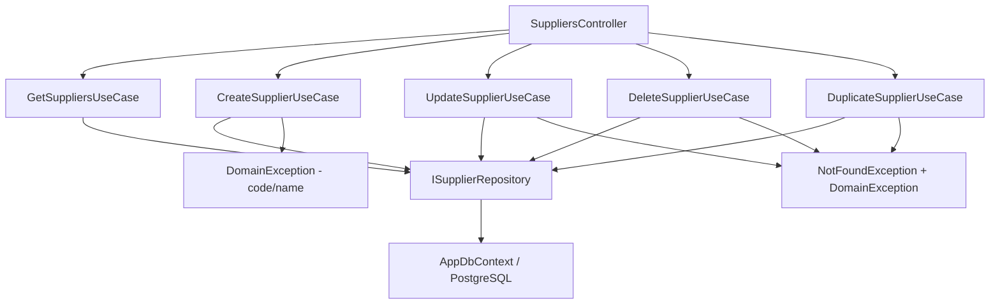

# Suppliers — Feature Document (BE)

> **Jira:** — | **Branch:** `dev` | **Generated:** 2026-04-25

---

## PRD Summary

> API quản lý danh sách nhà cung cấp mỹ phẩm cho hệ thống Lamour.

- **Goal:** Cung cấp CRUD API đầy đủ cho module Nhà Cung Cấp, kèm tính năng nhân bản và kiểm tra unique code.
- **User story:** As a Lamour admin, I want to manage suppliers via a REST API so that import invoices can reference valid suppliers.
- **Acceptance criteria:**
  - [x] `GET /api/v1/suppliers` trả danh sách tất cả nhà cung cấp
  - [x] `POST /api/v1/suppliers` tạo mới, validate `code` unique + `name` required
  - [x] `PUT /api/v1/suppliers/{id}` cập nhật, validate unique code (exclude self)
  - [x] `DELETE /api/v1/suppliers/{id}` xóa nhà cung cấp
  - [x] `POST /api/v1/suppliers/{id}/duplicate` nhân bản với code `_COPY`

---

## Business Rules

| Rule | Description |
|------|-------------|
| Code unique | `code` unique case-insensitive — `DomainException` nếu trùng |
| Code & Name required | Cả 2 đều bắt buộc |
| is_stop_tracking | Flag ngừng theo dõi — không xóa khỏi DB |
| Duplicate code | Code mới = `{original}_COPY`; lỗi nếu đã tồn tại |
| Import Invoice | Nhà cung cấp được tham chiếu bởi ImportInvoice (chưa enforce FK hiện tại) |
| Import Excel (2026-08-19) | `ImportExcelSuppliersUseCase` (Infra, ClosedXML) — header alias: `Mã NCC/Tên NCC/Địa chỉ/Nhóm/Mã số thuế/Điện thoại`. Khác Customer: `code` **bắt buộc** và phải unique (không auto-gen) — skip dòng nếu thiếu `code`/`name` hoặc `code` trùng (trong file hoặc đã tồn tại DB). Gộp thành 1 lần `AddRangeAsync` + broadcast `SuppliersBulkChangedAsync` |

---

## Architecture Overview

### Key Components

| Layer | File | Role |
|-------|------|------|
| Controller | `Lamour.Api/Controllers/SuppliersController.cs` | 5 HTTP actions |
| UseCase | `UseCases/GetSuppliersUseCase.cs` | Fetch all + map |
| UseCase | `UseCases/CreateSupplierUseCase.cs` | Validate + persist |
| UseCase | `UseCases/UpdateSupplierUseCase.cs` | Find → validate → update |
| UseCase | `UseCases/DeleteSupplierUseCase.cs` | Find → delete |
| UseCase | `UseCases/DuplicateSupplierUseCase.cs` | Clone với `_COPY` |
| Repository | `Repositories/ISupplierRepository.cs` | Data access contract |
| Repository | `Lamour.Infrastructure/Repositories/SupplierRepository.cs` | EF Core implementation |
| Entity | `Lamour.Domain/Entities/Supplier.cs` | Domain model |
| Config | `Lamour.Infrastructure/Persistence/Configurations/SupplierConfiguration.cs` | Table `suppliers` |

### Data Flow

```
HTTP Request
  → SuppliersController
  → IXxxSupplierUseCase.ExecuteAsync()
  → ISupplierRepository
  → AppDbContext (PostgreSQL table: suppliers)
  ← Supplier entity → SupplierResponseDto
  ← IActionResult
```



---

## Key Files & Symbols

### Domain
- [`Lamour.Domain/Entities/Supplier.cs`](../../../../Lamour.Domain/Entities/Supplier.cs) — `Id`, `Code`, `Name`, `Address`, `Group`, `TaxCode`, `Phone`, `IsStopTracking`

### Application — Repositories
- [`Repositories/ISupplierRepository.cs`](../Repositories/ISupplierRepository.cs) — `GetAllAsync`, `GetByIdAsync`, `CodeExistsAsync(code, excludeId)`, `AddAsync`, `UpdateAsync`, `DeleteAsync`

### Application — DTOs
- [`Dtos/SupplierResponseDto.cs`](../Dtos/SupplierResponseDto.cs) — `id`, `code`, `name`, `address`, `group`, `tax_code`, `phone`, `is_stop_tracking`
- [`Dtos/CreateSupplierRequestDto.cs`](../Dtos/CreateSupplierRequestDto.cs) — Same fields (code user-entered)
- [`Dtos/UpdateSupplierRequestDto.cs`](../Dtos/UpdateSupplierRequestDto.cs) — Same fields

### Application — UseCases
- [`UseCases/GetSuppliersUseCase.cs`](../UseCases/GetSuppliersUseCase.cs) — `ExecuteAsync()` → `IEnumerable<SupplierResponseDto>`
- [`UseCases/CreateSupplierUseCase.cs`](../UseCases/CreateSupplierUseCase.cs) — Validate code/name → `CodeExistsAsync` → `AddAsync`
- [`UseCases/UpdateSupplierUseCase.cs`](../UseCases/UpdateSupplierUseCase.cs) — `GetByIdAsync` → validate → `UpdateAsync`
- [`UseCases/DeleteSupplierUseCase.cs`](../UseCases/DeleteSupplierUseCase.cs) — `GetByIdAsync` → `DeleteAsync`
- [`UseCases/DuplicateSupplierUseCase.cs`](../UseCases/DuplicateSupplierUseCase.cs) — Clone + `{code}_COPY`

---

## API Contracts

| Method | Endpoint | Input | Output |
|--------|----------|-------|--------|
| `GET` | `/api/v1/suppliers` | — | `SupplierResponseDto[]` |
| `POST` | `/api/v1/suppliers` | `CreateSupplierRequestDto` | `SupplierResponseDto` (201) |
| `PUT` | `/api/v1/suppliers/{id}` | `UpdateSupplierRequestDto` | `SupplierResponseDto` (200) |
| `DELETE` | `/api/v1/suppliers/{id}` | — | 204 No Content |
| `POST` | `/api/v1/suppliers/{id}/duplicate` | — | `SupplierResponseDto` (201) |
| `POST` | `/api/v1/suppliers/import-excel` | `multipart/form-data` (`file`, .xlsx) | `ImportSupplierResultDto` (200) — `{total, imported, skipped, errors[]}` (2026-08-19) |

### Request
```json
{
  "code": "NCC001",
  "name": "COSMO C&T CO.LTD",
  "phone": "0912345678",
  "address": "103 Đường ABC, Q.1, TP.HCM",
  "group": "Mỹ phẩm",
  "tax_code": "0123456789",
  "is_stop_tracking": false
}
```

### Response
```json
{
  "id": 1,
  "code": "NCC001",
  "name": "COSMO C&T CO.LTD",
  "address": "103 Đường ABC, Q.1, TP.HCM",
  "group": "Mỹ phẩm",
  "tax_code": "0123456789",
  "phone": "0912345678",
  "is_stop_tracking": false
}
```

---

## Edge Cases & Error Handling

| Scenario | Expected Behavior | Handled? |
|----------|------------------|----------|
| `code` trống | `DomainException` → 400 | ✅ |
| `name` trống | `DomainException` → 400 | ✅ |
| `code` trùng (Create) | `DomainException` → 400 | ✅ |
| `code` trùng khi Update (exclude self) | `DomainException` → 400 | ✅ |
| `id` không tồn tại | `NotFoundException` → 404 | ✅ |
| Duplicate `_COPY` đã tồn tại | `DomainException` → 400 | ✅ |
| Xóa NCC đang được dùng trong ImportInvoice | Chưa có FK constraint | ❌ Not enforced |

---

## Test Coverage Notes

| Component | Test File | Coverage |
|-----------|-----------|----------|
| `GetSuppliersUseCase` | — | ❌ Missing |
| `CreateSupplierUseCase` | — | ❌ Missing |
| `UpdateSupplierUseCase` | — | ❌ Missing |
| `DeleteSupplierUseCase` | — | ❌ Missing |
| `DuplicateSupplierUseCase` | — | ❌ Missing |
| `SupplierRepository.CodeExistsAsync` | — | ❌ Missing |

**Suggested test cases:**
- [ ] Create: code/name trống → `DomainException`
- [ ] Create: code case-insensitive trùng → `DomainException`
- [ ] Update: code trùng với supplier khác → `DomainException`
- [ ] Update: code trùng với chính nó (exclude self) → OK
- [ ] Duplicate: `_COPY` đã tồn tại → `DomainException`

---

## Notes

- `[Authorize]` tạm thời bị comment — TODO restore khi WPF auth xong
- EF Migration: `20260425035040_InitialCreate`
- `Group` field tại Supplier = nhóm nhà cung cấp (khác với `CustomerGroup` ở Customers)

---

*Generated by `/ct-ai-document` on 2026-04-25*
*Updated 2026-08-19: thêm `POST /api/v1/suppliers/import-excel` (ClosedXML) + WPF "📤 Xuất khẩu"/"📥 Nhập khẩu" trên `SupplierListView` — không đổi schema, không cần migration.*
