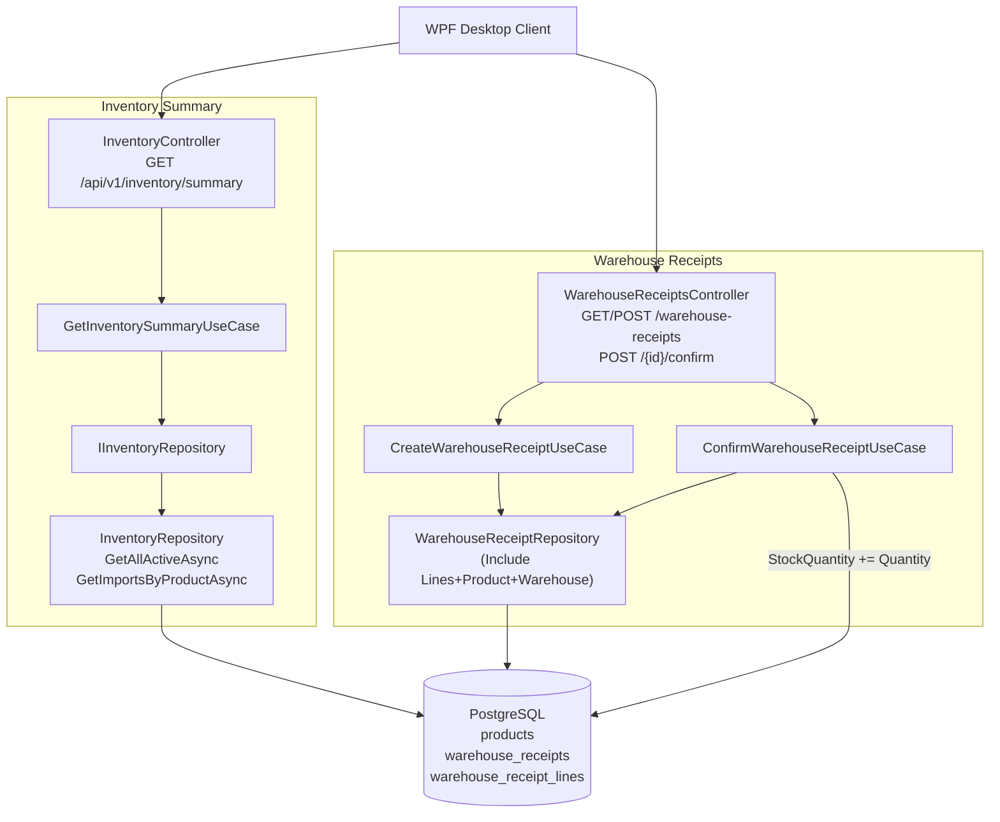

# Warehouse — Feature Document

> **Jira:** — | **Branch:** `dev` | **Generated:** 2026-04-27 | **Updated:** 2026-04-28 (×2)

---

## PRD Summary

> Cung cấp báo cáo tồn kho tổng hợp theo kỳ và quản lý phiếu nhập kho cho hệ thống quản lý mỹ phẩm Lamour.

- **Goal:** Trả về danh sách tồn kho của từng sản phẩm trong một khoảng thời gian, bao gồm tồn đầu kỳ, nhập kho (thực từ phiếu nhập đã xác nhận), xuất kho và tồn cuối kỳ. Đồng thời quản lý vòng đời phiếu nhập kho (Draft → Confirmed).
- **User story:** Là kế toán hoặc quản lý kho, tôi muốn xem báo cáo tồn kho theo ngày và tạo/xác nhận phiếu nhập kho để kiểm soát lượng hàng và giá trị hàng tồn trong kỳ.
- **Acceptance criteria:**
  - [x] API trả về danh sách sản phẩm đang hoạt động (`IsActive = true`) sắp xếp theo mã sản phẩm
  - [x] Mỗi mục trả về: `product_id`, `code`, `name`, `unit`, `opening_qty`, `opening_value`, `import_qty`, `import_value`, `export_qty`, `export_value`, `closing_qty`, `closing_value`, `latest_accounting_date`
  - [x] `closing_qty` = `Product.StockQuantity` hiện tại
  - [x] `import_qty` = tổng số lượng từ `warehouse_receipt_lines` có trạng thái Confirmed trong `[from_date, to_date]`
  - [x] `opening_qty` = `closing_qty - import_qty` (xấp xỉ — ExportQty chưa tracked)
  - [x] `closing_value` = `StockQuantity × CostPrice`
  - [x] Endpoint yêu cầu JWT Bearer token hợp lệ (`[Authorize]`)
  - [x] WPF danh sách hiển thị **1 row per line item** (flatten) — phiếu 3 sản phẩm → 3 rows; phiếu 0 dòng → 1 row trống
  - [x] Cột `Mã hàng` + `Tên hàng` hiện sau "Số phiếu"; các cột receipt-level lặp lại trên mỗi row
  - [x] `GET /api/v1/warehouse-receipts` — lấy danh sách phiếu nhập kho
  - [x] `POST /api/v1/warehouse-receipts` — tạo phiếu nhập kho (Draft)
  - [x] `POST /api/v1/warehouse-receipts/{id}/confirm` — xác nhận phiếu (cập nhật StockQuantity)

---

## Business Rules

> Các ràng buộc nghiệp vụ kho hàng mà developer phải tuân theo.

| Rule | Description |
|------|-------------|
| Chỉ sản phẩm đang hoạt động | `WHERE IsActive = true` — sản phẩm bị ẩn/ngưng không xuất hiện trong báo cáo |
| Sắp xếp theo mã sản phẩm | `ORDER BY Code ASC` |
| Closing qty = StockQuantity | Lấy trực tiếp từ `Products.StockQuantity` |
| Import qty thực | `SUM(warehouse_receipt_lines.Quantity)` WHERE `Status = Confirmed AND AccountingDate IN [from, to)`, GROUP BY `ProductId` |
| LatestAccountingDate | `MAX(l.WarehouseReceipt.AccountingDate)` trong cùng GROUP BY — ngày nhập gần nhất của sản phẩm trong kỳ |
| DateTime Kind=Unspecified | WPF gửi `AccountingDate` với `Kind=Unspecified` (không có offset) để ASP.NET Core không tự chuyển UTC -7h; BE dùng `DateTime.SpecifyKind(..., Utc)` để lưu đúng |
| Opening qty xấp xỉ | `OpeningQty = ClosingQty - ImportQty` (chưa trừ ExportQty) |
| Giá trị = Qty × CostPrice | `closing_value = StockQuantity * CostPrice` (giá vốn, không phải giá bán) |
| Export qty | Hardcode = 0 (TODO: cần ExportInvoice module) |
| Phiếu nhập kho — bất biến sau Confirm | Chỉ Draft mới có thể được Confirm; Confirmed không thể sửa/xóa |
| Xác nhận cập nhật tồn kho | `ConfirmWarehouseReceiptUseCase` thực hiện `Product.StockQuantity += line.Quantity` cho tất cả dòng hàng |
| Số phiếu tự sinh | Format `NK-{yyyyMMdd}-{seq:D3}`, đếm số phiếu có cùng prefix ngày |
| Không cho phép truy cập ẩn danh | Tất cả endpoints có `[Authorize]` — phải gửi JWT hợp lệ |

---

## Architecture Overview

> Clean Architecture 4 layers: Api → Application → Domain ← Infrastructure.

### Key Components — Inventory Summary

| Layer | File | Role |
|-------|------|------|
| API | [InventoryController.cs](src/Lamour.Api/Controllers/InventoryController.cs) | `GET /api/v1/inventory/summary` |
| Application | [GetInventorySummaryUseCase.cs](../UseCases/GetInventorySummaryUseCase.cs) | Fetch products + import totals → map DTO |
| Application | [IInventoryRepository.cs](../Repositories/IInventoryRepository.cs) | `GetAllActiveAsync` + `GetImportsByProductAsync` |
| Domain | [Product.cs](src/Lamour.Domain/Entities/Product.cs) | `StockQuantity`, `CostPrice`, `IsActive` |
| Infrastructure | [InventoryRepository.cs](src/Lamour.Infrastructure/Repositories/InventoryRepository.cs) | EF Core: active products + confirmed receipt lines |

### Key Components — WPF List View (Flat Layout)

| Layer | File | Role |
|-------|------|------|
| Presentation | [WarehouseReceiptListView.xaml](src/DesktopLamour/Features/HomePage/Warehouse/Views/WarehouseReceiptListView.xaml) | DataGrid: 1 row per line item; columns: Số phiếu → Mã hàng → Tên hàng → Loại phiếu → ... |
| Presentation | [WarehouseReceiptListViewModel.cs](src/DesktopLamour/Features/HomePage/Warehouse/ViewModels/WarehouseReceiptListViewModel.cs) | Flattens `WarehouseReceiptResponseDto.Lines` → `ObservableCollection<WarehouseReceiptFlatItem>` via `ToFlatItem()` |
| Domain | [WarehouseReceiptFlatItem.cs](src/DesktopLamour/Features/HomePage/Warehouse/Domain/Models/WarehouseReceiptFlatItem.cs) | Flat model: receipt-level fields + `ProductCode` + `ProductName` |

### Key Components — Warehouse Receipts (Phiếu Nhập Kho)

| Layer | File | Role |
|-------|------|------|
| API | [WarehouseReceiptsController.cs](src/Lamour.Api/Controllers/WarehouseReceiptsController.cs) | CRUD + `/confirm` endpoint |
| Application | [CreateWarehouseReceiptUseCase.cs](../../../WarehouseReceipts/UseCases/CreateWarehouseReceiptUseCase.cs) | Validate, build entity, generate receipt number |
| Application | [ConfirmWarehouseReceiptUseCase.cs](../../../WarehouseReceipts/UseCases/ConfirmWarehouseReceiptUseCase.cs) | Draft→Confirmed, `StockQuantity += Quantity` |
| Application | [GetWarehouseReceiptsUseCase.cs](../../../WarehouseReceipts/UseCases/GetWarehouseReceiptsUseCase.cs) | List all receipts |
| Application | [IWarehouseReceiptRepository.cs](../../../WarehouseReceipts/Repositories/IWarehouseReceiptRepository.cs) | Repository contract |
| Domain | [WarehouseReceipt.cs](src/Lamour.Domain/Entities/WarehouseReceipt.cs) | Entity: `Status`, `Lines`, `ReceiptNumber` |
| Infrastructure | [WarehouseReceiptRepository.cs](src/Lamour.Infrastructure/Repositories/WarehouseReceiptRepository.cs) | EF Core: Include Lines + Product + Warehouse |

### Data Flow — Inventory Summary

```
WPF Client (GET /api/v1/inventory/summary?from_date=&to_date=)
  → InventoryController.GetSummary()
  → GetInventorySummaryUseCase.ExecuteAsync(fromDate, toDate, ct)
      → IInventoryRepository.GetAllActiveAsync(ct)          → Products (WHERE IsActive ORDER BY Code)
      → IInventoryRepository.GetImportsByProductAsync(...)  → confirmed WarehouseReceiptLines in range
      ← Dictionary<ProductId, (Qty, Value)>
  ← Select → IEnumerable<InventorySummaryItemDto>
  ← Ok(result)
```

### Data Flow — Confirm Receipt

```
WPF Client (POST /api/v1/warehouse-receipts/{id}/confirm)
  → WarehouseReceiptsController.Confirm(id)
  → ConfirmWarehouseReceiptUseCase.ExecuteAsync(id, ct)
      → IWarehouseReceiptRepository.GetByIdAsync(id)   (Include Lines.Product)
      → Validate Status == Draft
      → foreach line: line.Product.StockQuantity += line.Quantity
      → receipt.Status = Confirmed, receipt.ConfirmedAt = UtcNow
      → SaveChangesAsync()
  ← MapToDto(receipt)
  ← Ok(WarehouseReceiptResponseDto)
```

### Architecture Diagram



---

## Key Files & Symbols

### API (Presentation)
- [InventoryController.cs](src/Lamour.Api/Controllers/InventoryController.cs) — `GET /api/v1/inventory/summary`
- [WarehouseReceiptsController.cs](src/Lamour.Api/Controllers/WarehouseReceiptsController.cs) — `GET`, `POST`, `GET /{id}`, `POST /{id}/confirm`

### Application — UseCases
- [IGetInventorySummaryUseCase.cs](../UseCases/IGetInventorySummaryUseCase.cs) — `ExecuteAsync(DateOnly fromDate, DateOnly toDate, CancellationToken ct)`
- [GetInventorySummaryUseCase.cs](../UseCases/GetInventorySummaryUseCase.cs) — fetch products + imports, map to DTO
- [ICreateWarehouseReceiptUseCase.cs](src/Lamour.Application/Features/WarehouseReceipts/UseCases/ICreateWarehouseReceiptUseCase.cs)
- [CreateWarehouseReceiptUseCase.cs](src/Lamour.Application/Features/WarehouseReceipts/UseCases/CreateWarehouseReceiptUseCase.cs) — validate, generate receipt number `NK-{date}-{seq}`, contains shared `MapToDto`
- [IConfirmWarehouseReceiptUseCase.cs](src/Lamour.Application/Features/WarehouseReceipts/UseCases/IConfirmWarehouseReceiptUseCase.cs)
- [ConfirmWarehouseReceiptUseCase.cs](src/Lamour.Application/Features/WarehouseReceipts/UseCases/ConfirmWarehouseReceiptUseCase.cs) — stock update + status transition
- [GetWarehouseReceiptsUseCase.cs](src/Lamour.Application/Features/WarehouseReceipts/UseCases/GetWarehouseReceiptsUseCase.cs)

### Application — Repository Contracts
- [IInventoryRepository.cs](../Repositories/IInventoryRepository.cs) — `GetAllActiveAsync` + `GetImportsByProductAsync(DateOnly, DateOnly)` → `Dictionary<int, (int Qty, decimal Value, DateTime? LatestDate)>`
- [IWarehouseReceiptRepository.cs](src/Lamour.Application/Features/WarehouseReceipts/Repositories/IWarehouseReceiptRepository.cs) — `GetAllAsync`, `GetByIdAsync`, `AddAsync`, `SaveChangesAsync`, `GetNextReceiptNumberAsync`

### Application — DTOs
- [InventorySummaryItemDto.cs](../Dtos/InventorySummaryItemDto.cs) — 13 fields snake_case (incl. `latest_accounting_date`)
- [WarehouseReceiptDtos.cs](src/Lamour.Application/Features/WarehouseReceipts/Dtos/WarehouseReceiptDtos.cs) — `CreateWarehouseReceiptRequestDto`, `CreateWarehouseReceiptLineDto`, `WarehouseReceiptResponseDto`, `WarehouseReceiptLineDto`

### Domain
- [Product.cs](src/Lamour.Domain/Entities/Product.cs) — `StockQuantity` (int), `CostPrice` (decimal), `IsActive`
- [WarehouseReceipt.cs](src/Lamour.Domain/Entities/WarehouseReceipt.cs) — `WarehouseReceiptType` enum (1/2/3), `WarehouseReceiptStatus` enum (Draft/Confirmed), `WarehouseReceiptLine`

### Infrastructure
- [InventoryRepository.cs](src/Lamour.Infrastructure/Repositories/InventoryRepository.cs) — `GetAllActiveAsync` (AsNoTracking, IsActive, OrderBy Code) + `GetImportsByProductAsync` (GroupBy ProductId, SUM Qty+Amount)
- [WarehouseReceiptRepository.cs](src/Lamour.Infrastructure/Repositories/WarehouseReceiptRepository.cs) — `GetAllAsync` (Include Customer/Employee/Lines/Product/Warehouse), `AddAsync` (LoadAsync navigations after save)

---

## API Contracts

| Method | Endpoint | Auth | Input | Output |
|--------|----------|------|-------|--------|
| `GET` | `/api/v1/inventory/summary` | JWT Bearer | `?from_date&to_date` | `InventorySummaryItemDto[]` |
| `GET` | `/api/v1/warehouse-receipts` | JWT Bearer | — | `WarehouseReceiptResponseDto[]` |
| `GET` | `/api/v1/warehouse-receipts/{id}` | JWT Bearer | `id` (int) | `WarehouseReceiptResponseDto` |
| `POST` | `/api/v1/warehouse-receipts` | JWT Bearer | `CreateWarehouseReceiptRequestDto` | `201 Created + WarehouseReceiptResponseDto` |
| `POST` | `/api/v1/warehouse-receipts/{id}/confirm` | JWT Bearer | `id` (int) | `200 OK + WarehouseReceiptResponseDto` |

### InventorySummaryItemDto

```csharp
public class InventorySummaryItemDto
{
    [JsonPropertyName("product_id")]     public int     ProductId    { get; set; }
    [JsonPropertyName("code")]           public string  Code         { get; set; }
    [JsonPropertyName("name")]           public string  Name         { get; set; }
    [JsonPropertyName("unit")]           public string  Unit         { get; set; }
    [JsonPropertyName("opening_qty")]    public int     OpeningQty   { get; set; }  // = ClosingQty - ImportQty
    [JsonPropertyName("opening_value")]  public decimal OpeningValue { get; set; }  // = OpeningQty × CostPrice
    [JsonPropertyName("import_qty")]     public int     ImportQty    { get; set; }  // SUM confirmed lines in range
    [JsonPropertyName("import_value")]   public decimal ImportValue  { get; set; }  // SUM confirmed line amounts
    [JsonPropertyName("export_qty")]     public int     ExportQty    { get; set; }  // TODO: hardcode 0
    [JsonPropertyName("export_value")]   public decimal ExportValue  { get; set; }  // TODO: hardcode 0
    [JsonPropertyName("closing_qty")]    public int     ClosingQty   { get; set; }  // = Product.StockQuantity
    [JsonPropertyName("closing_value")]          public decimal   ClosingValue          { get; set; }  // = StockQuantity × CostPrice
    [JsonPropertyName("latest_accounting_date")] public DateTime? LatestAccountingDate  { get; set; }  // MAX(AccountingDate) of confirmed lines in range; null if no imports
}
```

### CreateWarehouseReceiptRequestDto

```csharp
public class CreateWarehouseReceiptRequestDto
{
    [JsonPropertyName("receipt_type")]    public int      ReceiptType    { get; set; }  // 1=SupplierImport, 2=ReturnedGoods, 3=Adjustment
    [JsonPropertyName("customer_id")]     public int?     CustomerId     { get; set; }
    [JsonPropertyName("employee_id")]     public int?     EmployeeId     { get; set; }
    [JsonPropertyName("accounting_date")] public DateTime AccountingDate { get; set; }
    [JsonPropertyName("document_date")]   public DateTime DocumentDate   { get; set; }
    [JsonPropertyName("description")]     public string?  Description    { get; set; }
    [JsonPropertyName("delivery_person")] public string?  DeliveryPerson { get; set; }
    [JsonPropertyName("reference")]       public string?  Reference      { get; set; }
    [JsonPropertyName("lines")]           public List<CreateWarehouseReceiptLineDto> Lines { get; set; }
}
```

### Sample Response — Inventory Summary

```json
[
  {
    "product_id": 1,
    "code": "SP001",
    "name": "Kem dưỡng da mặt",
    "unit": "Hộp",
    "opening_qty": 40,
    "opening_value": 2000000,
    "import_qty": 10,
    "import_value": 500000,
    "export_qty": 0,
    "export_value": 0,
    "closing_qty": 50,
    "closing_value": 2500000.00
  }
]
```

---

## Edge Cases & Error Handling

| Scenario | Expected Behavior | Handled? |
|----------|------------------|----------|
| Không có sản phẩm `IsActive = true` | Trả về `[]`, HTTP 200 | ✅ |
| `from_date` > `to_date` | ImportQty query trả 0 (range không hợp lệ), OpeningQty = ClosingQty | ⚠️ Chưa validate |
| Missing `from_date` hoặc `to_date` | ASP.NET Core tự động 400 Bad Request | ✅ |
| JWT token hết hạn | 401 Unauthorized | ✅ |
| PostgreSQL connection timeout | 500 Internal Server Error (GlobalExceptionHandler) | ✅ |
| Confirm phiếu đã Confirmed | `DomainException("Only Draft receipts can be confirmed.")` → 400 | ✅ |
| ProductId trong line không tồn tại | `DomainException("Product with id X not found.")` → 400 | ✅ |
| Receipt không tồn tại khi Confirm | `DomainException("WarehouseReceipt with id X not found.")` → 400 | ✅ |
| Line có `line.Product is null` (navigation không load) | `DomainException` → 400 | ✅ |
| Số lượng sản phẩm rất lớn | Không có phân trang — toàn bộ trả về 1 response | ❌ TODO |

---

## Known Limitations (TODO)

| # | Limitation | Impact | Suggested Fix |
|---|-----------|--------|---------------|
| 1 | `opening_qty` tính xấp xỉ = `ClosingQty - ImportQty` | Sai khi có ExportQty trong kỳ | Tính từ `WarehouseReceiptLines` trước `from_date` + `ExportInvoiceItems` |
| 2 | `export_qty`, `export_value` hardcode = 0 | Báo cáo xuất kho sai | Implement ExportInvoice module, query `ExportInvoiceLines` theo kỳ |
| 3 | Không validate `from_date <= to_date` | Kết quả sai | Thêm domain validation trong UseCase |
| 4 | Không có pagination | Performance issue với catalog lớn | Thêm `page` / `pageSize` query param |
| 5 | `GetImportsByProductAsync` không có index | Chậm khi nhiều phiếu nhập | Thêm index `(status, accounting_date)` trên `warehouse_receipts` |

---

## Test Coverage Notes

| Component | Test File | Coverage |
|-----------|-----------|----------|
| `GetInventorySummaryUseCase` | — | ❌ Missing |
| `InventoryRepository.GetImportsByProductAsync` | — | ❌ Missing |
| `CreateWarehouseReceiptUseCase` | — | ❌ Missing |
| `ConfirmWarehouseReceiptUseCase` | — | ❌ Missing |
| `InventoryController` | — | ❌ Missing |
| `WarehouseReceiptsController` | — | ❌ Missing |

**Suggested test cases:**
- [ ] **UseCase - import_qty:** mock trả về 2 confirmed lines (qty=5, qty=3) → `ImportQty = 8`
- [ ] **UseCase - opening_qty:** `OpeningQty = ClosingQty - ImportQty` đúng
- [ ] **UseCase - no imports in range:** `imports` dict empty → `ImportQty = 0`, `OpeningQty = ClosingQty`
- [ ] **Confirm - success:** `StockQuantity` tăng đúng, `Status = Confirmed`
- [ ] **Confirm - not draft:** throws `DomainException("Only Draft receipts can be confirmed.")`
- [ ] **Confirm - product null:** throws `DomainException("Product with id X not found.")`
- [ ] **Create - duplicate receipt number guard:** `GetNextReceiptNumberAsync` đếm đúng prefix

---

## Notes

- **Confirm cập nhật stock trong cùng transaction**: `SaveChangesAsync` lưu cả `WarehouseReceipt.Status` và `Product.StockQuantity` trong cùng 1 lần gọi — EF Core change tracker xử lý cả 2 entity.
- **Date storage**: `AccountingDate` và `DocumentDate` lưu dưới dạng UTC (`DateTime.SpecifyKind(..., DateTimeKind.Utc)`). WPF client nhận UTC, hiển thị local time bằng `.ToLocalTime()`.
- **Timezone bug fix (2026-04-28)**: `DateTime.Today` trên WPF có `Kind=Local` (UTC+7). Khi System.Text.Json serialize, nó thêm offset `+07:00` → ASP.NET Core tự chuyển sang UTC → ngày bị lùi 1 ngày (2026-04-28 → 2026-04-27T17:00Z). Phiếu nhập kho không xuất hiện trong báo cáo vì `AccountingDate` nằm ngoài range. **Fix:** WPF `WarehouseReceiptFormViewModel.SaveAsync` gửi `DateTime.SpecifyKind(AccountingDate.Date, DateTimeKind.Unspecified)` — JSON serialize không có offset, ASP.NET Core không convert, BE's `SpecifyKind(..., Utc)` lưu đúng ngày UTC.
- **`GetImportsByProductAsync` query**: dùng navigation property `l.WarehouseReceipt.Status` và `l.WarehouseReceipt.AccountingDate` — EF Core sinh JOIN tự động.
- **`MapToDto` shared**: `CreateWarehouseReceiptUseCase.MapToDto` là `internal static` — được dùng lại bởi `ConfirmWarehouseReceiptUseCase` và `GetWarehouseReceiptsUseCase`.
- **WPF — Flat list layout (2026-04-28)**: `WarehouseReceiptListViewModel.Items` đổi từ `ObservableCollection<WarehouseReceiptResponseDto>` → `ObservableCollection<WarehouseReceiptFlatItem>`. `LoadAsync` flatten: mỗi receipt → N rows (1 per line), receipt 0 dòng → 1 row với `ProductCode = ""`. `ToFlatItem()` là private static helper. Dữ liệu `ProductCode`/`ProductName` đến từ `WarehouseReceiptLineDto` đã có sẵn — không cần BE thay đổi. Nút "Ghi sổ" hiện ở tất cả rows của cùng phiếu Draft.
- **WPF — "Ngày HT" column (2026-04-28)**: `TongHopTonKhoView.xaml` thêm cột 12 "Ngày HT" binding `LatestAccountingDate` với format `yyyyMMddHHmm` (ví dụ: `202604282016`). WPF `WarehouseRepository` map `d.LatestAccountingDate.Value.ToLocalTime()` để hiển thị giờ Việt Nam. Cột này là dạng ID timestamp — không phải label ngày đọc được.
- **DI registration**: `IInventoryRepository → InventoryRepository` và `IWarehouseReceiptRepository → WarehouseReceiptRepository` đăng ký trong `Program.cs` (Scoped).

---

*Generated by `/ct-ai-document` on 2026-04-27 | Updated 2026-04-28: LatestAccountingDate column + timezone bug fix*
