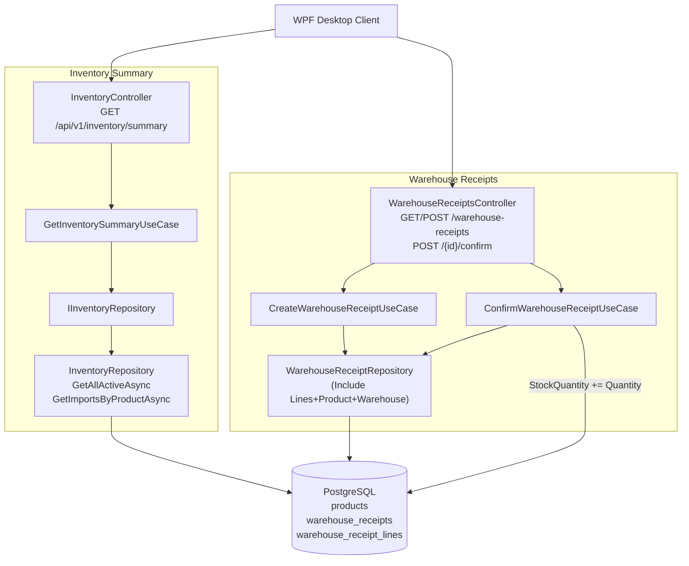

# Warehouse — Feature Document

> **Jira:** — | **Branch:** `dev` | **Generated:** 2026-04-27 | **Updated:** 2026-08-19 (Phiếu nhập kho: cột "Kho" hiển thị đúng mã kho ngầm định HH/TB của sản phẩm thay vì hardcode "Kho chính"; `WarehouseId` khi Lưu cũng đổi theo — xem [`products.md`](../../Products/docs/products.md) changelog cùng ngày) | 2026-08-15 (×2: thêm `GET /api/v1/warehouse-transactions` — danh sách gộp Nhập/Xuất kho, xem changelog cuối file; 4 loại phiếu + Supplier + tab Thống kê + số phiếu `NK00048`) | 2026-04-28 (×2)

---

## PRD Summary

> Cung cấp báo cáo tồn kho tổng hợp theo kỳ và quản lý phiếu nhập kho cho hệ thống quản lý mỹ phẩm Lamour.

- **Goal:** Trả về danh sách tồn kho của từng sản phẩm trong một khoảng thời gian, bao gồm tồn đầu kỳ, nhập kho (thực từ phiếu nhập đã xác nhận), xuất kho và tồn cuối kỳ. Đồng thời quản lý vòng đời phiếu nhập kho (Draft → Confirmed).
- **User story:** Là kế toán hoặc quản lý kho, tôi muốn xem báo cáo tồn kho theo ngày và tạo/xác nhận phiếu nhập kho để kiểm soát lượng hàng và giá trị hàng tồn trong kỳ.
- **Acceptance criteria:**
  - [x] API trả về danh sách sản phẩm đang hoạt động (`IsActive = true`) sắp xếp theo mã sản phẩm
  - [x] Mỗi mục trả về: `product_id`, `code`, `name`, `unit`, `opening_qty`, `opening_value`, `import_qty`, `import_value`, `export_qty`, `export_value`, `closing_qty`, `closing_value`, `latest_accounting_date`
  - [x] `closing_qty` = `Product.StockQuantity` hiện tại
  - [x] `import_qty` = tổng số lượng từ `warehouse_receipt_lines` có trạng thái Confirmed trong `[from_date, to_date]`
  - [x] `opening_qty` = `closing_qty - import_qty` (xấp xỉ — ExportQty chưa tracked)
  - [x] `closing_value` = `StockQuantity × CostPrice`
  - [x] Endpoint yêu cầu JWT Bearer token hợp lệ (`[Authorize]`)
  - [x] WPF danh sách hiển thị **1 row per line item** (flatten) — phiếu 3 sản phẩm → 3 rows; phiếu 0 dòng → 1 row trống
  - [x] Cột `Mã hàng` + `Tên hàng` hiện sau "Số phiếu"; các cột receipt-level lặp lại trên mỗi row
  - [x] `GET /api/v1/warehouse-receipts` — lấy danh sách phiếu nhập kho
  - [x] `POST /api/v1/warehouse-receipts` — tạo phiếu nhập kho (Draft)
  - [x] `POST /api/v1/warehouse-receipts/{id}/confirm` — xác nhận phiếu (cập nhật StockQuantity)
  - [x] (2026-08-15) 4 loại phiếu: `1=FinishedGoodsProduced, 2=ReturnedGoods, 3=Other, 4=ProcessingReceived`
  - [x] (2026-08-15) "Đối tượng" phiếu là `Customer` **hoặc** `Supplier` (mutually exclusive, không được set cả 2)
  - [x] (2026-08-15) Mỗi line hỗ trợ 7 field thống kê kế toán mở rộng (optional)
  - [x] (2026-08-15) Số phiếu đổi format: `NK{seq:D5}` (chạy tuần tự toàn hệ thống, không nhúng ngày)

---

## Business Rules

> Các ràng buộc nghiệp vụ kho hàng mà developer phải tuân theo.

| Rule | Description |
|------|-------------|
| Chỉ sản phẩm đang hoạt động | `WHERE IsActive = true` — sản phẩm bị ẩn/ngưng không xuất hiện trong báo cáo |
| Sắp xếp theo mã sản phẩm | `ORDER BY Code ASC` |
| Closing qty = StockQuantity | Lấy trực tiếp từ `Products.StockQuantity` |
| Import qty thực | `SUM(warehouse_receipt_lines.Quantity)` WHERE `Status = Confirmed AND AccountingDate IN [from, to)`, GROUP BY `ProductId` |
| LatestAccountingDate | `MAX(l.WarehouseReceipt.AccountingDate)` trong cùng GROUP BY — ngày nhập gần nhất của sản phẩm trong kỳ |
| DateTime Kind=Unspecified | WPF gửi `AccountingDate` với `Kind=Unspecified` (không có offset) để ASP.NET Core không tự chuyển UTC -7h; BE dùng `DateTime.SpecifyKind(..., Utc)` để lưu đúng |
| Opening qty xấp xỉ | `OpeningQty = ClosingQty - ImportQty` (chưa trừ ExportQty) |
| Giá trị = Qty × CostPrice | `closing_value = StockQuantity * CostPrice` (giá vốn, không phải giá bán) |
| Export qty | Hardcode = 0 (TODO: cần ExportInvoice module) |
| Phiếu nhập kho — bất biến sau Confirm | Chỉ Draft mới có thể được Confirm; Confirmed không thể sửa/xóa |
| Xác nhận cập nhật tồn kho | `ConfirmWarehouseReceiptUseCase` thực hiện `Product.StockQuantity += line.Quantity` cho tất cả dòng hàng |
| Số phiếu tự sinh (đổi 2026-08-15) | Format `NK{seq:D5}` (VD: `NK00048`) — đếm tổng số phiếu toàn hệ thống + 1, **không còn nhúng ngày**; `GetNextReceiptNumberAsync` bỏ tham số `date` (trước đây `NK-{yyyyMMdd}-{seq:D3}` đếm theo prefix ngày) |
| 4 loại phiếu (đổi 2026-08-15) | `WarehouseReceiptType`: `1=FinishedGoodsProduced` (Thành phẩm sản xuất), `2=ReturnedGoods` (Hàng bán bị trả lại), `3=Other` (Khác — NVL thừa, HH thuê gia công,...), `4=ProcessingReceived` (Hàng nhận gia công). Thay thế enum cũ 3 giá trị (`SupplierImport/ReturnedGoods/Adjustment`) — **breaking change** giá trị 1 và 3 đổi ý nghĩa |
| Đối tượng: Customer hoặc Supplier (mới 2026-08-15) | `CreateWarehouseReceiptRequestDto` có cả `customer_id` và `supplier_id` (đều nullable) — `CreateWarehouseReceiptUseCase` throw `DomainException` nếu cả 2 cùng có giá trị. Validate tồn tại qua `ICustomerRepository`/`ISupplierRepository` tương ứng |
| 7 field thống kê trên line (mới 2026-08-15) | `CostItem` (Khoản mục CP), `CostObject` (Đối tượng THCP), `Project` (Công trình), `PurchaseOrderNumber` (Đơn đặt hàng), `SalesContractNumber` (Hợp đồng bán), `LoanContractNumber` (Số khế ước), `StatisticsCode` (Mã thống kê) — toàn bộ `string?`, không validate, chỉ lưu trữ theo dõi nội bộ |
| Không cho phép truy cập ẩn danh | Tất cả endpoints có `[Authorize]` — phải gửi JWT hợp lệ |

---

## Architecture Overview

> Clean Architecture 4 layers: Api → Application → Domain ← Infrastructure.

### Key Components — Inventory Summary

| Layer | File | Role |
|-------|------|------|
| API | [InventoryController.cs](src/Lamour.Api/Controllers/InventoryController.cs) | `GET /api/v1/inventory/summary` |
| Application | [GetInventorySummaryUseCase.cs](../UseCases/GetInventorySummaryUseCase.cs) | Fetch products + import totals → map DTO |
| Application | [IInventoryRepository.cs](../Repositories/IInventoryRepository.cs) | `GetAllActiveAsync` + `GetImportsByProductAsync` |
| Domain | [Product.cs](src/Lamour.Domain/Entities/Product.cs) | `StockQuantity`, `CostPrice`, `IsActive` |
| Infrastructure | [InventoryRepository.cs](src/Lamour.Infrastructure/Repositories/InventoryRepository.cs) | EF Core: active products + confirmed receipt lines |

### Key Components — WPF List View (Flat Layout)

| Layer | File | Role |
|-------|------|------|
| Presentation | [WarehouseReceiptListView.xaml](src/DesktopLamour/Features/HomePage/Warehouse/Views/WarehouseReceiptListView.xaml) | DataGrid: 1 row per line item; columns: Số phiếu → Mã hàng → Tên hàng → Loại phiếu → ... |
| Presentation | [WarehouseReceiptListViewModel.cs](src/DesktopLamour/Features/HomePage/Warehouse/ViewModels/WarehouseReceiptListViewModel.cs) | Flattens `WarehouseReceiptResponseDto.Lines` → `ObservableCollection<WarehouseReceiptFlatItem>` via `ToFlatItem()` |
| Domain | [WarehouseReceiptFlatItem.cs](src/DesktopLamour/Features/HomePage/Warehouse/Domain/Models/WarehouseReceiptFlatItem.cs) | Flat model: receipt-level fields + `ProductCode` + `ProductName` |

### Key Components — Warehouse Receipts (Phiếu Nhập Kho)

| Layer | File | Role |
|-------|------|------|
| API | [WarehouseReceiptsController.cs](src/Lamour.Api/Controllers/WarehouseReceiptsController.cs) | CRUD + `/confirm` endpoint |
| Application | [CreateWarehouseReceiptUseCase.cs](../../../WarehouseReceipts/UseCases/CreateWarehouseReceiptUseCase.cs) | Validate, build entity, generate receipt number |
| Application | [ConfirmWarehouseReceiptUseCase.cs](../../../WarehouseReceipts/UseCases/ConfirmWarehouseReceiptUseCase.cs) | Draft→Confirmed, `StockQuantity += Quantity` |
| Application | [GetWarehouseReceiptsUseCase.cs](../../../WarehouseReceipts/UseCases/GetWarehouseReceiptsUseCase.cs) | List all receipts |
| Application | [IWarehouseReceiptRepository.cs](../../../WarehouseReceipts/Repositories/IWarehouseReceiptRepository.cs) | Repository contract |
| Domain | [WarehouseReceipt.cs](src/Lamour.Domain/Entities/WarehouseReceipt.cs) | Entity: `Status`, `Lines`, `ReceiptNumber` |
| Infrastructure | [WarehouseReceiptRepository.cs](src/Lamour.Infrastructure/Repositories/WarehouseReceiptRepository.cs) | EF Core: Include Lines + Product + Warehouse |

### Data Flow — Inventory Summary

```
WPF Client (GET /api/v1/inventory/summary?from_date=&to_date=)
  → InventoryController.GetSummary()
  → GetInventorySummaryUseCase.ExecuteAsync(fromDate, toDate, ct)
      → IInventoryRepository.GetAllActiveAsync(ct)          → Products (WHERE IsActive ORDER BY Code)
      → IInventoryRepository.GetImportsByProductAsync(...)  → confirmed WarehouseReceiptLines in range
      ← Dictionary<ProductId, (Qty, Value)>
  ← Select → IEnumerable<InventorySummaryItemDto>
  ← Ok(result)
```

### Data Flow — Confirm Receipt

```
WPF Client (POST /api/v1/warehouse-receipts/{id}/confirm)
  → WarehouseReceiptsController.Confirm(id)
  → ConfirmWarehouseReceiptUseCase.ExecuteAsync(id, ct)
      → IWarehouseReceiptRepository.GetByIdAsync(id)   (Include Lines.Product)
      → Validate Status == Draft
      → foreach line: line.Product.StockQuantity += line.Quantity
      → receipt.Status = Confirmed, receipt.ConfirmedAt = UtcNow
      → SaveChangesAsync()
  ← MapToDto(receipt)
  ← Ok(WarehouseReceiptResponseDto)
```

### Architecture Diagram



---

## Key Files & Symbols

### API (Presentation)
- [InventoryController.cs](src/Lamour.Api/Controllers/InventoryController.cs) — `GET /api/v1/inventory/summary`
- [WarehouseReceiptsController.cs](src/Lamour.Api/Controllers/WarehouseReceiptsController.cs) — `GET`, `POST`, `GET /{id}`, `POST /{id}/confirm`

### Application — UseCases
- [IGetInventorySummaryUseCase.cs](../UseCases/IGetInventorySummaryUseCase.cs) — `ExecuteAsync(DateOnly fromDate, DateOnly toDate, CancellationToken ct)`
- [GetInventorySummaryUseCase.cs](../UseCases/GetInventorySummaryUseCase.cs) — fetch products + imports, map to DTO
- [ICreateWarehouseReceiptUseCase.cs](src/Lamour.Application/Features/WarehouseReceipts/UseCases/ICreateWarehouseReceiptUseCase.cs)
- [CreateWarehouseReceiptUseCase.cs](src/Lamour.Application/Features/WarehouseReceipts/UseCases/CreateWarehouseReceiptUseCase.cs) — validate, generate receipt number `NK-{date}-{seq}`, contains shared `MapToDto`
- [IConfirmWarehouseReceiptUseCase.cs](src/Lamour.Application/Features/WarehouseReceipts/UseCases/IConfirmWarehouseReceiptUseCase.cs)
- [ConfirmWarehouseReceiptUseCase.cs](src/Lamour.Application/Features/WarehouseReceipts/UseCases/ConfirmWarehouseReceiptUseCase.cs) — stock update + status transition
- [GetWarehouseReceiptsUseCase.cs](src/Lamour.Application/Features/WarehouseReceipts/UseCases/GetWarehouseReceiptsUseCase.cs)

### Application — Repository Contracts
- [IInventoryRepository.cs](../Repositories/IInventoryRepository.cs) — `GetAllActiveAsync` + `GetImportsByProductAsync(DateOnly, DateOnly)` → `Dictionary<int, (int Qty, decimal Value, DateTime? LatestDate)>`
- [IWarehouseReceiptRepository.cs](src/Lamour.Application/Features/WarehouseReceipts/Repositories/IWarehouseReceiptRepository.cs) — `GetAllAsync`, `GetByIdAsync`, `AddAsync`, `SaveChangesAsync`, `GetNextReceiptNumberAsync(CancellationToken ct = default)` — **đổi 2026-08-15**: bỏ tham số `date` (không còn cần vì số phiếu không nhúng ngày)

### Application — DTOs
- [InventorySummaryItemDto.cs](../Dtos/InventorySummaryItemDto.cs) — 13 fields snake_case (incl. `latest_accounting_date`)
- [WarehouseReceiptDtos.cs](src/Lamour.Application/Features/WarehouseReceipts/Dtos/WarehouseReceiptDtos.cs) — `CreateWarehouseReceiptRequestDto`, `CreateWarehouseReceiptLineDto`, `WarehouseReceiptResponseDto`, `WarehouseReceiptLineDto`

### Domain
- [Product.cs](src/Lamour.Domain/Entities/Product.cs) — `StockQuantity` (int), `CostPrice` (decimal), `IsActive`
- [WarehouseReceipt.cs](src/Lamour.Domain/Entities/WarehouseReceipt.cs) — `WarehouseReceiptType` enum (1=FinishedGoodsProduced, 2=ReturnedGoods, 3=Other, 4=ProcessingReceived — đổi 2026-08-15), `WarehouseReceiptStatus` enum (Draft/Confirmed), `CustomerId`/`Customer` + `SupplierId`/`Supplier` (mutually exclusive, mới 2026-08-15), `WarehouseReceiptLine` — có thêm 7 field thống kê (`CostItem`, `CostObject`, `Project`, `PurchaseOrderNumber`, `SalesContractNumber`, `LoanContractNumber`, `StatisticsCode`, mới 2026-08-15)

### Infrastructure
- [InventoryRepository.cs](src/Lamour.Infrastructure/Repositories/InventoryRepository.cs) — `GetAllActiveAsync` (AsNoTracking, IsActive, OrderBy Code) + `GetImportsByProductAsync` (GroupBy ProductId, SUM Qty+Amount)
- [WarehouseReceiptRepository.cs](src/Lamour.Infrastructure/Repositories/WarehouseReceiptRepository.cs) — `GetAllAsync` (Include Customer/Employee/Lines/Product/Warehouse), `AddAsync` (LoadAsync navigations after save)

---

## API Contracts

| Method | Endpoint | Auth | Input | Output |
|--------|----------|------|-------|--------|
| `GET` | `/api/v1/inventory/summary` | JWT Bearer | `?from_date&to_date` | `InventorySummaryItemDto[]` |
| `GET` | `/api/v1/warehouse-receipts` | JWT Bearer | — | `WarehouseReceiptResponseDto[]` |
| `GET` | `/api/v1/warehouse-receipts/{id}` | JWT Bearer | `id` (int) | `WarehouseReceiptResponseDto` |
| `POST` | `/api/v1/warehouse-receipts` | JWT Bearer | `CreateWarehouseReceiptRequestDto` | `201 Created + WarehouseReceiptResponseDto` |
| `POST` | `/api/v1/warehouse-receipts/{id}/confirm` | JWT Bearer | `id` (int) | `200 OK + WarehouseReceiptResponseDto` |

### InventorySummaryItemDto

```csharp
public class InventorySummaryItemDto
{
    [JsonPropertyName("product_id")]     public int     ProductId    { get; set; }
    [JsonPropertyName("code")]           public string  Code         { get; set; }
    [JsonPropertyName("name")]           public string  Name         { get; set; }
    [JsonPropertyName("unit")]           public string  Unit         { get; set; }
    [JsonPropertyName("opening_qty")]    public int     OpeningQty   { get; set; }  // = ClosingQty - ImportQty
    [JsonPropertyName("opening_value")]  public decimal OpeningValue { get; set; }  // = OpeningQty × CostPrice
    [JsonPropertyName("import_qty")]     public int     ImportQty    { get; set; }  // SUM confirmed lines in range
    [JsonPropertyName("import_value")]   public decimal ImportValue  { get; set; }  // SUM confirmed line amounts
    [JsonPropertyName("export_qty")]     public int     ExportQty    { get; set; }  // TODO: hardcode 0
    [JsonPropertyName("export_value")]   public decimal ExportValue  { get; set; }  // TODO: hardcode 0
    [JsonPropertyName("closing_qty")]    public int     ClosingQty   { get; set; }  // = Product.StockQuantity
    [JsonPropertyName("closing_value")]          public decimal   ClosingValue          { get; set; }  // = StockQuantity × CostPrice
    [JsonPropertyName("latest_accounting_date")] public DateTime? LatestAccountingDate  { get; set; }  // MAX(AccountingDate) of confirmed lines in range; null if no imports
}
```

### CreateWarehouseReceiptRequestDto

```csharp
public class CreateWarehouseReceiptRequestDto
{
    [JsonPropertyName("receipt_type")]    public int      ReceiptType    { get; set; }  // 1=FinishedGoodsProduced, 2=ReturnedGoods, 3=Other, 4=ProcessingReceived
    [JsonPropertyName("customer_id")]     public int?     CustomerId     { get; set; }  // mutually exclusive với supplier_id
    [JsonPropertyName("supplier_id")]     public int?     SupplierId     { get; set; }  // mutually exclusive với customer_id — mới 2026-08-15
    [JsonPropertyName("employee_id")]     public int?     EmployeeId     { get; set; }
    [JsonPropertyName("accounting_date")] public DateTime AccountingDate { get; set; }
    [JsonPropertyName("document_date")]   public DateTime DocumentDate   { get; set; }
    [JsonPropertyName("description")]     public string?  Description    { get; set; }
    [JsonPropertyName("delivery_person")] public string?  DeliveryPerson { get; set; }
    [JsonPropertyName("reference")]       public string?  Reference      { get; set; }
    [JsonPropertyName("lines")]           public List<CreateWarehouseReceiptLineDto> Lines { get; set; }
}

public class CreateWarehouseReceiptLineDto  // mới 2026-08-15: 7 field thống kê, tất cả optional
{
    // ... product_id, warehouse_id, quantity, unit_price, amount, debit_account, credit_account (không đổi)
    [JsonPropertyName("cost_item")]             public string? CostItem              { get; set; }  // Khoản mục CP
    [JsonPropertyName("cost_object")]           public string? CostObject            { get; set; }  // Đối tượng THCP
    [JsonPropertyName("project")]               public string? Project               { get; set; }  // Công trình
    [JsonPropertyName("purchase_order_number")] public string? PurchaseOrderNumber   { get; set; }  // Đơn đặt hàng
    [JsonPropertyName("sales_contract_number")] public string? SalesContractNumber   { get; set; }  // Hợp đồng bán
    [JsonPropertyName("loan_contract_number")]  public string? LoanContractNumber    { get; set; }  // Số khế ước
    [JsonPropertyName("statistics_code")]       public string? StatisticsCode        { get; set; }  // Mã thống kê
}
```

### Sample Response — Inventory Summary

```json
[
  {
    "product_id": 1,
    "code": "SP001",
    "name": "Kem dưỡng da mặt",
    "unit": "Hộp",
    "opening_qty": 40,
    "opening_value": 2000000,
    "import_qty": 10,
    "import_value": 500000,
    "export_qty": 0,
    "export_value": 0,
    "closing_qty": 50,
    "closing_value": 2500000.00
  }
]
```

---

## Edge Cases & Error Handling

| Scenario | Expected Behavior | Handled? |
|----------|------------------|----------|
| Không có sản phẩm `IsActive = true` | Trả về `[]`, HTTP 200 | ✅ |
| `from_date` > `to_date` | ImportQty query trả 0 (range không hợp lệ), OpeningQty = ClosingQty | ⚠️ Chưa validate |
| Missing `from_date` hoặc `to_date` | ASP.NET Core tự động 400 Bad Request | ✅ |
| JWT token hết hạn | 401 Unauthorized | ✅ |
| PostgreSQL connection timeout | 500 Internal Server Error (GlobalExceptionHandler) | ✅ |
| Confirm phiếu đã Confirmed | `DomainException("Only Draft receipts can be confirmed.")` → 400 | ✅ |
| ProductId trong line không tồn tại | `DomainException("Product with id X not found.")` → 400 | ✅ |
| Receipt không tồn tại khi Confirm | `DomainException("WarehouseReceipt with id X not found.")` → 400 | ✅ |
| Line có `line.Product is null` (navigation không load) | `DomainException` → 400 | ✅ |
| Số lượng sản phẩm rất lớn | Không có phân trang — toàn bộ trả về 1 response | ❌ TODO |
| `customer_id` và `supplier_id` cùng có giá trị (mới 2026-08-15) | `DomainException("A receipt cannot reference both a customer and a supplier — choose one.")` → 400 | ✅ |
| `supplier_id` không tồn tại (mới 2026-08-15) | `DomainException($"Supplier with id {id} not found.")` → 400 | ✅ |
| `receipt_type` ngoài 1-4 (mới 2026-08-15) | `DomainException` → 400 (message liệt kê đủ 4 giá trị hợp lệ) | ✅ |

---

## Known Limitations (TODO)

| # | Limitation | Impact | Suggested Fix |
|---|-----------|--------|---------------|
| 1 | `opening_qty` tính xấp xỉ = `ClosingQty - ImportQty` | Sai khi có ExportQty trong kỳ | Tính từ `WarehouseReceiptLines` trước `from_date` + `ExportInvoiceItems` |
| 2 | `export_qty`, `export_value` hardcode = 0 | Báo cáo xuất kho sai | Implement ExportInvoice module, query `ExportInvoiceLines` theo kỳ |
| 3 | Không validate `from_date <= to_date` | Kết quả sai | Thêm domain validation trong UseCase |
| 4 | Không có pagination | Performance issue với catalog lớn | Thêm `page` / `pageSize` query param |
| 5 | `GetImportsByProductAsync` không có index | Chậm khi nhiều phiếu nhập | Thêm index `(status, accounting_date)` trên `warehouse_receipts` |

---

## Test Coverage Notes

| Component | Test File | Coverage |
|-----------|-----------|----------|
| `GetInventorySummaryUseCase` | — | ❌ Missing |
| `InventoryRepository.GetImportsByProductAsync` | — | ❌ Missing |
| `CreateWarehouseReceiptUseCase` | — | ❌ Missing |
| `ConfirmWarehouseReceiptUseCase` | — | ❌ Missing |
| `InventoryController` | — | ❌ Missing |
| `WarehouseReceiptsController` | — | ❌ Missing |

**Suggested test cases:**
- [ ] **UseCase - import_qty:** mock trả về 2 confirmed lines (qty=5, qty=3) → `ImportQty = 8`
- [ ] **UseCase - opening_qty:** `OpeningQty = ClosingQty - ImportQty` đúng
- [ ] **UseCase - no imports in range:** `imports` dict empty → `ImportQty = 0`, `OpeningQty = ClosingQty`
- [ ] **Confirm - success:** `StockQuantity` tăng đúng, `Status = Confirmed`
- [ ] **Confirm - not draft:** throws `DomainException("Only Draft receipts can be confirmed.")`
- [ ] **Confirm - product null:** throws `DomainException("Product with id X not found.")`
- [ ] **Create - duplicate receipt number guard:** `GetNextReceiptNumberAsync` đếm đúng prefix

---

## Notes

- **Confirm cập nhật stock trong cùng transaction**: `SaveChangesAsync` lưu cả `WarehouseReceipt.Status` và `Product.StockQuantity` trong cùng 1 lần gọi — EF Core change tracker xử lý cả 2 entity.
- **Date storage**: `AccountingDate` và `DocumentDate` lưu dưới dạng UTC (`DateTime.SpecifyKind(..., DateTimeKind.Utc)`). WPF client nhận UTC, hiển thị local time bằng `.ToLocalTime()`.
- **Timezone bug fix (2026-04-28)**: `DateTime.Today` trên WPF có `Kind=Local` (UTC+7). Khi System.Text.Json serialize, nó thêm offset `+07:00` → ASP.NET Core tự chuyển sang UTC → ngày bị lùi 1 ngày (2026-04-28 → 2026-04-27T17:00Z). Phiếu nhập kho không xuất hiện trong báo cáo vì `AccountingDate` nằm ngoài range. **Fix:** WPF `WarehouseReceiptFormViewModel.SaveAsync` gửi `DateTime.SpecifyKind(AccountingDate.Date, DateTimeKind.Unspecified)` — JSON serialize không có offset, ASP.NET Core không convert, BE's `SpecifyKind(..., Utc)` lưu đúng ngày UTC.
- **`GetImportsByProductAsync` query**: dùng navigation property `l.WarehouseReceipt.Status` và `l.WarehouseReceipt.AccountingDate` — EF Core sinh JOIN tự động.
- **`MapToDto` shared**: `CreateWarehouseReceiptUseCase.MapToDto` là `internal static` — được dùng lại bởi `ConfirmWarehouseReceiptUseCase` và `GetWarehouseReceiptsUseCase`.
- **WPF — Flat list layout (2026-04-28)**: `WarehouseReceiptListViewModel.Items` đổi từ `ObservableCollection<WarehouseReceiptResponseDto>` → `ObservableCollection<WarehouseReceiptFlatItem>`. `LoadAsync` flatten: mỗi receipt → N rows (1 per line), receipt 0 dòng → 1 row với `ProductCode = ""`. `ToFlatItem()` là private static helper. Dữ liệu `ProductCode`/`ProductName` đến từ `WarehouseReceiptLineDto` đã có sẵn — không cần BE thay đổi. Nút "Ghi sổ" hiện ở tất cả rows của cùng phiếu Draft.
- **WPF — "Ngày HT" column (2026-04-28)**: `TongHopTonKhoView.xaml` thêm cột 12 "Ngày HT" binding `LatestAccountingDate` với format `yyyyMMddHHmm` (ví dụ: `202604282016`). WPF `WarehouseRepository` map `d.LatestAccountingDate.Value.ToLocalTime()` để hiển thị giờ Việt Nam. Cột này là dạng ID timestamp — không phải label ngày đọc được.
- **DI registration**: `IInventoryRepository → InventoryRepository` và `IWarehouseReceiptRepository → WarehouseReceiptRepository` đăng ký trong `Program.cs` (Scoped).

---

## Changelog — 2026-08-15: Update "Phiếu nhập kho" theo mẫu MISA (4 loại, Supplier, tab Thống kê, số phiếu mới)

> User cung cấp 2 ảnh chụp phần mềm kế toán MISA-style ("Phiếu nhập kho" / "Nhập kho khác") và yêu cầu cập nhật cho khớp. Scope chốt qua `/ct-be-to-desktop` (flipped interaction, 4 câu hỏi).

**BE — `Lamour.Domain/Entities/WarehouseReceipt.cs`:**
- `WarehouseReceiptType` đổi hoàn toàn 3 → 4 giá trị: `FinishedGoodsProduced=1` (trước là `SupplierImport`), `ReturnedGoods=2` (không đổi), `Other=3` (trước là `Adjustment`), `ProcessingReceived=4` (mới). **Breaking change** — giá trị 1 và 3 đổi ý nghĩa, client cũ gửi `receipt_type=1` mong đợi "nhập từ NCC" sẽ bị hiểu sai thành "Thành phẩm sản xuất".
- Thêm `SupplierId`/`Supplier` (nullable) song song `CustomerId`/`Customer` hiện có. `CreateWarehouseReceiptUseCase` validate mutually-exclusive (throw nếu set cả 2) + validate tồn tại qua `ISupplierRepository.GetByIdAsync`.
- `WarehouseReceiptLine` thêm 7 field thống kê (`CostItem`, `CostObject`, `Project`, `PurchaseOrderNumber`, `SalesContractNumber`, `LoanContractNumber`, `StatisticsCode`) — toàn bộ `string?` maxlength 100, không có bảng danh mục riêng, chỉ lưu text tự do.
- `WarehouseReceiptRepository.GetNextReceiptNumberAsync` đổi format: đếm tổng số phiếu (`_db.WarehouseReceipts.CountAsync()`) thay vì đếm theo prefix ngày → `NK{count+1:D5}` (VD: `NK00048`). Bỏ tham số `date` khỏi interface + implementation vì không còn cần.
- Migration: `20260815024707_UpdateWarehouseReceiptSupplierAndStats` — additive only (`AddColumn` × 8 + FK `supplier_id → suppliers` với `OnDelete: Restrict`).

**WPF (`desktop-lamour`):**
- `WarehouseReceiptFormWindow.xaml`: combo "Loại phiếu" 4 mục mới; field "Khách hàng" đổi thành "Đối tượng" (combo gộp Customer + Supplier qua `WarehouseObjectItem` wrapper mới, tự phân biệt loại khi lưu); thêm `TabControl` 2 tab "1. Hàng tiền" (grid cũ) / "2. Thống kê" (7 cột mới).
- `WarehouseReceiptListView.xaml`: cột "Khách hàng" → "Đối tượng" (bind `WarehouseReceiptFlatItem.ObjectName` = `CustomerName ?? SupplierName`); label 4 loại phiếu cập nhật theo enum mới.
- Fix nhỏ cùng đợt: cột "TK Nợ"/"TK Có" trong `WarehouseReceiptFormWindow.xaml` thiếu `ElementStyle` căn giữa (dọc/ngang) như các cột số khác — đã thêm.

**Known gap:** Nút "+" cạnh combo "Đối tượng" chỉ mở form thêm nhanh **Khách hàng** (chưa có nút thêm nhanh Nhà cung cấp) — nếu cần dùng Supplier form riêng ở màn Suppliers.

---

## Changelog — 2026-08-15 (×2): `GET /api/v1/warehouse-transactions` — danh sách gộp Nhập/Xuất kho + đổi prefix Sales Order BC → XK

> Yêu cầu: màn "Kho" khi mở ra hiển thị 1 danh sách gộp cả Nhập kho lẫn Xuất kho (Xuất kho = Chứng từ bán hàng), khớp UI tham chiếu MISA "Nhập, xuất kho". Vì hệ thống **không có** entity "Phiếu xuất kho" riêng (tồn kho giảm trực tiếp khi Sales Order ghi sổ — xem `CreateSalesOrderUseCase`/`UpdateSalesOrderUseCase`), quyết định (qua flipped-interaction, 3 vòng hỏi):
> 1. Không tạo entity/bảng "Xuất kho" mới — map trực tiếp từ `SalesOrder` đã ghi sổ.
> 2. Đổi hẳn prefix số chứng từ Sales Order từ `BC` → `XK` (toàn project, kể cả 14 đơn cũ đã ghi sổ trong DB) — để số Sales Order TỰ NHIÊN dùng được luôn cho dòng Xuất kho, không cần sinh thêm 1 số song song.
> 3. Bộ lọc + panel "Chi tiết" đầy đủ như ảnh tham chiếu.

**Đổi prefix BC → XK (Sales Order):**
- `GetNextSalesOrderCodeUseCase` (`$"BC{n:D5}"` → `$"XK{n:D5}"`), `SalesOrderRepository.GetNextCodeNumberAsync` (`const string prefix = "BC"` → `"XK"`).
- DB: `UPDATE sales_orders SET document_number = 'XK' || substring(document_number from 3) WHERE document_number LIKE 'BC%'` — đổi cả 14 chứng từ cũ (`BC00001`..`BC00014` → `XK00001`..`XK00014`). Đã kiểm tra không có bảng nào khác lưu denormalized text copy của số này cần đồng bộ theo (`sales_return_lines.sales_order_number` là free-text riêng, đang rỗng; `deposit_deductions.sales_order_id` là FK int, tự phản ánh qua navigation).
- Phát hiện & fix kèm theo: `tests/Lamour.Application.Tests/.../SalesOrderAmountManualTests.cs` gọi constructor `CreateSalesOrderUseCase`/`UpdateSalesOrderUseCase` cũ (thiếu tham số `IDepositRepository` đã thêm ở tính năng Đặt cọc-qua-Sales-Order phiên trước) — test project chưa từng được build lại nên chưa lộ; đã fix, `dotnet test` pass 6/6.
- WPF: 2 default fallback hardcode `"BC00001"` (`SalesOrderService.GetNextCodeAsync`, `SalesOrderViewModel`) đổi thành `"XK00001"`.
- Xem chi tiết đầy đủ hơn ở [`Sales/docs/sales.md`](../../Sales/docs/sales.md) changelog cùng ngày.

**`GET /api/v1/warehouse-transactions?from_date=&to_date=&type=import|export`** (mới):
- `GetWarehouseTransactionsUseCase` (feature `Warehouse`, không phải `WarehouseReceipts`) — gộp `IWarehouseReceiptRepository.GetAllAsync()` (Nhập kho) + `ISalesOrderRepository.GetAllAsync()` (Xuất kho, lọc bỏ dòng `IsPromotion`), map cả 2 về chung 1 `WarehouseTransactionResponseDto`, sort theo `document_date` giảm dần. Filter `from_date`/`to_date` áp theo `AccountingDate`; `type` optional (`import`/`export`/bỏ trống = cả hai).
- **Nhập kho**: `transaction_type="Import"`, `document_type_label="Nhập kho"`, `object_name` = Customer hoặc Supplier name, `has_sales_order=false`, dòng chi tiết lấy trực tiếp từ `WarehouseReceiptLine` (đã có `Product`/`Warehouse` Include sẵn).
- **Xuất kho**: `transaction_type="Export"`, `document_type_label="Xuất kho bán hàng"`, `object_name` = `SalesOrder.Customer.Name`, `has_sales_order=true` (luôn true — dòng Xuất kho tự thân LÀ 1 Sales Order đã ghi sổ), `delivery_or_receiver=null` (SalesOrder không lưu tên người giao/nhận, chỉ có `DeliveryMethod` dạng mô tả). Dòng chi tiết: `TK Nợ`/`TK Có` lấy từ **`Product.CostAccount`/`Product.StockAccount`** (mặc định `632`/`1561` nếu sản phẩm chưa gán tài khoản) — **khác** với `ReceivableAccount`/`RevenueAccount` (`131`/`511`) đã có sẵn trên `SalesOrderLine`, vì đây là 2 bút toán khác nhau: Xuất kho ghi Nợ CP/Có Kho (giá vốn), còn Sales Order tự thân ghi Nợ Công nợ/Có Doanh thu. Cần tra `Product` (đã có sẵn `CostAccount`/`StockAccount` qua `IProductRepository.GetAllAsync`) và `Warehouse` (`IWarehouseRepository.GetAllAsync`, feature `Warehouses` — khác `WarehouseReceipts`) 1 lần, dùng chung cho mọi dòng thay vì N+1 query.
- **`ledger_date`** (Ngày ghi sổ kho): dùng `CreatedAt` — hệ thống không có field "ngày ghi sổ" riêng biệt với ngày chứng từ.
- **Known gap / scope cắt có chủ đích**: 4 cột "Mã quy cách"/"Số lô"/"Hạn sử dụng"/"Số khế ước" trong ảnh tham chiếu MISA **luôn để trống** — hệ thống hiện không model lô/hạn sử dụng/mã quy cách cho `Product`, thêm đầy đủ sẽ cần 1 subsystem theo dõi lô hàng riêng, ngoài phạm vi feature này.
- Controller mới: `WarehouseTransactionsController` (`Lamour.Api/Controllers/`), `[Authorize]`. DI: `IGetWarehouseTransactionsUseCase → GetWarehouseTransactionsUseCase` (Scoped) trong `Program.cs`. Không cần EF migration (chỉ 1 query mới, không đổi schema).

**WPF (`desktop-lamour`):**
- Mới: `Data/Services/Dtos/WarehouseTransactionDtos.cs`, `IWarehouseTransactionService`/`WarehouseTransactionService` (typed HttpClient), `IGetWarehouseTransactionsUseCase`/`GetWarehouseTransactionsUseCase` (client, pass-through), `WarehouseTransactionListView.xaml`/`.xaml.cs`/`WarehouseTransactionListViewModel.cs`.
- View: toolbar filter (Từ/Đến ngày, Loại: Tất cả/Nhập kho/Xuất kho — đổi `SelectedTypeIndex` tự `LoadCommand`, nút "Lấy dữ liệu" reload thủ công) + master `DataGrid` (1 dòng = 1 chứng từ) + panel "Chi tiết" `DataGrid` bind `{Binding SelectedItem.Lines}` (tự cập nhật khi đổi dòng chọn ở master, không cần code-behind).
- `NavigationRoutes.Warehouse.NhapXuatKho` route mới; `WarehouseView.xaml` tile "Phiếu Nhập Kho" (📥) đổi thành "Nhập, xuất kho" (📦), trỏ sang route mới; **bỏ hẳn** tile "Phiếu Xuất Kho" placeholder (mờ, chưa từng wire) vì đã được thay thế bởi màn gộp này. Route `WarehouseReceiptListView` cũ (`PhieuNhapKho`) vẫn còn nguyên trong code (không xóa, không còn tile nào trỏ tới) — nút "+ Thêm" trên màn mới tái dùng nguyên `WarehouseReceiptFormWindow` để tạo phiếu Nhập kho (Xuất kho không có luồng tạo riêng, luôn tạo qua Sales Order).

---

*Generated by `/ct-ai-document` on 2026-04-27 | Updated 2026-04-28: LatestAccountingDate column + timezone bug fix + flat list layout (Mã hàng / Tên hàng) | Updated 2026-08-15: 4 loại phiếu + Supplier + tab Thống kê + số phiếu `NK00048` | Updated 2026-08-15 (×2): `GET /api/v1/warehouse-transactions` danh sách gộp Nhập/Xuất kho + đổi prefix Sales Order BC → XK*
